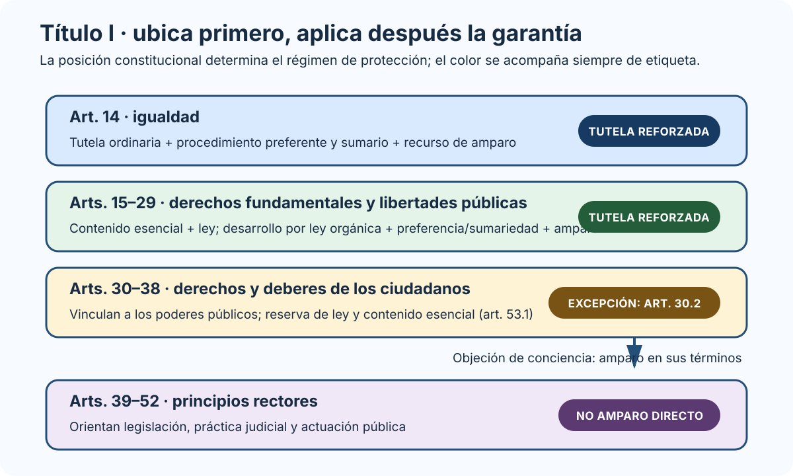
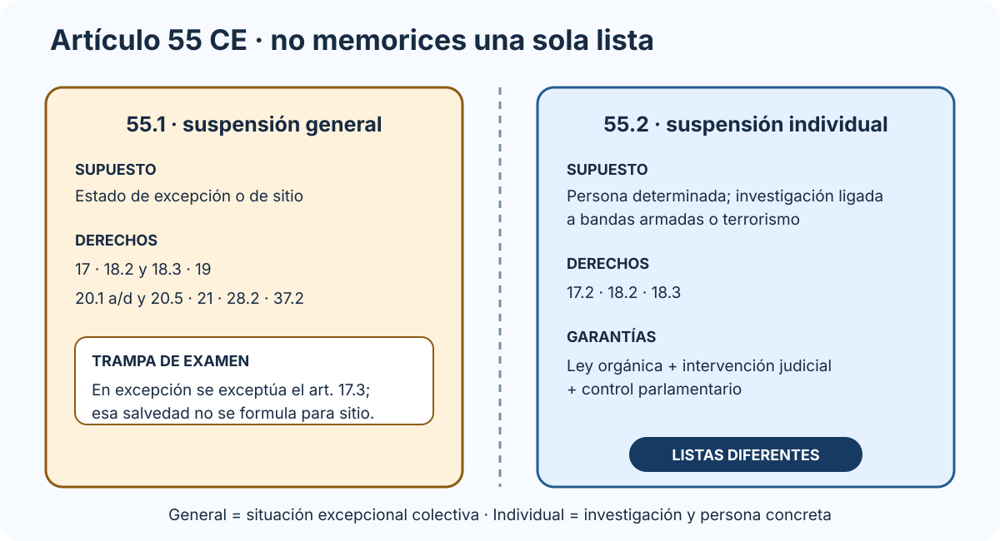

# La Constitución Española de 1978. Derechos y deberes fundamentales. Su garantía y suspensión. La Corona: funciones constitucionales del Rey.

B1-T01 · Bloque 1 · Tema 1

Fuente: [01 — BLOQUE I — Organización del Estado y Administración electrónica — GSI A2](https://docs.google.com/document/d/1J0-5Ab3M7Xom8Af_mpCzGFX5S4ynSyLLYa5YOTzd_qo/edit) · I.01 · V2.1 · 2026-09-23

## 1. Alcance del tema

El epígrafe obliga a dominar cuatro piezas: **Constitución de 1978**, **derechos y deberes fundamentales**, **garantías y suspensión**, y **Corona**. Para GSI no compensa estudiar en este tema todo el Estado autonómico, el Poder Judicial o la reforma constitucional con profundidad A1, aunque sí hay que conocer la estructura general para situar los preceptos.

La Constitución consolidada incorpora tres reformas sustantivas: artículo 13.2 (1992), artículo 135 (2011) y artículo 49 (2024). La edición consolidada del BOE consultada en 2026 ya contiene la nueva redacción del artículo 49.

## 2. Posición, fechas y estructura

La Constitución es la **norma suprema** del ordenamiento. El artículo 9.1 somete a ciudadanos y poderes públicos a la Constitución y al resto del ordenamiento. La supremacía constitucional implica que las normas inferiores deben respetarla y que existe control de constitucionalidad.

### Fechas que conviene memorizar

* **31 de octubre de 1978:** aprobación por las Cortes.
* **6 de diciembre de 1978:** ratificación en referéndum.
* **27 de diciembre de 1978:** sanción por el Rey.
* **29 de diciembre de 1978:** publicación en BOE y entrada en vigor.

### Estructura

* Preámbulo.
* Título Preliminar.
* **10 títulos numerados**.
* **169 artículos**.
* 4 disposiciones adicionales.
* 9 transitorias.
* 1 derogatoria.
* 1 final.

Didácticamente se distingue una **parte dogmática** —principios y derechos— y una **parte orgánica** —organización de los poderes e instituciones—.

## 3. Principios constitucionales

El artículo 1 define España como **Estado social y democrático de Derecho** y proclama como valores superiores **libertad, justicia, igualdad y pluralismo político**. La soberanía nacional reside en el **pueblo español** y la forma política del Estado es la **Monarquía parlamentaria**.

El artículo 2 combina unidad de la Nación, autonomía de nacionalidades y regiones y solidaridad. El artículo 9.3 es especialmente preguntable: legalidad, jerarquía normativa, publicidad de las normas, irretroactividad de disposiciones sancionadoras no favorables o restrictivas de derechos individuales, seguridad jurídica, responsabilidad e interdicción de la arbitrariedad de los poderes públicos.

## 4. Título I: esquema esencial

### Título I: derechos y nivel de protección

_Ordena las categorías por ubicación constitucional y muestra qué grupo dispone de tutela preferente y recurso de amparo._

**Qué debes recordar:** El amparo protege el artículo 14, los artículos 15 a 29 y, en sus términos, la objeción de conciencia del artículo 30.2; no todo el Título I tiene idéntica garantía.

| Parte | Artículos | Contenido |
| --- | --- | --- |
| Capítulo I | 11–13 | Españoles y extranjeros |
| Art. 14 | 14 | Igualdad ante la ley |
| Capítulo II, Sección 1.ª | 15–29 | Derechos fundamentales y libertades públicas |
| Capítulo II, Sección 2.ª | 30–38 | Derechos y deberes de los ciudadanos |
| Capítulo III | 39–52 | Principios rectores de la política social y económica |
| Capítulo IV | 53–54 | Garantías |
| Capítulo V | 55 | Suspensión |

### 4.1 Derechos de especial protección

El artículo 53.2 establece tutela reforzada para el **artículo 14**, los derechos de los **artículos 15–29** y, a efectos de amparo, la objeción de conciencia del artículo 30.2. La tutela se articula ante tribunales ordinarios mediante procedimiento basado en preferencia y sumariedad y, en su caso, mediante **recurso de amparo ante el Tribunal Constitucional**.

El desarrollo de los derechos fundamentales y libertades públicas de la Sección 1.ª se hace por **ley orgánica** en los términos del artículo 81.

### 4.2 Derechos 15–29 que debes reconocer por número

* 15: vida e integridad física y moral.
* 16: libertad ideológica, religiosa y de culto.
* 17: libertad y seguridad.
* 18: honor, intimidad, propia imagen, inviolabilidad del domicilio y secreto de comunicaciones. Art. 18.4: la ley limitará el uso de la informática para garantizar el honor y la intimidad personal y familiar y el pleno ejercicio de los derechos.
* 19: residencia y circulación.
* 20: expresión e información.
* 21: reunión.
* 22: asociación.
* 23: participación política y acceso a funciones/cargos.
* 24: tutela judicial efectiva.
* 25: legalidad sancionadora.
* 26: prohibición de tribunales de honor en la Administración civil y organizaciones profesionales.
* 27: educación.
* 28: sindicación y huelga.
* 29: petición.

### 4.3 Sección 2.ª: derechos y deberes de ciudadanos

Incluye defensa de España (30), deber de contribuir mediante sistema tributario justo (31), matrimonio (32), propiedad/herencia (33), fundación (34), trabajo (35), colegios profesionales (36), negociación colectiva/conflicto colectivo (37) y libertad de empresa (38). Su protección no es idéntica a la del artículo 14 y los artículos 15–29.

### 4.4 Principios rectores

Los artículos 39–52 orientan legislación, práctica judicial y actuación pública. Solo pueden alegarse ante jurisdicción ordinaria conforme a las leyes que los desarrollen.

**Actualización clave:** el artículo 49 fue reformado en 2024. Reconoce a las personas con discapacidad el ejercicio de los derechos del Título I en condiciones de libertad e igualdad reales y efectivas y obliga a impulsar autonomía personal e inclusión social en entornos universalmente accesibles.

## 5. Garantías

### Garantías normativas

* vinculación de todos los poderes públicos;
* reserva de ley;
* respeto al contenido esencial;
* ley orgánica para desarrollo de derechos fundamentales y libertades públicas en los términos del art. 81;
* control de constitucionalidad.

### Garantías jurisdiccionales

* tutela judicial efectiva;
* procedimiento preferente y sumario para derechos del art. 53.2;
* recurso de amparo;
* habeas corpus en relación con libertad personal.

### Garantía institucional

El **Defensor del Pueblo** es alto comisionado de las Cortes para la defensa de derechos del Título I y supervisa la Administración.

## 6. Suspensión de derechos

### Suspensión general e individual: dos listas distintas

_Separa supuesto habilitante, derechos afectados y controles para evitar mezclar ambas figuras._

**Qué debes recordar:** La suspensión individual se limita a los artículos 17.2, 18.2 y 18.3; la general tiene una lista más amplia y depende de excepción o sitio.

### Suspensión general — art. 55.1

Determinados derechos pueden suspenderse con la declaración del estado de excepción o de sitio: art. 17; 18.2 y 18.3; 19; 20.1.a y d; 20.5; 21; 28.2 y 37.2. Regla de test esencial: en el estado de excepción se exceptúa expresamente de la suspensión el art. 17.3; esa excepción específica no se formula para el estado de sitio.

### Suspensión individual — art. 55.2

Una ley orgánica puede prever suspensión individual, con intervención judicial y control parlamentario, de derechos de los **arts. 17.2, 18.2 y 18.3** para personas determinadas en investigaciones ligadas a bandas armadas o terrorismo.

**Trampa:** suspensión general e individual no tienen la misma lista.

## 7. La Corona

Se regula en el Título II. El Rey es Jefe del Estado, símbolo de unidad y permanencia y arbitra/modera el funcionamiento regular de las instituciones. Su persona es inviolable y no está sujeta a responsabilidad. Sus actos están sujetos a refrendo salvo excepciones constitucionales relativas a su Casa. Regencia — art. 59.2: si el Rey se inhabilita para ejercer su autoridad y la imposibilidad es reconocida por las Cortes Generales, entra a ejercer inmediatamente la Regencia el Príncipe heredero si es mayor de edad; si no lo es, se aplica la regla del art. 59.1 hasta que alcance la mayoría de edad.

### Funciones a reconocer

* sancionar y promulgar leyes;
* convocar/disolver Cortes y convocar elecciones según Constitución;
* convocar referéndum en casos previstos;
* proponer candidato a Presidente, nombrarlo y poner fin a sus funciones;
* nombrar/separar ministros a propuesta del Presidente;
* expedir decretos acordados en Consejo de Ministros;
* ser informado de asuntos de Estado;
* mando supremo de Fuerzas Armadas;
* derecho de gracia conforme a ley, sin indultos generales;
* alto patronazgo de Reales Academias;
* funciones internacionales constitucionales; en particular, corresponde al Rey, previa autorización de las Cortes Generales, declarar la guerra y hacer la paz (art. 63.3).

### Refrendo

Como regla, refrendan el Presidente del Gobierno o ministros competentes. La propuesta/nombramiento del Presidente y la disolución prevista en el art. 99 son refrendadas por el Presidente del Congreso. **Responsables de los actos son quienes los refrendan.**

## 8. Datos de test

* 169 artículos; 10 títulos numerados.
* Valores art. 1: libertad, justicia, igualdad, pluralismo político.
* Soberanía: pueblo español.
* Forma política: Monarquía parlamentaria.
* Amparo: art. 14 + Sección 1.ª + art. 30.2 en los términos constitucionales.
* Art. 49: redacción reformada en 2024.
* Rey: inviolable/no responsable; actos normalmente refrendados.
* Sancionar/promulgar una ley ≠ potestad legislativa.
* Suspensión general ≠ individual.

## 9. Aplicación al supuesto

La Constitución aparece transversalmente: igualdad, privacidad/comunicaciones, información, acceso a funciones públicas, accesibilidad del art. 49 y actuación objetiva/eficaz de la Administración. En un supuesto técnico no recites artículos: **traduce el principio a un requisito del sistema**.

## 10. Resumen I.01

Domina estructura y Título Preliminar; clasificación del Título I; niveles de garantía; amparo; suspensión general/individual; y posición, funciones y refrendo del Rey. Para 2026 es imprescindible el art. 49 con redacción de 2024.

## Resumen de repaso

Fuente: [GSI_A2 — BLOQUE I — RESUMEN MAESTRO DE REPASO (10 temas)](https://docs.google.com/document/d/1aa9J2Ilhwcn0K-Z_9yQ2QD12DCEbiSWaYZc3upXorWQ/edit) · I.01

### Núcleo de estudio

La Constitución de 1978 es la norma suprema del ordenamiento. Para GSI interesa dominar su estructura, los valores superiores del artículo 1, el Estado social y democrático de Derecho, la soberanía nacional, la monarquía parlamentaria y la sujeción de ciudadanos y poderes públicos a la Constitución. Los derechos fundamentales se concentran especialmente en el Título I: igualdad, libertades públicas, derechos y deberes, garantías y régimen de suspensión. Diferencia entre derechos con tutela reforzada —artículo 14 y Sección 1.ª del Capítulo II— y otros derechos constitucionales. La tutela incluye procedimiento preferente y sumario ante la jurisdicción ordinaria y, cuando proceda, recurso de amparo ante el Tribunal Constitucional. La Corona es la Jefatura del Estado; el Rey arbitra y modera el funcionamiento regular de las instituciones, sanciona y promulga leyes, convoca elecciones y referendos en los términos constitucionales, propone candidato a la Presidencia del Gobierno y ejerce las demás funciones tasadas. Sus actos requieren refrendo salvo las excepciones constitucionales.

### Claves de test

Memoriza la estructura básica de la Constitución y qué derechos admiten amparo; diferencia suspensión individual y general; recuerda que la persona del Rey es inviolable y no está sujeta a responsabilidad y que sus actos se refrendan; no confundas sanción/promulgación con potestad legislativa. En test suelen mezclarse competencias del Rey, Gobierno y Cortes.

### Enfoque para supuesto práctico

En un supuesto puede aparecer de forma transversal en igualdad, acceso a servicios públicos digitales, protección de derechos o diseño de trámites. La respuesta debe conectar legalidad, igualdad, accesibilidad, seguridad jurídica y tutela de derechos, sin convertir el supuesto técnico en un tema constitucional.

### Fuentes base del material

A1 001 La Constitución (I). BOE programa GSI A2 vigente.
