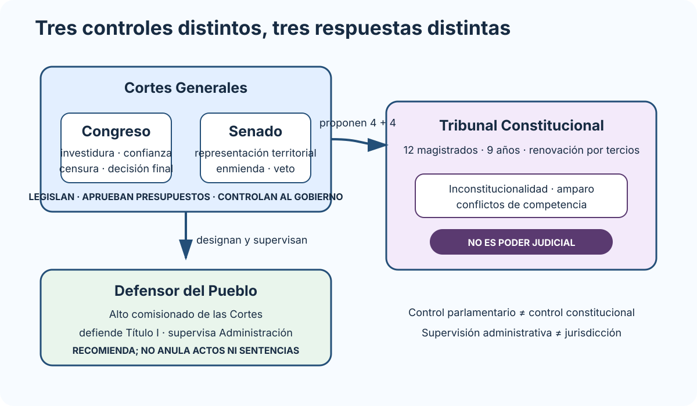

# Las Cortes Generales: atribuciones del Congreso de los Diputados y del Senado. El Tribunal Constitucional: composición y atribuciones. El Defensor del Pueblo.

B1-T02 · Bloque 1 · Tema 2

Fuente: [01 — BLOQUE I — Organización del Estado y Administración electrónica — GSI A2](https://docs.google.com/document/d/1J0-5Ab3M7Xom8Af_mpCzGFX5S4ynSyLLYa5YOTzd_qo/edit) · I.02 · V2.1 · 2026-09-23

## 1. Cortes Generales

### Cortes, Tribunal Constitucional y Defensor del Pueblo

_Sitúa cada órgano por su función y muestra las relaciones que suelen confundirse en preguntas tipo test._

**Qué debes recordar:** El TC no pertenece al Poder Judicial y el Defensor del Pueblo no anula actos: controla constitucionalidad uno y supervisa la Administración el otro.

Representan al pueblo español y están formadas por **Congreso y Senado**. El bicameralismo es desigual porque el Congreso tiene posición decisiva en investidura, censura, confianza y resolución final de determinadas discrepancias legislativas.

Funciones: potestad legislativa, Presupuestos, control del Gobierno y demás competencias constitucionales. Las Cortes son inviolables. Presupuestos — art. 134.4: si la Ley de Presupuestos no se aprueba antes del primer día del ejercicio económico correspondiente, se consideran automáticamente prorrogados los Presupuestos del ejercicio anterior hasta la aprobación de los nuevos.

## 2. Congreso

La Constitución fija entre **300 y 400 diputados**; la legislación electoral mantiene 350. La circunscripción es la provincia, con régimen propio para Ceuta y Melilla. Mandato de cuatro años salvo disolución.

El Congreso otorga la investidura, exige la responsabilidad política mediante la moción de censura, decide sobre la cuestión de confianza y puede superar el veto o las enmiendas del Senado conforme al artículo 90 de la Constitución.

## 3. Senado

Es la **Cámara de representación territorial**. Combina senadores elegidos directamente y designados por CCAA. Puede formular enmiendas o veto legislativo. El veto requiere mayoría absoluta y puede ser levantado por el Congreso en los términos del art. 90 Art. 155 CE: las medidas necesarias para obligar a una Comunidad Autónoma al cumplimiento forzoso de sus obligaciones requieren aprobación del Senado por mayoría absoluta..

**Trampa:** el Senado no inviste al Presidente del Gobierno.

## 4. Estatuto parlamentario y funcionamiento

Distingue: - inviolabilidad por opiniones en ejercicio de funciones; - inmunidad durante el mandato: solo pueden ser detenidos en caso de flagrante delito y no pueden ser inculpados ni procesados sin previa autorización de la Cámara respectiva; - aforamiento ante la Sala de lo Penal del Tribunal Supremo.

Cada Cámara aprueba Reglamento y presupuesto, elige Mesa y Presidente y se reúne en periodos ordinarios y sesiones extraordinarias. Existen **Diputaciones Permanentes**, con mínimo 21 miembros, para continuidad institucional.

## 5. Iniciativa y leyes

Pueden iniciar legislación, según Constitución: Gobierno, Congreso, Senado, asambleas autonómicas e iniciativa legislativa popular con límites.

* **Proyecto de ley:** Gobierno.
* **Proposición de ley:** otros sujetos legitimados.
* **Ley orgánica:** mayoría absoluta del Congreso en votación final sobre el conjunto.

## 6. Tribunal Constitucional

El TC **no forma parte del Poder Judicial**.

### Composición

**12 magistrados**, nombrados por el Rey: - 4 a propuesta del Congreso por 3/5; - 4 del Senado por 3/5; - 2 del Gobierno; - 2 del CGPJ.

Juristas de reconocida competencia con más de 15 años de ejercicio. Mandato **9 años**, renovación por terceras partes cada tres. Presidente nombrado por el Rey a propuesta del propio TC por tres años.

### Competencias

* recurso de inconstitucionalidad;
* cuestión de inconstitucionalidad;
* recurso de amparo;
* conflictos de competencia;
* otras atribuciones constitucionales/LOTC.

Legitimación clásica del recurso de inconstitucionalidad: Presidente del Gobierno, Defensor del Pueblo, 50 diputados, 50 senadores y órganos autonómicos en los términos constitucionales.

## 7. Defensor del Pueblo

**Alto comisionado de las Cortes para la defensa de los derechos del Título I. Es elegido por las Cortes para un mandato de cinco años. La Comisión Mixta Congreso-Senado propone candidato: se exige 3/5 del Congreso y, en un máximo de veinte días, 3/5 del Senado; si no se alcanzan las mayorías, en el plazo máximo de un mes pueden formularse nuevas propuestas y, obtenidos los 3/5 del Congreso, basta mayoría absoluta del Senado. Puede ser elegido cualquier español mayor de edad en pleno disfrute de sus derechos civiles y políticos. Actúa con autonomía, no está sujeto a mandato imperativo y goza de las prerrogativas previstas en su ley orgánica. Supervisa la actividad administrativa, formula recomendaciones/sugerencias, informa a las Cortes y está legitimado para recurso de inconstitucionalidad y amparo.**

No es tribunal y no anula por sí mismo actos administrativos ni sentencias.

## 8. Test

* Congreso + Senado = Cortes.
* Congreso: 300–400 CE; actualmente 350.
* Senado = representación territorial.
* TC: 12 / 9 años / renovación por tercios.
* 4+4+2+2 propuestas al TC.
* TC ≠ Poder Judicial.
* Defensor: alto comisionado; mandato 5 años; elección ordinaria 3/5 Congreso + 3/5 Senado (máx. 20 días); en propuestas sucesivas, 3/5 Congreso + mayoría absoluta Senado; legitimado para inconstitucionalidad/amparo.
* Proyecto ≠ proposición.

## 9. Supuesto y resumen

Peso técnico directo menor. Úsalo para jerarquía normativa, garantías y supervisión cuando proceda; no fuerces referencias institucionales. Debes distinguir con precisión funciones de Congreso/Senado, composición/competencias del TC y función del Defensor.

## Resumen de repaso

Fuente: [GSI_A2 — BLOQUE I — RESUMEN MAESTRO DE REPASO (10 temas)](https://docs.google.com/document/d/1aa9J2Ilhwcn0K-Z_9yQ2QD12DCEbiSWaYZc3upXorWQ/edit) · I.02

### Núcleo de estudio

Las Cortes Generales representan al pueblo español y están formadas por Congreso y Senado. Ejercen la potestad legislativa del Estado, aprueban los Presupuestos y controlan la acción del Gobierno. El Congreso tiene entre 300 y 400 diputados y actualmente 350; el Senado es la Cámara de representación territorial. Debes diferenciar funciones de ambas Cámaras, procedimientos legislativos y supuestos en los que el Congreso tiene una posición prevalente. El Tribunal Constitucional es independiente de los demás órganos constitucionales y está compuesto por doce magistrados nombrados por el Rey: cuatro a propuesta del Congreso, cuatro del Senado, dos del Gobierno y dos del Consejo General del Poder Judicial; su mandato es de nueve años con renovación por terceras partes. Conoce, entre otros, del recurso y cuestión de inconstitucionalidad, recurso de amparo y conflictos de competencia. El Defensor del Pueblo es alto comisionado de las Cortes para la defensa de los derechos del Título I y supervisa la actividad administrativa.

### Claves de test

Distingue Tribunal Constitucional de Poder Judicial; recurso de inconstitucionalidad de cuestión de inconstitucionalidad; Congreso de Senado; control parlamentario de control jurisdiccional. Son clásicos de test la composición del TC, mayorías parlamentarias, duración de mandatos y legitimación para determinados recursos.

### Enfoque para supuesto práctico

En supuesto su presencia suele ser indirecta: control de la Administración, derechos de ciudadanía, reclamaciones, transparencia o tratamiento de datos. Cítalos solo cuando aporten fundamento jurídico real.

### Fuentes base del material

A1 001. Constitución y órganos constitucionales.
