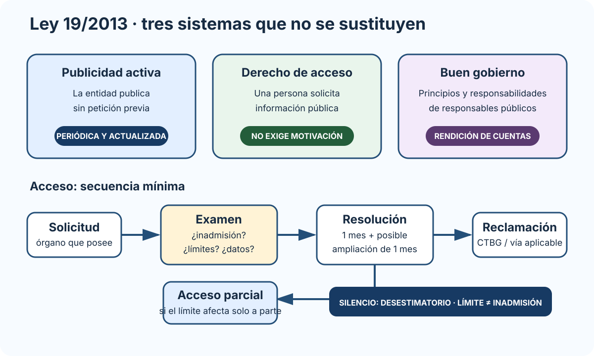

# La Ley 19/2013, de 9 de diciembre, de transparencia, acceso a la información pública y buen gobierno. La Agenda 2030 y los Objetivos de Desarrollo Sostenible.

B1-T04 · Bloque 1 · Tema 4

Fuente: [GSI_A2 — BLOQUE I — APUNTES COMPLETOS V2.1 REVISADOS — ESTUDIO (10 temas)](https://docs.google.com/document/d/1G4Gpao0ou7tGmBQ1iTLtC2pWcljbIEezmsh5ZHFPXYg/edit) · I.04 · V2.1 · 2026-08-24

## 1. Ley 19/2013: tres sistemas

### Transparencia: publicar, responder y rendir cuentas

_Diferencia la publicidad activa del derecho de acceso y coloca límites, inadmisión y protección de datos en el punto correcto del procedimiento._

**Qué debes recordar:** Publicidad activa no requiere solicitud; en acceso, límite e inadmisión son decisiones distintas y el plazo general es un mes, ampliable otro.

La Ley 19/2013 se entiende como tres piezas: 1. **publicidad activa**: publicar sin solicitud; 2. **derecho de acceso**: una persona solicita información pública; 3. **buen gobierno**: principios y responsabilidades de altos cargos/responsables.

En el ámbito digital, estas tres piezas se traducen en publicación proactiva, tramitación individual de solicitudes y responsabilidad institucional, sin confundir transparencia con administración electrónica.

## 2. Ámbito subjetivo

La Ley alcanza Administraciones y numerosas entidades del sector público, además de determinados sujetos privados con obligaciones específicas y personas/entidades que prestan servicios públicos o ejercen potestades administrativas, que deben suministrar información a la Administración vinculada.

Para test interesa distinguir **quién publica directamente** y **quién debe suministrar información**.

## 3. Publicidad activa

La información debe publicarse periódica y actualizada, clara, estructurada, comprensible y preferiblemente reutilizable, respetando protección de datos y demás límites.

### 3.1 Institucional, organizativa y planificación

Funciones, normativa, estructura, organigramas, responsables, planes y programas.

### 3.2 Relevancia jurídica

Directrices, instrucciones, acuerdos, respuestas con interpretación relevante, proyectos normativos y memorias en los términos legales.

### 3.3 Económica, presupuestaria y estadística

Contratos, convenios, subvenciones, presupuestos, cuentas, retribuciones de altos cargos, compatibilidades, estadísticas, patrimonio y demás información prevista.

**Trampa:** publicidad activa no sustituye el derecho de acceso.

## 4. Derecho de acceso

Información pública es, a grandes rasgos, contenido/documentos en poder de sujetos obligados elaborados o adquiridos en ejercicio de sus funciones.

No es necesario acreditar un interés especial y **motivar la solicitud no es obligatorio**, aunque el solicitante puede explicar sus razones.

### 4.1 Límites

Entre otros: seguridad nacional, defensa, relaciones exteriores, seguridad pública, investigación/sanción de ilícitos, tutela judicial, vigilancia/inspección/control, intereses económicos y comerciales, política económica/monetaria, secreto profesional y propiedad intelectual/industrial, confidencialidad de procesos decisorios y medio ambiente.

Los límites se aplican con ponderación/proporcionalidad. Si afectan solo a una parte puede proceder **acceso parcial**.

### 4.2 Protección de datos

No basta responder “hay datos personales”: se analiza naturaleza del dato, base, interés público y posibilidad de disociación. Después del acceso sigue siendo aplicable la normativa de protección de datos al tratamiento posterior.

## 5. Procedimiento

* solicitud al órgano/entidad que posea información;
* identificar información solicitada;
* motivación no obligatoria;
* plazo general de resolución/notificación: **un mes** desde recepción por órgano competente;
* ampliable otro mes por volumen/complejidad, informando;
* silencio: **desestimatorio**;
* reclamación ante CTBG en el ámbito correspondiente, sin perjuicio de contencioso.

### 5.1 Inadmisión

Distingue **límite** de **causa de inadmisión**. Ejemplos legales: información en elaboración/publicación, auxiliar/de apoyo en ciertos términos, necesidad de reelaboración, órgano que no dispone y desconoce competente, solicitudes repetitivas o abusivas no justificadas por finalidad de transparencia.

## 6. CTBG

El Consejo de Transparencia y Buen Gobierno es una **autoridad administrativa independiente**. Su Estatuto fue actualizado por el **RD 615/2024**, sustituyendo el anterior RD 919/2014.

Funciones: salvaguardar acceso, controlar publicidad activa, promover cultura de transparencia y resolver reclamaciones en su ámbito.

## 7. Gobierno abierto

No es sinónimo de administración electrónica. Sus valores: transparencia, participación, colaboración, integridad y rendición de cuentas.

El **V Plan de Gobierno Abierto 2025–2029** fue aprobado el 6 de octubre de 2025. Tiene 10 compromisos agrupados alrededor de participación/espacio cívico, transparencia, integridad/rendición, administración abierta, gobernanza digital, cuentas abiertas, información veraz/ecosistema informativo, difusión/formación, observatorio y Estado abierto.

## 8. Agenda 2030 — 17 ODS

* Fin de la pobreza.
* Hambre cero.
* Salud y bienestar.
* Educación de calidad.
* Igualdad de género.
* Agua limpia y saneamiento.
* Energía asequible y no contaminante.
* Trabajo decente y crecimiento económico.
* Industria, innovación e infraestructura.
* Reducción de desigualdades.
* Ciudades y comunidades sostenibles.
* Producción y consumo responsables.
* Acción por el clima.
* Vida submarina.
* Vida de ecosistemas terrestres.
* Paz, justicia e instituciones sólidas.
* Alianzas para lograr objetivos.

Para GSI destacan 9, 10, 16 y 17, sin olvidar 5.

## 9. Test

* Ley 19/2013 = publicidad activa + acceso + buen gobierno.
* Motivar solicitud: no obligatorio.
* Resolución: 1 mes, ampliable otro.
* Silencio: desestimatorio.
* Límite ≠ inadmisión.
* CTBG ≠ AEPD.
* Estatuto CTBG vigente: RD 615/2024.
* V Plan: 2025–2029.
* Agenda 2030: 17 ODS.

## 10. Supuesto y resumen

Diseña transparencia por defecto para lo publicable, separa información pública/datos personales, usa formatos reutilizables, buscador/accesibilidad, trazabilidad y procedimiento de solicitudes. Estudia Ley 19/2013 por bloques y el procedimiento con precisión.

## Resumen de repaso

Fuente: [GSI_A2 — BLOQUE I — RESUMEN MAESTRO DE REPASO (10 temas)](https://docs.google.com/document/d/1aa9J2Ilhwcn0K-Z_9yQ2QD12DCEbiSWaYZc3upXorWQ/edit) · I.04

### Núcleo de estudio

La Ley 19/2013 articula tres grandes ámbitos: publicidad activa, derecho de acceso a la información pública y buen gobierno. La publicidad activa exige publicar información institucional, organizativa, de relevancia jurídica, económica, presupuestaria y estadística de forma clara, estructurada y reutilizable. El derecho de acceso parte de un principio favorable al acceso pero está sujeto a límites y a protección de datos; deben conocerse causas de inadmisión, tramitación y reclamación ante el Consejo de Transparencia y Buen Gobierno en el ámbito estatal. Buen gobierno establece principios y régimen sancionador para responsables públicos. La Agenda 2030 de Naciones Unidas contiene 17 Objetivos de Desarrollo Sostenible y 169 metas; para GSI conviene relacionarla con administración inclusiva, innovación, instituciones eficaces, sostenibilidad y reducción de brechas digitales.

### Claves de test

Diferencia publicidad activa de derecho de acceso; límite de acceso de causa de inadmisión; transparencia de protección de datos; Consejo de Transparencia de AEPD. En Agenda 2030 no memorices todas las metas, pero sí los 17 ODS y especialmente ODS 9, 10, 16 y 17 en contexto público-digital.

### Enfoque para supuesto práctico

En supuestos, incorpora transparencia por diseño: portal de transparencia, trazabilidad, formatos reutilizables, indicadores y rendición de cuentas. Si hay datos personales, explica la ponderación entre transparencia y privacidad.

### Fuentes base del material

A1 025 + 014 + 031 según material disponible; Ley 19/2013 y Agenda 2030.
