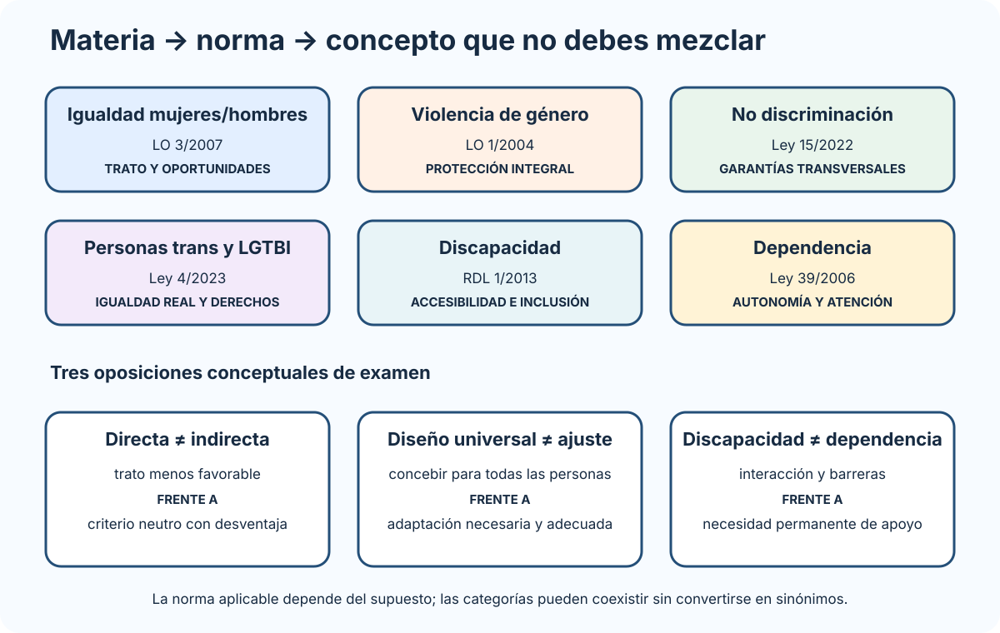

# Políticas de igualdad y contra la violencia de género. Políticas de igualdad de trato y no discriminación de las personas LGTBI. Discapacidad y dependencia: régimen jurídico.

B1-T05 · Bloque 1 · Tema 5

Fuente: [01 — BLOQUE I — Organización del Estado y Administración electrónica — GSI A2](https://docs.google.com/document/d/1J0-5Ab3M7Xom8Af_mpCzGFX5S4ynSyLLYa5YOTzd_qo/edit) · I.05 · V2.1 · 2026-09-23

## 1. Mapa normativo del tema

### Seis marcos, seis finalidades

_Asocia cada materia con su norma y destaca tres parejas que no deben tratarse como sinónimos._

**Qué debes recordar:** Discapacidad no equivale a dependencia; diseño universal no equivale a ajuste razonable; discriminación directa no equivale a indirecta.

El tema reúne seis marcos que deben estudiarse por su finalidad y sin intercambiar sus conceptos: igualdad entre mujeres y hombres; protección integral frente a la violencia de género; igualdad de trato; derechos de las personas trans y LGTBI; discapacidad; y promoción de la autonomía y atención a la dependencia.

## 2. Igualdad entre mujeres y hombres — LO 3/2007

La LO 3/2007 busca hacer efectivo el derecho de igualdad de trato y oportunidades. Datos de test vigentes: las empresas de 50 o más personas trabajadoras deben elaborar y aplicar un plan de igualdad en los términos de la ley; en la AGE, el Plan para la Igualdad entre mujeres y hombres se evalúa anualmente por el Consejo de Ministros.

### Conceptos

**Discriminación directa:** trato menos favorable por razón de sexo en situación comparable.

**Discriminación indirecta:** disposición/criterio/práctica aparentemente neutros que sitúan a personas de un sexo en desventaja particular, salvo justificación objetiva, legítima, necesaria y adecuada.

También: acoso sexual, acoso por razón de sexo, discriminación por embarazo/maternidad, represalias y acciones positivas.

### Transversalidad

La igualdad informa la actuación de poderes públicos. En digital afecta a lenguaje/formularios, estadísticas cuando proceda, diseño de servicios, evaluación de impacto, empleo público, contratación y brecha digital.

## 3. Violencia de género — LO 1/2004

La respuesta es integral, no exclusivamente penal: prevención/sensibilización, educación, publicidad, sanidad, derechos laborales/económicos, asistencia social, tutela institucional, judicial y penal. Microdato vigente de test: las trabajadoras por cuenta propia víctimas de violencia de género que cesen en su actividad para hacer efectiva su protección o su derecho a la asistencia social integral tienen suspendida la obligación de cotización durante seis meses, período que se considera de cotización efectiva en los términos legales.

En sistemas que tratan información de víctimas: confidencialidad, minimización, segregación de funciones, control de accesos, auditoría y protección frente a localización/divulgación son críticos.

## 4. Igualdad de trato y no discriminación — Ley 15/2022

Reconoce y articula garantías frente a discriminación. Debes distinguir: - directa; - indirecta; - por asociación; - por error; - múltiple; - interseccional; - acoso discriminatorio; - inducción/orden/instrucción de discriminar; - represalias.

## 5. Personas trans y LGTBI — Ley 4/2023

Establece medidas de igualdad real/efectiva de personas trans y garantía de derechos LGTBI. Para GSI: no discriminación, políticas públicas, empleo/servicios, tratamiento respetuoso de identidad y confidencialidad/protección de datos. Rectificación registral de la mención relativa al sexo: la persona española mayor de 16 años puede solicitarla por sí misma; el ejercicio de este derecho no se condiciona a la previa exhibición de informes médicos o psicológicos ni a la modificación previa de la apariencia o función corporal mediante procedimientos médicos, quirúrgicos o de otra índole.

No mezcles orientación sexual, identidad sexual, expresión de género y características sexuales.

## 6. Discapacidad — RDL 1/2013

Conceptos centrales: - accesibilidad universal; - diseño universal/diseño para todas las personas; - ajustes razonables; - igualdad de oportunidades; - vida independiente; - inclusión social.

Conecta con el **art. 49 CE reformado en 2024**.

### Administración digital

Accesibilidad implica navegación por teclado, tecnologías de apoyo, contraste, semántica, subtitulado/transcripción, formularios accesibles, lenguaje comprensible y alternativas de canal cuando sean necesarias. La normativa web se profundiza en Bloque III.

## 7. Dependencia — Ley 39/2006

**Autonomía:** capacidad de controlar/afrontar/tomar decisiones personales y desarrollar actividades básicas.

**Dependencia:** estado permanente ligado a pérdida de autonomía que requiere atención de otra persona o ayudas importantes para actividades básicas, en los términos legales.

La Ley articula el Sistema para la Autonomía y Atención a la Dependencia, servicios/prestaciones y reconocimiento de situación. El SAAD se configura como una red de utilización pública que integra coordinadamente centros y servicios públicos y privados; su integración no altera el régimen jurídico de titularidad, administración, gestión ni dependencia orgánica. Son titulares del derecho quienes cumplen los requisitos del art. 5, en particular situación de dependencia reconocida y los requisitos de residencia aplicables.

**Trampa:** discapacidad ≠ dependencia.

## 8. Test

* Igualdad M/H: LO 3/2007.
* Violencia género: LO 1/2004.
* No discriminación: Ley 15/2022.
* LGTBI/trans: Ley 4/2023.
* Discapacidad: RDL 1/2013.
* Dependencia: Ley 39/2006.
* Directa ≠ indirecta.
* Accesibilidad universal ≠ adaptación puntual.
* Ajuste razonable ≠ diseño universal.
* Art. 49 CE: reforma 2024.
* Ley 39/2006: el texto consolidado del BOE tiene como última actualización publicada el 22/10/2025; no memorizar tablas antiguas sin contrastar.

## 9. Supuesto y resumen

En sistemas públicos: accesibilidad desde diseño, lenguaje/procesos no discriminatorios, evitar datos innecesarios, justificar datos sensibles, pruebas con usuarios diversos, canales alternativos y evaluación de sesgos en automatización/IA. Aprende norma↔︎materia y diferencias conceptuales.

## Resumen de repaso

Fuente: [GSI_A2 — BLOQUE I — RESUMEN MAESTRO DE REPASO (10 temas)](https://docs.google.com/document/d/1aa9J2Ilhwcn0K-Z_9yQ2QD12DCEbiSWaYZc3upXorWQ/edit) · I.05

### Núcleo de estudio

Este tema debe estudiarse con normativa vigente y no solo con apuntes antiguos. Núcleo normativo: Ley Orgánica 3/2007 de igualdad efectiva de mujeres y hombres; Ley Orgánica 1/2004 de medidas de protección integral contra la violencia de género; Ley 15/2022 integral para la igualdad de trato y no discriminación; Ley 4/2023 para la igualdad real y efectiva de las personas trans y garantía de derechos LGTBI; Real Decreto Legislativo 1/2013, texto refundido de la Ley General de derechos de las personas con discapacidad y de su inclusión social; y Ley 39/2006 de promoción de la autonomía personal y atención a las personas en situación de dependencia. Para GSI interesa además la proyección sobre empleo público, servicios digitales, accesibilidad, ausencia de discriminación y diseño universal.

### Claves de test

No confundas igualdad formal con igualdad efectiva; discriminación directa, indirecta, por asociación y múltiple/interseccional; discapacidad con dependencia; accesibilidad universal con simple adaptación. En test es importante identificar qué norma regula cada materia.

### Enfoque para supuesto práctico

En un sistema público debes justificar accesibilidad, lenguaje inclusivo, canales alternativos, pruebas con usuarios diversos, adaptación razonable, ausencia de sesgos y cumplimiento de protección de datos en colectivos vulnerables.

### Actualización 2026

Actualización 2026: incorporar Ley 15/2022 y Ley 4/2023; no usar resúmenes pre-2023 como única fuente.

### Fuentes base del material

A1 016 como apoyo + normativa oficial vigente. Tema marcado como COMPLEMENTAR.
