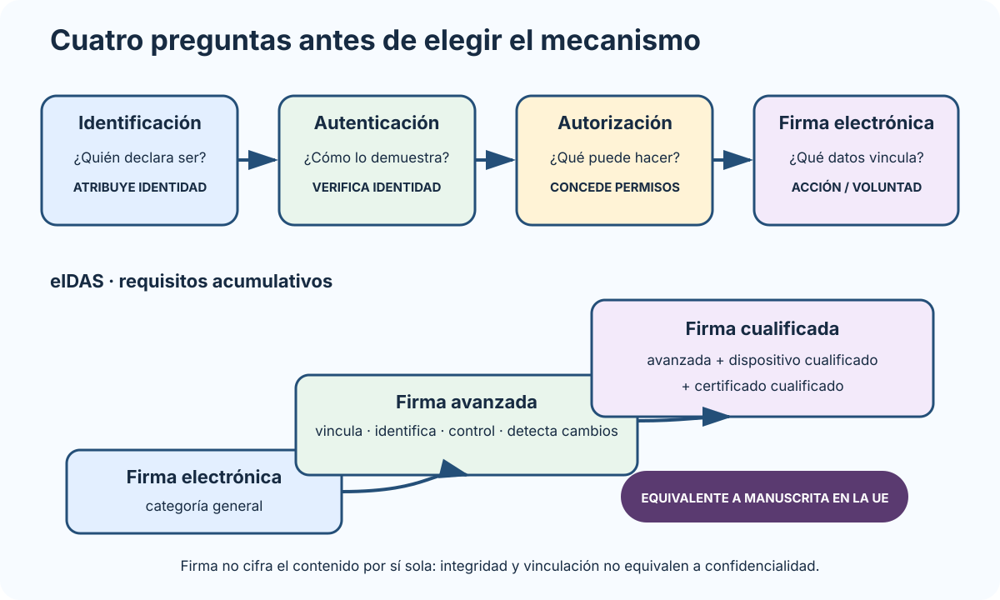
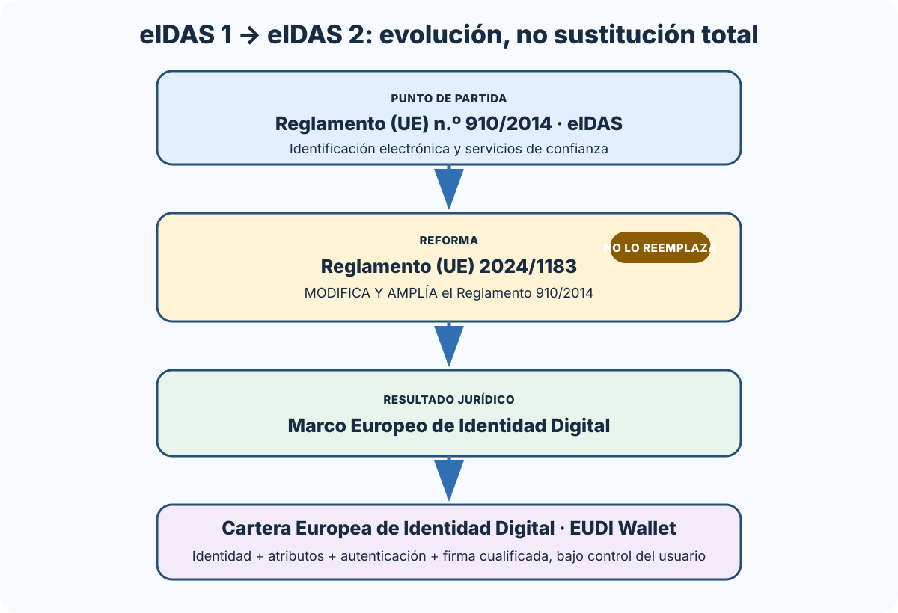
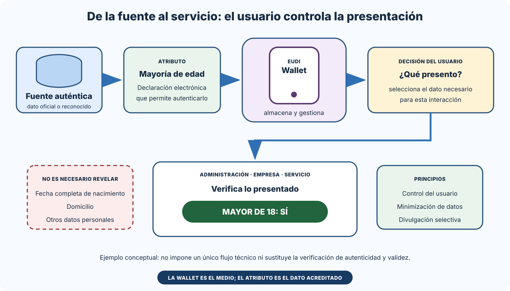

# La sociedad de la información. La Agenda Digital para España. Identidad y firma electrónica: régimen jurídico. Reglamento eIDAS. El DNI electrónico.

B1-T06 · Bloque 1 · Tema 6

Fuente: [GSI_A2 — BLOQUE I — APUNTES COMPLETOS V2.1 REVISADOS — ESTUDIO (10 temas)](https://docs.google.com/document/d/1G4Gpao0ou7tGmBQ1iTLtC2pWcljbIEezmsh5ZHFPXYg/edit) · I.06 · V2.1 · 2026-08-24

## 1. Sociedad de la información y estrategia digital

La sociedad de la información se caracteriza por generación, tratamiento, transmisión y explotación intensiva de información mediante TIC.

El programa conserva la expresión Agenda Digital para España. Estúdiala como antecedente. En agosto de 2026 el marco estratégico de referencia sigue incluyendo España Digital 2026. No memorices objetivos caducados de planes anteriores como vigentes; sí reconoce la evolución: conectividad, capacidades digitales, digitalización de AAPP/empresas, ciberseguridad, datos y tecnologías habilitadoras.

## 2. Identificación, autenticación, autorización y firma

### Identidad, acceso y firma: cuatro preguntas diferentes

_Relaciona cada concepto con la pregunta que resuelve y muestra los requisitos acumulativos de la firma cualificada._

**Qué debes recordar:** Autenticarse prueba quién actúa; autorizar decide qué puede hacer; firmar vincula al firmante con los datos. La firma cualificada añade dispositivo y certificado cualificados.

* **identificación:** determinar/declarar quién es;
* **autenticación:** comprobar identidad;
* **autorización:** decidir qué puede hacer;
* **firma electrónica:** vincular firmante con datos/documento y manifestar acción/voluntad con efectos jurídicos.

**Trampa:** autenticarse no equivale necesariamente a firmar.

## 3. Firma electrónica y digital

Firma electrónica es concepto jurídico de eIDAS. Firma digital es mecanismo técnico basado normalmente en criptografía asimétrica + hash.

### Proceso conceptual

* calcular hash del documento;
* generar firma con clave privada;
* receptor valida con clave pública/certificado;
* contrasta integridad;
* valida vigencia/confianza del certificado.

Puede aportar integridad, autenticidad, vinculación y evidencia/no repudio en el marco correspondiente. **No aporta confidencialidad por sí sola.**

## 4. PKI y certificados

Un certificado vincula identidad con clave pública y está firmado por una entidad/prestador de confianza.

X.509: emisor, titular, serie, validez, clave pública, algoritmo, usos/extensiones y firma del emisor.

### Estado

* **CRL:** lista de revocados.
* **OCSP:** consulta online de estado.

Caducidad ≠ revocación.

## 5. Tipos de firma eIDAS

### Firma electrónica

Categoría general.

### Firma avanzada

Vinculada al firmante, permite identificarlo, se crea bajo su control con nivel adecuado y detecta alteraciones posteriores en datos conforme a requisitos eIDAS.

### Firma cualificada

Firma avanzada + **dispositivo cualificado** + **certificado cualificado**. Tiene efecto jurídico equivalente a manuscrita en la UE en los términos del Reglamento.

## 6. Sello y tiempo

* **sello electrónico:** asociado típicamente a persona jurídica, origen/integridad.
* **sello de tiempo:** vincula datos con un instante y aporta evidencia temporal.

Certificado de firma de persona ≠ sello de persona jurídica.

## 7. Formatos

Del A1 080 son útiles: - **CAdES**: basado en CMS; - **XAdES**: XML; - **PAdES**: PDF; - **ASiC**: contenedor; - perfiles baseline B/T/LT/LTA como concepto de longevidad.

Firma longeva = preservar evidencias que permitan validar en el futuro.

## 8. eIDAS y reforma 2024/1183

<!-- editorial-supplement:B1-T06:01:start -->

### eIDAS 2: marco europeo, cartera y atributos

La expresión «eIDAS 2» designa la reforma introducida por el Reglamento (UE) 2024/1183: no sustituye por completo al Reglamento (UE) n.º 910/2014, sino que lo modifica y amplía para establecer el Marco Europeo de Identidad Digital. Por eso la norma de referencia sigue siendo el Reglamento 910/2014 en su versión modificada.

La pieza más visible de ese marco es la Cartera Europea de Identidad Digital o EUDI Wallet. Es un medio de identificación electrónica que permite gestionar y presentar datos de identificación y declaraciones electrónicas de atributos, autenticarse ante servicios y firmar con firma electrónica cualificada. No es un simple almacén de certificados ni una denominación europea del DNIe.

#### Qué permite hacer la EUDI Wallet

- Solicitar, obtener, seleccionar, combinar, almacenar, eliminar, compartir y presentar de forma segura datos de identificación personal y declaraciones electrónicas de atributos.
- Autenticarse ante una Administración, empresa u otro servicio, en línea y, cuando proceda, fuera de línea.
- Firmar mediante firma electrónica cualificada; esa función no convierte cualquier autenticación ni cualquier presentación de atributos en una firma.
- Mantener bajo control del usuario qué datos se usan y para qué interacción. Su utilización es, con carácter general, voluntaria y deben seguir disponibles otros medios de identificación y autenticación.

#### Atributo, declaración y fuente auténtica

Un atributo es una característica, cualidad, derecho o permiso de una persona física o jurídica o de un objeto. Una declaración electrónica de atributos —electronic attestation of attributes— es una declaración electrónica que permite autenticar uno o varios atributos. Si la expide un prestador cualificado de servicios de confianza y cumple los requisitos del anexo V, es una declaración electrónica cualificada de atributos.

La fuente auténtica es el repositorio o sistema, bajo responsabilidad de un organismo público o entidad privada, que contiene y proporciona esos atributos y se considera fuente principal o está reconocido como auténtico por el Derecho de la Unión o nacional. La fuente aporta el dato de referencia; la declaración permite presentarlo y verificarlo en formato electrónico.

#### Divulgación selectiva y minimización

La cartera debe posibilitar la divulgación selectiva: comunicar únicamente lo necesario para el servicio. Ejemplo conceptual: para acreditar una condición de edad, el usuario podría presentar «Mayor de 18: SÍ» sin revelar la fecha completa de nacimiento, el domicilio u otros datos innecesarios. Es una ilustración del principio, no un flujo técnico único ni una regla que obligue a todos los servicios a pedir exactamente esa prueba.

La divulgación selectiva refuerza la minimización de datos del RGPD. El usuario decide la presentación, pero la parte usuaria sigue verificando la autenticidad y validez de lo recibido y aplicando la base jurídica y los límites del servicio.

#### Fronteras conceptuales

- Identificación declara quién es la persona; autenticación comprueba esa identidad; autorización decide qué puede hacer.
- Firma electrónica vincula al firmante con unos datos y expresa la acción de firmar; el certificado vincula datos de validación de firma con una identidad.
- La declaración electrónica de atributos acredita características concretas; no equivale a la identidad completa ni es, por sí sola, un certificado de firma.
- La cartera es el medio que permite gestionar y presentar identidad y atributos y usar funciones de autenticación o firma; no se identifica con el DNIe, un certificado o una declaración concreta.

**Trampas frecuentes de test**

| Confusión | Corrección |
| --- | --- |
| Identificación = firma | No. Identificar declara quién; firmar vincula al firmante con unos datos. |
| Autenticación = autorización | No. Autenticar comprueba identidad; autorizar habilita acciones o recursos. |
| Wallet = DNIe | No. La EUDI Wallet es un medio europeo de identidad digital; el DNIe es un documento y medio nacional concreto. |
| Atributo = identidad completa | No. Un atributo puede ser una sola característica, cualidad, derecho o permiso. |
| Declaración de atributos = certificado de firma | No. La primera permite autenticar atributos; el segundo vincula datos de validación de firma con una identidad. |
| Divulgación selectiva = entregar todos los datos | No. Permite revelar solo el dato o atributo necesario. |
| Reglamento 2024/1183 = sustitución total del 910/2014 | No. Lo modifica y amplía para establecer el Marco Europeo de Identidad Digital. |
| Uso de la wallet = obligación general | No. Su uso es voluntario con carácter general y deben mantenerse otras vías. |

#### Fuentes oficiales de la ampliación

- [Reglamento (UE) n.º 910/2014, texto consolidado](https://eur-lex.europa.eu/eli/reg/2014/910/2024-10-18) · artículos 3, 5 bis y 45 bis a 45 septies
- [Reglamento (UE) 2024/1183](https://eur-lex.europa.eu/eli/reg/2024/1183/oj) · acto modificador y considerandos sobre divulgación selectiva

> **Alcance de estudio:** Para GSI A2 interesa dominar conceptos, relaciones y trampas. No es necesario memorizar el detalle de los actos de ejecución, números de artículo, mecanismos criptográficos internos ni procedimientos técnicos de certificación.

<!-- editorial-supplement:B1-T06:01:end -->

### De eIDAS 1 al Marco Europeo de Identidad Digital

_Representa la reforma como una ampliación del marco eIDAS existente, no como su derogación o sustitución completa._

**Qué debes recordar:** El Reglamento 2024/1183 modifica el 910/2014; el texto consolidado de este último contiene el marco vigente y la regulación de la EUDI Wallet.

### EUDI Wallet: atributo verificable bajo control del usuario

_Muestra el papel de la fuente auténtica, la declaración electrónica de atributos, la decisión del usuario y la verificación por la parte usuaria._

**Qué debes recordar:** Divulgación selectiva significa presentar lo necesario —por ejemplo, la mayoría de edad— sin comunicar el conjunto completo de datos personales.

Reglamento 910/2014: identificación electrónica y servicios de confianza. La reforma por **Reglamento (UE) 2024/1183** impulsa el Marco Europeo de Identidad Digital y la **Cartera Europea de Identidad Digital (EUDI Wallet)**.

Estudia reconocimiento transfronterizo, niveles de garantía, servicios de confianza, firma/sello/sellado, certificados web y wallet.

## 9. Marco español y DNIe

La **Ley 6/2020** regula aspectos de servicios electrónicos de confianza y adapta el ordenamiento al marco eIDAS. Leyes 39/2015, 40/2015 y RD 203/2021 regulan identificación/firma en sector público.

El DNIe es documento de identidad con capacidades electrónicas de identificación y firma según certificados/condiciones. Distingue soporte, certificado, PIN, claves, autenticación y firma.

## 10. Test

* firma electrónica ≠ digital;
* hash ≠ cifrado;
* privada se protege, pública se distribuye;
* CRL ≠ OCSP;
* firma ≠ sello;
* CAdES/XAdES/PAdES;
* cualificada = avanzada + dispositivo cualificado + certificado cualificado;
* eIDAS: 910/2014; reforma: 2024/1183;
* Ley española confianza: 6/2020;
* autenticación ≠ autorización ≠ firma.

## 11. Supuesto y resumen

Define identidad, nivel de garantía, separa autenticación/firma, reutiliza Cl@ve/certificados, valida firmas/certificados, preserva evidencia temporal, audita y no exijas firma fuerte cuando no sea jurídicamente necesaria.

## Resumen de repaso

Fuente: [GSI_A2 — BLOQUE I — RESUMEN MAESTRO DE REPASO (10 temas)](https://docs.google.com/document/d/1aa9J2Ilhwcn0K-Z_9yQ2QD12DCEbiSWaYZc3upXorWQ/edit) · I.06

### Núcleo de estudio

La sociedad de la información se basa en generación, tratamiento, intercambio y explotación intensiva de información mediante TIC. El programa todavía cita la Agenda Digital para España; conviene conocerla como antecedente y ubicar la estrategia posterior España Digital 2026 como contexto de actualización. En identidad electrónica distingue identificación de firma: identificar acredita quién actúa; firmar añade manifestación de voluntad y garantías sobre el documento. El Reglamento eIDAS 910/2014 armoniza identificación electrónica y servicios de confianza; fue modificado por el Reglamento (UE) 2024/1183 para establecer el Marco Europeo de Identidad Digital y la cartera europea de identidad. Distingue firma electrónica, avanzada y cualificada; certificados cualificados, sellos, sellado de tiempo y servicios de entrega electrónica certificada. En España son relevantes la Ley 6/2020 de servicios electrónicos de confianza y el DNI electrónico como documento de identidad y medio de autenticación/firma.

### Claves de test

Firma cualificada = firma avanzada creada con dispositivo cualificado y basada en certificado cualificado; tiene efecto jurídico equivalente a firma manuscrita. No confundas certificado de persona con sello de persona jurídica. Aprende diferencia autenticación, autorización, firma y no repudio.

### Enfoque para supuesto práctico

En supuestos define un esquema de identidad: ciudadanos mediante Cl@ve/certificado/DNIe; empleados mediante sistemas corporativos; firma mediante @firma/AutoFirma/Cl@ve Firma cuando corresponda. Justifica nivel de garantía, trazabilidad y minimización de fricción.

### Actualización 2026

Actualización 2026: eIDAS debe estudiarse con la reforma del Reglamento (UE) 2024/1183 y el marco de identidad digital europea.

### Fuentes base del material

A1 051 + 080 + 081. eIDAS y normativa española de confianza.
