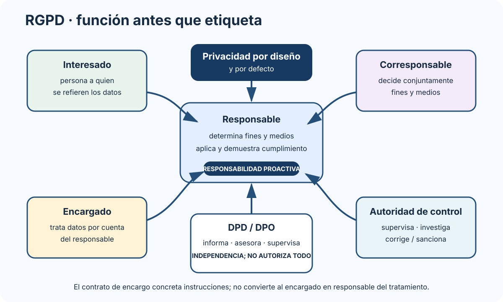

# La protección de datos personales y su régimen jurídico: principios, derechos, responsable y encargado del tratamiento, delegado y autoridades de protección de datos. Derechos digitales.

B1-T07 · Bloque 1 · Tema 7

Fuente: [01 — BLOQUE I — Organización del Estado y Administración electrónica — GSI A2](https://docs.google.com/document/d/1J0-5Ab3M7Xom8Af_mpCzGFX5S4ynSyLLYa5YOTzd_qo/edit) · I.07 · V2.1 · 2026-09-23

## 1. Marco

* Reglamento (UE) 2016/679, **RGPD**.
* Ley Orgánica 3/2018, **LOPDGDD**.

La LOPDGDD debe estudiarse consolidada: el BOE muestra como última actualización publicada el 27/12/2025, posterior a muchos apuntes A1.

## 2. Conceptos

**Dato personal:** información sobre persona física identificada/identificable.

**Tratamiento:** operación o conjunto de operaciones sobre datos.

**Responsable:** determina fines y medios.

**Encargado:** trata por cuenta del responsable.

**Interesado:** persona a la que se refieren datos.

También: seudonimización, anonimización, perfilado, consentimiento, violación de seguridad.

### Anonimización vs seudonimización

* anonimización efectiva → persona deja de ser razonablemente identificable;
* seudonimización → reduce vinculación directa, pero sigue siendo dato personal si puede reidentificarse. La reversión deliberada de un procedimiento de anonimización para permitir la reidentificación de los afectados está tipificada por la LOPDGDD como infracción muy grave.

## 3. Principios RGPD

* licitud, lealtad y transparencia;
* limitación de finalidad;
* minimización;
* exactitud;
* limitación de conservación;
* integridad y confidencialidad;
* responsabilidad proactiva.

Consentimiento **no es un principio ni la única base jurídica**.

## 4. Bases jurídicas

Art. 6: consentimiento, contrato, obligación legal, intereses vitales, misión de interés público/ejercicio de poderes públicos, interés legítimo con sus límites.

En AAPP son frecuentes obligación legal e interés público/poderes públicos. Consentimiento de menores — art. 7 LOPDGDD: el tratamiento puede fundarse únicamente en el propio consentimiento del menor cuando sea mayor de catorce años; por debajo de esa edad se aplican las reglas legales de consentimiento de titulares de la patria potestad o tutela.

## 5. Categorías especiales

Art. 9 RGPD: datos de salud, biométricos para identificación unívoca, genéticos, convicciones, etc. Parten de prohibición general con excepciones tasadas.

“Con consentimiento siempre se puede” es falso.

## 6. Derechos

* acceso;
* rectificación;
* supresión;
* limitación;
* oposición;
* portabilidad;
* garantías frente a decisiones automatizadas;
* información/transparencia.

Supresión ≠ derecho al olvido en todos los contextos; oposición ≠ revocar consentimiento; portabilidad ≠ mera copia documental. Para el Capítulo II del Título III de la LOPDGDD, memoriza los rótulos de los arts. 13–18: acceso, rectificación, supresión, limitación del tratamiento, portabilidad y oposición. Bloqueo de datos — art. 32: el responsable debe bloquear los datos cuando proceda a su rectificación o supresión, en los términos y con las excepciones legales.

## 7. Responsable, encargado y corresponsable

### Quién decide, quién trata y quién supervisa

_Separa decisiones sobre fines y medios, tratamiento por cuenta de otro, asesoramiento independiente y supervisión pública._

**Qué debes recordar:** El responsable determina fines y medios; el encargado trata por su cuenta; el DPD asesora y supervisa, pero no autoriza cada tratamiento.

Responsable aplica medidas y demuestra cumplimiento. Encargado requiere relación contractual/jurídica con contenido exigido. Corresponsables determinan conjuntamente fines/medios y distribuyen responsabilidades de forma transparente.

## 8. DPD/DPO

Informa/asesora, supervisa cumplimiento, asesora sobre EIPD, coopera y es punto de contacto. Debe actuar con independencia y recursos. Administraciones y organismos públicos están entre los supuestos centrales de designación obligatoria.

## 9. Privacidad desde diseño y por defecto

**Desde diseño:** protección incorporada desde concepción.

**Por defecto:** tratar solo datos necesarios, con accesos, exposición y conservación limitados por defecto.

Traducción técnica: minimización de campos, RBAC, cifrado, retención, logging, separación de entornos y datos de prueba sintéticos/anonimizados cuando sea viable.

## 10. EIPD

Exigible cuando un tratamiento probablemente entrañe alto riesgo. **EIPD ≠ análisis de riesgos ENS**, aunque se coordinan.

## 11. Brechas

Se documentan y pueden requerir notificación a autoridad en **72 horas desde que se tiene constancia**, salvo que sea improbable que entrañe riesgo. Si puede entrañar alto riesgo puede requerirse comunicación a afectados, con excepciones.

Incidencia TI ≠ automáticamente brecha de datos.

## 12. Autoridad

La **AEPD** es autoridad estatal independiente; existen autoridades autonómicas en ámbitos respectivos. Supervisa, orienta, investiga y ejerce potestades correctivas/sancionadoras.

## 13. Derechos digitales — Título X LOPDGDD

El BOE GSI los menciona expresamente. Reconoce, entre otros: - neutralidad de Internet; - acceso universal; - seguridad digital; - educación digital; - protección de menores; - rectificación/actualización en medios digitales; - intimidad en dispositivos laborales; - desconexión digital; - videovigilancia/grabación/geolocalización laboral; - olvido en búsquedas/redes; - portabilidad en redes/servicios equivalentes; - testamento digital Para test, añade la Carta de Derechos Digitales: en materia de pseudonimidad, su diseño debe asegurar la posibilidad de reidentificar a las personas previa resolución judicial en los casos y con las garantías previstas por el ordenamiento. La Carta es un documento de referencia, no una ley..

Aprende **derecho ↔︎ contexto**, no solo una lista.

## 14. Transferencias internacionales

Salida de datos fuera del EEE requiere mecanismo válido: adecuación, garantías adecuadas u otras excepciones. Es relevante en cloud/proveedores.

## 15. Test

* RGPD 2016/679; LOPDGDD LO 3/2018.
* Consentimiento no es única base.
* Seudonimización ≠ anonimización.
* Responsable ≠ encargado.
* DPD no “autoriza” cada tratamiento.
* Brecha: 72 h a autoridad cuando proceda.
* EIPD ≠ ENS.
* Derechos digitales: Título X.

## 16. Supuesto y resumen

Checklist: inventario/finalidad, base jurídica, minimización, responsable/encargado, contrato, accesos, cifrado, logs, retención, derechos, EIPD, DPD, brechas, transferencias y privacidad por diseño/default. No prepares RGPD como “consentimiento + derechos”: entiende el sistema completo.

## Resumen de repaso

Fuente: [GSI_A2 — BLOQUE I — RESUMEN MAESTRO DE REPASO (10 temas)](https://docs.google.com/document/d/1aa9J2Ilhwcn0K-Z_9yQ2QD12DCEbiSWaYZc3upXorWQ/edit) · I.07

### Núcleo de estudio

Marco central: Reglamento (UE) 2016/679 (RGPD) y Ley Orgánica 3/2018 (LOPDGDD). Principios: licitud, lealtad y transparencia; limitación de finalidad; minimización; exactitud; limitación del plazo de conservación; integridad y confidencialidad; responsabilidad proactiva. Debes conocer bases jurídicas, categorías especiales, información al interesado y derechos de acceso, rectificación, supresión, oposición, limitación, portabilidad y garantías frente a decisiones automatizadas. Distingue responsable y encargado del tratamiento, corresponsabilidad, registro de actividades, contratos de encargo, delegado de protección de datos, evaluación de impacto y privacidad desde el diseño y por defecto. Las brechas de seguridad pueden requerir notificación a la autoridad de control en 72 horas y, cuando exista alto riesgo, comunicación a los afectados. La AEPD es la autoridad estatal independiente.

### Claves de test

No todo tratamiento requiere consentimiento; en Administraciones son frecuentes obligación legal, misión en interés público y ejercicio de poderes públicos. Distingue anonimización de seudonimización; encargado de responsable; EIPD de análisis de riesgos ENS; derecho de supresión de derecho al olvido.

### Enfoque para supuesto práctico

En supuesto incluye inventario de tratamientos, base jurídica, minimización, perfiles de acceso, cifrado, registro, conservación/borrado, gestión de derechos, contratos con proveedores, DPD, análisis de riesgos y EIPD cuando corresponda.

### Fuentes base del material

A1 027 + 082. RGPD, LOPDGDD y AEPD.
