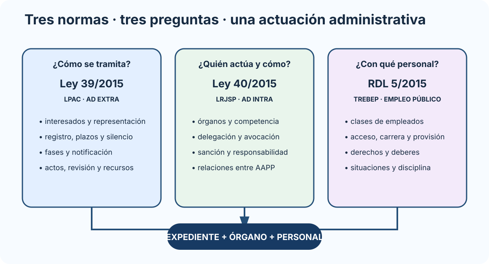
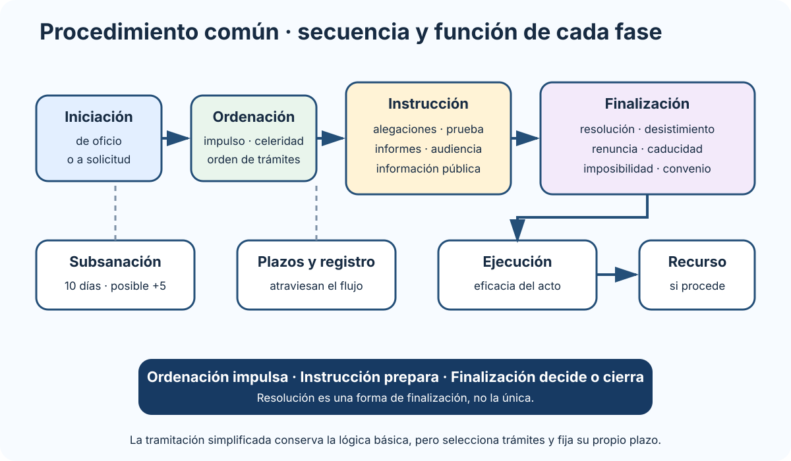

# Las Leyes de Procedimiento Administrativo Común de las Administraciones Públicas y de Régimen Jurídico del Sector Público. El texto refundido del Estatuto Básico del Empleo Público.

B1-T08 · Bloque 1 · Tema 8

Fuente: [01 — BLOQUE I — Organización del Estado y Administración electrónica — GSI A2](https://docs.google.com/document/d/1J0-5Ab3M7Xom8Af_mpCzGFX5S4ynSyLLYa5YOTzd_qo/edit) · I.08 · V2.1 · 2026-09-23

## 1. Mapa mental

### Ruta de estudio: procedimiento, organización y empleo público

_Reorganiza la entrada al tema en tres preguntas: cómo se tramita, quién actúa y con qué personal._

**Qué debes recordar:** LPAC es procedimiento ad extra; LRJSP es organización ad intra; TREBEP es régimen básico del personal.

* **Ley 39/2015 (LPAC):** procedimiento y relación Administración–interesados (“ad extra”).
* **Ley 40/2015 (LRJSP):** organización/funcionamiento interno, órganos, competencia y relaciones interadministrativas (“ad intra”).
* **RDL 5/2015 TREBEP:** régimen básico del empleo público.

Es uno de los temas más rentables del Bloque I. Hay que estudiar reglas, sujetos, plazos, efectos y diferencias entre figuras, no solo la estructura de las leyes. Control de vigencia a 24/08/2026: LPAC, última actualización consolidada BOE 06/11/2024; LRJSP, 02/08/2024; TREBEP, 30/07/2025.

# PARTE A — LEY 39/2015

## 2. Ámbito, capacidad e interesados

La LPAC se aplica al sector público en los términos de su art. 2. Son interesados, entre otros: - quienes promuevan procedimiento como titulares de derechos/intereses legítimos; - quienes tengan derechos que puedan resultar afectados; - quienes tengan intereses legítimos afectados y comparezcan antes de resolución definitiva.

### Representación

Puede actuarse por representante. Para determinados actos debe acreditarse; para actos de mero trámite se presume. El apoderamiento apud acta puede ser presencial o electrónico y los registros electrónicos de apoderamientos facilitan su gestión. Los poderes inscritos tienen una validez máxima de cinco años desde la inscripción; antes de finalizar pueden revocarse o prorrogarse, con prórrogas de duración máxima de cinco años desde su inscripción.

## 3. Derechos y relación electrónica

Entre los derechos: comunicarse mediante PAGe, asistencia en medios electrónicos, uso de lenguas oficiales, acceso a información/archivos conforme a normativa, trato respetuoso, exigir responsabilidades y protección de datos. Lengua del procedimiento — art. 15 LPAC: en la AGE la lengua es el castellano, pero el interesado que se dirija a un órgano con sede en una Comunidad Autónoma puede utilizar también la lengua cooficial; el procedimiento se tramitará en la lengua elegida por el interesado. Si concurren varios interesados y discrepan, se tramita en castellano, aunque los documentos o testimonios que requieran se expedirán en la lengua elegida por cada uno.

### Sujetos obligados electrónicamente

Entre otros: - personas jurídicas; - entidades sin personalidad; - profesionales con colegiación obligatoria para trámites de su ejercicio; - representantes de obligados; - empleados públicos para trámites derivados de su condición según regulación.

Reglamentariamente pueden imponerse obligaciones a colectivos de personas físicas cuando se acredite acceso/disponibilidad de medios.

**Trampa:** no toda persona física está obligada por defecto.

## 4. Identificación y firma

La Ley diferencia ambas. Identificación acredita identidad; firma se exige en actuaciones concretas (formular solicitudes, declaraciones responsables/comunicaciones, recursos, desistimiento, renuncia, etc., en términos legales).

Un sistema de tramitación debe poder registrar **quién se identificó**, **qué firmó**, **qué certificado/mecanismo se usó** y **qué evidencia queda**.

## 5. Registros electrónicos

Cada Administración dispone de Registro Electrónico General o se integra/adhiere al correspondiente según marco aplicable.

La presentación electrónica está disponible 24x7, pero el **cómputo de plazos** depende del calendario oficial de días inhábiles y reglas de la LPAC. El registro genera recibo/acreditación con fecha/hora y número/asiento.

## 6. Documentos aportados por interesados

Como principio de simplificación, no debe exigirse al interesado documentación que ya obre en poder de Administraciones o pueda obtenerse legalmente por interoperabilidad, con las condiciones y excepciones previstas.

En un supuesto, esto enlaza con la **Plataforma de Intermediación de Datos**.

## 7. Cómputo de plazos

Puntos de test: el plazo fijado por la norma reguladora no puede exceder de 6 meses salvo ley/UE que permita más; 3 meses si la norma no fija plazo; subsanación 10 días, ampliable hasta 5 en los casos legales; notificación cursada en 10 días desde el acto; rechazo de notificación electrónica obligatoria/elegida tras 10 días naturales sin acceso; tramitación simplificada: solicitud desestimable en 5 días y resolución general en 30 días.

* Por **horas**: se entienden hábiles salvo previsión y se cuentan hora a hora/minuto a minuto; no pueden tener duración superior a 24 h salvo norma distinta.
* Por **días**: son hábiles salvo que ley/derecho UE señale naturales.
* Son inhábiles sábados, domingos y festivos.
* Por **meses/años**: de fecha a fecha conforme a regla legal.
* Si último día es inhábil, se prorroga al primer hábil siguiente.
* Si un día es hábil en municipio/CCAA del interesado e inhábil en sede del órgano, o viceversa, se considera inhábil en términos de LPAC.

El registro electrónico se rige por fecha/hora oficial de sede.

## 8. Obligación de resolver y silencio

La Administración debe dictar resolución expresa y notificarla. El plazo máximo es el fijado por la norma reguladora del procedimiento y, como regla, no puede exceder de seis meses salvo que una ley establezca uno mayor o así lo prevea el Derecho de la UE. Cuando la norma no fija plazo máximo, éste es de tres meses. En procedimientos de oficio se cuenta desde el acuerdo de iniciación; a solicitud, desde la entrada de la solicitud en el registro electrónico de la Administración u organismo competente para tramitar.

Silencio: - en procedimientos iniciados a solicitud suele tener sentido estimatorio, **pero existen importantes excepciones**; - en determinados procedimientos iniciados de oficio produce efectos distintos según naturaleza.

No memorices “silencio positivo” como regla absoluta.

## 9. Fases del procedimiento

### Procedimiento administrativo de principio a fin

_Muestra la secuencia general y sitúa los trámites que suelen aparecer desordenados en los test._

**Qué debes recordar:** Ordenación impulsa el expediente; instrucción reúne elementos para decidir; resolución es una forma de finalización, no la única.

### 9.1 Iniciación

* de oficio: propia iniciativa, orden superior, petición razonada, denuncia;
* a solicitud del interesado.

Puede haber información/actuaciones previas, medidas provisionales, acumulación y subsanación.

### 9.2 Subsanación

Si la solicitud no reúne los requisitos, se requiere subsanación en diez días, con advertencia de desistimiento previa resolución si no se atiende. Cuando no sea un procedimiento selectivo o de concurrencia competitiva, el plazo puede ampliarse prudencialmente hasta cinco días si aportar los documentos presenta dificultades especiales. Es un clásico de test y debe reflejarse en el workflow.

### 9.3 Ordenación

Impulso de oficio, celeridad, concentración de trámites y orden de incoación para asuntos homogéneos salvo motivación.

### 9.4 Instrucción

* alegaciones;
* prueba;
* informes;
* audiencia;
* información pública cuando proceda.

### 9.5 Finalización

* resolución;
* desistimiento;
* renuncia cuando sea posible;
* caducidad;
* imposibilidad material;
* terminación convencional cuando proceda En procedimientos sancionadores con sanción únicamente pecuniaria, el art. 85.3 prevé reducciones de al menos el 20 % sobre la sanción propuesta por reconocimiento de responsabilidad y por pago voluntario, acumulables entre sí cuando concurran ambos supuestos y se cumplan las condiciones legales..

### 9.6 Tramitación simplificada

Puede acordarse de oficio o a solicitud por interés público o falta de complejidad. Si el interesado la solicita y no concurren las razones legales, la Administración puede desestimarla en cinco días; transcurrido ese plazo se entiende desestimada. Salvo que reste menos para la tramitación ordinaria, el procedimiento simplificado debe resolverse en treinta días desde el día siguiente a la notificación del acuerdo de tramitación simplificada.

## 10. Notificaciones

Preferentemente electrónicas y obligatorias por ese medio para obligados.

Distingue: - **puesta a disposición**; - **acceso/comparecencia**; - **aviso** al correo/dispositivo; - efecto jurídico de notificación.

El aviso es complementario y su falta no invalida por sí sola la notificación. Toda notificación debe cursarse dentro de los diez días desde que se dicta el acto. En notificación electrónica obligatoria o expresamente elegida, se entiende rechazada cuando transcurren diez días naturales desde su puesta a disposición sin acceder al contenido.

## 11. Actos: eficacia, nulidad y anulabilidad

Los actos se presumen válidos y producen efectos desde la fecha en que se dicten salvo previsión diferente.

Distingue: - **nulidad de pleno derecho**: causas tasadas y gravedad máxima; - **anulabilidad**: infracción del ordenamiento no encuadrada en nulidad, con reglas de forma/desviación; - irregularidad no invalidante; - conversión; - conservación; - convalidación.

**Trampa:** cualquier defecto formal no convierte automáticamente el acto en nulo.

## 12. Revisión de oficio y recursos

### Revisión de oficio

Mecanismos para actos/disposiciones nulos y declaración de lesividad para anulables, con requisitos y dictámenes cuando correspondan.

### Recursos

**Alzada:** contra actos que no ponen fin a vía administrativa.

**Reposición potestativa:** contra actos que ponen fin a vía administrativa, antes de acudir a contencioso si se opta por ella.

**Extraordinario de revisión:** solo por causas tasadas.

Plazos de alta rentabilidad: alzada contra acto expreso, un mes para interponer; si es presunto, en cualquier momento desde el día siguiente a producirse el silencio; plazo máximo de resolución, tres meses, con silencio desestimatorio salvo la excepción del art. 24.1. Reposición contra acto expreso, un mes; contra acto presunto, en cualquier momento; resolución, un mes, y no cabe reiterar reposición contra su resolución. Recurso extraordinario de revisión: por error de hecho resultante de documentos del expediente, cuatro años; en las demás causas, tres meses desde conocimiento de documentos o firmeza de sentencia; si pasan tres meses sin resolución, se entiende desestimado. Para este epígrafe basta dominar la finalidad, procedencia, plazos y efectos de los recursos administrativos, sin extenderse a cuestiones procesales ajenas al programa.

# PARTE B — LEY 40/2015

## 13. Principios generales

La actuación administrativa se rige por servicio efectivo, simplicidad/claridad/proximidad, participación/objetividad/transparencia, racionalización/agilidad, buena fe/confianza legítima, responsabilidad, planificación/dirección por objetivos, eficacia, economía/adecuación, eficiencia y cooperación/colaboración/coordinación.

La relación entre Administraciones y organismos debe utilizar medios electrónicos interoperables y seguros y respetar protección de datos.

## 14. Órganos administrativos

La creación de un órgano exige: - integración/dependencia; - funciones/competencias; - créditos para funcionamiento; - no duplicar órganos existentes sin suprimir/restringir adecuadamente.

Distingue órganos administrativos, colegiados y consultivos.

### Órganos colegiados

Tienen Presidente y Secretario y reglas de convocatoria, sesiones, adopción de acuerdos, actas y funcionamiento presencial/a distancia conforme al marco legal.

## 15. Competencia y técnicas

La competencia es **irrenunciable**.

### Delegación de competencias

Un órgano permite que otro ejerza determinadas competencias, con límites. La titularidad no se pierde.

### Avocación

Órgano superior asume para sí conocimiento de uno o varios asuntos cuya resolución corresponde ordinariamente o por delegación a dependiente, conforme a requisitos.

### Encomienda de gestión

Se encomiendan actividades materiales/técnicas por eficacia o falta de medios. **No cede titularidad ni elementos sustantivos de competencia.**

### Delegación de firma

Permite firmar resoluciones/actos por otro órgano/unidad en los términos legales, sin cambiar competencia.

### Suplencia

Sustitución temporal por vacante, ausencia o enfermedad y supuestos previstos.

**Tabla de trampa**

| Figura | ¿Cambia titularidad? | Idea |
| --- | --- | --- |
| Delegación | No | otro órgano ejerce competencia |
| Avocación | No | superior atrae asunto concreto |
| Encomienda | No | actividad material/técnica |
| Delegación firma | No | otro firma |
| Suplencia | No | sustituye temporalmente al titular |

## 16. Abstención y recusación

Autoridades/personal deben abstenerse ante causas de interés/conflicto previstas. Interesados pueden recusar. Microdato de test: es causa de abstención el parentesco de consanguinidad dentro del cuarto grado o de afinidad dentro del segundo, en los supuestos y con las personas que detalla el art. 23 LRJSP. Un sistema de expedientes debe poder reasignar, registrar causa y dejar trazabilidad.

## 17. Potestad sancionadora

Principios: - legalidad; - irretroactividad; - tipicidad; - responsabilidad; - proporcionalidad; - prescripción; - concurrencia/non bis in idem en términos aplicables.

Sanciones administrativas no pueden implicar privación de libertad.

## 18. Responsabilidad patrimonial

Idea base: derecho a indemnización por lesión consecuencia del funcionamiento de servicios públicos cuando sea efectiva, evaluable, individualizada y antijurídica, con causalidad y demás requisitos, salvo fuerza mayor/deber jurídico de soportar en los casos legalmente previstos.

## 19. Organización AGE — mínimo útil

La AGE se estructura funcional y territorialmente. Distingue órganos **superiores** (Ministros, Secretarios de Estado) y **directivos** (Subsecretarios, Secretarios Generales, Secretarios Generales Técnicos, Directores Generales, Subdirectores Generales y equivalentes territoriales según ley).

No hace falta convertir I.08 en todo el tema A1 de organización administrativa, pero sí reconocer jerarquía porque aparece en competencia/delegación.

## 20. Relaciones interadministrativas

Principios: - lealtad institucional; - adecuación a competencias; - colaboración; - cooperación; - coordinación; - eficiencia; - responsabilidad; - igualdad de derechos; - solidaridad interterritorial.

Diferencias: - **colaboración:** deber general de actuar con otras AAPP; - **cooperación:** compromisos voluntarios para acción común en ejercicio de competencias; - **coordinación:** garantiza coherencia de actuaciones cuando existe competencia para coordinar.

Órganos/instrumentos: Conferencia de Presidentes, Conferencias Sectoriales, Comisiones Bilaterales, Comisiones Territoriales y órganos de apoyo.

# PARTE C — TREBEP

## 21. Clases de empleados públicos

* **funcionarios de carrera**;
* **funcionarios interinos**;
* **personal laboral**;
* **personal eventual**.

Funcionario interino no equivale a eventual. El eventual realiza funciones expresamente calificadas de confianza o asesoramiento especial en términos legales.

## 22. Acceso

Principios: igualdad, mérito, capacidad, publicidad, transparencia, imparcialidad/profesionalidad de órganos, independencia/discrecionalidad técnica, adecuación pruebas-funciones y agilidad con objetividad.

## 23. Grupos

Funcionarios de carrera: - Grupo A: **A1 y A2**; - B; - C: C1 y C2.

Requisitos de titulación y clasificación se aplican conforme al TREBEP y normativa específica.

## 24. Derechos y deberes

Derechos: carrera/promoción, retribuciones, formación, seguridad/salud, conciliación, negociación/representación, etc.

Código de conducta: objetividad, integridad, neutralidad, responsabilidad, imparcialidad, confidencialidad, dedicación, transparencia, ejemplaridad, austeridad, accesibilidad, eficacia, honradez y respeto a igualdad.

## 25. Carrera y provisión

Distingue: - carrera horizontal; - carrera vertical; - promoción interna vertical; - promoción interna horizontal.

Provisión: concurso y libre designación, entre otros mecanismos previstos.

## 26. Situaciones administrativas

Reconoce: - servicio activo; - servicios especiales; - servicio en otras AAPP; - excedencias; - suspensión de funciones.

El TREBEP debe estudiarse con el texto consolidado: última actualización publicada el 30/07/2025. En funcionarios interinos (art. 10), memoriza: vacante, regla de máximo tres años; excepcionalmente puede permanecer en la plaza si la convocatoria correspondiente se publicó dentro de esos tres años, hasta su resolución conforme al art. 70; sustitución transitoria, durante el tiempo estrictamente necesario; programa temporal, máximo tres años ampliable hasta doce meses por las leyes de Función Pública; exceso o acumulación de tareas, máximo nueve meses dentro de dieciocho meses. Estos límites prevalecen sobre resúmenes A1 anteriores.

## 27. Régimen disciplinario

Principios de legalidad/tipicidad, irretroactividad favorable, proporcionalidad, culpabilidad y presunción de inocencia. Faltas y sanciones se determinan por marco básico y desarrollo aplicable.

## 28. Test I.08

* **LPAC**
* **plazo máximo sin plazo específico: 3 meses; la norma reguladora no puede fijar más de 6 meses salvo ley/UE.**
* **subsanación: 10 días; posible ampliación hasta 5 en los casos legales.**
* **notificación: cursar en 10 días; electrónica obligatoria/elegida, rechazo tras 10 días naturales sin acceso.**
* **tramitación simplificada: 5 días para desestimar solicitud; 30 días para resolver como regla.**
* **alzada: 1 mes si acto expreso; resolución 3 meses.**
* **reposición: 1 mes si acto expreso; resolución 1 mes.**
* **extraordinario de revisión: 4 años por error de hecho; 3 meses en las demás causas; silencio a 3 meses.**
* **persona jurídica: electrónica obligatoria.**
* sábado: inhábil.
* identificación ≠ firma.
* aviso de notificación ≠ notificación.
* alzada ≠ reposición.
* silencio no siempre positivo.

### LRJSP

* competencia irrenunciable.
* delegación ≠ encomienda.
* avocación ≠ suplencia.
* cooperación ≠ coordinación.
* sanción administrativa: no privación de libertad.

### TREBEP

* cuatro clases básicas.
* A1/A2 = Grupo A.
* interino ≠ eventual; art. 10 TREBEP: vacante, regla máx. 3 años, con excepción si la convocatoria se publicó dentro de esos 3 años hasta su resolución; programa temporal máx. 3 años + hasta 12 meses por ley de Función Pública; exceso/acumulación máx. 9 meses en 18.
* carrera horizontal ≠ vertical.

## 29. Aplicación al supuesto

Traduce norma a requisitos: - expediente con estados/fases; - cómputo de plazos; - registro; - subsanación; - notificación; - representación; - firma solo cuando proceda; - trazabilidad; - competencia/delegación; - abstención/recusación; - archivo; - roles de empleados; - auditoría.

## 30. Resumen I.08

La LPAC se estudia como **flujo completo del procedimiento**; la LRJSP como **organización, competencia y relaciones**; TREBEP como **régimen básico del empleado**. Es un tema para practicar test desde el primer día porque las preguntas se construyen sobre diferencias pequeñas y plazos.

## Resumen de repaso

Fuente: [GSI_A2 — BLOQUE I — RESUMEN MAESTRO DE REPASO (10 temas)](https://docs.google.com/document/d/1aa9J2Ilhwcn0K-Z_9yQ2QD12DCEbiSWaYZc3upXorWQ/edit) · I.08

### Núcleo de estudio

La Ley 39/2015 regula relaciones externas y procedimiento administrativo común; la Ley 40/2015 regula organización y funcionamiento interno del sector público y relaciones interadministrativas. En la 39/2015 domina interesados, representación, identificación y firma, registros, cómputo de plazos, notificaciones, fases del procedimiento, silencio, validez/eficacia de actos y recursos. En la 40/2015 estudia órganos administrativos y colegiados, competencia y sus técnicas de alteración, abstención/recusación, responsabilidad patrimonial, convenios, sector público institucional y relaciones electrónicas. El TREBEP, aprobado por Real Decreto Legislativo 5/2015, regula clases de empleados, derechos/deberes, carrera, provisión, situaciones, régimen disciplinario, negociación y principios de acceso.

### Claves de test

Clásicos de test: días hábiles/naturales, obligación de relación electrónica, subsanación, notificación electrónica, silencio positivo/negativo, delegación vs encomienda de gestión, avocación vs suplencia, funcionario de carrera/interino/personal laboral/eventual.

### Enfoque para supuesto práctico

En supuesto traduce la norma a requisitos: expediente electrónico, sello de tiempo, registro, notificación, trazabilidad, roles de tramitación, firma, conservación y reglas de plazo. No basta citar la ley; explica cómo afecta al diseño.

### Fuentes base del material

A1 008 + 009 + 010 + 024. Leyes 39/2015, 40/2015 y TREBEP.
