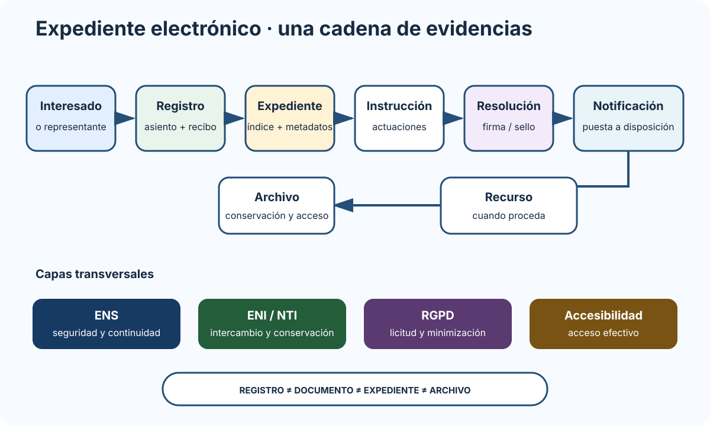
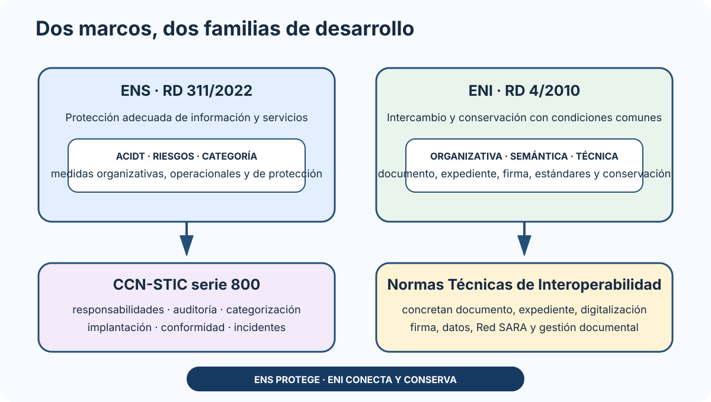

# Instrumentos para el acceso electrónico a las Administraciones públicas: sedes electrónicas, canales y punto de acceso, identificación y autenticación. Datos abiertos. Normativa vigente de reutilización de la información del sector público. La gestión electrónica de los procedimientos administrativos. Esquema Nacional de Seguridad (ENS). Esquema Nacional de Interoperabilidad (ENI). Normas técnicas de interoperabilidad. Guías CCN-STIC serie 800.

B1-T09 · Bloque 1 · Tema 9

Fuente: [01 — BLOQUE I — Organización del Estado y Administración electrónica — GSI A2](https://docs.google.com/document/d/1J0-5Ab3M7Xom8Af_mpCzGFX5S4ynSyLLYa5YOTzd_qo/edit) · I.09 · V2.1 · 2026-09-23

## 1. Por qué es un tema nuclear

I.09 une normativa jurídica, interoperabilidad y seguridad. Es de los temas con más retorno para **test y supuesto**. Debes entender cómo encajan:

* instrumentos de acceso electrónico;
* gestión electrónica del procedimiento;
* datos abiertos/reutilización;
* ENS;
* ENI;
* NTI;
* CCN-STIC serie 800.

El tema debe estudiarse como un sistema completo: acceso y tramitación electrónica, reutilización de información, seguridad e interoperabilidad. Cada marco resuelve un problema distinto y todos convergen en el expediente.

## 2. Marco de actuación electrónica

Normas centrales: - Ley 39/2015; - Ley 40/2015; - RD 203/2021, Reglamento de actuación y funcionamiento del sector público por medios electrónicos. Control de actualidad: el ENS (RD 311/2022) y el ENI (RD 4/2010) muestran en BOE última actualización consolidada publicada el 06/11/2024.

El objetivo es que la vía electrónica no sea una capa decorativa, sino el medio ordinario de actuación con garantías de identidad, integridad, trazabilidad, interoperabilidad, seguridad y accesibilidad.

## 3. Sede, portal y Punto de Acceso General

### 3.1 Sede electrónica

Dirección electrónica cuya titularidad corresponde a una Administración/organismo y cuya gestión debe garantizar identificación del titular, integridad/veracidad/actualización de información/servicios, seguridad, responsabilidad y accesibilidad.

Servicios típicos: trámites, registro, identificación/firma, consulta de estado, notificaciones, verificación, calendario/hora oficial y tablón cuando proceda. RD 203/2021, art. 9.1: mediante sede electrónica se realizan todas las actuaciones y trámites de procedimientos o servicios que requieran la identificación de la Administración Pública y, en su caso, la identificación o firma electrónica de las personas interesadas.

### 3.2 Portal de Internet

Punto de acceso a información publicada y enlaces/servicios. Puede dirigir a sede, pero **portal ≠ sede**: la sede tiene régimen jurídico y garantías específicas.

### 3.3 PAGe

El Punto de Acceso General electrónico facilita acceso centralizado a información, sedes y servicios y se vincula con área personal/Carpeta Ciudadana.

**Test:** sede ≠ portal ≠ PAGe.

## 4. Registro electrónico

Permite presentación de solicitudes/documentos y genera recibo con asiento, fecha/hora y evidencia. Aspectos de diseño: - disponibilidad; - hora oficial; - integridad; - sellado; - identificación del asiento; - anexos y tamaños/formatos; - interoperabilidad; - conexión con tramitador; - contingencia.

Un registro no es el expediente: es la puerta de entrada/salida de documentos/asientos.

## 5. Documento electrónico

Un documento electrónico administrativo debe poder identificarse, conservarse, interoperar y mantener integridad/autenticidad.

Elementos habituales: - contenido; - metadatos; - firma/sello cuando proceda; - identificador; - formato; - relación con expediente; - evidencias de validación cuando sean necesarias.

El ENI/NTI concreta estructuras y metadatos mínimos.

## 6. Expediente electrónico

Conjunto ordenado de documentos y actuaciones correspondientes a un procedimiento. Según la NTI de Expediente Electrónico, la estructura de test es: documentos electrónicos + índice electrónico firmado + metadatos mínimos obligatorios del expediente. El índice garantiza la integridad del expediente y permite su recuperación cuando proceda.

No debe confundirse con: - una carpeta del sistema de archivos; - una tabla de BD sin documentos; - un ZIP sin índice/metadatos.

En intercambio entre Administraciones, la interoperabilidad del expediente es esencial.

## 7. Copias auténticas, digitalización y archivo

Las copias auténticas deben seguir procesos/competencias previstos y conservar relación con original. La digitalización transforma documentos en papel a documentos electrónicos con garantías cuando proceda. RD 203/2021: cuando un documento en papel presentado por el interesado no pueda devolverse en el momento de su presentación, una vez digitalizado se conserva a su disposición durante al menos seis meses, salvo que reglamentariamente proceda un plazo mayor.

Archivo electrónico debe garantizar: - autenticidad; - integridad; - disponibilidad; - accesibilidad; - conservación; - trazabilidad; - migración de formatos; - seguridad; - aplicación de calendario de conservación/eliminación.

## 8. Procedimiento electrónico de extremo a extremo

### Del registro al archivo: expediente electrónico completo

_Une los componentes jurídicos y técnicos que deben conservar trazabilidad a lo largo de todo el procedimiento._

**Qué debes recordar:** Registro, documento, expediente y archivo son piezas distintas; ENS, ENI, accesibilidad y RGPD atraviesan todo el flujo.

Un tramitador público debe poder representar:

**interesado/representante → registro → expediente → documentos → actuaciones → firma/sello → plazos → subsanación → informes → resolución → notificación → recurso → archivo**.

Requisitos transversales: - roles/competencia; - abstención/recusación; - protección de datos; - auditoría; - interoperabilidad; - accesibilidad; - continuidad.

## 9. Datos abiertos y reutilización

Marco central: **Ley 37/2007** y normativa de desarrollo/modificación.

Conceptos: - información del sector público; - reutilización; - formato abierto; - formato legible por máquina; - metadatos; - datos dinámicos; - conjuntos de alto valor; - condiciones/licencias; - no discriminación; - formatos y APIs cuando proceda.

**Importante: dato abierto no significa “todo dato de la Administración debe publicarse”. Existen exclusiones/límites por datos personales, seguridad, propiedad intelectual, confidencialidad y demás normativa. Los conjuntos de datos de alto valor se suministran gratuitamente, en formatos legibles por máquina y mediante API y, cuando proceda, descarga masiva. En el ámbito de la AGE, reutilizar documentación sin la licencia exigida cuando ésta sea necesaria constituye infracción grave conforme a la Ley 37/2007.**

## 10. ENS — RD 311/2022

### 10.1 Finalidad y ámbito

El ENS establece principios y requisitos para protección adecuada de información/servicios en su ámbito, incluida aplicación a proveedores privados cuando prestan determinados servicios a entidades públicas en virtud de relación contractual y normativa aplicable.

### 10.2 Dimensiones de seguridad: ACIDT

* **A**utenticidad.
* **C**onfidencialidad.
* **I**ntegridad.
* **D**isponibilidad.
* **T**razabilidad.

La categoría no se decide por “tamaño del servidor”, sino por impacto de incidentes sobre estas dimensiones y servicios/información.

### 10.3 Siete principios básicos

* seguridad como proceso integral;
* gestión de seguridad basada en riesgos;
* prevención, detección, respuesta y conservación;
* líneas de defensa;
* vigilancia continua;
* reevaluación periódica;
* diferenciación de responsabilidades.

### 10.4 Requisitos mínimos

Debes reconocer: - organización e implantación del proceso de seguridad; - análisis/gestión de riesgos; - gestión de personal; - profesionalidad; - autorización/control de accesos; - protección de instalaciones; - adquisición de productos y contratación de servicios de seguridad; - mínimo privilegio; - integridad/actualización; - protección de información almacenada/en tránsito; - prevención frente a sistemas interconectados; - registro de actividad y detección de código dañino; - incidentes; - continuidad; - mejora continua.

## 11. Roles ENS

* Responsable de la Información.
* Responsable del Servicio.
* Responsable de Seguridad.
* Responsable del Sistema.

La separación evita conflictos: quien decide requisitos de información/servicio no debe concentrar sin control toda la ejecución técnica/seguridad.

## 12. Categorización ENS

Primero se valora impacto en dimensiones, después se obtiene categoría conforme al Anexo I.

Categorías: - **BÁSICA**; - **MEDIA**; - **ALTA**.

El nivel de una dimensión responde a perjuicio potencial para organización, ciudadanos, cumplimiento legal y otros criterios del ENS.

## 13. Medidas de seguridad — Anexo II

Se organizan en: 1. **marco organizativo**; 2. **marco operacional**; 3. **medidas de protección**.

La selección depende de categoría, análisis de riesgos, perfil de cumplimiento y reglas del ENS. La relación aplicable forma la **Declaración de Aplicabilidad**.

### Marco organizativo

Política, normativa, procedimientos, autorización, responsabilidades.

### Marco operacional

Planificación, control de acceso, explotación, servicios externos, continuidad, monitorización, gestión cambios/configuración y otros controles operativos.

### Medidas de protección

Instalaciones, personal, equipos, comunicaciones, soportes, aplicaciones, información, servicios y otros activos.

## 14. Auditoría y conformidad

El material A1 048 actualizado en marzo 2026 recoge: - auditoría ordinaria con periodicidad mínima bienal en sistemas sujetos a ella; - extraordinaria ante cambios sustanciales con impacto en seguridad; - autoevaluación/declaración de conformidad para categoría básica en el marco correspondiente; - certificación de conformidad para media/alta según regulación/ITS.

Distingue: - auditoría ENS; - certificación ISO 27001; - EIPD de protección de datos.

## 15. Gestión de incidentes

Se requieren procedimientos, clasificación, comunicación, registro, contención, recuperación y aprendizaje.

CCN-CERT presta apoyo, guías, herramientas y respuesta en el ámbito público correspondiente. Proveedores/entidades privadas pueden tener canales distintos según normativa/ámbito.

## 16. ENI — RD 4/2010

### ENS, ENI, NTI y CCN-STIC: encaje de marcos

_Separa finalidad, norma y piezas de desarrollo para evitar asociaciones cruzadas._

**Qué debes recordar:** ENS protege; ENI permite intercambiar y conservar; las NTI desarrollan ENI; la serie CCN-STIC 800 apoya ENS.

Objetivo: condiciones comunes para intercambio y conservación interoperable de información/servicios.

Dimensiones: - **organizativa**; - **semántica**; - **técnica**.

Áreas: - estándares; - redes/servicios; - firma/certificados; - documento/expediente; - conservación; - reutilización; - modelos de datos; - política de gestión documental. Reutilización de aplicaciones: el ENI establece que se procurará aplicar la Licencia Pública de la Unión Europea (EUPL), sin excluir otras licencias que garanticen los mismos derechos de uso, estudio, modificación y redistribución.

**Regla mental:** ENS protege; ENI hace posible entender/intercambiar/reutilizar de forma común.

## 17. Normas Técnicas de Interoperabilidad

Desarrollan ENI. Debes reconocer, al menos, ámbitos de: - catálogo de estándares; - documento electrónico; - expediente electrónico; - digitalización; - copiado auténtico/conversión; - política de firma/sello/certificados; - protocolos de intermediación de datos; - modelos de datos; - conexión a Red SARA; - reutilización de recursos de información; - política de gestión de documentos electrónicos.

**No memorices como actual un catálogo de estándares de una versión antigua sin validar.**

## 18. CCN-STIC serie 800

Serie vinculada al ENS. Asociaciones especialmente útiles:

* 801: responsabilidades/funciones.
* 802: auditoría.
* 803: valoración/categorización.
* 804: implantación ENS.
* 805: política de seguridad.
* 806: plan de adecuación.
* 807: criptología.
* 808: verificación de cumplimiento.
* 809: declaración/certificación/conformidad.
* 811: interconexión.
* 812: entornos/aplicaciones web.
* 817: gestión de ciberincidentes.

Existen guías especializadas para nube, VPN, móviles, Wi-Fi, malware y registro. Para GSI interesa conocer familias/conceptos, no cientos de números sin contexto Microdatos ya preguntados en el examen oficial más reciente: CCN-STIC 804 [ORG.3] exige que los procedimientos operativos de seguridad cubran al menos el 80 % de las actividades rutinarias; CCN-STIC 807, para AES con cifrado autenticado AE/AEAD de uso recomendado, recoge EAX, GCM y CCM. Estos valores deben revisarse si cambia la versión oficial de la guía..

## 19. Tabla de diferencias crítica

| Concepto | Qué resuelve |
| --- | --- |
| RD 203/2021 | funcionamiento electrónico del sector público |
| ENS | seguridad |
| ENI | interoperabilidad |
| NTI | desarrollo técnico del ENI |
| CCN-STIC 800 | guías/recomendaciones para ENS |
| Ley 37/2007 | reutilización de información pública |

## 20. Datos de test I.09

* ENS = RD 311/2022.
* ENI = RD 4/2010.
* actuación electrónica = RD 203/2021.
* reutilización = Ley 37/2007.
* ENS: ACIDT.
* categorías: básica/media/alta.
* 7 principios básicos ENS.
* 3 grupos de medidas: organizativo, operacional, protección.
* ENI: organizativa/semántica/técnica.
* NTI desarrollan ENI.
* serie 800 → ENS.
* sede ≠ portal ≠ PAG.
* registro ≠ expediente.
* documento ≠ expediente.

## 21. Aplicación al supuesto — plantilla

Para una nueva sede/tramitador:

* identificar procedimiento/sujetos;
* sede/PAG/registro;
* identidad/firma;
* documento/expediente/metadatos;
* notificación;
* archivo;
* ENI/NTI;
* servicios comunes;
* categorizar ENS;
* análisis de riesgos;
* roles ENS;
* medidas/Declaración Aplicabilidad;
* logging/monitorización;
* incidentes;
* continuidad;
* RGPD;
* accesibilidad;
* datos abiertos cuando proceda.

## 22. Resumen I.09

Este tema debe entenderse como un sistema único: **procedimiento electrónico + interoperabilidad + seguridad**. Memoriza roles, categorías, dimensiones y diferencias ENS/ENI/NTI, y practica cómo convertirlas en arquitectura y controles.

## Resumen de repaso

Fuente: [GSI_A2 — BLOQUE I — RESUMEN MAESTRO DE REPASO (10 temas)](https://docs.google.com/document/d/1aa9J2Ilhwcn0K-Z_9yQ2QD12DCEbiSWaYZc3upXorWQ/edit) · I.09

### Núcleo de estudio

Es un tema nuclear para test y supuesto. La actuación electrónica se apoya en Leyes 39/2015 y 40/2015 y Real Decreto 203/2021. Debes dominar sede electrónica, Portal de Internet, Punto de Acceso General, registro electrónico, expediente y documento electrónico, copias, archivo, identificación/firma y notificación. Datos abiertos y reutilización: Ley 37/2007, modificada para incorporar el marco europeo de datos abiertos; conceptos de formatos legibles por máquina, datos dinámicos, conjuntos de alto valor y condiciones de reutilización. El ENS vigente se regula por Real Decreto 311/2022: principios básicos, requisitos mínimos, categorización, medidas, roles, gestión de riesgos, incidentes y auditoría. El ENI sigue regulado por Real Decreto 4/2010, con texto consolidado actualizado en 2024: interoperabilidad organizativa, semántica y técnica, estándares, firma, documento/expediente, conservación y reutilización. Las NTI concretan el ENI y las guías CCN-STIC serie 800 desarrollan seguridad ENS.

### Claves de test

Aprende diferencias ENS/ENI; categoría BÁSICA/MEDIA/ALTA según impacto en dimensiones; roles de seguridad; declaración/certificación de conformidad; documento vs expediente; metadatos y firma; interoperabilidad semántica/técnica/organizativa. El ENI tuvo actualización consolidada en 2024: evita esquemas antiguos sin revisar.

### Enfoque para supuesto práctico

En supuesto suele dar muchos puntos: categoriza razonadamente el sistema, selecciona medidas ENS, plantea interoperabilidad ENI/NTI, expediente/documento, archivo, firma, servicios comunes, protección de datos y continuidad.

### Actualización 2026

Actualización 2026: ENS = RD 311/2022; ENI consolidado con actualización publicada en 2024.

### Fuentes base del material

A1 008 + 009 + 025 + 045 + 046 + 047 + 048. RD 203/2021, RD 311/2022 ENS, RD 4/2010 ENI.
