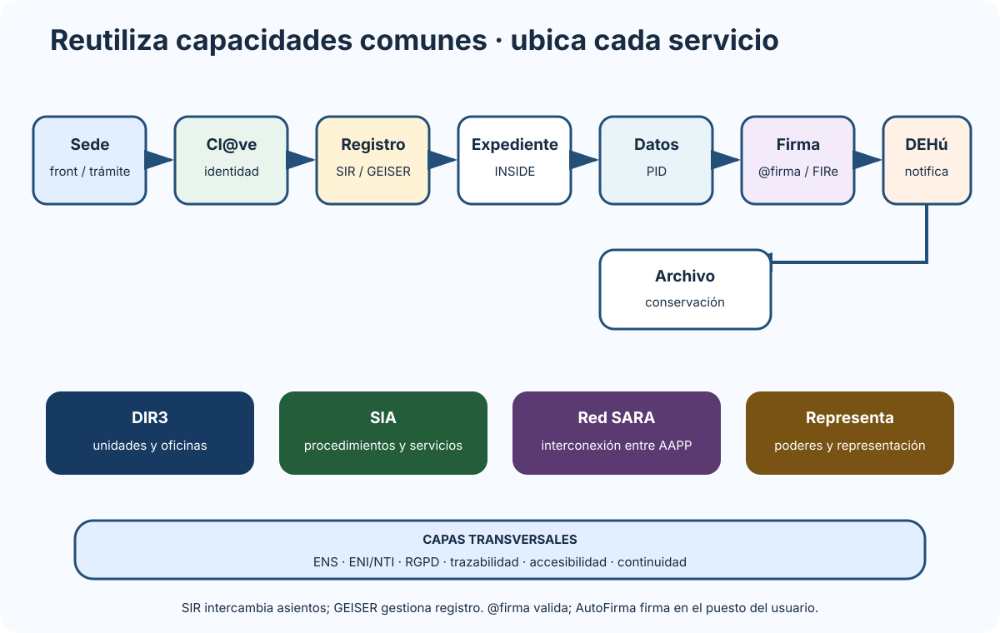

# Instrumentos y órganos para la cooperación entre Administraciones públicas en materia de Administración electrónica. Infraestructuras y servicios comunes. Plataformas de validación e interconexión de redes.

B1-T10 · Bloque 1 · Tema 10

Fuente: [01 — BLOQUE I — Organización del Estado y Administración electrónica — GSI A2](https://docs.google.com/document/d/1J0-5Ab3M7Xom8Af_mpCzGFX5S4ynSyLLYa5YOTzd_qo/edit) · I.10 · V2.1 · 2026-09-23

## 1. Cooperación en administración digital

Se apoya en principios LRJSP de colaboración, cooperación, coordinación, eficiencia y lealtad institucional. Digitalmente, el objetivo es evitar duplicar identidad, firma, registro, intermediación, notificación, directorios o redes cuando existen soluciones comunes.

## 2. Servicios comunes/transversales y RD 1125/2024

El **RD 1125/2024** actualiza organización e instrumentos operativos para Administración Digital de la Administración del Estado y el marco de medios/servicios transversales Dato de test del art. 9.2: cuando un medio o servicio se declara transversal, su utilización es obligatoria y sustitutiva respecto de los medios y servicios particulares empleados por las unidades..

Idea práctica: si existe un servicio común adecuado y obligatorio, construir otro paralelo suele empeorar coste, interoperabilidad, operación y seguridad.

## 3. Red SARA

Infraestructura de comunicaciones para interconectar Administraciones y acceder a servicios comunes, con servicios básicos y conexiones con entornos europeos cuando corresponde.

**Trampa:** SARA no es Internet pública ni “la nube de la Administración”.

## 4. Cl@ve — identidad ciudadana

Sistema común para identificación/autenticación.

A 24/08/2026 la información oficial del Punto de Acceso General mantiene tres usos de Cl@ve: Cl@ve Móvil, Cl@ve Permanente y Cl@ve PIN. La documentación oficial presenta Cl@ve Móvil como el nuevo sistema de acceso y mantiene la alternativa de PIN por SMS; por tanto, las tres opciones deben reconocerse en el estudio.

Una aplicación debe pedir **nivel de garantía proporcionado al riesgo**, no siempre el mecanismo más fuerte.

## 5. Suite y servicios de firma

### **@firma**

Plataforma multi-PKI de validación/servicios de certificados y firmas para desacoplar esa lógica de aplicaciones.

### VALIDe

Servicio web para verificación/validación y utilidades de firma/certificados orientado a uso interactivo.

### AutoFirma

Aplicación de firma en el entorno del usuario. Port@firmas AGE, por su parte, es un componente para incorporar la firma electrónica en los flujos de trabajo de una organización; no confundirlo con AutoFirma, @firma o VALIDe.

### FIRe

Facilita integración de mecanismos de firma locales/en nube mediante componente común Está compuesta por dos componentes: API FIRe, integrable en las aplicaciones, y Servidor FIRe..

### Cl@ve Firma

Firma con certificados centralizados/nube en su marco de uso.

### TS@

Sellado de tiempo, sincronizado con hora oficial en el marco de servicios estatales.

**Trampa:** @firma, AutoFirma, VALIDe y Cl@ve no son sinónimos.

## 6. Autentica

Servicio de autenticación/autorización/SSO para empleados públicos y colectivos habilitados en aplicaciones internas. No debe confundirse con Cl@ve ciudadana.

## 7. DIR3

Directorio Común de Unidades Orgánicas y Oficinas. Proporciona identificadores/códigos comunes para unidades/oficinas y soporta interoperabilidad registral y documental.

## 8. SIA

Sistema de Información Administrativa: catálogo de **procedimientos y servicios**.

**Trampa clásica:** - DIR3 → unidades/oficinas. - SIA → procedimientos/servicios.

## 9. SIR y GEISER

### SIR

Sistema de Interconexión de Registros: intercambio electrónico de asientos/documentos registrales entre oficinas/Administraciones integradas.

### GEISER

Aplicación de gestión de registro integrada con SIR para entradas/salidas.

**Trampa:** SIR = infraestructura/intercambio; GEISER = aplicación de gestión.

## 10. Plataforma de Intermediación de Datos

Permite consultar/verificar datos entre Administraciones para evitar exigir al ciudadano documentos/certificados que pueden obtenerse interoperablemente cuando exista base jurídica.

Requisitos prácticos: - finalidad; - habilitación/base; - minimización; - autenticación de organismo/aplicación; - autorización; - trazabilidad; - disponibilidad/contingencia; - protección de datos.

No simplifiques todo a “consentimiento del ciudadano”: la base de consulta depende del régimen jurídico aplicable.

## 11. INSIDE

Solución/servicios para gestión e intercambio de **documentos y expedientes electrónicos** alineados con ENI. Útil en remisiones, intercambio y construcción de expediente interoperable.

## 12. DEHú y notificaciones

La Dirección Electrónica Habilitada única actúa como punto de acceso a notificaciones/comunicaciones electrónicas en el ámbito correspondiente. NOTIFICA es la plataforma común que gestiona de forma automatizada las notificaciones y comunicaciones emitidas por los organismos integrados y su puesta a disposición por los canales correspondientes.

Distingue: - puesta a disposición; - acceso; - aviso; - efecto jurídico de notificación.

## 13. Carpeta Ciudadana

Área personal que agrega información y facilita relación con Administraciones: expedientes, notificaciones, datos y servicios disponibles.

No es una “base de datos única del ciudadano”; integra información de sistemas diferentes. Acceso: el interesado accede a la Carpeta Ciudadana mediante los sistemas de identificación a los que se refiere el art. 9.2 de la Ley 39/2015.

## 14. Representa

Registro/servicio de apoderamientos y representación en el marco correspondiente. Conecta directamente con representación de Ley 39/2015.

## 15. CTT

Centro de Transferencia de Tecnología: repositorio/entorno para reutilización y colaboración sobre soluciones, activos y documentación de las AAPP. Relacionado con ENI y reutilización.

## 16. Otras infraestructuras transversales

Según supuesto pueden aparecer: - NubeSARA/servicios de nube; - alojamiento de infraestructuras TIC; - servicios de seguridad gestionada; - hora oficial/NTP/sellado; - archivo; - otros servicios sectoriales.

No memorices catálogos infinitos; prioriza servicios del epígrafe, exámenes y supuestos.

## 17. Patrón de arquitectura pública

### Servicios comunes a lo largo de un trámite

_Coloca cada servicio en el punto de la tramitación donde aporta una capacidad concreta._

**Qué debes recordar:** DIR3 identifica unidades; SIA cataloga procedimientos; SIR intercambia asientos; GEISER gestiona registro; INSIDE trabaja con documentos y expedientes.

**Ciudadano → sede/front → Cl@ve/certificado → tramitador/API → registro → expediente → intermediación → firma/sello → notificación → archivo**

Transversal: - DIR3/SIA; - SARA; - ENS; - ENI/NTI; - RGPD; - logs/monitorización; - continuidad.

## 18. Tabla servicio ↔︎ función

| Servicio | Función principal |
| --- | --- |
| Red SARA | interconexión entre AAPP |
| Cl@ve | identidad/autenticación ciudadana |
| @firma | validación/servicios de firma y certificado |
| AutoFirma | firma en cliente |
| VALIDe | validación/verificación accesible |
| Autentica | identidad/SSO de empleado público |
| DIR3 | unidades y oficinas |
| SIA | procedimientos y servicios |
| SIR | intercambio registral |
| GEISER | gestión de registro |
| PID | intermediación/consulta de datos |
| INSIDE | documento/expediente interoperable |
| DEHú | acceso a notificaciones |
| Carpeta Ciudadana | área personal/agregación |
| Representa | representación/apoderamientos |
| CTT | reutilización/transferencia tecnológica |

## 19. Supuesto práctico

No basta escribir “usaría servicios comunes”. Para cada integración indica: - necesidad; - servicio elegido; - autenticación/autorización; - formato/API/protocolo a nivel conceptual; - manejo de errores; - reintentos/idempotencia; - trazabilidad; - disponibilidad/SLA; - contingencia; - protección de datos; - ENS; - ENI.

Ejemplo: si PID está temporalmente indisponible, diseña reintento/cola o actuación alternativa compatible con procedimiento; no pidas automáticamente al ciudadano documentación que la Administración debe interoperar sin analizar la norma.

## 20. Resumen I.10

Memoriza la asociación **servicio ↔︎ función** y comprende el patrón de integración. Los servicios cambian más rápido que la ley, por lo que su estado debe validarse con documentación oficial. En supuesto, la regla es **reutilizar lo común y justificar la integración**.

# ANEXO A — Tabla de memorización rápida

| Concepto | Dato |
| --- | --- |
| CE | 169 artículos |
| Valores art. 1 | libertad, justicia, igualdad, pluralismo |
| Reforma discapacidad | art. 49, 2024 |
| TC | 12 magistrados, 9 años |
| Investidura | absoluta; 48 h después simple |
| Moción censura | constructiva, mayoría absoluta |
| Transparencia | Ley 19/2013 |
| Acceso información | 1 mes, ampliable otro |
| Igualdad M/H | LO 3/2007 |
| Violencia género | LO 1/2004 |
| No discriminación | Ley 15/2022 |
| LGTBI/trans | Ley 4/2023 |
| Discapacidad | RDL 1/2013 |
| Dependencia | Ley 39/2006 |
| RGPD | Reglamento UE 2016/679 |
| LOPDGDD | LO 3/2018 |
| Brecha datos | 72 h a autoridad cuando proceda |
| Procedimiento | Ley 39/2015 |
| Régimen sector público | Ley 40/2015 |
| Empleo público | RDL 5/2015 |
| Actuación electrónica | RD 203/2021 |
| ENS | RD 311/2022 |
| Dimensiones ENS | ACIDT |
| Categorías ENS | básica, media, alta |
| ENI | RD 4/2010 |
| Reutilización | Ley 37/2007 |
| CCN-STIC 800 | ENS |
| DIR3 | unidades/oficinas |
| SIA | procedimientos/servicios |
| SIR | interconexión registros |
| GEISER | gestión registro |
| INSIDE | documento/expediente interoperable |
| DEHú | notificaciones |
| PID | intermediación datos |

# ANEXO B — Método de estudio del Bloque I

## Primera vuelta

Comprensión y subrayado activo. Crea mapas de: - Título I CE; - Congreso/Senado/TC; - Gobierno; - transparencia; - igualdad; - identidad/firma; - RGPD; - LPAC/LRJSP; - ENS/ENI; - servicios comunes.

## Segunda vuelta

Tablas de diferencias: - Congreso / Senado. - recurso / cuestión de inconstitucionalidad. - confianza / censura. - límite / inadmisión. - identificación / autenticación / autorización / firma. - responsable / encargado. - Ley 39 / Ley 40. - delegación / encomienda / avocación / suplencia. - ENS / ENI. - SIR / GEISER. - DIR3 / SIA.

## Test

Tras cada tema: preguntas cerradas + cuaderno de errores con tema → regla correcta → causa del fallo → fuente.

## Supuesto

Practica I.09 e I.10 desde el principio con arquitecturas cortas de: - sede electrónica; - tramitador; - identidad/firma; - registro; - expediente; - intermediación; - notificaciones; - archivo.

# Fuentes y control de actualidad

## PreparaTIC utilizado

* A1 001 — Constitución — resumen 05/09/2024.
* A1 007 — apoyo organización/Gobierno — P31.
* A1 025 — Gobierno abierto/transparencia — v31.1, 14/03/2026.
* A1 016 — igualdad/LGTBI/discapacidad/dependencia/violencia — v31.1, 26/02/2026.
* A1 051 — Agenda Digital/España Digital — cambios de ciclo P31.
* A1 080 — identificación/firma — 12/10/2024, incorpora reforma eIDAS 2.0.
* A1 081 — PKI/servicios confianza — P31 disponible.
* A1 027 — protección de datos — material P31 disponible.
* A1 008 — Ley 39/2015, Ley 40/2015 y administración electrónica — v31.1, 15/02/2026.
* A1 009/010 — revisión/recursos/responsabilidad — apoyo selectivo.
* A1 024 — TREBEP — 12/01/2025; actualizado en V2.1 con texto consolidado BOE de 30/07/2025.
* A1 045 — ENI — v31.1, 21/02/2026.
* A1 046 — NTI — resumen disponible.
* A1 047 — análisis de riesgos — apoyo.
* A1 048 — ENS — 05/03/2026.
* A1 049 — servicios comunes — 13/12/2024, corregido con operación oficial 2026.

## Fuentes oficiales prevalentes

* Convocatoria GSI A2 — BOE-A-2025-26262, Anexo IX.
* Constitución Española, texto consolidado BOE.
* Ley 19/2013 y RD 615/2024.
* LO 3/2007; LO 1/2004; Ley 15/2022; Ley 4/2023; RDL 1/2013; Ley 39/2006.
* RGPD y LO 3/2018.
* Reglamento eIDAS 910/2014 modificado por Reglamento 2024/1183; Ley 6/2020.
* Leyes 39/2015 y 40/2015; RD 203/2021; RDL 5/2015.
* Ley 37/2007.
* RD 311/2022 ENS.
* RD 4/2010 ENI y NTI.
* RD 1125/2024.
* Portal de Administración Electrónica / DATAOBSAE / CTT.
* Portal de Transparencia — V Plan Gobierno Abierto 2025–2029.

**Fecha de control de actualidad: 24/08/2026.**

## Resumen de repaso

Fuente: [GSI_A2 — BLOQUE I — RESUMEN MAESTRO DE REPASO (10 temas)](https://docs.google.com/document/d/1aa9J2Ilhwcn0K-Z_9yQ2QD12DCEbiSWaYZc3upXorWQ/edit) · I.10

### Núcleo de estudio

La cooperación electrónica evita duplicidades y permite servicios interoperables. Debes conocer órganos e instrumentos de cooperación de la Ley 40/2015 y, en el ámbito digital, el papel de los órganos de coordinación de administración electrónica y de la Secretaría General de Administración Digital. Red SARA proporciona interconexión entre Administraciones y acceso a servicios comunes. Servicios que conviene reconocer y saber ubicar: Cl@ve para identidad; @firma y VALIDe para firma/certificados; AutoFirma y Cl@ve Firma; SIA para catálogo de procedimientos; DIR3 para unidades y oficinas; SIR y GEISER para intercambio/registro; INSIDE para documento y expediente interoperable; DEHú/Notific@ para notificaciones; Carpeta Ciudadana; Plataforma de Intermediación de Datos para consultas; Representa para apoderamientos; y otros servicios horizontales. No memorices solo nombres: asocia cada plataforma con la necesidad que resuelve.

### Claves de test

Test: Red SARA no es Internet pública; DIR3 identifica unidades/oficinas; SIA cataloga procedimientos; SIR intercambia asientos registrales; GEISER gestiona registro; INSIDE trabaja con documentos/expedientes ENI; VALIDe valida firmas/certificados; DEHú actúa como punto único de notificaciones.

### Enfoque para supuesto práctico

En supuesto, reutilizar servicios comunes suele ser preferible a construirlos. Dibuja integraciones, identifica protocolos/APIs, disponibilidad, seguridad, protección de datos, trazabilidad y contingencia; justifica desacoplamiento y evita dependencias innecesarias.

### Actualización 2026

Actualización 2026: priorizar servicios actualmente en producción; DEHú, GEISER e INSIDE siguen con documentación operativa reciente.

### Fuentes base del material

A1 008 + 009 + 049 y material transversal RELEASE/P30. Portal de Administración Electrónica/CTT.

## Fuentes oficiales de actualización

* [Programa oficial GSI A2 — BOE-A-2025-26262](https://www.boe.es/diario_boe/txt.php?id=BOE-A-2025-26262)
* [ENS — Real Decreto 311/2022, texto consolidado](https://www.boe.es/buscar/act.php?id=BOE-A-2022-7191)
* [ENI — Real Decreto 4/2010, texto consolidado](https://www.boe.es/buscar/act.php?id=BOE-A-2010-1331)
* [Reglamento eIDAS modificado por Reglamento (UE) 2024/1183](https://eur-lex.europa.eu/eli/reg/2024/1183/oj)
* [Portal de Administración Electrónica / CTT](https://administracionelectronica.gob.es/)

Edición de trabajo GSI A2. Los materiales del otro proyecto GSI\_B1 no se han utilizado como fuente.
