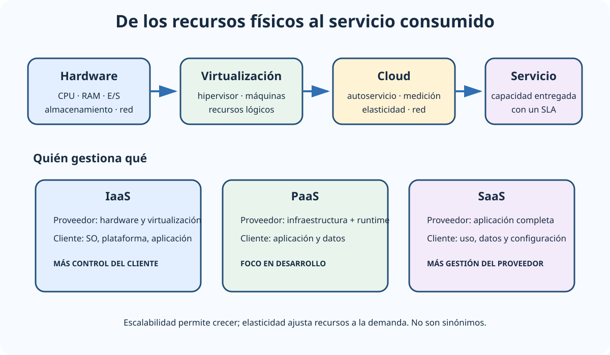

# Tecnologías actuales de ordenadores: de los dispositivos móviles a los superordenadores y arquitecturas escalables y de altas prestaciones. Computación en la nube. Base tecnológica. Componentes, funcionalidades y capacidades.

B2-T01 · Bloque 2 · Tema 1

Fuente: [02 — BLOQUE II — Tecnología básica — GSI A2](https://docs.google.com/document/d/1_-6JFktfHXhth_n3KeUfRPjPeFxp3Mgkl2HlZzab7c4/edit) · II.01 · V2.1 · 2026-09-23

## 1. Alcance del BOE

El tema une dos escalas: desde los dispositivos móviles y ordenadores de propósito general hasta servidores, clústeres, superordenadores y cloud. Para estudiarlo bien hay que dominar la **base tecnológica** —procesador, memoria, E/S, almacenamiento e interconexión— y después entender cómo se obtienen capacidad, paralelismo, escalabilidad, disponibilidad y elasticidad.

La taxonomía de Flynn, UMA/NUMA, clúster y grid siguen siendo fundamentos examinables. Deben relacionarse con servidores, virtualización e infraestructura actual, evitando convertir datos coyunturales de mercado o versiones en reglas técnicas.

## 2. Componentes básicos de un sistema de cómputo

Un computador ejecuta instrucciones sobre datos mediante la cooperación de procesador, memoria, subsistema de entrada/salida, almacenamiento e interconexiones. La CPU contiene unidades de control y ejecución, registros y varios niveles de caché. En procesadores modernos es habitual disponer de varios núcleos, y cada núcleo puede exponer uno o más hilos hardware. No deben confundirse CPU física, socket, núcleo e hilo. En el modelo clásico de CPU, el registro de instrucción (IR) mantiene la instrucción actual capturada para su decodificación/ejecución. Microdato de interfaz: el conector USB Type-C dispone de 24 contactos (pines).

La jerarquía de memoria busca equilibrar velocidad, capacidad y coste: registros → cachés L1/L2/L3 → memoria principal → almacenamiento persistente. Cuanto más cerca de la CPU, menor latencia y normalmente menor capacidad. Las cachés explotan localidad temporal y espacial. En sistemas multiprocesador cobran importancia la coherencia de caché y la topología de memoria.

El almacenamiento puede apoyarse en HDD, SSD/NVMe y sistemas externos o distribuidos. La E/S se gestiona mediante controladores, buses e interfaces. En cargas especializadas aparecen **aceleradores**: GPU para procesamiento masivamente paralelo, FPGA para lógica reconfigurable y otros ASIC orientados a cargas concretas.

## 3. Paralelismo y taxonomía de Flynn

La clasificación clásica distingue el número de flujos de instrucciones y de datos:

* **SISD**: una instrucción y un flujo de datos; modelo secuencial clásico.
* **SIMD**: una misma instrucción se aplica a múltiples datos. Es característico del procesamiento vectorial y de muchas operaciones de GPU.
* **MISD**: múltiples instrucciones sobre un flujo de datos; poco común como arquitectura general.
* **MIMD: múltiples instrucciones sobre múltiples datos; modelo típico de multiprocesadores y sistemas distribuidos. Como extensión clásica dentro de MIMD, Andrew S. Tanenbaum propuso una clasificación más fina atendiendo al grado de acoplamiento entre procesadores.**

En MIMD interesa distinguir memoria compartida y distribuida. En **UMA** los procesadores presentan tiempos de acceso aproximadamente uniformes a memoria; en **NUMA** el acceso a memoria local es más rápido que a memoria asociada a otros procesadores. El software debe considerar afinidad, localidad y sincronización para aprovechar el hardware.

## 4. Mainframe, supercomputación, clúster y grid

<!-- editorial-supplement:B2-T01:01:start -->

### Single System Image (SSI)

Single System Image (SSI) es la propiedad u objetivo de presentar los nodos y recursos de determinados clústeres como un único sistema lógico para usuarios o aplicaciones. No implica una sola máquina física ni que todos los clústeres ofrezcan el mismo grado de transparencia.

<!-- editorial-supplement:B2-T01:01:end -->

**Mainframe** y **supercomputador** no son sinónimos. El mainframe prioriza enorme capacidad transaccional, E/S, disponibilidad, aislamiento de cargas y continuidad de servicio; el supercomputador se orienta a maximizar capacidad de cálculo para problemas científicos o técnicos. Ambos pueden ser multiprocesador y altamente redundantes, pero sus cargas y objetivos difieren.

Un **clúster** agrupa nodos independientes conectados por una red y coordinados mediante software para prestar una capacidad conjunta. Puede buscar alto rendimiento, alta disponibilidad, balanceo o una combinación. El A1 052 destaca tres piezas: nodos de computación, interconexión de altas prestaciones y middleware que coordina el conjunto.

**Grid computing** agrega recursos autónomos y geográficamente distribuidos, incluso pertenecientes a dominios distintos. La idea estable es compartir y seleccionar recursos de manera dinámica; no debe estudiarse como si sustituyera al cloud moderno.

## 5. Escalabilidad, elasticidad y disponibilidad

**Escalabilidad vertical (scale up)** aumenta CPU, RAM o capacidad de un nodo. Es simple, pero tiene techo físico y puede mantener un punto único de fallo. **Escalabilidad horizontal (scale out)** añade nodos y exige que la aplicación y los datos toleren distribución. En sistemas web suele facilitarse manteniendo servicios sin estado o externalizando el estado.

**Elasticidad** es la capacidad de ajustar recursos a la demanda, idealmente de forma automática. Un sistema puede ser escalable sin ser elástico. **Alta disponibilidad** reduce interrupciones mediante redundancia y failover; **tolerancia a fallos** busca seguir funcionando a pesar de fallos; **recuperación ante desastres** contempla la restauración del servicio ante eventos graves y se relaciona con RTO y RPO.

## 6. Virtualización

La virtualización abstrae recursos físicos para crear entornos lógicos. Un **hipervisor tipo 1** se ejecuta directamente sobre el hardware; uno **tipo 2** sobre un sistema operativo anfitrión. Una máquina virtual incluye un sistema operativo invitado y recursos virtuales; esto proporciona aislamiento y flexibilidad, aunque introduce sobrecarga y exige gestión del hipervisor, imágenes, redes y almacenamiento.

No confundas virtualización con contenedores: el contenedor comparte el kernel del host y virtualiza a nivel de sistema operativo; se estudia en II.07.

## 7. Computación en la nube

### De la máquina física al servicio cloud

_Conecta la base física con la abstracción cloud y sitúa el reparto de gestión en IaaS, PaaS y SaaS._

**Qué debes recordar:** Cloud no elimina la infraestructura: añade abstracción y cambia quién administra hardware, sistema operativo, plataforma y aplicación.

Cloud computing ofrece recursos TIC bajo demanda mediante acceso de red, aprovisionamiento rápido, compartición de recursos, medición de consumo y elasticidad. Las características conceptuales importan más que memorizar proveedores. Edge computing desplaza parte del procesamiento y almacenamiento cerca de la fuente de datos o del usuario para reducir latencia, consumo de red o dependencia de un centro remoto; edge ≠ cloud, aunque pueden complementarse.

### 7.1 Modelos de servicio

* **IaaS**: el proveedor entrega capacidad de cómputo, red y almacenamiento; el cliente gestiona SO, middleware y aplicaciones.
* **PaaS**: el proveedor gestiona además plataforma/runtime y servicios de soporte; el cliente despliega aplicaciones y datos.
* **SaaS**: el usuario consume una aplicación completa gestionada por el proveedor.
* Otros modelos especializados —funciones, bases de datos gestionadas, contenedores gestionados— pueden entenderse como evoluciones dentro del continuo de responsabilidad.

### 7.2 Modelos de despliegue

* **Nube pública**: infraestructura ofrecida por un proveedor a múltiples clientes.
* **Nube privada**: dedicada a una organización, alojada interna o externamente.
* **Híbrida**: integra recursos privados y públicos con mecanismos de interoperabilidad y operación.
* **Multicloud**: uso de más de un proveedor; no implica por sí mismo integración transparente.

### 7.3 Componentes y capacidades

Una plataforma cloud combina cómputo, redes virtuales, balanceo, almacenamiento de bloque/fichero/objeto, IAM, gestión de claves y secretos, observabilidad, autoscaling, copias, imágenes, APIs de gestión y automatización. La infraestructura se organiza frecuentemente en regiones y zonas de disponibilidad para aislar fallos.

## 8. Riesgos y criterios de elección

Cloud no elimina la administración: cambia el reparto de responsabilidades. Deben valorarse protección del dato, ENS cuando proceda, ubicación y transferencias, identidad y privilegios, cifrado, logging, dependencia del proveedor, portabilidad, costes variables, salida/reversibilidad, disponibilidad y continuidad.

El dimensionamiento debe distinguir **capacidad** y **rendimiento**. Métricas típicas: CPU, RAM, IOPS, throughput, latencia, concurrencia y tiempos de respuesta. Sobredimensionar encarece; infradimensionar compromete servicio.

## 9. Datos y trampas de test

* SISD/SIMD/MISD/MIMD clasifican por flujos de instrucciones y datos.
* UMA ≠ NUMA.
* Mainframe ≠ supercomputador.
* Clúster ≠ grid ≠ cloud.
* Scale up = más recursos en un nodo; scale out = más nodos.
* Escalabilidad ≠ elasticidad.
* HA ≠ backup ≠ disaster recovery.
* IaaS/PaaS/SaaS implican distinta distribución de responsabilidades.
* Hipervisor tipo 1 ≠ tipo 2.
* CPU/socket/núcleo/hilo no son equivalentes.

## 10. Aplicación al supuesto

Ante una carga nueva, describe volumen y picos, requisitos de latencia, disponibilidad y datos; estima recursos; plantea escalado vertical/horizontal; distribuye por zonas; añade balanceo, observabilidad, backups y DR; y compara on-premise/cloud con TCO y riesgos. Una respuesta madura justifica por qué la arquitectura elegida satisface los requisitos y cómo crecerá.

## 11. Resumen II.01

Estudia la cadena completa: hardware → paralelismo → clúster/HPC → virtualización → escalabilidad → cloud. Las preguntas de examen suelen explotar diferencias conceptuales; en supuesto, la clave es dimensionar, eliminar puntos únicos de fallo y justificar coste, seguridad y crecimiento.

# Microdatos oficiales añadidos — ZBR y sistemas distribuidos

# En discos magnéticos, Zoned Bit Recording (ZBR) agrupa pistas en zonas y permite que las pistas exteriores contengan más sectores que las interiores, aprovechando mejor la superficie; apareció en la OEP 2025 con plantilla provisional. Como rasgo clásico de sistemas operativos/distribuidos, la OEP 2024 definitiva señaló la concurrencia global; en sistemas distribuidos no existe un reloj global común y los nodos pueden ejecutar trabajo concurrentemente.

## Resumen de repaso

Fuente: [GSI_A2 — BLOQUE II — RESUMEN MAESTRO DE REPASO (16 temas)](https://docs.google.com/document/d/1h7n4dFYafS_3VMuL55TnEuVKhqaTheUoL-thDFQSr9w/edit) · II.01

### Núcleo de estudio

Estudia la evolución desde dispositivos móviles y sistemas personales hasta servidores, clústeres, supercomputadores y arquitecturas de altas prestaciones. Revisa CPU, memoria, buses, almacenamiento, GPU/aceleradores, paralelismo SIMD/MIMD, multiprocesamiento, clúster y conceptos de HPC. Escalabilidad vertical significa aumentar recursos de un nodo; horizontal, añadir nodos. En cloud distingue IaaS, PaaS y SaaS; despliegues público, privado, híbrido y multicloud; elasticidad, autoservicio, pago por uso, agrupación de recursos y acceso por red. Relaciona virtualización, contenedores, almacenamiento distribuido, balanceo, alta disponibilidad y regiones/zonas de disponibilidad. Para la AGE conviene conocer la idea de nube soberana y servicios cloud contratados con requisitos ENS, sin memorizar productos comerciales salvo ejemplos.

### Claves de test

Diferencia escalabilidad y elasticidad; alta disponibilidad y recuperación ante desastres; hipervisor tipo 1 y tipo 2; IaaS/PaaS/SaaS; cloud público/privado/híbrido. En arquitectura, CPU no es lo mismo que núcleo, hilo o socket. Preguntas frecuentes mezclan capacidad, rendimiento, disponibilidad y tolerancia a fallos.

### Enfoque para supuesto práctico

Ante un supuesto, justifica dimensionamiento, crecimiento, HA, zonas, RPO/RTO, cifrado, monitorización y coste. Evita elegir cloud “porque sí”: compara requisitos de datos, latencia, dependencia de proveedor, reversibilidad y ENS.

### Fuentes base del material

A1 052 + 053 + 054 + 055 y RELEASE de arquitectura física/cloud.
