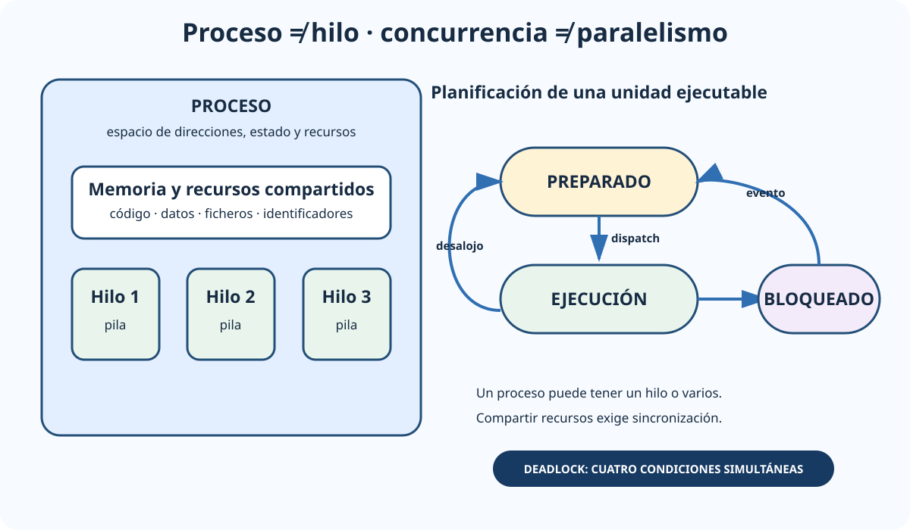

# Conceptos y fundamentos de los sistemas operativos. Características técnicas, funcionales y de administración: Windows, Linux, Unix y otros. Sistemas operativos para dispositivos móviles.

B2-T02 · Bloque 2 · Tema 2

Fuente: [02 — BLOQUE II — Tecnología básica — GSI A2](https://docs.google.com/document/d/1_-6JFktfHXhth_n3KeUfRPjPeFxp3Mgkl2HlZzab7c4/edit) · II.02 · V2.1 · 2026-09-23

## 1. Alcance y fuente

El A1 059, actualizado en marzo de 2026, es una base especialmente útil. Se complementa con los temas A1 específicos de Windows, Unix/Linux y móviles. El objetivo GSI no es memorizar comandos aislados, sino comprender funciones del SO y reconocer cómo se administran las plataformas principales.

## 2. Funciones de un sistema operativo

El sistema operativo administra hardware y ofrece abstracciones a los programas: procesos e hilos, memoria, E/S, ficheros, usuarios, protección, comunicaciones y servicios. El **kernel** ejecuta operaciones privilegiadas; las aplicaciones trabajan normalmente en modo usuario y solicitan servicios mediante llamadas al sistema.

## 3. Procesos, hilos y planificación

### Proceso, hilos y estados de ejecución

_Separa el contenedor de recursos —proceso— de las unidades de ejecución —hilos— y lo relaciona con planificación._

**Qué debes recordar:** Los hilos comparten recursos del proceso; el planificador asigna CPU a unidades ejecutables y un bloqueo no equivale a terminación.

Un **proceso** es un programa en ejecución con espacio de direcciones, estado y recursos. Un **hilo** es una unidad de ejecución dentro de un proceso y comparte gran parte de sus recursos con otros hilos del mismo proceso. Los hilos facilitan concurrencia, pero exigen sincronización.

Estados clásicos: nuevo, preparado, ejecución, bloqueado/espera y terminado, con variantes según SO. El planificador decide qué tarea usa CPU. En el modelo clásico, el planificador de largo plazo decide qué trabajos se admiten al sistema y pasan a competir por recursos; el de corto plazo selecciona entre procesos preparados cuál usa la CPU. Algoritmos que conviene reconocer: FIFO/FCFS, Round Robin, prioridades, Shortest Job First y Shortest Remaining Time. En tiempo compartido importa combinar respuesta, equidad y utilización.

Concurrencia introduce condiciones de carrera. Mecanismos: mutex, semáforos, monitores, variables de condición y operaciones atómicas. Un **deadlock** puede aparecer cuando concurren exclusión mutua, retención y espera, no apropiación y espera circular.

## 4. Memoria

La memoria virtual proporciona a cada proceso un espacio lógico y permite usar almacenamiento secundario como respaldo. La **paginación** divide memoria en páginas/marcos de tamaño fijo; la **segmentación** usa unidades lógicas de tamaño variable. La MMU traduce direcciones y la TLB acelera traducciones.

Ante falta de marcos, el SO aplica algoritmos de reemplazo. Para test conviene reconocer FIFO, NRU, LRU, NFU y LFU, aunque los sistemas reales emplean variantes y aproximaciones. Un exceso de fallos de página puede provocar thrashing. No confundas memoria virtual con «tener más RAM»: es una abstracción de direccionamiento y gestión.

## 5. Entrada/salida y dispositivos

Los drivers encapsulan detalles del hardware. Hay dispositivos orientados a bloque y a carácter. DMA permite transferencias entre dispositivos y memoria con menor intervención de CPU. Interrupciones notifican eventos y evitan sondeo continuo en muchos casos.

## 6. Sistemas de archivos

El sistema de archivos organiza nombres, directorios, metadatos, permisos y asignación de bloques. Debes reconocer conceptos de journaling, enlaces, cuotas, montajes y permisos.

* **Windows**: NTFS es el sistema de ficheros corporativo habitual, con ACL, journaling y características avanzadas; FAT/exFAT siguen siendo relevantes en intercambio y medios extraíbles.
* **Linux/Unix: ext4, XFS y otros; árbol único desde /, montajes, permisos rwx para propietario/grupo/otros y ACL cuando se usan. En notación octal de permisos Unix: r=4, w=2, x=1; por ejemplo, en chmod 457 el propietario tiene 4 = solo lectura, el grupo 5 = lectura+ejecución y otros 7 = lectura+escritura+ejecución.**
* **macOS**: APFS es el formato moderno principal, con snapshots y cifrado entre sus capacidades.

## 7. Estructuras de SO

Según diseño pueden hablarse de kernels monolíticos, microkernels e híbridos. Un kernel monolítico concentra muchos servicios en espacio privilegiado; un microkernel mantiene en el núcleo los mecanismos esenciales y desplaza servicios —por ejemplo sistemas de archivos, red o determinados drivers— a procesos/servidores en espacio de usuario, comunicados mediante paso de mensajes en un esquema de tipo cliente-servidor. Los sistemas reales combinan ideas. También se distinguen sistemas monousuario/multiusuario, monotarea/multitarea, uniprocesador/multiprocesador, de red y distribuidos.

## 8. Windows

Windows moderno deriva de la familia NT. Conceptos administrativos: servicios, procesos, registro, Event Log, NTFS, usuarios/grupos, ACL, políticas, PowerShell, actualización y protección del puesto. En entornos corporativos, Active Directory proporciona directorio, autenticación y políticas; no debe confundirse con el sistema operativo en sí. Las directivas de seguridad permiten gestionar privilegios/derechos y otras opciones de seguridad en el equipo local y, mediante Directiva de Grupo (GPO) en Active Directory, aplicarlas a nivel de dominio y a controladores de dominio.

La administración segura implica mínimo privilegio, separación de cuentas administrativas, parcheo, firewall, protección de credenciales, cifrado, logging, EDR y gestión centralizada.

## 9. Unix y Linux

<!-- editorial-supplement:B2-T02:01:start -->

### Microdatos de administración Unix/Linux

/etc/passwd contiene información de cuentas y /etc/shadow almacena hashes y datos de expiración de contraseñas en sistemas compatibles; passwd permite gestionar la contraseña de una cuenta. cron ejecuta tareas programadas y crontab define o edita su planificación. ps muestra información de procesos y vmstat resume estadísticas del sistema, como procesos, memoria, paginación, E/S y CPU. Son referencias de administración que conviene reconocer en test, no un catálogo de comandos que memorizar.

<!-- editorial-supplement:B2-T02:01:end -->

Unix define una tradición de diseño multiusuario con procesos, ficheros y herramientas composables. Linux es un kernel de tipo Unix usado en múltiples distribuciones. Conceptos clave: shell, procesos y señales, demonios/servicios, usuarios/grupos, permisos, sudo, paquetes, /proc y /sys, montaje de sistemas de archivos, logs y automatización. /etc es el directorio tradicional de configuración global del sistema y de muchos servicios.

En sistemas con systemd, unidades y servicios se gestionan de forma centralizada. El examen no debería prepararse como una lista de comandos, pero sí conviene saber qué problemas resuelven herramientas de procesos, red, almacenamiento, permisos y logs.

## 10. Sistemas móviles

**Android utiliza kernel Linux y un modelo por aplicaciones con UID/sandbox, permisos y firma. iOS deriva de Darwin/XNU y usa sandbox, firma de código y una distribución más controlada. En ambos importan cifrado, permisos, actualización, aislamiento, biometría y administración empresarial mediante soluciones MDM/UEM. BYOD (Bring Your Own Device) es el uso de dispositivos personales para actividades de la organización; incrementa los retos de seguridad y gestión al introducir dispositivos heterogéneos y acceso a datos corporativos desde equipos de propiedad personal.**

## 11. Administración y operación

Tareas comunes: instalación, configuración, usuarios y permisos, almacenamiento, red, servicios, actualización, hardening, copias, monitorización y resolución de incidencias. Deben automatizarse cuando sea razonable, manteniendo configuración versionada, trazabilidad y separación de entornos.

## 12. Test

* Proceso ≠ hilo.
* Concurrencia ≠ paralelismo.
* Modo kernel ≠ modo usuario.
* Paginación ≠ segmentación.
* Memoria física ≠ virtual.
* Driver ≠ firmware.
* Servicio Windows ≈ daemon Unix en función, no en implementación.
* NTFS ≠ FAT/exFAT.
* Permisos rwx y ACL no son exactamente lo mismo.
* Android usa kernel Linux; iOS se basa en Darwin/XNU.
* Un SO multitarea no implica que todas las tareas ejecuten simultáneamente en CPU.

## 13. Aplicación al supuesto

Define plataforma por compatibilidad y soporte. Explica hardening, actualización, cuentas privilegiadas, directorio/SSO, cifrado, logging, EDR, backups, monitorización, automatización y HA. No elijas Windows o Linux por preferencia personal: vincula la decisión a requisitos, competencias, licenciamiento, integración y operación.

## 14. Resumen II.02

Domina procesos/hilos, planificación, memoria, E/S, ficheros y seguridad; después aprende las diferencias operativas de Windows, Unix/Linux y móvil. Para GSI tiene más valor comprender mecanismos que memorizar comandos o versiones.

## Resumen de repaso

Fuente: [GSI_A2 — BLOQUE II — RESUMEN MAESTRO DE REPASO (16 temas)](https://docs.google.com/document/d/1h7n4dFYafS_3VMuL55TnEuVKhqaTheUoL-thDFQSr9w/edit) · II.02

### Núcleo de estudio

Un sistema operativo gestiona procesador, memoria, procesos/hilos, dispositivos, E/S, ficheros, usuarios y seguridad, ofreciendo abstracciones a aplicaciones. Domina núcleo, modo usuario/kernel, llamadas al sistema, planificación, concurrencia, sincronización, memoria virtual, paginación, sistemas de archivos y gestión de dispositivos. Windows emplea familias NT, servicios, registro, NTFS, Active Directory en entorno corporativo y PowerShell como herramienta de administración. Linux/Unix se apoyan en modelo multiusuario, permisos propietario-grupo-otros, procesos, señales, demonios/servicios, jerarquía de ficheros y shells. En móviles, Android se basa en kernel Linux con runtime y sandbox por aplicación; iOS usa arquitectura derivada de Darwin/XNU y un modelo de sandbox y firma estricta.

### Claves de test

Diferencia proceso/hilo; memoria física/virtual; paginación/segmentación; kernel monolítico/microkernel/híbrido; permisos Linux; NTFS/FAT; servicio/daemon; Android/iOS de SO de escritorio. No memorices comandos aislados sin entender su función.

### Enfoque para supuesto práctico

En supuesto define hardening, actualización, cuentas privilegiadas, logging, EDR, cifrado, copias, automatización, alta disponibilidad y política de soporte. Si eliges Windows o Linux, justifica por compatibilidad, operación, licencias y capacidades, no por preferencias.

### Fuentes base del material

A1 059 + 060 + 061 + 062.
