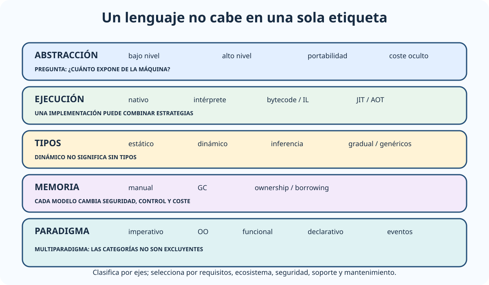

# Características técnicas de los lenguajes y paradigmas actuales de programación.

B2-T03 · Bloque 2 · Tema 3

Fuente: [GSI_A2 — BLOQUE II — APUNTES COMPLETOS V2.1 REVISADOS — ESTUDIO (16 temas)](https://docs.google.com/document/d/12jkpwzH8m5VoljIVPRi_Ofvqr7I_VBpVNGV0wmHfOFk/edit) · II.03 · V2.1 · 2026-08-21

## 1. Situación de las fuentes

El objetivo del tema es clasificar lenguajes por distintos ejes y comprender decisiones técnicas, no aprender la sintaxis completa de cada uno. Un mismo lenguaje puede ser multiparadigma y disponer de varias estrategias de ejecución.

## 2. Formas de clasificar un lenguaje

### Un lenguaje se clasifica por varios ejes

_Evita reducir cada lenguaje a una sola etiqueta y reúne los criterios que suelen mezclarse en test._

**Qué debes recordar:** Compilación, tipado, memoria y paradigma son ejes distintos; un lenguaje puede combinar varias opciones e implementaciones.

### 2.1 Nivel de abstracción

Los lenguajes de bajo nivel exponen detalles cercanos a la máquina; los de alto nivel proporcionan abstracciones de datos, control, memoria y bibliotecas. Un mayor nivel de abstracción suele mejorar productividad y portabilidad, aunque puede ocultar costes de ejecución.

### 2.2 Compilación, interpretación, JIT y AOT

* **Compilación nativa**: transforma código fuente a instrucciones de una arquitectura antes de ejecutar.
* **Interpretación**: un intérprete ejecuta representaciones del programa durante la ejecución.
* **Bytecode/intermediate language**: Java y .NET generan representaciones intermedias ejecutadas por una máquina virtual/runtime.
* **JIT**: compila durante ejecución partes del programa a código nativo.
* **AOT**: compila anticipadamente, incluso en plataformas que también admiten JIT.

La frontera no es absoluta: un lenguaje puede disponer de varias implementaciones. Por eso «lenguaje compilado» y «lenguaje interpretado» no deben tratarse como categorías rígidas.

### 2.3 Tipado

**Tipado estático**: muchas comprobaciones se realizan antes de ejecutar; **dinámico**: los tipos se asocian y comprueban principalmente en ejecución. «Dinámico» no significa «sin tipos». La distinción fuerte/débil es menos formal y alude al grado de conversiones implícitas y restricciones.

Otros conceptos: inferencia de tipos, genéricos, nulabilidad, tipos algebraicos, conversión explícita e implícita.

## 3. Paradigma imperativo y procedimental

Describe **cómo** modificar el estado mediante secuencias de instrucciones, asignaciones, condiciones, bucles y procedimientos. C es un ejemplo clásico. Ventajas: modelo cercano a la máquina y control explícito. Riesgos: mutabilidad y efectos laterales pueden complicar sistemas grandes y concurrentes.

## 4. Orientación a objetos

Organiza software alrededor de objetos que combinan estado y comportamiento. Conceptos: clase, objeto, encapsulación, abstracción, herencia, polimorfismo, composición e interfaces. Java, C#, C++ y muchos lenguajes modernos son multiparadigma y ofrecen OO.

La composición suele permitir menor acoplamiento que jerarquías de herencia profundas. La OO no garantiza por sí sola buen diseño: importan cohesión, interfaces y responsabilidades.

## 5. Programación funcional

Trata funciones como valores de primera clase y favorece expresiones, composición, funciones puras e inmutabilidad. Una función pura depende solo de sus entradas y no produce efectos laterales observables. Esto facilita razonamiento, pruebas y paralelismo. Haskell es funcional por diseño; Java, C#, JavaScript, Python y otros incorporan lambdas, funciones de orden superior y operaciones funcionales.

Conceptos a reconocer: map/filter/reduce, closures, recursividad, evaluación perezosa en algunos lenguajes e inmutabilidad.

## 6. Lógico y declarativo

En programación declarativa se expresa **qué resultado** se desea y el motor decide gran parte de cómo obtenerlo. SQL es el ejemplo esencial: la consulta describe el conjunto deseado y el optimizador elige un plan. En programación lógica se expresan hechos y reglas, como en Prolog.

## 7. Eventos, reactividad y concurrencia

En el modelo **dirigido por eventos**, callbacks, listeners o manejadores responden a eventos. Es habitual en GUI, navegador y sistemas distribuidos. La programación **reactiva** modela flujos asíncronos y propagación de cambios; suele incorporar backpressure o mecanismos para regular productores y consumidores.

**Concurrencia** significa progresar en varias tareas potencialmente solapadas; **paralelismo**, ejecutar realmente tareas a la vez. Modelos: hilos y memoria compartida, paso de mensajes/actores, async/await, event loop y procesos.

## 8. Gestión de memoria

C/C++ permiten control explícito de memoria, con potencia y riesgo de fugas, use-after-free y corrupción. Java, .NET, Python o JavaScript incorporan recolección automática de basura, aunque siguen existiendo fugas lógicas y presión de memoria. Rust emplea ownership y borrowing para imponer gran parte de la seguridad de memoria en compilación sin GC general.

## 9. Ejemplos de lenguajes actuales

| Lenguaje | Rasgos útiles para comparar |
| --- | --- |
| C | Compilado, procedimental, control de memoria, sistemas y rendimiento. |
| C++ | Nativo, multiparadigma, OO/genéricos, alto control y complejidad. |
| Java | Tipado estático, JVM, GC, OO + funcional, ecosistema empresarial. |
| C# | Tipado estático, .NET/CLR, multiparadigma, async/await, ecosistema empresarial. |
| Python | Dinámico, alto nivel, multiparadigma, scripting, datos y automatización. |
| JavaScript/ECMAScript | Dinámico, web, event loop, funciones de primera clase; cliente y servidor. |
| TypeScript | Superset de JavaScript con sistema de tipos estático gradual; transpila a JavaScript. |
| Go | Compilado, tipado estático, goroutines/channels, servicios e infraestructura. |
| Rust | Compilado, tipado estático, ownership, seguridad de memoria sin GC general. |
| SQL | Declarativo, orientado a consulta/manipulación relacional. |

## 10. Módulos, paquetes, excepciones y genéricos

Los sistemas modernos estructuran código en módulos/paquetes y gestionan dependencias con repositorios y versiones. Las excepciones separan flujo normal y manejo de errores, aunque algunos lenguajes emplean tipos de resultado. Los genéricos permiten reutilizar algoritmos manteniendo información de tipos.

## 11. Criterios de selección

Lenguaje y runtime deben evaluarse por requisitos funcionales/no funcionales, rendimiento, seguridad, ecosistema, disponibilidad de profesionales, soporte, ciclo de vida, portabilidad, integración, observabilidad, herramientas de pruebas, despliegue y coste de mantenimiento. La moda o preferencia del equipo no es criterio suficiente.

## 12. Test

* Compilado ≠ necesariamente código nativo.
* JIT ≠ intérprete puro.
* Tipado dinámico ≠ ausencia de tipos.
* Paradigma OO ≠ lenguaje exclusivamente OO.
* Funcional: funciones de primera clase e inmutabilidad son ideas centrales.
* Declarativo expresa principalmente qué; imperativo, cómo.
* Concurrencia ≠ paralelismo.
* Garbage collector reduce gestión manual, pero no elimina todos los problemas de memoria.
* SQL es declarativo.
* Java y C# se apoyan en runtime/máquina virtual y pueden usar JIT/AOT.

## 13. Supuesto

Cuando el caso exija escoger tecnología, presenta una matriz corta: requisitos → alternativas → criterios → decisión. Indica runtime, modelo de concurrencia, bibliotecas, mantenibilidad, seguridad, pruebas, soporte y despliegue. En aplicaciones públicas la continuidad del mantenimiento pesa más que elegir el lenguaje con mayor tendencia.

## 14. Resumen II.03

Clasifica por ejecución, tipado, memoria y paradigma; domina imperativo, OO, funcional, declarativo, eventos y concurrencia; y aprende a justificar un lenguaje por requisitos.

## Resumen de repaso

Fuente: [GSI_A2 — BLOQUE II — RESUMEN MAESTRO DE REPASO (16 temas)](https://docs.google.com/document/d/1h7n4dFYafS_3VMuL55TnEuVKhqaTheUoL-thDFQSr9w/edit) · II.03

### Núcleo de estudio

Tema complementario. Clasifica lenguajes por nivel de abstracción, tipado estático/dinámico y fuerte/débil, compilación/interpretación/JIT, gestión de memoria y paradigma. Paradigmas principales: imperativo/procedimental, orientado a objetos, funcional, lógico/declarativo, dirigido por eventos, concurrente/reactivo y scripting. Java y C# combinan OO con elementos funcionales y ejecución sobre máquina virtual/runtime; C/C++ se compilan a código nativo; Python y JavaScript son dinámicos y multiparadigma; SQL es declarativo. Conceptos transversales: tipos, alcance, paso de parámetros, excepciones, genéricos, closures, inmutabilidad, concurrencia, recolector de basura, módulos/paquetes y ecosistemas. No hace falta aprender sintaxis extensa: GSI pregunta características y comparaciones.

### Claves de test

Compilado no equivale siempre a nativo: Java/.NET compilan a bytecode/IL y usan JIT/AOT. Tipado dinámico no significa “sin tipos”. Funcional enfatiza funciones de primera clase e inmutabilidad; lógico expresa hechos/reglas; declarativo describe qué se quiere. Diferencia concurrencia de paralelismo.

### Enfoque para supuesto práctico

En supuesto selecciona lenguaje por ecosistema, mantenibilidad, competencias del equipo, rendimiento, seguridad, soporte, interoperabilidad y ciclo de vida. Evita justificar solo por popularidad.

### Fuentes base del material

Sin correspondencia A1 suficiente. Usar fuentes oficiales de Java, .NET, Python/ECMAScript y material docente de paradigmas. Tema COMPLEMENTAR.
