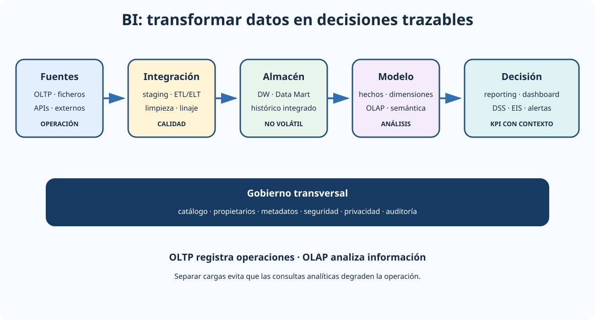

# Inteligencia de negocios: cuadros de mando integral, sistemas de soporte a las decisiones, sistemas de información ejecutiva y almacenes de datos. OLTP y OLAP.

B2-T04 · Bloque 2 · Tema 4

Fuente: [02 — BLOQUE II — Tecnología básica — GSI A2](https://docs.google.com/document/d/1_-6JFktfHXhth_n3KeUfRPjPeFxp3Mgkl2HlZzab7c4/edit) · II.04 · V2.1 · 2026-09-23

## 1. Alcance del tema

El núcleo del tema es Business Intelligence, Data Warehouse, DSS/EIS, ETL, datamarts y explotación multidimensional. Data Lake, Lakehouse, Data Fabric y Data Mesh se mantienen como comparación actual, sin desplazar el foco examinable de BI, cuadros de mando y OLTP/OLAP.

## 2. De datos a decisión

### Cadena BI: de las fuentes a la decisión

_Sitúa integración, almacén, modelo analítico y consumo en el orden correcto._

**Qué debes recordar:** BI no es solo el dashboard: sin integración, calidad, linaje y modelo analítico, la visualización no produce información fiable.

**Business Intelligence (BI)** agrupa métodos, procesos y tecnologías para transformar datos en información analítica útil para la toma de decisiones. Un ecosistema típico tiene fuentes operacionales → integración/ETL → almacén analítico → modelo semántico/OLAP → reporting, dashboards, alertas y análisis.

BI no es solo visualización. Si los datos son inconsistentes, no hay gobierno, o las métricas tienen definiciones diferentes, un dashboard únicamente presenta errores con mejor formato.

## 3. Sistemas de soporte

* **DSS (Decision Support System)**: apoya decisiones semiestructuradas mediante datos, modelos y análisis.
* **EIS (Executive Information System)**: orientado a alta dirección, con información agregada, tendencias, excepciones y KPI.
* **MIS**: categoría amplia de información para gestión operativa, táctica y estratégica.
* **Cuadro de mando**: visualiza indicadores y objetivos; puede ser operativo, analítico o estratégico.
* **Cuadro de Mando Integral (CMI/Balanced Scorecard)**: vincula indicadores con estrategia y objetivos, tradicionalmente desde perspectivas financiera, cliente/usuario, procesos internos y aprendizaje/crecimiento, adaptables al sector público.

## 4. Data Warehouse

Un Data Warehouse integra información de múltiples fuentes para análisis histórico. La formulación clásica de Inmon lo caracteriza como **orientado a temas, integrado, variable en el tiempo y no volátil**. El objetivo no es procesar transacciones de negocio en tiempo real, sino facilitar análisis coherente.

**Data Mart** es un subconjunto especializado por área o materia. En enfoque top-down se construye primero un DW corporativo y después datamarts; en enfoque bottom-up se crean datamarts conformados y se integran progresivamente.

## 5. Aprovisionamiento: ETL/ELT, staging y ODS

**ETL**: extraer de fuentes, transformar/depurar/homogeneizar y cargar en destino. **ELT**: carga primero en una plataforma capaz y transforma posteriormente. No son dogmas: la elección depende de arquitectura, volumen, gobierno y herramientas.

* **Staging area**: zona temporal de recepción/preparación.
* **ODS (Operational Data Store)**: almacén integrado de datos operacionales recientes, habitualmente más normalizado y con menor profundidad histórica que el DW.
* **Metadatos**: describen significado, origen, estructura y transformación.
* **Linaje**: permite saber de dónde procede un dato y qué transformaciones ha sufrido.
* **Calidad**: exactitud, completitud, consistencia, unicidad, validez, oportunidad, etc.

## 6. Modelo dimensional

La **tabla de hechos** representa eventos o procesos medibles y contiene medidas y claves hacia dimensiones. Las **dimensiones** aportan ejes descriptivos como tiempo, organización, producto, territorio o usuario. Una decisión fundamental es el **grano** del hecho: qué representa exactamente una fila.

Esquema **estrella**: hecho central con dimensiones normalmente desnormalizadas. **Copo de nieve**: dimensiones más normalizadas. El modelo dimensional favorece comprensión y consultas analíticas.

## 7. OLTP vs OLAP

| Aspecto | OLTP | OLAP |
| --- | --- | --- |
| Objetivo | Registrar operaciones | Analizar información |
| Carga | Muchas transacciones cortas | Consultas complejas/agregaciones |
| Datos | Actuales, detalle | Históricos e integrados |
| Modelo | Normalizado con frecuencia | Dimensional/multidimensional frecuente |
| Escritura | Continua | Cargas planificadas/streaming según arquitectura |
| Prioridad | Integridad y latencia transaccional | Rendimiento analítico |

OLAP ofrece operaciones clásicas: **roll-up** (agregar), **drill-down** (más detalle), **slice** (seleccionar una dimensión/valor), **dice** (subcubo), **pivot** (reorientar ejes). Puede implementarse como MOLAP, ROLAP o HOLAP según almacenamiento y motor.

## 8. KPI, KGI y cuadro de mando

Un indicador útil debe tener definición, fórmula, fuente, periodicidad, responsable, objetivo/umbral y contexto. Diferencia métrica de **KPI**: no toda cifra es clave. El cuadro debe mostrar evolución, desviaciones y capacidad de profundizar, no solo valores absolutos.

## 9. Conceptos modernos, sin desplazar el epígrafe

A1 075 incluye **Data Lake** —almacenamiento flexible de datos brutos, schema-on-read—, **Lakehouse**, **Data Fabric** y **Data Mesh**. Para II.04 conviene saber diferenciarlos del DW, pero no convertirlos en el núcleo. Un Data Lake sin catálogo, calidad y gobierno puede degenerar en un *data swamp*.

## 10. Gobierno, seguridad y privacidad

BI requiere catálogo, propietarios, calidad, linaje y control de acceso. Las capas de presentación deben respetar minimización y finalidad. Técnicas como agregación, seudonimización y control por filas/columnas reducen exposición. Los entornos de análisis también deben auditar accesos y exportaciones.

## 11. Test

* DW: orientado a temas, integrado, histórico/variable en tiempo y no volátil.
* Data Mart ≠ Data Warehouse completo.
* ETL: transformación antes de la carga; ELT: transformación principal después de cargar.
* Hecho ≠ dimensión.
* Grano define qué representa una fila de hechos.
* OLTP ≠ OLAP.
* Roll-up ≠ drill-down.
* DSS ≠ EIS, aunque están relacionados.
* KPI ≠ cualquier métrica.
* Data Lake ≠ DW.

## 12. Supuesto

Define fuentes, frecuencia y volumen; plantea ingestión/ETL, calidad y linaje; diseña un modelo con grano, hechos y dimensiones; separa OLTP de carga analítica; añade BI, roles, auditoría y protección de datos. Incluye KPI concretos con fórmula y frecuencia.

## 13. Resumen II.04

Memoriza la arquitectura BI de extremo a extremo y las diferencias OLTP/OLAP, hecho/dimensión, DW/Data Mart y ETL/ELT. En caso práctico, la calidad y definición de indicadores son tan importantes como la herramienta.

# Microdatos oficiales añadidos — OLAP y KPI

# Los tipos clásicos de OLAP que conviene reconocer son ROLAP, MOLAP y HOLAP. En la OEP 2024 definitiva, “SOLAP (Spiral On-Line Analytical Processing)” era la opción que NO constituía un tipo OLAP. En la misma convocatoria, la trampa de KPI consideraba incorrecto afirmar que los objetivos pueden ser borrosos y no estar delimitados: el objetivo debe estar suficientemente definido y ser medible para que el indicador sea útil.

## Resumen de repaso

Fuente: [GSI_A2 — BLOQUE II — RESUMEN MAESTRO DE REPASO (16 temas)](https://docs.google.com/document/d/1h7n4dFYafS_3VMuL55TnEuVKhqaTheUoL-thDFQSr9w/edit) · II.04

### Núcleo de estudio

Business Intelligence transforma datos en información útil para decidir. Un Data Warehouse es orientado a temas, integrado, histórico y no volátil; suele alimentarse mediante ETL/ELT desde sistemas operacionales. Diferencia OLTP —muchas transacciones cortas, datos actuales y normalización— de OLAP —consultas analíticas, agregaciones, histórico y modelos dimensionales—. En modelado dimensional estudia tabla de hechos, dimensiones, medidas, estrella y copo de nieve. DSS apoya decisiones semiestructuradas; EIS facilita información agregada para dirección; un cuadro de mando presenta KPI y objetivos. Añade calidad, linaje, catálogo, metadatos y gobierno del dato como conceptos actuales.

### Claves de test

Hechos contienen medidas y claves hacia dimensiones; dimensión tiempo es habitual. ETL transforma antes de cargar; ELT puede transformar en destino. OLAP usa operaciones como slice, dice, drill-down, roll-up y pivot. No confundas Data Lake con Data Warehouse.

### Enfoque para supuesto práctico

En supuesto plantea fuentes, integración, calidad, modelo analítico, almacenamiento, BI, seguridad por roles, datos personales, actualización y KPI. Explica por qué separar cargas analíticas de OLTP.

### Fuentes base del material

A1 072 + 075 y materiales BI/DW del RELEASE.
