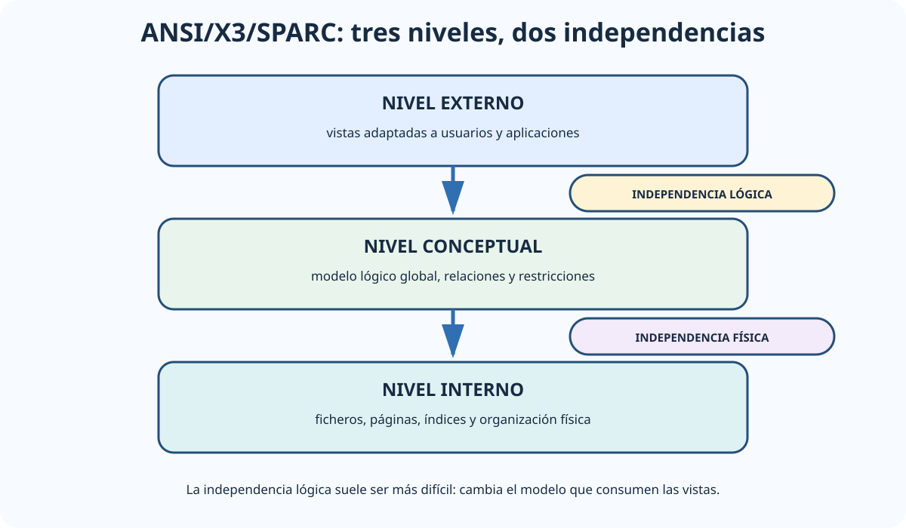

# La arquitectura ANSI/SPARC. Sistemas de gestión de bases de datos relacionales. El lenguaje SQL. Normas y estándares para la interoperabilidad entre gestores de bases de datos relacionales.

B2-T05 · Bloque 2 · Tema 5

Fuente: [02 — BLOQUE II — Tecnología básica — GSI A2](https://docs.google.com/document/d/1_-6JFktfHXhth_n3KeUfRPjPeFxp3Mgkl2HlZzab7c4/edit) · II.05 · V2.1 · 2026-09-23

## 1. Alcance del tema

El tema reúne arquitectura ANSI/SPARC, modelo relacional, SQL, transacciones ACID, concurrencia, componentes internos e interoperabilidad. Conviene estudiarlo como una cadena que va desde la independencia de datos hasta la ejecución segura y concurrente de consultas.

## 2. Base de datos, metadatos y SGBD

Una base de datos es un conjunto persistente de datos estructurados e interrelacionados conforme a un modelo. El **diccionario de datos** almacena metadatos sobre objetos, atributos, restricciones, privilegios, estructuras y otras propiedades. Puede hablarse de diccionario activo cuando su definición participa directamente en las herramientas del SGBD.

Un **SGBD** proporciona servicios para definir, almacenar, consultar y modificar datos, manteniendo concurrencia, integridad, recuperación, seguridad y administración. Entre sus funciones: catálogo, optimización, transacciones, bloqueos/versionado, logs, backup/recovery, autorización y utilidades de explotación.

## 3. Lenguajes

* **DDL: CREATE, ALTER, DROP y otras sentencias de definición de esquemas/objetos. TRUNCATE elimina las filas/contenido de una tabla conservando su definición; no equivale a DROP. Su clasificación formal y comportamiento transaccional concreto dependen del SGBD.**
* **DML**: SELECT, INSERT, UPDATE, DELETE y manipulación de datos.
* **DCL**: control de privilegios, por ejemplo GRANT/REVOKE según SGBD.
* **TCL**: control transaccional, como COMMIT, ROLLBACK y SAVEPOINT.

La clasificación exacta de determinadas sentencias puede variar entre productos/documentación; para examen interesa la función conceptual.

## 4. Arquitectura ANSI/X3/SPARC

### ANSI/SPARC e independencia de datos

_Relaciona los tres esquemas con los dos tipos de independencia que suelen intercambiarse en test._

**Qué debes recordar:** La independencia física protege el modelo conceptual frente a cambios de almacenamiento; la lógica protege vistas y aplicaciones frente a cambios conceptuales.

La arquitectura de tres niveles busca independencia entre vistas, modelo global y almacenamiento:

* **Nivel externo**: vistas o esquemas externos adaptados a usuarios/aplicaciones.
* **Nivel conceptual**: descripción lógica global de entidades, relaciones y restricciones, independiente del almacenamiento concreto.
* **Nivel interno**: representación física, organización de ficheros, páginas, índices y estrategias de almacenamiento.

**Independencia física**: cambiar estructuras internas sin obligar a modificar esquema conceptual/aplicaciones. **Independencia lógica**: modificar el esquema conceptual preservando en lo posible vistas externas y aplicaciones. La independencia lógica suele ser más difícil de alcanzar.

## 5. Modelo relacional

E. F. Codd propuso representar datos mediante relaciones. Una relación puede visualizarse como tabla; sus filas son tuplas y columnas atributos. Un dominio define valores admisibles. El orden de filas no forma parte del significado relacional. Regla de acceso garantizado de Codd: cada valor atómico debe poder localizarse unívocamente mediante el nombre de la relación/tabla, el atributo/columna y el valor de la clave primaria de la fila.

* **Clave candidata**: conjunto mínimo de atributos que identifica de forma única una tupla.
* **Clave primaria**: candidata elegida como identificador principal.
* **Clave alternativa**: candidata no elegida.
* **Clave foránea: referencia una clave de otra relación y materializa integridad referencial. En una relación 1:N, la clave foránea suele situarse en el lado N y referencia la clave del lado 1.**
* **NULL**: ausencia/desconocimiento/no aplicabilidad según contexto; introduce lógica de tres valores.

Restricciones: dominio, clave/entidad, integridad referencial y reglas de negocio. El diseño y normalización se profundizan en Bloque III, pero aquí hay que reconocer que el SGBD las aplica.

## 6. Álgebra relacional: conceptos

Operaciones básicas a reconocer: selección (filas), proyección (columnas), unión, diferencia, producto cartesiano y renombrado; join combina relaciones según condición. SQL no es una transcripción exacta del álgebra relacional, pero comparte su fundamento de operación sobre conjuntos/multiconjuntos.

## 7. SQL de consulta

Orden lógico aproximado de una consulta: FROM/JOIN → WHERE → GROUP BY → HAVING → SELECT → ORDER BY, con matices del optimizador. De ahí una trampa clásica: **WHERE** filtra filas antes de agrupar y **HAVING** filtra grupos.

### 7.1 Joins

* **INNER JOIN**: filas con coincidencia.
* **LEFT OUTER JOIN**: conserva todas las filas izquierdas y completa con NULL cuando no hay coincidencia.
* **RIGHT OUTER JOIN**: simétrico.
* **FULL OUTER JOIN**: conserva ambos lados.
* **CROSS JOIN**: producto cartesiano.

Un join mal especificado puede multiplicar filas. Las cardinalidades del modelo deben entenderse antes de interpretar agregaciones.

### 7.2 Agregación y subconsultas

COUNT, SUM, AVG, MIN y MAX operan sobre conjuntos. GROUP BY crea grupos. Subconsultas pueden ser escalares, devolver conjuntos o estar correlacionadas. EXISTS comprueba existencia. UNION combina resultados eliminando duplicados; UNION ALL los conserva.

## 8. Vistas, índices y objetos

**Vista**: consulta con nombre que presenta una representación lógica; no equivale necesariamente a materialización. Una vista materializada persiste resultados según mecanismos del motor.

**Índice**: estructura auxiliar que acelera determinadas búsquedas/ordenaciones a costa de espacio, mantenimiento y mayor coste de escritura. Conceptos habituales: B/B+ tree, hash, índices compuestos, selectividad y cobertura. La elección depende del patrón de consultas.

Otros objetos frecuentes: secuencias/identidades, procedimientos/funciones almacenadas, triggers y constraints; no todos son parte estricta del estándar con idéntico comportamiento en productos.

## 9. Transacciones y ACID

* **Atomicidad**: todas las operaciones de la transacción tienen efecto o ninguna.
* **Consistencia**: la transacción lleva la BD de un estado válido a otro respetando reglas.
* **Aislamiento**: las transacciones concurrentes no deben producir resultados incompatibles con el nivel establecido.
* **Durabilidad**: tras commit, el resultado persiste frente a fallos contemplados.

COMMIT confirma; ROLLBACK deshace según alcance. El log de transacciones, buffers y mecanismos de recuperación ayudan a garantizar atomicidad/durabilidad.

## 10. Anomalías de concurrencia

* **Lectura sucia**: una transacción lee datos no confirmados por otra.
* **Lectura no repetible**: la misma fila leída dos veces ofrece valores distintos porque otra transacción confirmó una modificación.
* **Lectura fantasma**: repetir una consulta por condición devuelve un conjunto distinto por inserciones/borrados concurrentes.

| Nivel clásico | Lectura sucia | No repetible | Fantasma |
| --- | --- | --- | --- |
| Read Uncommitted | Puede | Puede | Puede |
| Read Committed | Evita | Puede | Puede |
| Repeatable Read | Evita | Evita | Puede en modelo estándar |
| Serializable | Evita | Evita | Evita |

Los motores implementan aislamiento mediante bloqueos, MVCC o combinaciones, por lo que ciertos comportamientos prácticos pueden diferir del cuadro teórico estándar.

## 11. Bloqueos, 2PL y deadlock

El **two-phase locking (2PL)** separa una fase de adquisición de bloqueos y otra de liberación para lograr serializabilidad en variantes adecuadas. Pueden existir bloqueos compartidos/exclusivos y granularidad de fila, página, tabla, etc. Dos transacciones pueden formar un **deadlock**; el SGBD detecta/previene y aborta una de ellas.

## 12. Arquitectura interna del SGBD

El A1 063 diferencia componentes conceptuales:

* **Procesador/optimizador de consultas**: parsea, valida y elige plan de ejecución.
* **Gestor de transacciones**: coordina unidades de trabajo.
* **Scheduler/Lock Manager**: ordena acceso concurrente y bloqueos.
* **Gestor de buffers**: mueve páginas entre disco y memoria.
* **Gestor de recuperación**: log, commit/rollback y restauración de consistencia.
* **Gestor de almacenamiento: organiza páginas, ficheros, índices y acceso físico. Formulación clásica de examen para los componentes de proceso de un SGBD: compilador DML, precompilador DML, intérprete DDL y motor de ejecución.**

## 13. Optimización

El optimizador elige planes en función de estadísticas, cardinalidades, índices, costes estimados y operadores. Problemas típicos: estadísticas obsoletas, índices inadecuados, scans masivos, joins costosos, funciones que impiden usar índice, N+1 desde aplicaciones y falta de particionado cuando procede.

## 14. Interoperabilidad entre SGBD relacionales

La interoperabilidad puede darse en varios niveles:

* **SQL estándar**: lenguaje común, aunque cada producto introduce dialectos/extensiones.
* **ODBC**: interfaz/driver estandarizado de acceso a datos, ampliamente usado en múltiples lenguajes.
* **JDBC**: API Java para conexión a SGBD mediante drivers.
* **ORM**: capa de mapeo objeto-relacional; mejora portabilidad parcial, pero no elimina diferencias de SQL, tipos ni transacciones.
* **APIs y servicios**: encapsulan datos evitando acoplar consumidores al motor.
* **ETL/ELT, replicación y CDC**: integración y sincronización entre plataformas.
* **Formatos**: CSV, JSON, XML, Parquet, etc., útiles para intercambio, no equivalentes a interoperabilidad transaccional.

El objetivo realista no es que dos motores sean idénticos, sino reducir dependencia de extensiones y definir contratos de datos, tipos, codificación, transacciones y errores.

## 15. CAP: dónde encaja

El A1 063 menciona CAP. Conviene conocerlo como teoría de sistemas de datos distribuidos: ante partición de red, no puede garantizarse simultáneamente consistencia fuerte y disponibilidad para todas las operaciones. No es una regla para elegir un SGBD relacional mononodo ni sustituye a ACID. Como ejemplo de familia distinta, Apache Cassandra es una base de datos distribuida NoSQL que utiliza un modelo de almacenamiento particionado wide-column/columnas anchas; no es un SGBD relacional.

## 16. Seguridad

Principio de mínimo privilegio, cuentas separadas, roles, autenticación robusta, cifrado en tránsito y reposo, gestión de secretos, auditoría, parcheo, hardening y copias. Las aplicaciones deben usar consultas parametrizadas para prevenir inyección SQL.

## 17. Test

* ANSI/SPARC: externo → conceptual → interno.
* Independencia física ≠ lógica.
* DDL/DML/DCL/TCL.
* PK ≠ FK.
* WHERE ≠ HAVING.
* INNER ≠ LEFT/FULL JOIN.
* Vista ≠ tabla física necesariamente.
* Índice acelera lecturas concretas pero penaliza almacenamiento/escrituras.
* ACID: atomicidad, consistencia, aislamiento, durabilidad.
* Dirty/non-repeatable/phantom son anomalías distintas.
* Read committed evita dirty reads; serializable es el aislamiento más fuerte del esquema clásico.
* CAP ≠ ACID.
* ODBC ≠ JDBC.

## 18. Supuesto

Diseña esquema y claves; identifica transacciones críticas; define aislamiento; selecciona índices con base en consultas; plantea pooling de conexiones, roles, cifrado, logs, backup y HA; y documenta interoperabilidad mediante estándar SQL/driver/API. Justifica cuándo usar funciones nativas y el coste de lock-in.

## 19. Resumen II.05

Tema nuclear: ANSI/SPARC + relacional + SQL + transacciones/concurrencia + arquitectura interna + interoperabilidad. Practica consultas y anomalías; son mucho más examinables que memorizar marcas de SGBD.

## Resumen de repaso

Fuente: [GSI_A2 — BLOQUE II — RESUMEN MAESTRO DE REPASO (16 temas)](https://docs.google.com/document/d/1h7n4dFYafS_3VMuL55TnEuVKhqaTheUoL-thDFQSr9w/edit) · II.05

### Núcleo de estudio

La arquitectura ANSI/SPARC separa niveles externo, conceptual e interno para favorecer independencia lógica y física de los datos. Un SGBD proporciona definición, manipulación, control de concurrencia, transacciones, integridad, seguridad, recuperación y administración. En el modelo relacional, tablas representan relaciones; filas tuplas; columnas atributos; claves primarias identifican y claves foráneas relacionan. SQL incluye DDL, DML, DCL y control transaccional. Domina SELECT, JOIN, agregación, GROUP BY/HAVING, subconsultas, vistas, índices y transacciones ACID. Interoperabilidad: estándares SQL, ODBC/JDBC, formatos de intercambio, APIs y replicación/CDC según caso.

### Claves de test

ANSI/SPARC: externo=visiones, conceptual=modelo global, interno=almacenamiento. WHERE filtra antes de agrupar; HAVING después. INNER/LEFT/RIGHT/FULL JOIN no son equivalentes. Índice acelera lecturas pero añade coste de espacio y escritura. ACID: atomicidad, consistencia, aislamiento, durabilidad.

### Enfoque para supuesto práctico

En supuesto diseña esquema, claves, índices, particionado, HA/replicación, backup, cifrado, auditoría y conexión. Justifica motor relacional frente a NoSQL en función de consistencia, consultas y modelo de datos.

### Fuentes base del material

A1 063 + 064. Correspondencia DIRECTA.
