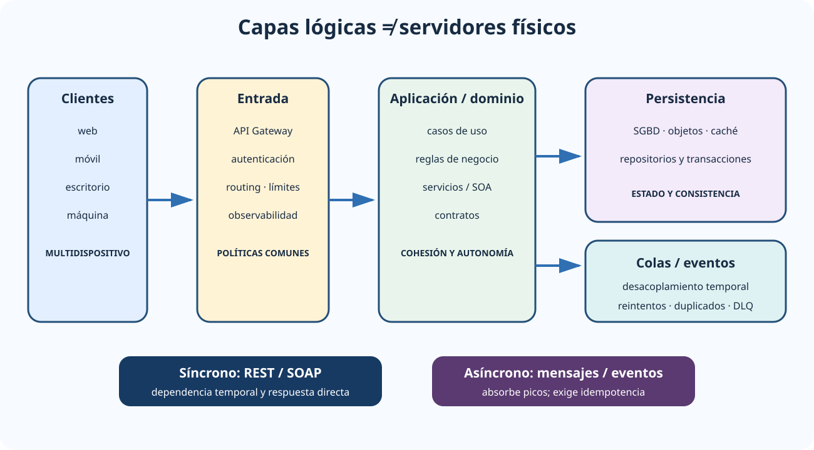

# Arquitectura de sistemas cliente-servidor, multicapas y multidispositivo: tipología. Componentes. Interoperabilidad de componentes. Ventajas e inconvenientes. Arquitectura de servicios web.

B2-T06 · Bloque 2 · Tema 6

Fuente: [02 — BLOQUE II — Tecnología básica — GSI A2](https://docs.google.com/document/d/1_-6JFktfHXhth_n3KeUfRPjPeFxp3Mgkl2HlZzab7c4/edit) · II.06 · V2.1 · 2026-09-23

## 1. Alcance del tema

El tema combina fundamentos todavía examinables —procesamiento cooperativo, cliente-servidor, SOA, SOAP/WSDL y ESB— con APIs HTTP, REST, mensajería y observabilidad. La arquitectura clásica y los patrones actuales deben entenderse como opciones relacionadas, no como una sustitución automática.

## 2. Centralizado, distribuido y procesamiento cooperativo

En un sistema centralizado, la mayor parte del procesamiento y datos reside en un host. En un sistema distribuido, componentes autónomos en nodos distintos cooperan mediante red. Objetivos clásicos: transparencia, fiabilidad, rendimiento, escalabilidad, flexibilidad e interoperabilidad. El precio es mayor complejidad: fallos parciales, latencia, consistencia, coordinación y seguridad.

## 3. Cliente-servidor

### Capas lógicas y estilos de integración

_Integra multidispositivo, separación por capas y las dos formas principales de comunicación._

**Qué debes recordar:** Una capa lógica no equivale a un servidor físico; REST, SOAP y mensajería son mecanismos distintos que se eligen según contrato y acoplamiento.

El cliente solicita una función mediante una interfaz/protocolo y el servidor la presta. Los roles son lógicos: un proceso puede actuar como servidor para unos componentes y cliente de otros.

### 3.1 Dos capas

Presentación/lógica pueden residir en cliente y datos en servidor. Ventajas: simplicidad inicial y respuesta local. Inconvenientes: clientes pesados, despliegue complejo, acoplamiento a BD y menor control central.

### 3.2 Tres o N capas

* **Presentación**: interacción y validaciones de interfaz.
* **Lógica de aplicación/dominio**: reglas de negocio y casos de uso.
* **Persistencia/acceso a datos**: repositorios, SGBD y almacenamiento.

Añadir capas lógicas no obliga a usar servidores físicos distintos. La separación mejora mantenibilidad, seguridad, pruebas y escalado, aunque incrementa llamadas y arquitectura.

## 4. Multidispositivo

Un mismo sistema puede atender web de escritorio, móvil, apps nativas, integraciones máquina-máquina y accesibilidad asistida. Es preferible desacoplar la interfaz mediante APIs y contratos estables. Técnicas: diseño responsive/adaptativo, BFF cuando distintas experiencias justifican una API específica, caché, CDN para recursos públicos y capacidades offline cuando proceda.

## 5. SOA

Service-Oriented Architecture organiza capacidades como servicios con contrato. Para evaluar un servicio conviene separar tres planos: cómo expone su capacidad —contrato, abstracción y descubrimiento—; cuánto depende de consumidores e implementaciones —bajo acoplamiento y autonomía—; y cómo participa en soluciones mayores —reutilización y composición, evitando retener estado cuando el caso lo permita—.

**Orquestación**: un coordinador controla el flujo entre servicios. **Coreografía**: los participantes siguen un protocolo de interacción distribuido sin un único controlador de todo el proceso. No son sinónimos.

## 6. ESB

El Enterprise Service Bus es una infraestructura de integración asociada a SOA: enrutado, transformación de mensajes, mediación de protocolos, seguridad, validación, logging y políticas. Su uso centraliza capacidades, pero un ESB mal diseñado puede convertirse en cuello de botella y concentrar lógica de negocio.

## 7. Servicios web clásicos

**SOAP** define mensajería XML estructurada; **WSDL** describe contratos de servicio; **XML Schema** define estructuras/tipos. El ecosistema WS-\* incluye seguridad, políticas y otros aspectos empresariales. SOAP puede operar sobre HTTP y otros transportes; SOAP no es «HTTP con XML».

**WS-Security** añade mecanismos de seguridad a mensajes SOAP, incluyendo firma/cifrado y tokens según perfil. En entornos con requisitos formales o integraciones heredadas estos estándares siguen siendo relevantes.

## 8. REST y HTTP

**REST** es un estilo arquitectónico centrado en recursos, identificadores, representaciones, interfaz uniforme, stateless y caché cuando procede. HTTP aporta métodos y códigos de estado. No existe obligación de que una API HTTP sea RESTful.

* GET: recuperación, seguro e idempotente conceptualmente.
* PUT: reemplazo/actualización idempotente según semántica.
* DELETE: idempotente en efecto deseado.
* POST: procesamiento/creación, no necesariamente idempotente.
* PATCH: modificación parcial; su idempotencia depende del formato/operación.

Diseña URIs estables, errores estructurados, paginación, filtros, idempotency keys cuando proceda, versionado y límites de tasa.

## 9. Sincronía y asincronía

Una llamada síncrona mantiene dependencia temporal entre consumidor y proveedor. La integración asíncrona mediante colas o eventos desacopla disponibilidad y facilita absorción de picos, pero introduce consistencia eventual, duplicados y necesidad de reintentos.

Conceptos: **at-least-once**, **at-most-once**, orden, deduplicación, idempotencia, dead-letter queue y outbox. «Exactly once» extremo a extremo suele ser una propiedad costosa y dependiente del contexto.

## 10. API Gateway, balanceo y caché

Un API Gateway puede centralizar autenticación, routing, rate limiting, políticas, transformación y observabilidad. El balanceador reparte tráfico entre instancias. La caché reduce latencia/carga, pero exige estrategia de invalidación y no debe servir datos sensibles sin controles.

## 11. Estado, sesión y escalabilidad

HTTP es sin estado a nivel de protocolo; una aplicación puede mantener sesión. Para escalar horizontalmente conviene evitar que una sesión solo exista en memoria de una instancia, o utilizar afinidad con conocimiento de sus límites. Alternativas: tokens, session store compartido o diseño stateless.

## 12. Interoperabilidad y contratos

Define formatos, codificación, versiones, autenticación, errores, límites, tiempos, SLA/SLO y compatibilidad. OpenAPI puede documentar APIs HTTP; AsyncAPI puede describir eventos/mensajería. Contract testing ayuda a evitar roturas entre consumidores y productores.

## 13. Seguridad

TLS, OAuth2/OIDC cuando aplique, autenticación de servicio a servicio, autorización, validación de entradas, límites de tamaño/rate, gestión de secretos, protección frente a SSRF/inyección, logging sin datos sensibles y trazabilidad distribuida.

## 14. Test

* 2 capas ≠ 3/N capas.
* Capa lógica ≠ servidor físico.
* SOA ≠ SOAP; SOA puede usar distintas tecnologías.
* SOAP = protocolo/mensajería; REST = estilo arquitectónico.
* WSDL describe servicios; XSD estructura XML.
* Orquestación ≠ coreografía.
* ESB ≠ API Gateway aunque se solapen funciones.
* HTTP stateless ≠ aplicación sin sesión.
* Síncrono ≠ asíncrono.
* Idempotencia ≠ ausencia de efectos.

## 15. Supuesto

Dibuja presentación → API/gateway → servicios → persistencia, con integraciones externas. Define contratos, autenticación/autorización, errores, reintentos, timeouts, circuit breaker cuando proceda, observabilidad y HA. Justifica SOAP si existe contrato/legado específico, REST para recursos o mensajería/eventos cuando desacoplar sea necesario.

## 16. Resumen II.06

Comprende la evolución cliente-servidor → capas → SOA/servicios → APIs/eventos. El examen puede preguntar tecnología clásica; el supuesto exige además resiliencia, contratos, seguridad y operación.

# Microdatos oficiales añadidos — middleware y multicapa

# En sistemas distribuidos, el middleware proporciona una capa común que abstrae diferencias entre nodos/plataformas y ofrece interfaces o servicios uniformes a las aplicaciones. Una ventaja típica de las arquitecturas multicapa es reducir el acoplamiento y facilitar mantenimiento y evolución. Ambos literales aparecen en la OEP 2025 con plantilla provisional.

## Resumen de repaso

Fuente: [GSI_A2 — BLOQUE II — RESUMEN MAESTRO DE REPASO (16 temas)](https://docs.google.com/document/d/1h7n4dFYafS_3VMuL55TnEuVKhqaTheUoL-thDFQSr9w/edit) · II.06

### Núcleo de estudio

Cliente-servidor separa consumidores y proveedores de servicios. En 2 capas el cliente suele hablar directamente con datos/servidor; en 3 o n capas se separan presentación, lógica de negocio y persistencia, mejorando mantenibilidad, escalabilidad y seguridad. Multidispositivo exige interfaces adaptativas, APIs y desacoplamiento. SOA organiza capacidades como servicios con contratos y bajo acoplamiento. Servicios web clásicos usan SOAP, WSDL y XML; REST es un estilo arquitectónico sobre recursos, HTTP, interfaz uniforme y ausencia de estado. También existen mensajería y eventos para integración asíncrona. Conceptos clave: API Gateway, balanceador, caché, sesión, idempotencia, versionado y contratos.

### Claves de test

SOAP es protocolo; REST es estilo. HTTP es stateless aunque una aplicación pueda mantener sesión externamente. 3 capas lógicas no implica tres servidores físicos. Escalado horizontal exige minimizar estado local. Distingue sincronía de asincronía.

### Enfoque para supuesto práctico

En supuesto dibuja capas y flujos, define APIs, autenticación/autorización, errores, versionado, observabilidad, HA y contratos. Justifica síncrono REST/SOAP frente a asíncrono por eventos/colas.

### Fuentes base del material

A1 058 SOA + 065 web y RELEASE de arquitectura lógica.
