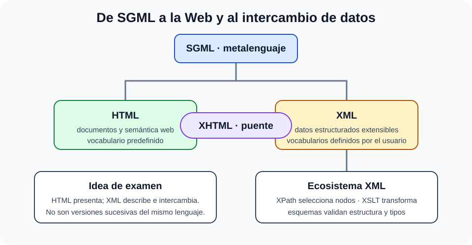

# Lenguajes de marca o etiqueta. Características y funcionalidades. SGML, HTML, XML y sus derivaciones. Lenguajes de script.

B2-T09 · Bloque 2 · Tema 9

Fuente: [GSI_A2 — BLOQUE II — APUNTES COMPLETOS V2.1 REVISADOS — ESTUDIO (16 temas)](https://docs.google.com/document/d/12jkpwzH8m5VoljIVPRi_Ofvqr7I_VBpVNGV0wmHfOFk/edit) · II.09 · V2.1 · 2026-08-21

## 1. Alcance y distinción principal

La distinción central es que HTML moderno tiene sintaxis propia y no debe describirse como basado en XML. XHTML aplica reglas XML al vocabulario HTML, mientras XML permite definir vocabularios extensibles y validarlos mediante DTD o XSD.

## 2. Lenguajes de marcas y SGML

### SGML, HTML, XML y XHTML: parentesco sin confusión

_Representa la relación histórica y sintáctica sin afirmar que HTML5 sea XML._

**Qué debes recordar:** HTML estructura la web con sintaxis propia; XML define vocabularios; XHTML es HTML expresado con reglas XML.

Un lenguaje de marcas incorpora etiquetas/metadatos al contenido para representar estructura, semántica o presentación. **SGML** es un metalenguaje ISO histórico para definir lenguajes de marcado mediante reglas/DTD. Influyó en HTML y XML. Para GSI importa su relación histórica/conceptual, no memorizar toda la norma SGML.

## 3. HTML

**HTML** define estructura y semántica de documentos web. El documento moderno comienza con <!doctype html> y contiene los elementos html, head y body. La presentación se delega principalmente en CSS y el comportamiento en JavaScript.

### 3.1 Semántica

Elementos como header, nav, main, article, section, aside y footer describen función del contenido. Usar semántica nativa mejora accesibilidad, mantenimiento, indexación y capacidad de las tecnologías de apoyo.

### 3.2 Formularios y multimedia

Form, label, input, select, textarea y button permiten interacción. La asociación label-control y la validación accesible son fundamentales. HTML incluye audio, video, canvas y SVG integrado. El atributo alt proporciona alternativa textual a imágenes cuando procede.

### 3.3 Metadatos

title, meta charset, viewport, description y lenguaje del documento. Los metadatos ayudan a interpretación, responsive y SEO, pero no sustituyen contenido de calidad.

## 4. CSS

Aunque el título del BOE no lo menciona expresamente, A1 077 lo usa para entender la web. CSS separa presentación de estructura. Conceptos: cascada, especificidad, herencia, box model, media queries, Flexbox y Grid. Responsive design adapta el layout al espacio disponible.

## 5. XML

**XML** es un metalenguaje/sintaxis extensible para representar documentos y datos estructurados. Las etiquetas las define la aplicación. Un documento **bien formado** cumple reglas sintácticas XML; uno **válido** además cumple el vocabulario/esquema declarado.

* Un único elemento raíz.
* Etiquetas correctamente anidadas y cerradas.
* XML distingue mayúsculas/minúsculas.
* Atributos entre comillas.
* Entidades para caracteres especiales cuando proceda.

## 6. DTD y XSD

**DTD** describe estructura mediante sintaxis heredada de SGML. **XML Schema (XSD)** usa XML y define tipos de datos, cardinalidades, restricciones y estructuras más ricas. XSD no es lo mismo que un documento XML de negocio: es su esquema.

## 7. Namespaces

Evitan colisiones de nombres al combinar vocabularios XML. Se declaran mediante URI y prefijos. El prefijo es una abreviatura local; la identidad se asocia al namespace, no al texto del prefijo.

## 8. XPath y XSLT

**XPath** selecciona nodos/valores dentro de XML mediante expresiones de rutas. **XSLT** transforma documentos XML a XML, HTML, texto u otros resultados, utilizando XPath para seleccionar partes. XPath consulta; XSLT transforma.

## 9. XHTML

XHTML aplica reglas XML al vocabulario HTML. Requiere documento bien formado, minúsculas según versión, elementos cerrados y atributos citados. No debe confundirse con HTML5 servido con sintaxis HTML.

## 10. JSON frente a XML

JSON no está en el título, pero es útil como comparación: modelo sencillo de objetos, arrays, strings, números, booleanos y null, muy habitual en APIs. XML destaca en documentos con namespaces, esquemas y ecosistemas de firma/transformación. La elección depende del contrato y no de que uno sea universalmente «mejor».

## 11. Lenguajes de script

Un script automatiza tareas o añade comportamiento con un ciclo de desarrollo generalmente ligero. Ejemplos: JavaScript, Python, shell/Bash, PowerShell. El término no implica necesariamente tipado dinámico ni interpretación pura.

En navegador, JavaScript usa DOM y APIs web; puede gestionar eventos y peticiones. En servidor y automatización, los scripts administran sistemas, transforman datos y orquestan procesos.

## 12. JavaScript y seguridad web

JavaScript ≠ Java. Riesgos típicos: XSS si se inyecta contenido no confiable en DOM/HTML, CSRF cuando una aplicación acepta acciones autenticadas sin protección adecuada y dependencias de terceros comprometidas. Medidas: escaping contextual, APIs seguras de DOM, CSP, cookies seguras/SameSite, tokens CSRF cuando proceda y control de dependencias.

## 13. HTTP como contexto

HTTP es protocolo de aplicación sin estado. HTTP/2 multiplexa flujos sobre conexión; HTTP/3 utiliza QUIC sobre UDP con TLS integrado en QUIC. No es necesario memorizar cada RFC, pero sí comprender que HTML/XML son formatos y HTTP es protocolo de transporte de aplicación.

## 14. Test

* SGML = metalenguaje histórico.
* HTML ≠ XML; XHTML sí usa sintaxis XML.
* HTML estructura; CSS presenta; JavaScript programa comportamiento.
* XML bien formado ≠ válido.
* XSD ≠ XML de datos.
* Namespace evita colisiones.
* XPath selecciona; XSLT transforma.
* JavaScript ≠ Java.
* JSON ≠ XML.
* HTTP ≠ HTML.

## 15. Supuesto

Usa HTML semántico y accesible; CSS responsive; scripts sin mezclar secretos; APIs con JSON o XML según contrato; XSD si una integración exige validación; sanitiza/valida entradas y protege XSS/CSRF. Si hay intercambio administrativo XML, documenta namespaces, esquemas, firma y versiones.

## 16. Resumen II.09

Domina la jerarquía SGML→influencia en HTML/XML, diferencias HTML/XHTML/XML, XSD, XPath/XSLT y papel de scripts. La trampa principal es confundir lenguaje de marcas, programación y protocolo.

## Resumen de repaso

Fuente: [GSI_A2 — BLOQUE II — RESUMEN MAESTRO DE REPASO (16 temas)](https://docs.google.com/document/d/1h7n4dFYafS_3VMuL55TnEuVKhqaTheUoL-thDFQSr9w/edit) · II.09

### Núcleo de estudio

SGML es metalenguaje histórico del que deriva HTML; XML define una sintaxis extensible para datos estructurados. HTML describe estructura y semántica de documentos web; CSS se encarga de presentación; JavaScript proporciona comportamiento en cliente y también puede ejecutarse en servidor. En XML estudia documento bien formado y válido, namespaces, XSD, XPath y transformaciones XSLT a nivel conceptual. JSON no aparece en el título del BOE pero es un formato actual de intercambio que conviene contrastar con XML. Los lenguajes de script suelen priorizar automatización y ejecución rápida sobre un ciclo clásico de compilación.

### Claves de test

HTML no es XML salvo XHTML; XML no trae etiquetas predefinidas; XSD define estructura/tipos; XPath selecciona nodos; XSLT transforma. JavaScript ≠ Java. Distingue lenguaje de marcas de lenguaje de programación.

### Enfoque para supuesto práctico

En supuesto usa HTML semántico, CSS responsive, JavaScript/TypeScript cuando proceda, APIs con JSON/XML según integración y validación de esquemas. Añade accesibilidad y seguridad contra XSS/CSRF/inyección.

### Fuentes base del material

A1 077. Correspondencia DIRECTA.
