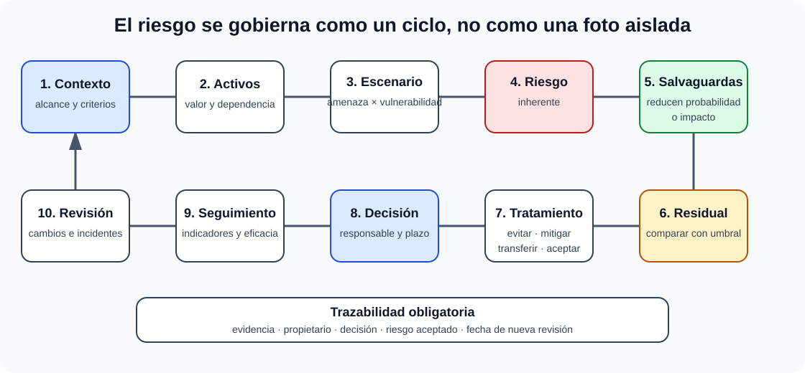

# Análisis y gestión de riesgos de los sistemas de información. Herramientas.

B2-T10 · Bloque 2 · Tema 10

Fuente: [GSI_A2 — BLOQUE II — APUNTES COMPLETOS V2.1 REVISADOS — ESTUDIO (16 temas)](https://docs.google.com/document/d/12jkpwzH8m5VoljIVPRi_Ofvqr7I_VBpVNGV0wmHfOFk/edit) · II.10 · V2.1 · 2026-08-21

## 1. Alcance del tema

El tema combina el proceso general de gestión de riesgos con MAGERIT v3 como metodología de referencia en la Administración y PILAR como herramienta asociada. Metodología, herramienta y decisión de aceptación son piezas distintas.

## 2. Vocabulario esencial

* **Activo**: elemento que tiene valor para la organización y cuya degradación afecta objetivos.
* **Amenaza**: causa potencial de incidente o daño.
* **Vulnerabilidad**: debilidad que una amenaza puede explotar.
* **Salvaguarda/control**: medida que reduce probabilidad, impacto o facilita prevención/detección/respuesta.
* **Impacto**: consecuencia de materialización.
* **Probabilidad/frecuencia**: posibilidad de ocurrencia según método.
* **Riesgo**: combinación de probabilidad y consecuencias sobre objetivos/activos.
* **Riesgo inherente/potencial**: antes de considerar controles.
* **Riesgo residual**: el que permanece tras salvaguardas.

Amenaza y vulnerabilidad no son intercambiables. Un servidor sin parche tiene una vulnerabilidad; un atacante o malware puede ser amenaza; el riesgo surge al combinar contexto, exposición y consecuencias.

## 3. Ciclo de gestión de riesgos

### Del activo al riesgo residual

_Ordena el análisis y la gestión y señala dónde actúan los controles._

**Qué debes recordar:** El riesgo inherente se valora antes de controles; el residual queda después y debe tratarse o aceptarse por quien tenga competencia.

* Establecer contexto, alcance, criterios y responsables.
* Inventariar activos y dependencias.
* Valorar activos/servicios e impacto por dimensiones relevantes.
* Identificar amenazas y vulnerabilidades.
* Identificar salvaguardas existentes y su madurez.
* Estimar impacto y probabilidad/frecuencia.
* Calcular/valorar riesgos.
* Compararlos con criterios de aceptación.
* Seleccionar tratamiento.
* Aprobar riesgo residual por responsable competente.
* Revisar de forma continua ante cambios, incidentes y nuevas amenazas.

## 4. Análisis cualitativo y cuantitativo

**Cualitativo**: escalas como bajo/medio/alto y matrices; rápido y comprensible, pero menos preciso. **Cuantitativo**: intenta expresar frecuencias/pérdidas en magnitudes, útil cuando hay datos fiables. En la práctica existen enfoques semicuantitativos.

No conviertas números arbitrarios en falsa precisión. Lo importante es que escalas y criterios estén definidos y sean consistentes.

## 5. Tratamiento

* **Evitar**: eliminar actividad/causa que genera riesgo.
* **Reducir/mitigar**: aplicar controles.
* **Compartir/transferir**: seguros, contratos, externalización; no transfiere toda responsabilidad.
* **Aceptar**: decisión consciente cuando residual es tolerable o tratamiento desproporcionado.

Un plan de tratamiento define acción, responsable, prioridad, recursos, fecha y riesgo objetivo. La aceptación debe ser explícita según gobernanza.

## 6. MAGERIT v3

MAGERIT estructura el análisis de riesgos de sistemas de información dentro de un marco de gestión. Está especialmente alineada con el ámbito de las AAPP y el ENS. Trabaja con activos, dimensiones/valoración, amenazas, salvaguardas, impacto y riesgo. No es una herramienta: es una **metodología**.

El material oficial la relaciona con ISO 31000 y con la exigencia del ENS de gestionar seguridad basada en riesgos.

## 7. PILAR

PILAR implementa análisis y gestión según MAGERIT/ISO 27005. Permite modelar activos y dependencias, amenazas y salvaguardas, estimar impacto/riesgo potencial y residual, producir mapa de riesgos y apoyar un plan de mejora. La herramienta no sustituye al juicio ni a la aprobación de responsables.

## 8. Riesgo de seguridad vs riesgo de proyecto

No mezcles: riesgo de seguridad (pérdida de C/I/D/A/T, etc.) con riesgos de proyecto como retraso, sobrecoste o falta de recursos. Pueden relacionarse, pero usan objetivos y tratamientos distintos.

## 9. Relación con ENS

El ENS exige gestión de seguridad basada en riesgos y análisis/gestión proporcionados. Categorizar un sistema y analizar riesgos son procesos relacionados pero distintos: la categoría deriva del impacto en dimensiones según ENS; el análisis profundiza en amenazas, controles y residual.

## 10. Continuidad

RTO es tiempo objetivo de recuperación; RPO es pérdida máxima de datos medida temporalmente. Ayudan a traducir impacto/disponibilidad a requisitos de continuidad. No son probabilidades ni «niveles de riesgo».

## 11. Riesgos de terceros

Cloud, SaaS, telecomunicaciones y subcontratación introducen dependencia de terceros. Evalúa SLA, seguridad, ubicación del dato, cadena de suministro, continuidad, notificación de incidentes, subencargados/subcontratistas y reversibilidad. Transferir un servicio no elimina el riesgo para la organización.

## 12. Test

* Amenaza ≠ vulnerabilidad.
* Impacto ≠ probabilidad.
* Riesgo inherente/potencial ≠ residual.
* Control ≠ riesgo.
* MAGERIT = metodología; PILAR = herramienta.
* Evitar/reducir/transferir- compartir/aceptar son tratamientos.
* Aceptar riesgo no significa ignorarlo.
* ENS categoriza y exige gestión de riesgos; no sustituye el análisis.
* RPO ≠ RTO.
* Riesgo de proyecto ≠ riesgo de seguridad.

## 13. Supuesto

Incluye una tabla: activo/servicio → amenaza → vulnerabilidad → impacto → controles → residual → tratamiento/owner. Prioriza riesgos altos, vincula medidas ENS y continuidad, y señala qué riesgos requieren aceptación. Con pocos elementos bien elegidos se demuestra más análisis que con listas genéricas.

## 14. Resumen II.10

Aprende vocabulario, ciclo, tratamiento y relación MAGERIT/PILAR/ENS. En supuesto, el valor está en conectar cada medida con un riesgo concreto y mostrar riesgo residual.

## Resumen de repaso

Fuente: [GSI_A2 — BLOQUE II — RESUMEN MAESTRO DE REPASO (16 temas)](https://docs.google.com/document/d/1h7n4dFYafS_3VMuL55TnEuVKhqaTheUoL-thDFQSr9w/edit) · II.10

### Núcleo de estudio

Riesgo combina probabilidad y consecuencia de que una amenaza explote una vulnerabilidad sobre un activo. Proceso: contexto, inventario/valoración de activos, amenazas, vulnerabilidades, salvaguardas, estimación de impacto/probabilidad, evaluación, tratamiento y aceptación del riesgo residual. Opciones: evitar, reducir, transferir/compartir o aceptar. En España, MAGERIT es una metodología de referencia de la Administración y PILAR una herramienta asociada; ENS exige gestión de riesgos proporcionada. ISO/IEC 27005 aporta marco internacional. Diferencia análisis cualitativo y cuantitativo; identifica propietario del riesgo y del activo.

### Claves de test

Amenaza no es vulnerabilidad; riesgo inherente es previo a controles, residual tras controles. Un control puede reducir probabilidad, impacto o ambos. RPO/RTO pertenecen a continuidad y ayudan a valorar impacto, no son medidas de probabilidad.

### Enfoque para supuesto práctico

En supuesto haz una tabla corta activo-amenaza-vulnerabilidad-impacto-medida-riesgo residual. Vincula controles con ENS y continuidad, prioriza por riesgo y justifica aceptación por responsable competente.

### Fuentes base del material

A1 047 y material ENS/MAGERIT.
