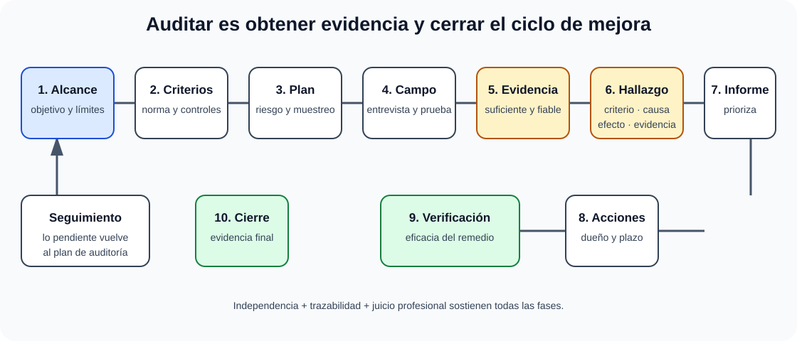

# Auditoría Informática: objetivos, alcance y metodología. Técnicas y herramientas. Normas y estándares. Auditoría del ENS y de protección de datos. Auditoría de seguridad física.

B2-T11 · Bloque 2 · Tema 11

Fuente: [02 — BLOQUE II — Tecnología básica — GSI A2](https://docs.google.com/document/d/1_-6JFktfHXhth_n3KeUfRPjPeFxp3Mgkl2HlZzab7c4/edit) · II.11 · V2.1 · 2026-09-23

## 1. Concepto y objetivo

La auditoría informática es un proceso sistemático de obtención y evaluación de evidencias para determinar si los sistemas, controles y procesos protegen activos, mantienen integridad/seguridad, cumplen criterios y apoyan eficazmente los objetivos. El enfoque integra metodología de auditoría, gestión de riesgos y requisitos específicos del ENS.

Auditar no es «buscar fallos» sin criterio. Debe existir **alcance**, **criterios**, **evidencia**, **hallazgos**, conclusión y seguimiento.

## 2. Objetivos

* Evaluar eficacia y diseño de controles.
* Comprobar cumplimiento legal, normativo, contractual y de políticas.
* Identificar riesgos y debilidades relevantes.
* Evaluar protección de confidencialidad, integridad, disponibilidad, autenticidad y trazabilidad. Trazabilidad: propiedad por la que las actuaciones de una entidad pueden ser imputadas exclusivamente a dicha entidad.
* Revisar gobierno, operación, continuidad, cambios y seguridad.
* Proponer acciones correctivas y comprobar su cierre.

## 3. Principios de auditoría

Independencia y objetividad; competencia profesional; planificación basada en riesgos; evidencia suficiente, pertinente y fiable; confidencialidad; trazabilidad; debido cuidado profesional. El auditor no debería evaluar de forma acrítica controles que él mismo diseñó/operó cuando ello comprometa independencia.

## 4. Ciclo de auditoría

### Auditoría: del criterio al cierre eficaz

_Muestra la cadena probatoria completa y evita reducir la auditoría a una búsqueda informal de fallos._

**Qué debes recordar:** Un hallazgo necesita condición, criterio y evidencia; una acción no está cerrada hasta comprobar su eficacia.

* **Mandato y alcance**: sistema, procesos, periodo, ubicaciones, exclusiones.
* **Criterios**: ENS, políticas, RGPD/LOPDGDD, ISO, contrato, procedimientos, etc.
* **Análisis preliminar de riesgos** y plan de trabajo.
* **Trabajo de campo**: entrevistas, documentación, observación, configuración, logs, muestreo y pruebas.
* **Contraste de evidencia** y elaboración de hallazgos.
* **Informe**: condición, criterio, causa, riesgo/efecto y recomendación.
* **Plan de acciones**: responsable, prioridad y fecha.
* **Seguimiento** y verificación de cierre.

## 5. Evidencia

Tipos: documental, observacional, testimonial y técnica/digital. Debe poder ser reproducida o contrastada. Capturas aisladas o declaraciones sin corroboración pueden no ser suficientes. Es importante conservar fecha, fuente, consulta realizada y contexto.

El muestreo permite obtener conclusión razonable sin revisar el 100%, pero debe definirse población, método y riesgo de muestreo.

## 6. Técnicas y herramientas

* Entrevistas y cuestionarios.
* Revisión de políticas, procedimientos, arquitectura e inventarios.
* Revisión de configuración y hardening.
* Análisis de usuarios, roles, privilegios y segregación de funciones.
* Consulta de logs y SIEM.
* Escáneres de vulnerabilidades y cumplimiento.
* Análisis de red/configuración de firewalls.
* Muestreo de transacciones y pruebas de controles.
* Revisión de backups/restauraciones.
* Pruebas físicas de acceso/energía/ambiente.
* Scripts de auditoría para correlacionar inventario, cuentas, parches o eventos.

Una auditoría puede utilizar resultados de pentest, pero **auditoría ≠ pentest**. El pentest busca explotar vulnerabilidades dentro de reglas de compromiso; la auditoría evalúa un conjunto más amplio de controles y criterios.

## 7. Tipos

Interna/primera parte, de proveedor/segunda parte y externa/tercera parte; de cumplimiento, financiera con componente TI, operativa, seguridad, desarrollo, continuidad, datos, etc. El BOE exige específicamente ENS, protección de datos y seguridad física.

## 8. Normas y marcos

<!-- editorial-supplement:B2-T11:01:start -->

### 8.1 Common Criteria / ISO/IEC 15408

Common Criteria es el marco internacional de evaluación de propiedades de seguridad de productos TI, normalizado en la serie ISO/IEC 15408. La edición vigente de la Parte 1 es ISO/IEC 15408-1:2026. El objeto evaluado se denomina TOE (Target of Evaluation).

Términos clásicos que conviene reconocer: PP (Protection Profile), conjunto reutilizable de requisitos de seguridad para una categoría o necesidad; ST (Security Target), especificación de seguridad concreta del TOE; y EAL (Evaluation Assurance Level), niveles clásicos de garantía de evaluación EAL1–EAL7. No confundas Common Criteria con ISO/IEC 27001: el primero evalúa propiedades de seguridad de productos/TOE; ISO/IEC 27001 certifica un sistema de gestión de seguridad de la información.

<!-- editorial-supplement:B2-T11:01:end -->

**ISO 19011** ofrece directrices para auditoría de sistemas de gestión. **ISO/IEC 27001** contiene requisitos de un SGSI certificable; **ISO/IEC 27002** sirve de guía de controles. COBIT e ISACA aportan gobierno/control y prácticas de auditoría. No debe asumirse que una certificación ISO implica cumplimiento automático del ENS o RGPD.

## 9. Auditoría ENS

El ENS (RD 311/2022, art. 31) exige auditoría regular ordinaria al menos cada dos años en los sistemas sujetos a ella. El plazo de dos años puede extenderse tres meses por fuerza mayor no imputable a la entidad titular. Debe realizarse auditoría extraordinaria ante modificaciones sustanciales que puedan repercutir en las medidas de seguridad; esa auditoría reinicia la fecha de cómputo para la siguiente ordinaria. Los sistemas de categoría básica se apoyan en autoevaluación para la declaración de conformidad, mientras media/alta requieren los mecanismos de auditoría/certificación previstos.

La guía CCN-STIC 802 desarrolla auditoría ENS. Debes distinguir:

* **Categoría del sistema**: deriva de valoración ENS.
* **Auditoría de seguridad**: evaluación periódica y ante cambios relevantes.
* **Conformidad ENS**: declaración/certificación conforme al régimen.
* **ISO 27001**: certificación de SGSI, relacionada pero no equivalente.

En auditoría ENS se revisan política, roles, análisis de riesgos, Declaración de Aplicabilidad, medidas del marco organizativo/operacional/protección, evidencias, incidentes, continuidad, terceros y mejora.

## 10. Auditoría de protección de datos

RGPD no establece una «auditoría bienal general» como la antigua LOPD española. El enfoque actual es **responsabilidad proactiva**: poder demostrar licitud, transparencia, minimización, contratos de encargado, seguridad, gestión de derechos, EIPD cuando proceda, brechas, transferencias, retención y privacidad desde diseño.

Una auditoría puede revisar: registro de actividades, bases jurídicas, información a interesados, medidas, roles, DPD, contratos, subencargados, evidencias de consentimiento cuando sea base, derechos, supresión/retención, pruebas y datos en no producción.

## 11. Auditoría de seguridad física

Áreas: perímetro, control de acceso, visitantes, CCTV si procede, cerramientos, racks, energía, UPS/grupos, climatización, detección/extinción de incendios, agua, cableado, inventario, destrucción de soportes, mantenimiento y continuidad. Debe verificarse evidencia: registros de acceso, pruebas de generadores, mantenimientos, sensores, simulacros y restauraciones.

## 12. Hallazgos y criticidad

Un buen hallazgo relaciona **criterio** incumplido, **condición** observada, **causa**, **impacto/riesgo** y recomendación. Clasificar como crítica/alta/media/baja debe basarse en criterios definidos, no en dramatismo.

Distingue no conformidad, observación/oportunidad de mejora y riesgo aceptado. Una recomendación debe ser accionable y proporcional.

## 13. Test

* Auditoría ≠ pentest.
* Evidencia ≠ opinión.
* Hallazgo debe referenciar criterio.
* Independencia y trazabilidad son principios clave.
* Auditoría ENS ≠ certificación ISO 27001.
* RGPD se basa en responsabilidad proactiva; no memorices la antigua auditoría bienal de LOPD como regla RGPD.
* Seguridad física incluye energía, clima y acceso, no solo puertas.
* Riesgo determina prioridad del plan de acciones.
* Cerrar una acción requiere verificar efectividad, no solo «marcarla hecha».

## 14. Supuesto

Define alcance y criterios; selecciona pruebas por riesgo; solicita evidencias; presenta 4–6 hallazgos con riesgo; prioriza remediación; fija responsables/fechas y seguimiento. Si el caso es ENS, añade categoría, análisis de riesgos, DoA, roles y conformidad. Si es datos, añade EIPD, contratos, derechos y brechas.

## 15. Resumen II.11

Estudia auditoría como método: alcance → criterio → evidencia → hallazgo → informe → remediación → seguimiento. Luego aplica ese ciclo a ENS, protección de datos y seguridad física.

## Resumen de repaso

Fuente: [GSI_A2 — BLOQUE II — RESUMEN MAESTRO DE REPASO (16 temas)](https://docs.google.com/document/d/1h7n4dFYafS_3VMuL55TnEuVKhqaTheUoL-thDFQSr9w/edit) · II.11

### Núcleo de estudio

La auditoría obtiene evidencia objetiva para evaluar controles, cumplimiento, eficacia y riesgos. Fases: planificación y alcance, criterios, trabajo de campo/evidencias, hallazgos, conclusiones, informe y seguimiento. Principios: independencia, competencia, evidencia suficiente y trazabilidad. Técnicas: entrevistas, revisión documental/configuración, muestreo, análisis de logs, pruebas de controles y herramientas automatizadas. Para ENS estudia auditoría regular y extraordinaria y conformidad según categoría; para protección de datos, responsabilidad proactiva, contratos, EIPD, registros, seguridad y derechos. Seguridad física: acceso a CPD, perímetro, energía, climatización, incendio, agua, inventario y continuidad.

### Claves de test

Auditoría no es pentest, aunque puede usar sus resultados. Evidencia debe ser pertinente y verificable. No confundir evaluación de conformidad ENS con certificación ISO 27001. ISO 19011 aporta directrices generales de auditoría; ISO 27001 se centra en SGSI.

### Enfoque para supuesto práctico

En supuesto define alcance, criterios, pruebas, evidencias y plan de remediación. Separa no conformidad, observación y riesgo; prioriza por criticidad y exige seguimiento.

### Fuentes base del material

A1 038 + 047 + 048, RGPD/LOPDGDD y ENS.
