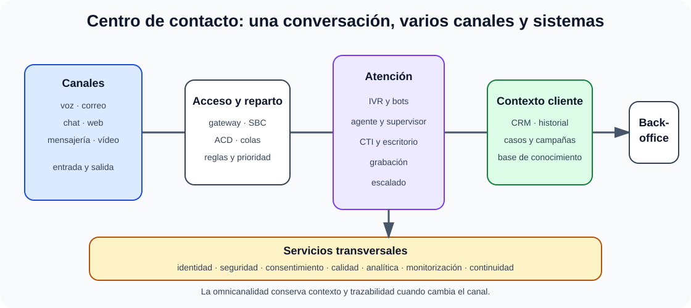

# Gestión de la atención a clientes y usuarios: centros de contacto, CRM. Arquitectura multicanal. Sistemas de respuesta de voz interactiva (IVR). Voice XML.

B2-T12 · Bloque 2 · Tema 12

Fuente: [GSI_A2 — BLOQUE II — APUNTES COMPLETOS V2.1 REVISADOS — ESTUDIO (16 temas)](https://docs.google.com/document/d/12jkpwzH8m5VoljIVPRi_Ofvqr7I_VBpVNGV0wmHfOFk/edit) · II.12 · V2.1 · 2026-08-21

## 1. Alcance del tema

El tema estudia la arquitectura completa de un contact center: PBX/SBC/VoIP, colas y enrutado, CTI, IVR, ASR/TTS, VoiceXML, CRM, privacidad, accesibilidad, indicadores y dimensionamiento.

## 2. De call center a contact center

Un **call center** se centra principalmente en voz. Un **contact center** integra varios canales: telefonía, email, chat, web, mensajería, videollamada y redes sociales cuando proceda. El objetivo es gestionar interacciones con enrutamiento, contexto, trazabilidad y niveles de servicio.

## 3. Multicanal vs omnicanal

**Multicanal**: existen varios canales, pero pueden funcionar como silos. **Omnicanal**: se intenta conservar contexto, identidad e historial al cambiar de canal. La omnicanalidad requiere un modelo común de interacción, CRM/case management y reglas de privacidad.

## 4. Componentes de voz

* **PBX/IP-PBX**: centralita que gestiona extensiones y llamadas.
* **SIP**: protocolo de señalización habitual en VoIP.
* **SBC**: Session Border Controller, protege/controla el borde de sesiones VoIP.
* **ACD**: Automatic Call Distributor, enruta llamadas a colas/agentes.
* **CTI**: Computer Telephony Integration, integra telefonía y aplicaciones/CRM.
* **IVR**: Interactive Voice Response, diálogo automatizado por teclado DTMF y/o voz.
* **Grabación**: registra llamadas cuando existe finalidad/base y controles apropiados.
* **WFM**: Workforce Management, predice carga y planifica agentes.

## 5. Enrutamiento y colas

Estrategias: round-robin, agente más libre, skills-based routing, prioridad, idioma, servicio, valor o urgencia. Las colas necesitan mensajes, tiempo estimado, callback y reglas de desbordamiento. El diseño debe evitar loops y pérdida de contexto.

## 6. CRM

Customer Relationship Management gestiona información e interacciones de una relación. En sector público puede ser más apropiado hablar de ciudadano/usuario y gestión de casos. Componentes: ficha, contactos, historial, actividades, casos/tickets, comunicaciones, segmentación autorizada, base de conocimiento, reporting e integraciones.

CRM no debe convertirse en «base de datos donde copiar todo». Minimización, calidad, finalidad, retención y permisos son esenciales.

## 7. CTI y screen-pop

CTI enlaza llamada y aplicación: identificar número/usuario, abrir ficha o caso, registrar inicio/fin, permitir click-to-call, transferencias y clasificación. El **screen pop** muestra información contextual al agente. Debe aplicarse mínimo privilegio: que llegue una llamada no justifica mostrar datos innecesarios.

## 8. IVR

Un IVR presenta opciones y recoge entrada. Puede usar DTMF, reconocimiento automático de voz (**ASR**) y síntesis (**TTS**). Diseña menús cortos, salida a agente, repetición, accesibilidad, detección de errores y tratamiento de datos sensibles.

IVR no equivale a reconocimiento de voz: un IVR puede funcionar solo con tonos DTMF.

## 9. VoiceXML

**VoiceXML** es un lenguaje XML para describir diálogos de voz. Separa lógica de aplicación y presentación de voz y puede controlar prompts, gramáticas, captura y flujo del diálogo mediante un intérprete/plataforma de voz. Para examen importa su naturaleza XML y su uso en aplicaciones de voz, no aprender sintaxis extensa.

## 10. Arquitectura multicanal

### Contact center multicanal y continuidad de contexto

_Sitúa ACD, CTI, IVR y CRM en su función y muestra qué añade la omnicanalidad._

**Qué debes recordar:** ACD distribuye, CTI conecta telefonía y aplicaciones, IVR automatiza el diálogo y CRM conserva el contexto autorizado.

Canales → gateway/telefonía/chat/email → router/ACD → IVR/bots cuando proceda → agentes → CRM/case management → conocimiento → backoffice. Servicios transversales: identidad, grabación, analítica, supervisión, reporting y observabilidad.

## 11. Identificación y autenticación

Distingue identificar por contexto (número, cookie, correo) de autenticar con garantía suficiente. Para trámites sensibles pueden requerirse factores adicionales. No uses preguntas débiles como único mecanismo si el riesgo es alto. La autenticación debe ser proporcional y no bloquear innecesariamente la atención general.

## 12. Privacidad y grabación

Si se graban llamadas, define finalidad/base, información, acceso, retención, seguridad y ejercicio de derechos. Evita registrar credenciales o datos de pago/sensibles innecesarios. Los agentes necesitan roles, logs y formación; las exportaciones de grabaciones deben estar controladas.

## 13. Accesibilidad

Canales alternativos para personas con discapacidad auditiva, visual, del habla o cognitiva; compatibilidad con tecnologías de apoyo; lenguaje claro; tiempos razonables; chat/texto; subtítulos/interpretación cuando el servicio lo exija. Un IVR inaccesible no se corrige únicamente «añadiendo web».

## 14. KPI

* **ASA**: tiempo medio de respuesta.
* **AHT**: tiempo medio de gestión.
* **Abandon rate**: porcentaje de abandonos.
* **FCR**: resolución en primer contacto.
* **Service level**: porcentaje atendido dentro de umbral.
* **Occupancy**: tiempo productivo respecto a disponible.
* **CSAT/NPS**: satisfacción/recomendación, interpretados con cautela.

Optimizar AHT de forma aislada puede empeorar FCR y satisfacción. Los KPI deben equilibrar eficiencia y calidad.

## 15. Dimensionamiento

Se parte de volumen por franja, duración media, patrón de llegada, objetivo de servicio, shrinkage (pausas/formación/ausencias), canales y concurrencia. En telefonía se emplean modelos de colas como Erlang C en escenarios adecuados. Para GSI basta comprender que «número medio de llamadas / agentes» no es dimensionamiento suficiente.

## 16. Continuidad

Redundancia de enlaces/telefonía, sedes o agentes remotos, colas, fallback, backup de configuración, capacidad de desbordamiento, monitorización y planes de contingencia. Un fallo del CRM no debería dejar sin mecanismo básico de atención si el servicio es crítico.

## 17. Test

* Call center ≠ contact center.
* Multicanal ≠ omnicanal.
* ACD distribuye; CTI integra telefonía e informática.
* IVR ≠ ASR.
* DTMF ≠ reconocimiento de voz.
* VoiceXML es XML orientado a diálogos de voz.
* CRM ≠ simple agenda.
* Screen-pop ≠ autenticación fuerte.
* AHT bajo no implica mejor calidad.
* Grabación requiere finalidad y controles.

## 18. Supuesto

Dibuja canales y voz → ACD/IVR → agentes → CRM/casos → backoffice. Define reglas de routing, identificación, escalado a agente, grabación, privacidad, accesibilidad, SLA/KPI, continuidad y monitorización. Para un organismo público, incluye trazabilidad y no fuerces a usar voz para todos los trámites.

## 19. Resumen II.12

Domina los componentes y sus funciones: ACD, CTI, IVR, CRM, VoiceXML y canales. En supuesto, la diferencia está en privacidad, accesibilidad, routing y métricas.

## Resumen de repaso

Fuente: [GSI_A2 — BLOQUE II — RESUMEN MAESTRO DE REPASO (16 temas)](https://docs.google.com/document/d/1h7n4dFYafS_3VMuL55TnEuVKhqaTheUoL-thDFQSr9w/edit) · II.12

### Núcleo de estudio

Un CRM centraliza información e interacciones para gestionar relaciones con usuarios/clientes; puede incluir gestión de casos, campañas, conocimiento e indicadores. Contact center integra voz, correo, chat, formularios, mensajería y otros canales; omnicanal busca continuidad entre canales, frente a multicanal donde pueden estar aislados. Componentes: ACD para distribución de llamadas, CTI para integrar telefonía-informática, IVR para interacción por voz/teclado, grabación, workforce management y analítica. VoiceXML es un lenguaje XML para aplicaciones de diálogo de voz. En sector público añade accesibilidad, identificación, protección de datos y trazabilidad.

### Claves de test

Call center es más limitado que contact center; multicanal no implica omnicanal; IVR no es reconocimiento de voz necesariamente; CRM no es solo una agenda de contactos.

### Enfoque para supuesto práctico

En supuesto diseña canales, enrutamiento, identificación, CRM, base de conocimiento, SLA, registro, grabación justificada, privacidad, accesibilidad y continuidad. Incluye métricas: tiempo de respuesta, abandono, resolución en primer contacto y satisfacción.

### Fuentes base del material

A1 072 + 077 y material de servicios/atención.
