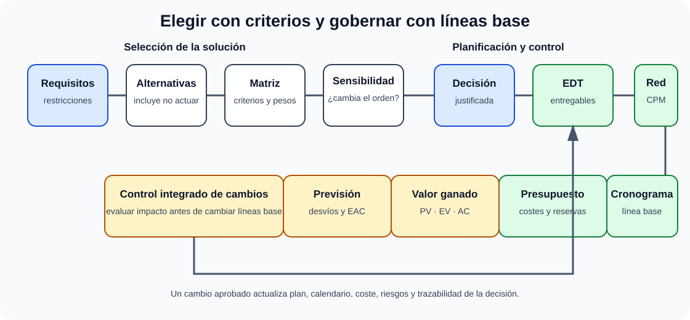

# Técnicas de evaluación de alternativas y análisis de viabilidad. Planificación, presupuestación y control de costes de un proyecto informático.

B2-T15 · Bloque 2 · Tema 15

Fuente: [02 — BLOQUE II — Tecnología básica — GSI A2](https://docs.google.com/document/d/1_-6JFktfHXhth_n3KeUfRPjPeFxp3Mgkl2HlZzab7c4/edit) · II.15 · V2.1 · 2026-09-23

## 1. Alcance

El A1 040 aporta métodos multicriterio; otros temas de gestión aportan estimación, planificación y costes. Para GSI importa ser capaz de justificar una alternativa y convertirla en un plan viable, no memorizar todos los algoritmos de decisión existentes.

## 2. Estudio de alternativas

### De la alternativa al control del proyecto

_Conecta la selección transparente de solución con su planificación y control posterior._

**Qué debes recordar:** Una alternativa inviable no se compensa con puntuación; tras decidir, el control compara alcance, plazo y coste contra líneas base aprobadas.

* Definir problema y objetivos.
* Identificar requisitos obligatorios y restricciones.
* Generar alternativas realistas, incluida opción de no actuar cuando tenga sentido.
* Definir criterios y pesos antes de conocer/ajustar interesadamente el resultado.
* Obtener datos/evidencia y puntuar.
* Normalizar cuando las escalas difieran.
* Realizar análisis de sensibilidad.
* Seleccionar y documentar decisión/riesgos.

## 3. Criterios

Técnicos: funcionalidad, rendimiento, escalabilidad, seguridad, interoperabilidad, mantenibilidad, soporte, accesibilidad. Económicos: inversión, operación, licencias, personal, energía, migración y salida. Organizativos: competencias, cambio, dependencia, gobernanza. Jurídicos: protección de datos, ENS, licencias, contratación y conservación.

Distingue **requisito eliminatorio** de criterio ponderable. Una alternativa que incumple una restricción legal no debería «compensarla» con una puntuación económica alta.

## 4. Asignación de pesos

A1 040 incluye Delphi, AHP/Saaty, utilidades relativas y entropía. Para GSI:

* **Delphi**: rondas de expertos con realimentación para aproximar consenso.
* **AHP**: comparaciones por pares y jerarquía de criterios; permite analizar consistencia.
* **Entropía: enfoque más objetivo basado en capacidad discriminante de datos, según método. En la clasificación usada en preguntas oficiales, sirve para asignación/derivación de pesos, no como método de ordenación de alternativas.**
* **Ponderación directa**: simple y transparente si se documenta.

## 5. Normalización y puntuación

Cuando los criterios usan unidades distintas (euros, ms, %), se normalizan. El A1 040 incluye fracción del máximo, del ideal y de la suma; «fracción del mínimo» no aparece como método de normalización en esa clasificación de examen. En decisiones reales hay que distinguir criterios a maximizar/minimizar, umbrales de satisfacción y umbral de saciedad: mejoras por encima de cierto punto pueden no aportar valor.

## 6. Métodos de decisión

**Ponderación lineal**: suma puntuaciones normalizadas × pesos. Sencilla y explicable, pero compensatoria. **AHP** estructura decisión por jerarquías. **TOPSIS** elige cercanía a ideal positivo y lejanía del negativo. **ELECTRE/PROMETHEE** pertenecen a métodos de superación. Para GSI conviene entender la idea, no memorizar derivaciones matemáticas exhaustivas.

## 7. Análisis de sensibilidad

Cambia pesos y supuestos razonables. Si una variación pequeña invierte la decisión, el resultado es frágil y debe comunicarse. La sensibilidad ayuda a detectar «falsa objetividad» de una matriz.

## 8. Viabilidad

| Dimensión | Preguntas |
| --- | --- |
| Técnica | ¿Tecnología madura? ¿integra? ¿escala? ¿hay PoC? |
| Económica | ¿TCO asumible? ¿beneficios/ahorros? ¿financiación? |
| Operativa | ¿Puede explotarse y soportarse? ¿cambio organizativo? |
| Legal | ¿RGPD/ENS/licencias/contratación/accesibilidad? |
| Temporal | ¿Cabe en plazo y dependencias? |
| Recursos | ¿equipo, proveedores, infraestructura y competencias? |

Una prueba de concepto valida incertidumbres técnicas; un piloto valida además operación y usuarios a pequeña escala. No son equivalentes a producción.

## 9. Costes: CAPEX, OPEX y TCO

**CAPEX** suele asociarse a inversión/capitalización; **OPEX** a gasto operativo recurrente, según contabilidad aplicable. **TCO** suma coste total de propiedad/uso: compra, licencias, cloud, personal, soporte, energía, instalaciones, seguridad, formación, migración, downtime y retirada.

Una solución «barata de comprar» puede tener TCO alto por operación o dependencia.

## 10. Evaluación económica

* **ROI**: relación entre beneficio neto y inversión, con definición explícita.
* **Payback**: tiempo para recuperar inversión.
* **VAN/NPV**: valor presente de flujos descontados; positivo indica creación de valor según supuestos.
* **TIR/IRR**: tasa que hace VAN cero; se interpreta comparándola con tasa exigida y considerando limitaciones.

En AAPP los beneficios pueden ser no monetarios —calidad, tiempo ciudadano, cumplimiento, resiliencia—; deben medirse con indicadores y no inventarse como euros sin método.

## 11. Estimación de proyecto

Técnicas: juicio experto, analogía, paramétrica, bottom-up, tres puntos y métodos basados en tamaño (puntos función/story points con usos distintos). **Estimación ≠ compromiso**: debe incluir rango e incertidumbre.

Estimación de tres puntos puede usar optimista, más probable y pesimista; PERT clásico pondera (O + 4M + P)/6. Earned Value Management (EVM, gestión del valor ganado) integra alcance, cronograma y coste para medir objetivamente desempeño y progreso del proyecto.

## 12. WBS/EDT

La Estructura de Desglose del Trabajo divide entregables/alcance en paquetes gestionables. Ayuda a estimar, asignar responsables y controlar cambios. No es un organigrama ni necesariamente un cronograma.

## 13. Gantt y dependencias

Gantt representa tareas en el tiempo. Dependencias clásicas: fin-inicio, inicio-inicio, fin-fin, inicio-fin. Hitos tienen duración cero y marcan eventos. Las holguras indican margen.

## 14. PERT/CPM y camino crítico

Una red de actividades permite calcular secuencia crítica: actividades con holgura total cero determinan duración mínima del proyecto bajo estimaciones. Retrasar una actividad crítica retrasa el proyecto si no se recupera tiempo. Camino crítico puede cambiar al actualizar duraciones.

## 15. Presupuesto y línea base

Presupuesto agrega costes por recursos/paquetes y reservas según gestión. Una **línea base de costes** permite comparar plan y real. Control no es «recalcular presupuesto» sin gobernanza: los cambios aprobados actualizan la baseline conforme al proceso.

## 16. Valor ganado

Conceptos: PV (valor planificado), EV (valor ganado) y AC (coste real). Indicadores:

* **CV = EV − AC**: negativo = sobrecoste.
* **SV = EV − PV**: negativo = retraso respecto a plan en valor.
* **CPI = EV / AC**: <1, ineficiencia de coste.
* **SPI = EV / PV**: <1, avance inferior al plan.

El valor ganado exige una línea base y reglas de medición coherentes.

## 17. Riesgo y reservas

Distingue reserva de contingencia para riesgos identificados de reserva de gestión para incertidumbre no asignada según marco usado. El presupuesto debe relacionarse con registro de riesgos y no incluir «colchones» opacos.

## 18. Control de cambios

Toda solicitud relevante se evalúa por impacto en alcance, plazo, coste, calidad, seguridad y contratos; se aprueba/rechaza por autoridad definida y se actualizan baselines/documentación. El scope creep es crecimiento no controlado.

## 19. Test

* Criterio obligatorio ≠ ponderable.
* Peso ≠ puntuación.
* Delphi ≠ AHP.
* Ponderación lineal es compensatoria.
* TCO ≠ precio de compra.
* CAPEX ≠ OPEX.
* VAN ≠ TIR ≠ payback.
* WBS ≠ Gantt.
* Hito tiene duración cero.
* Camino crítico = holgura total cero en modelo clásico.
* CPI < 1 indica coste desfavorable.
* SPI < 1 indica avance desfavorable.
* Estimación ≠ compromiso.

## 20. Supuesto

Matriz de alternativas con criterios y pesos; TCO a 3–5 años según contexto; riesgos; decisión y sensibilidad. Después WBS, hitos, dependencias, recursos, presupuesto, contingencia y KPI de control. Una respuesta excelente explica por qué descartó alternativas, no solo la elegida.

## 21. Resumen II.15

Decide con criterios transparentes, comprueba viabilidad, estima con incertidumbre y controla contra líneas base. Practica camino crítico y valor ganado: son conceptos fáciles de preguntar con datos.

## Resumen de repaso

Fuente: [GSI_A2 — BLOQUE II — RESUMEN MAESTRO DE REPASO (16 temas)](https://docs.google.com/document/d/1h7n4dFYafS_3VMuL55TnEuVKhqaTheUoL-thDFQSr9w/edit) · II.15

### Núcleo de estudio

Una decisión TIC debe evaluar viabilidad técnica, económica, operativa, jurídica, organizativa y temporal. Compara alternativas con criterios ponderados y análisis de riesgos. Costes: inversión y operación, directos/indirectos, licencias, infraestructura, personal, migración, formación, soporte, seguridad y salida. TCO estima coste total de propiedad; ROI relaciona beneficio y coste; VAN actualiza flujos; TIR es la tasa que hace VAN cero; payback mide plazo de recuperación. En planificación usa EDT/WBS, dependencias, hitos, ruta crítica, Gantt y PERT; estima recursos y contingencia. En contratación pública añade lotes, solvencia, criterios y reversibilidad cuando proceda.

### Claves de test

Coste hundido no debe condicionar decisión futura; menor precio ≠ menor TCO; VAN positivo puede indicar conveniencia con la tasa usada; ruta crítica tiene holgura total cero en el modelo clásico. Diferencia presupuesto base, reserva y coste real.

### Enfoque para supuesto práctico

En supuesto presenta una matriz de alternativas, supuestos, costes CAPEX/OPEX, riesgos, cronograma y recomendación. Justifica make/buy/cloud/on-prem y evita cifras sin explicar hipótesis.

### Fuentes base del material

A1 040 + 041 + 036 + 099 y materiales de costes/viabilidad.
