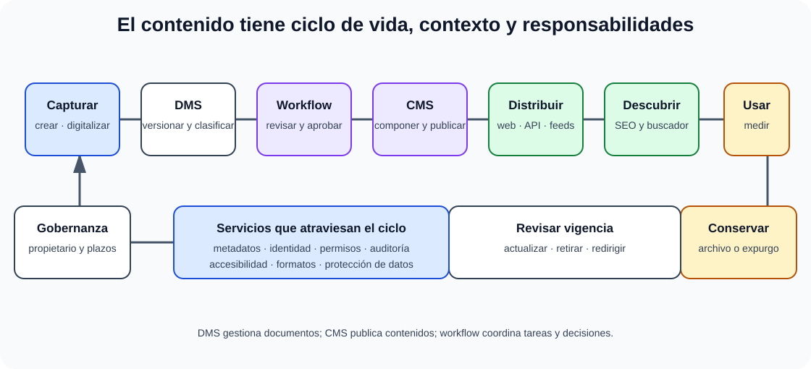

# Sistemas de gestión documental y de contenidos. Sindicación de contenido. Sistemas de gestión de flujos de trabajos. Búsqueda de información: robots, spiders, otros. Posicionamiento y buscadores (SEO). Herramientas de trabajo colaborativo y redes sociales.

B2-T16 · Bloque 2 · Tema 16

Fuente: [GSI_A2 — BLOQUE II — APUNTES COMPLETOS V2.1 REVISADOS — ESTUDIO (16 temas)](https://docs.google.com/document/d/12jkpwzH8m5VoljIVPRi_Ofvqr7I_VBpVNGV0wmHfOFk/edit) · II.16 · V2.1 · 2026-08-21

## 1. Alcance

El epígrafe reúne gestión documental, contenidos, workflow, búsqueda, sindicación y colaboración. Debe estudiarse por función y por ciclo de vida, evitando organizarlo como una lista de productos.

## 2. Gestión documental

Un **DMS/gestor documental** administra documentos y su ciclo de vida: captura, clasificación, metadatos, versiones, permisos, búsqueda, retención, archivo y disposición. En el sector público se relaciona con documento/expediente electrónico, ENI/NTI y política de gestión documental, tratados más jurídicamente en Bloque I.

### 2.1 Metadatos

Describen contenido, contexto, estructura y gestión. Ejemplos: título, autor/unidad, fecha, tipo documental, estado, versión, clasificación, expediente, seguridad, retención y relaciones. Un buen modelo evita campos ambiguos y permite búsquedas.

### 2.2 Versionado y check-in/check-out

Versionado conserva evolución. Check-out puede bloquear o reservar edición; check-in incorpora versión. En colaboración moderna también existe edición concurrente y resolución de conflictos. Versionar ≠ backup: un borrado o corrupción puede afectar al repositorio completo.

### 2.3 Retención

Políticas definen conservación y eliminación por valor legal/administrativo/histórico. Deben existir bloqueos de conservación («legal hold») cuando proceda. Borrar porque «el disco está lleno» no es política documental.

## 3. CMS

**Content Management System** gestiona contenidos de publicación: páginas, componentes, multimedia, flujos editoriales, plantillas, taxonomías y permisos. Un CMS se orienta más a publicación/experiencia; un DMS a documentos y expediente, aunque productos se solapan.

## 4. ECM

**Enterprise Content Management** integra captura, gestión documental, contenidos, workflow, records, colaboración y preservación. El término es paraguas; no equivale a una tecnología concreta.

## 5. Taxonomías, ontologías y etiquetado

Taxonomía organiza categorías jerárquicas o facetas. Folksonomía surge de etiquetas libres de usuarios. Ontología modela conceptos y relaciones con mayor formalidad. La clasificación controlada mejora precisión; etiquetas libres favorecen flexibilidad pero requieren gobierno.

## 6. Sindicación

**RSS** y **Atom** permiten publicar feeds de novedades para suscripción y agregación. Un feed contiene entradas con título, enlace, fecha, identificador y contenido/resumen según formato. Sindicación ≠ scraping: el productor ofrece un canal estructurado.

## 7. Workflow

Un sistema de workflow define tareas, estados, reglas, participantes y transiciones. Patrones: secuencia, decisión, paralelismo, sincronización, bucles, escalado y temporizadores. Los motores pueden apoyarse en BPMN u otros modelos.

Distingue **workflow** de **orquestación técnica**: un workflow puede representar proceso de negocio con personas y tareas; una orquestación coordina servicios.

## 8. BPM y BPMN

**BPM** gestiona procesos de extremo a extremo: descubrir/modelar, ejecutar, medir y mejorar. **BPMN** es una notación con eventos, actividades, gateways, flujos y pools/lanes. Automatizar un proceso ineficiente puede consolidar la ineficiencia; primero se analiza.

## 9. Búsqueda e indexación

Un motor de búsqueda suele realizar crawling/captura → parsing → normalización → indexación → consulta → ranking. Un **crawler/robot/spider** descubre y descarga recursos. El **índice invertido** mapea términos a documentos y permite búsqueda eficiente.

## 10. Recuperación de información

Conceptos:

* **Precision**: proporción de resultados recuperados que son relevantes.
* **Recall**: proporción de documentos relevantes que han sido recuperados.
* **F1**: media armónica de precision y recall.
* **Tokenización**: separación en unidades.
* **Stemming/lemmatization**: reducción de variantes.
* **Stop words**: términos frecuentes que pueden tratarse de forma especial.
* **TF-IDF/BM25**: familias de ponderación/ranking textual.

Búsqueda semántica/vectorial puede complementar la búsqueda léxica, pero para GSI primero domina índice, crawling, ranking y métricas.

## 11. Robots.txt y sitemaps

**robots.txt** comunica preferencias de crawling a robots que deciden respetarlo; no es un control de acceso. Un recurso sensible debe protegerse con autenticación/autorización. **sitemap** ayuda a descubrir URLs.

## 12. SEO

Search Engine Optimization busca mejorar descubrimiento/ranking legítimo. Factores técnicos: HTML semántico, títulos/metadescripciones, URLs claras, enlaces internos, rendimiento/Core Web Vitals según contexto, mobile, datos estructurados, sitemap, canonical y accesibilidad. Factores de contenido: calidad, relevancia, autoridad y actualización.

**SEO ≠ SEM**: SEO es optimización orgánica; SEM suele referirse a marketing/pago en buscadores.

## 13. SEO público e interno

En una Administración, además del buscador externo interesa la búsqueda del propio portal: sinónimos, filtros/facetas, corrector, ranking, accesibilidad, analítica de consultas sin resultados y contenidos oficiales. Optimizar «clics» no puede degradar claridad jurídica.

## 14. Colaboración

Herramientas: coedición, wikis, repositorios, chat/canales, videoconferencia, foros, gestión de tareas, pizarras y control de versiones. Deben gobernarse: identidad, permisos, ciclo de vida de espacios, clasificación, retención, invitados, exportaciones y búsqueda.

## 15. Redes sociales

Permiten difusión, interacción y escucha, pero deben existir cuentas oficiales, roles, archivo/retención según política, moderación, respuesta ante suplantación, accesibilidad y protección de datos. No deben utilizarse como único canal para trámites o información que requiera garantías.

## 16. Integración DMS/CMS/workflow

### Ciclo de vida integrado del contenido

_Sitúa cada familia de herramienta dentro de un proceso completo y gobernado._

**Qué debes recordar:** DMS conserva y gobierna documentos; workflow coordina tareas; CMS publica; el buscador indexa y recupera; versionado no sustituye al backup.

Un patrón: entrada/creación → metadatos → repositorio DMS → workflow de revisión/aprobación → publicación CMS → sindicación → indexación/búsqueda → archivo/retención. Servicios transversales: IAM, firma, auditoría, antivirus, OCR, conversión de formatos y API.

## 17. Seguridad

RBAC/ABAC según necesidad, clasificación, cifrado, antivirus/sandbox de ficheros, DLP, logs, control de enlaces públicos, revisión de invitados, backups, versionado y retención. Los metadatos también pueden contener información sensible.

## 18. Test

* DMS ≠ CMS.
* Versionado ≠ backup.
* Taxonomía ≠ folksonomía.
* RSS/Atom = sindicación.
* Crawler/robot/spider = captura/descubrimiento, no ranking completo.
* robots.txt ≠ mecanismo de seguridad.
* Precision ≠ recall.
* Workflow ≠ BPM, aunque se relacionan.
* SEO ≠ SEM.
* Red social ≠ canal administrativo con garantías por defecto.

## 19. Supuesto

Define repositorio y metadatos, clasificación, workflow, firma si procede, retención, permisos y búsqueda. Si hay portal, añade CMS, publicación, RSS/Atom, SEO, sitemap y buscador interno. Para colaboración, incluye gobierno de espacios/invitados y conservación.

## 20. Resumen II.16

Piensa en el ciclo de vida del contenido: crear/capturar → clasificar → colaborar → aprobar → publicar → encontrar → conservar/eliminar. Cada familia —DMS, CMS, workflow, buscador— resuelve una parte distinta.

# ANEXO A — Tabla de memorización rápida

| Concepto | Dato clave |
| --- | --- |
| Flynn | SISD / SIMD / MISD / MIMD |
| Escalado | Vertical = recursos por nodo; horizontal = más nodos |
| Cloud | IaaS / PaaS / SaaS |
| Hipervisor | Tipo 1 sobre hardware; tipo 2 sobre SO host |
| Proceso/hilo | Hilos comparten recursos del proceso |
| Paradigmas | Imperativo, OO, funcional, declarativo, eventos/reactivo |
| DW clásico | Orientado a temas, integrado, variable temporal, no volátil |
| OLTP/OLAP | Operación transaccional / análisis |
| ANSI/SPARC | Externo / conceptual / interno |
| ACID | Atomicidad / Consistencia / Aislamiento / Durabilidad |
| Aislamiento | RU / RC / RR / Serializable |
| SOA | Servicios + contrato + bajo acoplamiento |
| Orquestación/coreografía | Coordinador único / interacción distribuida |
| Contenedores | Imagen → registry → contenedor |
| Kubernetes | Pod, Deployment, Service, StatefulSet, ConfigMap, Secret |
| Probes | startup / readiness / liveness |
| OSI | 7 capas |
| IPv4/IPv6 | 32 / 128 bits |
| Rangos privados IPv4 | 10/8, 172.16/12, 192.168/16 |
| XML | bien formado ≠ válido |
| XPath/XSLT | seleccionar / transformar |
| Riesgos AGE | MAGERIT v3 + PILAR |
| Tratamiento riesgo | evitar / reducir / compartir-transferir / aceptar |
| Auditoría | criterio + evidencia + hallazgo + remediación |
| Contact center | ACD / CTI / IVR / CRM |
| Forense | preservar / adquirir / hash / analizar / cadena custodia |
| Licencias | permisivas vs copyleft |
| Costes | CAPEX / OPEX / TCO |
| Valor ganado | CPI=EV/AC; SPI=EV/PV |
| Gestión contenidos | DMS / CMS / workflow / búsqueda / sindicación |

# ANEXO B — Trampas transversales de test

* Escalabilidad no es lo mismo que elasticidad ni alta disponibilidad.
* Virtualización no es contenedorización.
* Lenguaje no tiene por qué ser exclusivamente compilado o interpretado.
* Concurrencia no implica paralelismo.
* Data Warehouse no es una base OLTP grande.
* CAP no sustituye ACID.
* WHERE y HAVING no son intercambiables.
* SOA no implica necesariamente SOAP; REST no es un protocolo.
* Un Pod no es siempre un único contenedor y un Service de Kubernetes no es un microservicio.
* NAT no es firewall.
* HTML moderno no es XML; XHTML sí sigue reglas XML.
* MAGERIT es metodología; PILAR herramienta.
* Auditoría no es pentest.
* IVR no es reconocimiento de voz.
* Hash no es cifrado.
* Software libre no significa gratis.
* TCO no es precio de compra.
* robots.txt no protege información confidencial.

# ANEXO C — Método de estudio del Bloque II

## Primera vuelta: comprensión

Estudia cada tema con un mapa de conceptos y explica en voz alta las diferencias. Para II.05, II.07, II.08, II.10, II.11, II.13 y II.15 realiza ejercicios desde la primera vuelta; son temas que no se consolidan solo leyendo.

## Segunda vuelta: tablas de contraste

* scale-up / scale-out / elasticidad / HA;
* proceso / hilo / concurrencia / paralelismo;
* imperativo / OO / funcional / declarativo;
* OLTP / OLAP; DW / lake;
* externo / conceptual / interno;
* dirty / non-repeatable / phantom;
* SOAP / REST / mensajería;
* VM / contenedor; pod / deployment / service;
* TCP / UDP; IPv4 / IPv6;
* HTML / XML / XHTML;
* amenaza / vulnerabilidad / impacto / riesgo;
* auditoría / pentest;
* ACD / CTI / IVR;
* SOC / CSIRT; SIEM / SOAR;
* permisiva / copyleft;
* CAPEX / OPEX / TCO; VAN / TIR / payback;
* DMS / CMS / workflow.

## Práctica de test

Tras cada tema, responde preguntas cerradas sin mirar y registra errores con cuatro campos: tema → regla correcta → por qué fallaste → fuente. Vuelve a los errores 24–72 horas después.

## Práctica de supuesto

Practica respuestas de 15–25 minutos con plantillas: **requisitos → arquitectura/proceso → seguridad → operación → riesgos → métricas → justificación**. El examen práctico premia aplicar conocimientos, no recitar definiciones.

# Fuentes y control de actualidad

## Programa oficial

Resolución de 18 de diciembre de 2025, BOE-A-2025-26262, Anexo IX, programa GSI A2. Para este Bloque II se han usado literalmente los epígrafes 1–16 de «Tecnología básica».

## Fuentes PreparaTIC/A1 verificadas en esta reconstrucción

* A1 052 — Sistemas de altas prestaciones / grid / mainframe — resumen 10/05/2019.
* A1 053 — Equipos departamentales, servidores e infraestructura — v30.2, 12/09/2024.
* A1 059 — Fundamentos de sistemas operativos — v31.1, 10/03/2026.
* A1 063 — SGBD y ANSI/SPARC — 01/02/2022.
* A1 064 — Modelo relacional, SQL e interoperabilidad — 23/04/2023.
* A1 058 — Cliente-servidor y SOA — 13/01/2019.
* A1 065 — Arquitectura/desarrollo web — 13/04/2023.
* A1 097 — Integración continua y DevOps — 23/01/2022.
* A1 077 — HTML, CSS, XML y estándares web — 13/04/2023.
* A1 047 — Análisis y gestión de riesgos.
* A1 038 — Auditoría informática — 20/01/2022.
* A1 048 — ENS — material actualizado 05/03/2026.
* A1 075 — Tecnologías y explotación de datos / DW — 16/05/2023.
* A1 072 — CRM/ERP — apoyo parcial.
* A1 125 — Seguridad en redes — v30.1, 09/09/2024.
* A1 126 — Seguridad/incidentes — versión P31 disponible.
* A1 127 — Informática forense — material A1 específico.
* A1 069 — Software libre/código abierto — 07/05/2023.
* A1 043 — Protección jurídica del software — 23/01/2022.
* A1 040 — Evaluación multicriterio de alternativas — 23/04/2019.
* A1 104 — Gestión documental/CMS/DMS — 12/05/2023.

## Actualización oficial complementaria

* Kubernetes — documentación oficial de versiones: ramas soportadas verificadas el 21/08/2026.
* Portal de Administración Electrónica/CTT — MAGERIT v3 y PILAR: metodología y herramienta en producción verificadas en agosto de 2026.
* ENS — RD 311/2022 y material CCN/PreparaTIC actualizado utilizado para auditoría y seguridad.

**Control de versiones:** las versiones concretas de software cambian con rapidez. Se incluyen solo cuando ayudan a detectar que un apunte ha quedado obsoleto. Para examen se priorizan conceptos, estándares, arquitectura y normativa.

# CIERRE DEL BLOQUE II

El Bloque II debe dejarte capaz de explicar un sistema técnico desde la máquina hasta la operación: hardware/cloud → SO → lenguajes → datos → integración → contenedores → red → formatos → riesgos → auditoría → atención → ciberseguridad → licencias → proyecto → contenidos. Esa conexión entre temas es especialmente útil para el segundo ejercicio.

## Resumen de repaso

Fuente: [GSI_A2 — BLOQUE II — RESUMEN MAESTRO DE REPASO (16 temas)](https://docs.google.com/document/d/1h7n4dFYafS_3VMuL55TnEuVKhqaTheUoL-thDFQSr9w/edit) · II.16

### Núcleo de estudio

Un gestor documental controla documentos, metadatos, versiones, permisos, clasificación, búsqueda, retención y ciclo de vida; en AAPP debe relacionarse con documento/expediente electrónico, ENI, archivo y firma. Un CMS gestiona publicación de contenidos web y plantillas. Workflow/BPM automatiza tareas y estados; BPMN es una notación habitual de procesos. Sindicación usa feeds como RSS/Atom. Motores de búsqueda emplean rastreadores/robots/spiders, indexación y ranking; robots.txt orienta rastreo pero no es control de seguridad. SEO mejora descubrimiento mediante contenido, estructura, metadatos, rendimiento y enlaces. Herramientas colaborativas añaden coedición, repositorios, chat, wiki y control de acceso.

### Claves de test

CMS ≠ gestor documental; workflow ≠ BPM completo; robots.txt no impide acceso; SEO orgánico ≠ publicidad SEM. En expediente público importan metadatos, integridad, conservación y trazabilidad.

### Enfoque para supuesto práctico

En supuesto separa CMS público, gestor documental/archivo y motor de workflow; integra INSIDE/archivo si aplica, SSO, permisos, versionado, búsqueda, auditoría, conservación y accesibilidad.

### Fuentes base del material

A1 104 + 105 y RELEASE de gestores documentales/BPM.

## Fuentes oficiales de actualización

* [Programa oficial GSI A2 — BOE-A-2025-26262](https://www.boe.es/diario_boe/txt.php?id=BOE-A-2025-26262)
* [Kubernetes — releases soportadas](https://kubernetes.io/releases/)
* [MAGERIT / Administración electrónica](https://administracionelectronica.gob.es/)
* [CCN-CERT / ENS](https://www.ccn-cert.cni.es/)

Edición de trabajo GSI A2. Los materiales del otro proyecto GSI\_B1 no se han utilizado como fuente.
