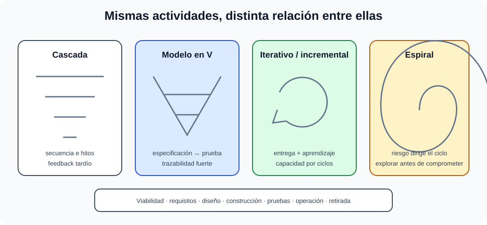

# Concepto del ciclo de vida de los sistemas y fases. Modelos de ciclo de vida.

B3-T01 · Bloque 3 · Tema 1

Fuente: [GSI_A2 — BLOQUE III — APUNTES COMPLETOS V2.1 REVISADOS — ESTUDIO (15 temas)](https://docs.google.com/document/d/1eUTbZtV2Jj1Y8P_pjOP7Tk86chx1r9lPyLwuz3vBCec/edit) · III.01 · V2.1 · 2026-08-21

Cobertura oficial que debe quedar dominada: Concepto de ciclo de vida. Fases. Modelos de ciclo de vida.

## 1. Concepto

El ciclo de vida comprende las etapas por las que pasa un sistema desde la identificación de una necesidad hasta su retirada. La fuente A1 086 diferencia correctamente **ciclo de vida** y **ciclo de desarrollo**: el primero incluye operación/mantenimiento y retirada. El modelo dice qué etapas y relaciones existen; una metodología concreta define cómo trabajar.

## 2. Actividades típicas

* viabilidad y planificación;
* requisitos;
* análisis y diseño;
* construcción;
* pruebas;
* despliegue;
* operación y mantenimiento;
* retirada/migración.

En modelos iterativos estas actividades se repiten y solapan; no desaparecen.

## 3. Modelos clásicos

### Modelos de ciclo de vida según incertidumbre y riesgo

_Sitúa cada modelo por su forma de avanzar, recibir feedback y tratar el riesgo._

**Qué debes recordar:** Las actividades del ciclo no desaparecen: cambia su orden, repetición, solapamiento y forma de control.

### Cascada

Fases secuenciales. Facilita hitos/documentación, pero responde peor a requisitos cambiantes si se aplica rígidamente.

### Modelo en V

Relaciona fases de especificación/diseño con niveles de verificación y validación. Útil para trazabilidad entre requisitos y pruebas.

### Prototipos

Reducen incertidumbre. Pueden ser desechables o evolutivos. Riesgo: convertir prototipo en producción sin arquitectura/calidad suficiente.

### Incremental e iterativo

Entrega partes útiles y refina el producto mediante ciclos. Incremental añade capacidad; iterativo mejora/revisa solución.

### Espiral

Dirigido por riesgos: objetivos → identificación/resolución de riesgos → desarrollo/validación → planificación siguiente iteración.

## 4. Enfoques modernos

Agile y DevOps no eliminan el ciclo de vida: acortan ciclos, aumentan feedback y automatizan integración, pruebas, entrega y operación. El producto puede mantener un flujo continuo de cambios con controles de calidad y seguridad.

## 5. Retirada

Planificar migración de datos, conservación legal, exportación, destrucción segura, cierre de integraciones, revocación de secretos/cuentas, comunicación y contingencia. Retirar no es “apagar servidor”.

## 5.1 Entregables, gates y trazabilidad del ciclo

Cada transición del ciclo debe controlarse mediante entradas, salidas, responsables y criterios de paso; esta gobernanza permite conectar modelo, entregables y aceptación.

Un ciclo bien gobernado no es una lista de fases: cada transición debe tener **entradas, salidas y criterios de paso**. En viabilidad se espera una justificación de alternativas; en requisitos, una especificación priorizada y trazable; en diseño, arquitectura y modelos; en construcción, artefactos reproducibles; en pruebas, evidencia de verificación/validación; en despliegue, plan de implantación y reversión; en operación, niveles de servicio y procedimientos.

La **trazabilidad** enlaza necesidad → requisito → componente de diseño → implementación → prueba → versión desplegada. Esta cadena permite estimar impacto de un cambio y demostrar cobertura ante auditoría o aceptación.

## 5.2 Elección del modelo

| Contexto | Enfoque razonable | Riesgo a vigilar |
| --- | --- | --- |
| requisitos muy estables y fuerte regulación | predictivo o híbrido con gates formales | feedback tardío |
| alta incertidumbre funcional | iterativo/incremental y prototipado | deriva de alcance |
| riesgo técnico elevado | espiral/prototipos técnicos | coste de exploración |
| producto digital evolutivo | ágil + CI/CD + operación continua | deuda técnica y gobernanza |

**Trampa de test:** “ágil” no constituye una fase del ciclo de vida ni elimina análisis, diseño, pruebas o mantenimiento.

## 6. Test

* Ciclo de vida ≠ metodología.
* Verificación: ¿construimos correctamente? Validación: ¿construimos lo correcto?
* Incremental ≠ iterativo.
* Espiral = fuerte orientación a riesgos.
* Operación/mantenimiento forman parte del ciclo.

## 7. Supuesto

Elige modelo según incertidumbre, criticidad, regulación, tamaño, dependencia externa y frecuencia de entrega. Explica hitos, artefactos, feedback, pruebas y transición a operación.

## 8. Resumen

Domina diferencias entre cascada, V, prototipo, incremental, iterativo y espiral, y entiende que Agile/DevOps comprimen y automatizan actividades del mismo ciclo.

## Resumen de repaso

Fuente: [GSI_A2 — BLOQUE III — RESUMEN MAESTRO DE REPASO (15 temas)](https://docs.google.com/document/d/1l0nl4fc451Tl3XB9XZ4LRLZGLZEJxUueQvaMZoF8gcA/edit) · III.01

### Núcleo de estudio

El ciclo de vida estructura actividades desde necesidad y viabilidad hasta retirada: planificación, requisitos, análisis/diseño, construcción, pruebas, implantación, operación, mantenimiento y retirada, con variaciones según modelo. Cascada avanza por fases secuenciales y funciona mejor con requisitos estables; iterativo refina en ciclos; incremental entrega funcionalidad por partes; espiral añade gestión explícita del riesgo; prototipado reduce incertidumbre; enfoques ágiles entregan incrementos frecuentes y realimentación. DevOps extiende la colaboración hacia operación y automatización. Elige modelo según incertidumbre, criticidad, regulación, tamaño, dependencias y necesidad de entrega temprana.

### Claves de test

Iterativo no equivale a incremental; prototipo puede ser desechable o evolutivo; mantenimiento forma parte del ciclo de vida; ágil no elimina documentación ni arquitectura. Espiral está orientado a riesgos.

### Enfoque para supuesto práctico

En supuesto define fases, entregables, gates, pruebas y despliegues. Si hay requisitos inciertos, propone iteración/prototipos; si hay alta regulación, refuerza trazabilidad y documentación aun usando ágil.

### Fuentes base del material

A1 086. Correspondencia DIRECTA.
