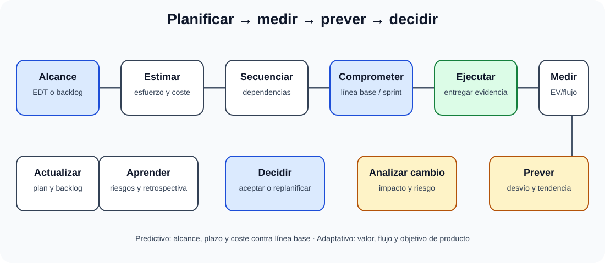

# Gestión y planificación del proceso de desarrollo. Técnicas y prácticas de gestión y planificación de proyectos. Metodologías de desarrollo.

B3-T02 · Bloque 3 · Tema 2

Fuente: [03 — BLOQUE III — Desarrollo de sistemas — GSI A2](https://docs.google.com/document/d/1T28bNfTrftG0eCG2sX336DKKir-8ruVKnkhKMS0w7N0/edit) · III.02 · V2.1 · 2026-09-23

Cobertura oficial que debe quedar dominada: Gestión y planificación del proceso de desarrollo: técnicas y prácticas de gestión y planificación de proyectos. Metodologías de desarrollo.

## 1. Gestión

Gestionar desarrollo significa definir alcance, entregables, responsables, calendario, recursos, riesgos, calidad, comunicaciones y cambios. Hay que controlar progreso mediante evidencia, no solo porcentaje subjetivo.

## 2. Planificación

Descomponer trabajo en WBS/backlog; estimar esfuerzo/duración; dependencias; recursos; hitos; riesgos; criterios de aceptación. Técnicas: análoga, paramétrica, tres puntos y bottom-up.

## 3. Tradicional vs ágil

| Predictivo | Ágil/adaptativo |
| --- | --- |
| alcance más definido al inicio | alcance evoluciona en backlog |
| plan detallado por fases | planificación progresiva |
| cambio mediante control formal | cambio esperado y priorizado |
| entregas más grandes | entregas frecuentes |

## 4. Scrum

Roles/accountabilities: Product Owner, Scrum Master, Developers. Eventos: Sprint, Planning, Daily, Review, Retrospective. Artefactos: Product Backlog, Sprint Backlog, Increment con compromisos asociados. Scrum no prescribe arquitectura, lenguaje ni herramientas.

## 5. Kanban

Visualiza flujo, limita WIP, gestiona flujo y mejora continuamente. Métricas: lead time, cycle time, throughput, WIP. No requiere sprints.

## 6. XP

Prácticas: TDD, programación en pareja, integración continua, refactorización, diseño simple, propiedad colectiva, feedback frecuente.

## 7. Riesgos y calidad

Registro de riesgos con probabilidad/impacto, propietario, respuesta y disparadores. Calidad se planifica con Definition of Done, estándares, revisión, automatización y criterios de aceptación.

## 7.1 EDT/WBS, cronograma y dependencias

La planificación debe conectar alcance, estimación, dependencias, calendario, coste y evidencia de avance, tanto en enfoques predictivos como adaptativos.

La **EDT/WBS** descompone entregables y trabajo hasta un nivel gestionable. No es un calendario: primero estructura alcance, después permite estimar esfuerzo, responsables y coste. Un **hito** representa un punto de control sin duración propia relevante.

El diagrama de **Gantt** muestra actividades, duración, dependencias y calendario. Las redes PERT/CPM permiten analizar secuencia y **camino crítico**. Una actividad crítica tiene holgura total nula o mínima: retrasarla retrasa la fecha final salvo que se modifique la planificación.

### PERT

Estimación de tres puntos clásica: optimista O, más probable M y pesimista P. Duración esperada aproximada: **(O + 4M + P) / 6**. La técnica no convierte incertidumbre en certeza; explicita supuestos.

## 7.2 Líneas base y seguimiento

### Planificar, ejecutar y controlar el desarrollo

_Une planificación inicial, seguimiento objetivo y decisión sobre cambios._

**Qué debes recordar:** WBS y backlog no son sinónimos; ambos necesitan prioridades, responsables, criterios de aceptación y medidas de avance.

En gestión predictiva se controlan líneas base de alcance, cronograma y costes. En enfoques ágiles se observa flujo, valor entregado, burnup/burndown y objetivos de producto. Conviene separar **avance físico** de “porcentaje declarado”.

El **Valor Ganado** puede aparecer transversalmente: PV (valor planificado), EV (valor ganado) y AC (coste real). CV=EV−AC; SV=EV−PV; CPI=EV/AC; SPI=EV/PV. CPI o SPI inferiores a 1 son señales desfavorables de coste o plazo.

## 7.3 Gestión de cambios y configuración del proyecto

Un cambio debe registrar origen, justificación, impacto en requisitos/arquitectura/pruebas/plazo/coste y decisión. En un backlog ágil la priorización es más dinámica, pero sigue existiendo análisis de impacto. El control de configuración identifica versiones de requisitos, código, documentación, infraestructura y releases.

## 7.4 Comparación de metodologías

| Marco | Foco | Conceptos de test |
| --- | --- | --- |
| Scrum | producto incremental por Sprints | PO, SM, Developers; Product/Sprint Backlog; Increment |
| Kanban | flujo continuo | visualización, límites WIP, lead/cycle time |
| XP | prácticas de ingeniería | TDD, pairing, refactor, CI, diseño simple |
| UP | iterativo, arquitectura, riesgos | Inicio, Elaboración, Construcción, Transición |

**Para supuesto:** si existe contratación pública, hitos de aceptación y cumplimiento normativo, es razonable proponer gobierno/hitos formales combinados con construcción iterativa. “Híbrido” debe explicar qué parte es predictiva y cuál adaptativa.

## 7.5 Microhechos oficiales de planificación y ágil

Kanban visualiza el flujo en un tablero, pero el método no fija un número invariable de columnas.

Planning Poker es una técnica de estimación por consenso usada habitualmente en entornos ágiles; no es un evento ni un artefacto obligatorio de Scrum.

Durante un Sprint no deben introducirse cambios que pongan en peligro el Sprint Goal; el alcance puede clarificarse y renegociarse con el Product Owner a medida que se aprende. Si el Sprint Goal queda obsoleto, solo el Product Owner tiene autoridad para cancelar el Sprint.

En Gantt, longitud de barra = duración en calendario, no esfuerzo. PERT se usa para analizar secuencia, ruta crítica y duración esperada.

## 8. Test

* Scrum ≠ Kanban.
* Backlog ≠ WBS.
* Lead time ≠ cycle time.
* Velocidad no compara equipos de forma fiable.
* Ágil no significa ausencia de documentación/planificación.

## 9. Supuesto

Proponer un modelo híbrido si hay contratación/hitos regulatorios y desarrollo iterativo. Definir gobierno, backlog, releases, riesgos, calidad, CI/CD y métricas.

## 10. Resumen

La metodología debe ajustarse a incertidumbre y contexto. Planifica alcance, tiempo, coste, calidad y riesgos con métricas de flujo/entrega.

## Resumen de repaso

Fuente: [GSI_A2 — BLOQUE III — RESUMEN MAESTRO DE REPASO (15 temas)](https://docs.google.com/document/d/1l0nl4fc451Tl3XB9XZ4LRLZGLZEJxUueQvaMZoF8gcA/edit) · III.02

### Núcleo de estudio

Planificar implica alcance, EDT/WBS, recursos, estimaciones, dependencias, calendario, riesgos, calidad, comunicaciones y seguimiento. Gantt visualiza tareas en el tiempo; PERT/CPM ayuda con dependencias y ruta crítica. En enfoques tradicionales se definen fases y entregables; Scrum organiza trabajo en producto/backlog, sprints y roles Product Owner, Scrum Master y Developers; Kanban visualiza flujo y limita WIP. La gestión ágil usa valor, feedback, priorización y métricas de flujo/velocidad con cautela. Metodologías de desarrollo deben conectarse con arquitectura, pruebas, configuración y despliegue. Métrica v3 puede estudiarse como referencia histórica de la Administración, pero el programa vigente ya no la cita expresamente.

### Claves de test

Ruta crítica, holgura, dependencia y hito son conceptos distintos. Scrum no tiene “jefe de proyecto” como rol oficial; sprint backlog deriva de product backlog; velocity no compara equipos. Kanban no prescribe sprints.

### Enfoque para supuesto práctico

En supuesto propone gobernanza, planificación por entregas, riesgos, responsables, control de cambios y métricas. Justifica metodología híbrida si regulación y contratación requieren hitos formales pero desarrollo necesita iteración.

### Actualización 2026

Actualización 2026: el BOE vigente habla de metodologías de desarrollo y ya no menciona Métrica de forma expresa.

### Fuentes base del material

A1 088 + 037 + 036. A1 095 Métrica v3 solo como apoyo histórico.
