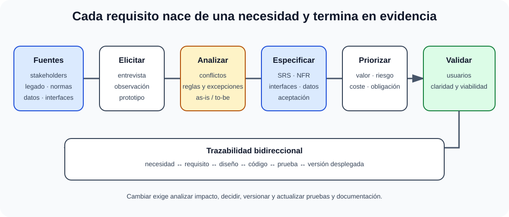

# Estrategias de determinación de requerimientos: entrevistas, derivación de sistemas existentes, análisis y prototipos. La especificación de requisitos de software.

B3-T03 · Bloque 3 · Tema 3

Fuente: [GSI_A2 — BLOQUE III — APUNTES COMPLETOS V2.1 REVISADOS — ESTUDIO (15 temas)](https://docs.google.com/document/d/1eUTbZtV2Jj1Y8P_pjOP7Tk86chx1r9lPyLwuz3vBCec/edit) · III.03 · V2.1 · 2026-08-21

Cobertura oficial que debe quedar dominada: Análisis de requisitos: técnicas de entrevistas, derivación de sistemas existentes, análisis, prototipos y especificación de requisitos.

## 1. Tipos

* negocio;
* usuario/stakeholder;
* funcionales;
* no funcionales/calidad;
* restricciones;
* transición/migración.

## 2. Elicitación

Entrevistas, talleres, observación, cuestionarios, análisis documental, prototipos, brainstorming, análisis de interfaces y procesos. No es “preguntar qué quiere el usuario”: se descubren necesidades, conflictos, reglas y excepciones.

## 3. Calidad de requisitos

Deben ser necesarios, claros, verificables, consistentes, factibles, trazables, priorizados y sin ambigüedad evitable. Un requisito no funcional debe poder medirse: “rápido” es pobre; “p95 < 2 s bajo X carga” es verificable.

## 4. Historias y casos de uso

Historia: “Como [rol], quiero [capacidad], para [beneficio]”, complementada con criterios de aceptación. Caso de uso desarrolla actores, precondiciones, flujo principal, alternativos, excepciones y postcondiciones.

## 5. Priorización

MoSCoW, valor/riesgo/coste, WSJF en contextos adecuados. Prioridad debe explicitar dependencia y obligación legal.

## 6. Trazabilidad

Requisito ↔ diseño ↔ código ↔ prueba ↔ entrega. Permite impacto de cambio y demostrar cobertura. Matriz de trazabilidad no debe convertirse en burocracia sin uso.

## 7. Gestión de cambios

Registrar cambio, analizar impacto, decidir, versionar, actualizar trazabilidad y comunicar. En Agile, backlog facilita cambio, pero no elimina análisis de impacto.

## 7.1 Derivación de sistemas existentes

La derivación de sistemas existentes exige descubrir procesos, datos, interfaces, reglas y excepciones sin convertir automáticamente cada limitación heredada en un requisito futuro.

Cuando se sustituye o moderniza un sistema, parte de los requisitos se obtiene mediante ingeniería inversa funcional: inventario de procesos, interfaces, datos, reglas de negocio, roles, informes, dependencias, restricciones y excepciones actuales. Hay que distinguir entre **requisito real** y **limitación heredada**. Copiar sin análisis todos los comportamientos del legado perpetúa deuda y errores.

Técnicas: observación de usuarios, análisis de pantallas/documentación/código y logs, extracción del modelo de datos, trazado de interfaces y talleres de “as-is / to-be”. Para migración se documentan reglas de correspondencia de datos y requisitos de reconciliación.

## 7.2 Especificación de requisitos

### De la necesidad a una prueba trazable

_Muestra cómo se descubre, especifica, valida y mantiene un requisito._

**Qué debes recordar:** Un requisito útil es claro y verificable; la trazabilidad permite medir cobertura y analizar el impacto de cada cambio.

Una SRS/ERS debe permitir construir y verificar. Estructura útil: alcance, actores, glosario, requisitos funcionales, reglas de negocio, interfaces, datos, requisitos no funcionales, restricciones, supuestos, criterios de aceptación y trazabilidad. La familia ISO/IEC/IEEE 29148 es una referencia de ingeniería de requisitos que puede usarse como apoyo, sin memorizar numeración secundaria salvo que aparezca en test.

## 7.3 Modelado de requisitos

Casos de uso, BPMN/diagramas de actividad, estados, prototipos, modelos de dominio y contratos de interfaz. El modelo se elige por la duda que resuelve; dibujar por decorar añade ruido.

## 7.4 Requisitos no funcionales

| Área | Ejemplo verificable |
| --- | --- |
| rendimiento | p95 de respuesta < 2 s bajo carga definida |
| disponibilidad | 99,9 % mensual excluyendo ventanas acordadas |
| seguridad | MFA para perfiles privilegiados; cifrado en tránsito |
| accesibilidad | conformidad legal/técnica aplicable y pruebas manuales |
| continuidad | RTO/RPO definidos por proceso |

**Trampa:** “el sistema será intuitivo y rápido” no es un requisito suficientemente verificable.

## 8. Test

* Requisito funcional ≠ no funcional.
* Criterio de aceptación ≠ requisito completo.
* Historia ≠ caso de uso.
* Trazabilidad bidireccional facilita impacto y cobertura.

## 9. Supuesto

Identifica stakeholders, requisitos, NFR medibles, restricciones ENS/RGPD/accesibilidad, prototipo, prioridades, trazabilidad y control de cambios.

## 10. Resumen

El mejor requisito es comprensible y verificable. La trazabilidad conecta necesidad con prueba y entrega.

## Resumen de repaso

Fuente: [GSI_A2 — BLOQUE III — RESUMEN MAESTRO DE REPASO (15 temas)](https://docs.google.com/document/d/1l0nl4fc451Tl3XB9XZ4LRLZGLZEJxUueQvaMZoF8gcA/edit) · III.03

### Núcleo de estudio

Requisitos funcionales describen comportamientos; no funcionales imponen cualidades/restricciones como seguridad, rendimiento, disponibilidad, accesibilidad o mantenibilidad. Elicitación: entrevistas, talleres, observación, cuestionarios, análisis documental, sistemas existentes, prototipos, historias de usuario y casos de uso. Un buen requisito es necesario, claro, verificable, trazable, consistente y factible. La especificación SRS debe organizar alcance, actores, interfaces, reglas, datos, requisitos funcionales/no funcionales, restricciones y criterios de aceptación. La trazabilidad enlaza necesidad-requisito-diseño-prueba. Prototipos ayudan a validar UX y requisitos, pero no sustituyen el análisis.

### Claves de test

Requisito no funcional no significa “opcional”; caso de uso ≠ historia de usuario; criterio de aceptación debe poder verificarse; trazabilidad bidireccional ayuda a impacto de cambios. ISO/IEC/IEEE 29148 es una referencia moderna de ingeniería de requisitos.

### Enfoque para supuesto práctico

En supuesto identifica actores y objetivos, lista requisitos prioritarios, NFR medibles, interfaces, datos y restricciones legales; añade matriz de trazabilidad y validación con usuarios.

### Fuentes base del material

A1 088 + 094 + 091 y material de análisis funcional.
