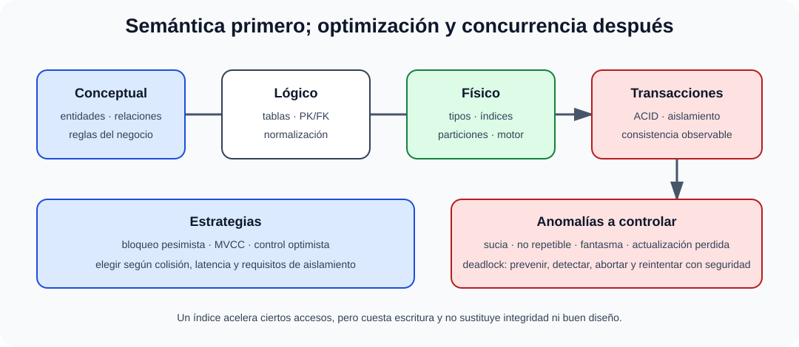

# Modelado de datos y metodologías. Diseño de bases de datos. El modelo lógico relacional. Normalización. Diseño lógico y físico. Problemas de concurrencia de acceso. Mecanismos de resolución de conflictos.

B3-T04 · Bloque 3 · Tema 4

Fuente: [GSI_A2 — BLOQUE III — APUNTES COMPLETOS V2.1 REVISADOS — ESTUDIO (15 temas)](https://docs.google.com/document/d/1eUTbZtV2Jj1Y8P_pjOP7Tk86chx1r9lPyLwuz3vBCec/edit) · III.04 · V2.1 · 2026-08-21

Cobertura oficial que debe quedar dominada: Modelado de datos y metodologías. Diseño de bases de datos. Modelo relacional, normalización, diseño lógico y físico. Concurrencia y resolución de conflictos.

## 1. Modelado conceptual

Entidad, atributo, relación, cardinalidad, participación y restricciones. El modelo conceptual debe representar negocio sin contaminarse prematuramente con detalles físicos.

## 2. Paso a relacional

Entidades → tablas; identificadores → PK; relaciones 1:N → FK en lado N; N:M → tabla asociativa; 1:1 según opcionalidad/semántica.

## 3. Normalización

1FN, 2FN, 3FN y BCNF reducen redundancia/anomalías. No normalices “por dogma”: el modelo transaccional suele favorecer normalización; cargas analíticas pueden justificar dimensional/desnormalizado.

## 4. Integridad

PK, UNIQUE, FK, NOT NULL, CHECK y reglas de dominio. La integridad debe vivir lo más cerca posible del dato cuando es universal y estable.

## 5. Transacciones/concurrencia

ACID, bloqueos, deadlock, MVCC y niveles de aislamiento. Fenómenos: dirty read, non-repeatable read, phantom y lost update.

## 6. Optimización del diseño

Índices, particionado, tipos, cardinalidad, consultas y estadísticas. Un índice mejora ciertas lecturas y penaliza escrituras/mantenimiento.

## 6.1 Del modelo conceptual al físico

### Diseño de datos y control de concurrencia

_Relaciona las tres capas de diseño con las decisiones de integridad, rendimiento y concurrencia._

**Qué debes recordar:** Normalizar protege semántica; índices optimizan accesos y el aislamiento controla qué interferencias concurrentes se aceptan.

El foco del tema es transformar reglas de negocio en diseño conceptual, lógico y físico, y preservar la consistencia cuando varias transacciones acceden a los datos.

* **Conceptual:** entidades, relaciones, atributos, identificadores, cardinalidades y reglas.
* **Lógico:** transformación al modelo relacional: tablas, PK/FK, restricciones y normalización.
* **Físico:** tipos concretos, índices, particiones, almacenamiento, clustering, parámetros y decisiones dependientes del SGBD.

La independencia conceptual/física explica por qué una optimización de almacenamiento no debería obligar a rediseñar toda la aplicación.

## 6.2 Dependencias y normalización con intención

**1FN**: dominios atómicos según el modelo aplicado. **2FN**: elimina dependencias parciales respecto a claves compuestas. **3FN**: elimina dependencias transitivas indebidas de atributos no clave. **BCNF**: todo determinante no trivial debe ser superclave. La normalización evita anomalías de inserción, borrado y actualización.

La desnormalización es una decisión consciente para patrones de lectura/rendimiento; exige controles para coherencia. No debe usarse para “arreglar” consultas mal diseñadas sin medir.

## 6.3 Concurrencia: anomalías

* **lectura sucia:** leer cambios no confirmados;
* **lectura no repetible:** la misma fila cambia entre lecturas;
* **fantasma:** cambia el conjunto de filas que satisface un predicado;
* **actualización perdida:** una escritura sobrescribe otra sin detectar conflicto.

## 6.4 Técnicas de control

**Bloqueo pesimista:** evita conflictos bloqueando. **2PL** separa fase de adquisición y liberación y ayuda a serializabilidad, aunque puede producir deadlocks. **MVCC** mantiene versiones para permitir lecturas concurrentes y necesita reglas de visibilidad. **Control optimista** permite trabajar y valida versión/timestamp al confirmar; es útil cuando las colisiones son poco frecuentes.

## 6.5 Deadlocks y resolución

Prevención mediante orden consistente de adquisición, transacciones cortas y buenos índices; detección por gestor y aborto de una víctima; timeouts como mecanismo auxiliar. En aplicaciones, el error debe manejarse con rollback y reintento seguro cuando sea idempotente.

## 6.6 Índices y diseño físico

B-tree/B+tree para búsquedas/rangos; hash para igualdad según motor; índice compuesto depende del orden de columnas. Demasiados índices aumentan coste de escritura. Particionado divide grandes tablas por rango/lista/hash u otras estrategias del gestor, pero no sustituye índices ni buen modelo.

**Para supuesto:** dibuja un ER simplificado, justifica normalización, restricciones, transacciones críticas, aislamiento, bloqueo/MVCC, índices y estrategia de crecimiento.

## 7. Test

* Modelo conceptual ≠ físico.
* N:M requiere relación/tablas intermedias en relacional.
* Normalización ≠ optimización siempre.
* PK ≠ índice “solo por rendimiento”.
* MVCC ≠ ausencia de transacciones.

## 8. Supuesto

Presenta entidades, claves/cardinalidades, reglas, normalización, transacciones críticas, índices, concurrencia y plan de crecimiento.

## 9. Resumen

Modelar datos es preservar semántica e integridad antes de optimizar.

## Resumen de repaso

Fuente: [GSI_A2 — BLOQUE III — RESUMEN MAESTRO DE REPASO (15 temas)](https://docs.google.com/document/d/1l0nl4fc451Tl3XB9XZ4LRLZGLZEJxUueQvaMZoF8gcA/edit) · III.04

### Núcleo de estudio

Desde requisitos se construye modelo conceptual (entidades, atributos, relaciones), lógico (tablas, claves, restricciones) y físico (tipos, índices, particiones, almacenamiento). Normalización reduce redundancia y anomalías: 1FN elimina grupos repetitivos/valores no atómicos; 2FN elimina dependencias parciales respecto de clave compuesta; 3FN elimina dependencias transitivas de atributos no clave; BCNF endurece determinantes. En concurrencia domina ACID, bloqueos, MVCC, niveles de aislamiento y anomalías: lectura sucia, no repetible y fantasma. Deadlock se gestiona por prevención/detección/rollback. Diseña integridad de entidad, referencial y de dominio.

### Claves de test

Clave candidata ≠ primaria; índice no es una restricción de unicidad salvo configuración; normalizar no significa llevar siempre a forma máxima; serializable ofrece mayor aislamiento con coste. Optimista y pesimista son estrategias de concurrencia diferentes.

### Enfoque para supuesto práctico

En supuesto incluye diagrama conceptual, tablas/claves, índices y transacciones críticas; justifica aislamiento y consistencia según negocio. Si hay alta concurrencia, menciona locking/MVCC y estrategia de recuperación.

### Fuentes base del material

A1 063 + 064 + 089. Correspondencia muy directa.
