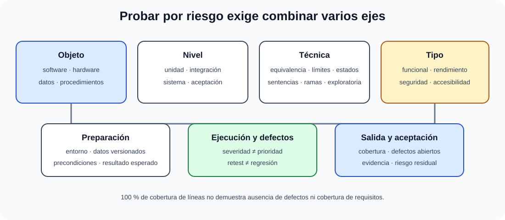

# Pruebas. Planificación y documentación. Utilización de datos de prueba. Pruebas de software, hardware, procedimientos y datos.

B3-T07 · Bloque 3 · Tema 7

Fuente: [GSI_A2 — BLOQUE III — APUNTES COMPLETOS V2.1 REVISADOS — ESTUDIO (15 temas)](https://docs.google.com/document/d/1eUTbZtV2Jj1Y8P_pjOP7Tk86chx1r9lPyLwuz3vBCec/edit) · III.07 · V2.1 · 2026-08-21

Cobertura oficial que debe quedar dominada: Planificación y documentación de las pruebas. Datos de prueba. Pruebas de software, hardware, procedimientos y datos.

## 1. Principios

Los principios de prueba pueden agruparse en tres ideas: probar reduce incertidumbre, pero no demuestra ausencia de defectos; la exhaustividad no es viable, por lo que conviene empezar pronto y concentrar el esfuerzo donde se acumulan fallos; y la estrategia debe adaptarse al contexto, renovar los casos para evitar pérdida de eficacia y comprobar que el producto satisface la necesidad, no solo que carece de errores conocidos.

## 2. Error, defecto y fallo

Error humano puede introducir defecto; el defecto ejecutado puede causar fallo. No son sinónimos.

## 3. Verificación y validación

Verificación evalúa producto de trabajo frente a especificación; validación evalúa adecuación a necesidad/uso. Revisiones estáticas también son testing/QA relevante sin ejecutar código.

## 4. Niveles

* unitarias/componente;
* integración;
* sistema;
* aceptación.

La pirámide de pruebas favorece muchas unitarias rápidas, menos integración y menos E2E costosas, adaptada al contexto.

## 5. Tipos

Funcionales, rendimiento/carga/estrés, seguridad, usabilidad/accesibilidad, compatibilidad, recuperación, instalación, regresión, smoke/sanity y resiliencia.

## 6. Caja negra

Particiones de equivalencia, valores límite, tablas de decisión, transición de estados, casos de uso.

## 7. Caja blanca

Cobertura de sentencias, ramas/decisiones, condiciones y caminos. 100% cobertura de líneas no significa ausencia de defectos.

## 8. TDD

Red → Green → Refactor. TDD es técnica de desarrollo guiada por tests unitarios, no sustituto de estrategia completa de pruebas.

## 9. Dobles de prueba

Dummy, stub, spy, mock y fake. El exceso de mocks acopla test a implementación.

## 10. Automatización

Tests deterministas, rápidos, aislados y con datos controlados. CI ejecuta suites. Gestionar flaky tests como defectos del sistema de pruebas.

## 11. Criterios de aceptación y salida

Cobertura de requisitos, defectos críticos abiertos, tasa de éxito, rendimiento, seguridad y riesgo residual. “Todos los tests pasan” no basta si faltan escenarios.

## 11.1 Plan de pruebas y documentación

### Estrategia de pruebas basada en riesgo y evidencia

_Ordena las dimensiones que deben aparecer en un plan de pruebas completo._

**Qué debes recordar:** Nivel, tipo, técnica y objeto son ejes distintos; la aceptación necesita evidencia y riesgo residual, no solo tests en verde.

La estrategia de pruebas debe cubrir planificación, condiciones, diseño, datos y entornos, ejecución, defectos, criterios de salida, informe y cierre.

Un plan identifica alcance, objetos de prueba, riesgos, niveles/tipos, técnicas, entornos, datos, roles, calendario, herramientas, criterios de entrada/salida, gestión de defectos y entregables. Los casos de prueba especifican precondiciones, datos, pasos, resultado esperado y trazabilidad. Un informe de cierre resume ejecución, cobertura, defectos abiertos y riesgo residual.

## 11.2 Datos de prueba

Los datos deben cubrir particiones, límites, excepciones y combinaciones. En sistemas con datos personales se prefieren datos sintéticos o anonimizados cuando sea viable; copiar producción a test sin control es un riesgo. La **seudonimización** puede seguir siendo dato personal. Es importante poder recrear datasets y conocer su versión.

## 11.3 Pruebas de hardware

El BOE las menciona expresamente. Incluyen aceptación y verificación de servidores/dispositivos, CPU/RAM, almacenamiento, interfaces, redundancia, sensores/periféricos, rendimiento, burn-in/estrés cuando proceda y comportamiento ante fallos. No se confunden con pruebas unitarias de software.

## 11.4 Pruebas de procedimientos

Comprueban que procedimientos operativos son ejecutables: alta/baja de usuarios, backup/restauración, recuperación ante desastre, escalado de incidencias, operación batch, cambio, parcheo, gestión de certificados, contingencia y actuación manual. Un runbook que nadie ha probado no es evidencia de recuperabilidad.

## 11.5 Pruebas de datos

Validan migraciones, integridad, completitud, exactitud, reconciliación, duplicados, formatos, reglas de negocio y calidad. En una migración: conteos origen/destino, sumas/control totals, muestreo de registros, claves/referencias, excepciones y trazabilidad de transformaciones.

## 11.6 Técnicas de diseño

| Caja negra | Caja blanca |
| --- | --- |
| partición de equivalencia | sentencias |
| valores límite | decisiones/ramas |
| tablas de decisión | condiciones |
| transición de estados | caminos / flujo de control |

También testing basado en experiencia: error guessing, exploratory testing y checklist, útil pero no sustituto de cobertura sistemática.

## 11.7 No funcionales

**Rendimiento:** carga, estrés, endurance/soak, volumen y capacidad. **Seguridad:** SAST/DAST, revisión, dependencias y pentest según riesgo. **Recuperación:** fallo y restauración real. **Accesibilidad:** automatización + revisión manual/teclado/lector según alcance. **Compatibilidad:** navegadores/dispositivos/versiones.

## 11.8 Gestión de defectos

Ciclo: registrar → clasificar severidad/prioridad → asignar → corregir → retest → cerrar/reabrir. **Severidad** refleja impacto; **prioridad** urgencia de resolución. La regresión comprueba que cambios no rompen lo existente; el retest confirma el defecto concreto.

## 11.9 Norma y proceso

ISO/IEC/IEEE 29119 es una familia de referencia para procesos/documentación/técnicas de pruebas. Para examen, prioriza conceptos sobre memorizar todos los números de parte salvo evidencia histórica de pregunta.

**Supuesto:** una estrategia excelente separa objeto (software/hardware/datos/procedimientos), nivel, tipo, técnica, entorno, datos, automatización, criterios y evidencia de aceptación.

## 12. Test

* Pruebas demuestran defectos, no su ausencia.
* Exhaustividad imposible.
* Unit ≠ integración ≠ sistema ≠ aceptación.
* Regresión ≠ re-test.
* Coverage ≠ calidad.
* TDD ≠ testing completo.

## 13. Supuesto

Define estrategia por riesgo, niveles, técnicas, entornos/datos, automatización, performance/security/accessibility, criterios de entrada/salida, gestión de defectos y trazabilidad requisitos→tests.

## 14. Resumen

Testing reduce riesgo. Diseña cobertura por riesgo y automatiza sin olvidar pruebas no funcionales y aceptación.

## Resumen de repaso

Fuente: [GSI_A2 — BLOQUE III — RESUMEN MAESTRO DE REPASO (15 temas)](https://docs.google.com/document/d/1l0nl4fc451Tl3XB9XZ4LRLZGLZEJxUueQvaMZoF8gcA/edit) · III.07

### Núcleo de estudio

Proceso de pruebas: estrategia/plan, diseño de casos, preparación de entorno/datos, ejecución, registro de defectos, re-prueba/regresión e informe. Niveles: unitarias, integración, sistema y aceptación. Técnicas de caja negra: particiones de equivalencia, valores límite, tablas de decisión, transición de estados; caja blanca: cobertura de sentencias, ramas y caminos con límites prácticos. Tipos no funcionales: rendimiento/carga/estrés, seguridad, compatibilidad, usabilidad, recuperación, accesibilidad. Hardware y procedimientos también pueden requerir pruebas. Datos de prueba deben ser representativos, controlados y preferentemente sintéticos/anonimizados si proceden de producción.

### Claves de test

Verificación pregunta si construimos correctamente; validación si construimos lo correcto. Error/defecto/fallo no son sinónimos estrictos. Smoke test valida estabilidad básica; regresión comprueba que cambios no rompen lo existente. 100% cobertura no garantiza ausencia de defectos.

### Enfoque para supuesto práctico

En supuesto crea matriz requisito-prueba, niveles, entorno similar a producción, automatización, rendimiento, seguridad, UAT y criterios de aceptación/salida. Trata datos personales en pruebas de forma explícita.

### Fuentes base del material

A1 096. Correspondencia DIRECTA.
