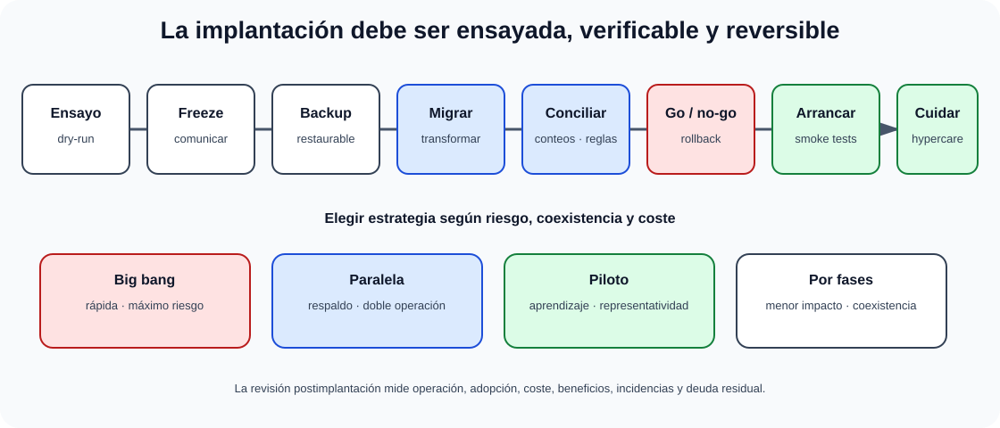

# Instalación y cambio. Estrategias de sustitución. Recepción e instalación. Evaluación post-implementación. Mantenimiento.

B3-T08 · Bloque 3 · Tema 8

Fuente: [03 — BLOQUE III — Desarrollo de sistemas — GSI A2](https://docs.google.com/document/d/1T28bNfTrftG0eCG2sX336DKKir-8ruVKnkhKMS0w7N0/edit) · III.08 · V2.1 · 2026-09-23

Cobertura oficial que debe quedar dominada: Estrategias de implantación, sustitución y cambio. Recepción e instalación. Evaluación postimplantación. Mantenimiento de sistemas.

## 1. Instalación

Preparación de entornos, configuración, datos, integraciones, certificados/secretos, observabilidad y validación. Todo debe poder repetirse y auditarse.

## 2. Migración

Inventario, mapeo de datos, limpieza, pruebas, reconciliación, ventana de cambio, rollback y validación. Estrategias: big bang, fases, paralelo y piloto.

## 3. Gestión del cambio

RFC/cambio → evaluación de impacto/riesgo → aprobación según modelo → planificación → ejecución → validación → cierre. Cambios estándar/preautorizados pueden agilizar operación.

## 4. Postimplantación

Hypercare, monitorización, soporte reforzado, métricas, incidencias, adopción, rendimiento y revisión post-implantación. Comparar beneficios reales con caso de negocio.

## 5. Mantenimiento

* correctivo;
* adaptativo;
* perfectivo/evolutivo;
* preventivo.

La deuda técnica aumenta coste futuro y debe gestionarse como riesgo/coste, no como categoría de mantenimiento separada necesariamente.

## 6. CMDB/configuración

Identificar elementos de configuración, versiones, relaciones y estado. CMDB no debe convertirse en inventario desactualizado: automatizar discovery cuando compense.

## 6.1 Estrategias de sustitución

Las cuatro estrategias clásicas de sustitución deben compararse por velocidad, coexistencia, reversibilidad, coste y riesgo operativo.

| Estrategia | Ventaja | Riesgo/coste |
| --- | --- | --- |
| directa / big bang | rápida, sin coexistencia | máximo riesgo; rollback crítico |
| paralela | comparación y respaldo | doble operación/coste; sincronización |
| piloto | aprendizaje en ámbito limitado | representatividad y posterior escalado |
| por fases | reduce impacto progresivamente | coexistencia e interfaces temporales |

## 6.2 Recepción

La recepción técnica comprueba entregables y criterios contractuales: software, código/artefactos, licencias, documentación, formación, pruebas, vulnerabilidades, inventario, configuración e infraestructura. Debe existir evidencia de aceptación y lista de defectos/condiciones pendientes.

## 6.3 Plan de cutover

### Cutover controlado y estrategias de sustitución

_Conecta la estrategia elegida con la secuencia operativa y la reversión._

**Qué debes recordar:** El punto de no retorno, la reconciliación y un rollback probado convierten una instalación en una transición gobernada.

Secuencia minuto/hora: congelación, backup, parada, exportación, migración, validación, cambio de DNS/rutas, arranque, smoke tests, comunicación y decisión go/no-go. Define **punto de no retorno** y pasos de rollback con responsables.

## 6.4 Evaluación postimplantación

Compara objetivos con resultados: disponibilidad, rendimiento, incidencias, adopción, satisfacción, costes y beneficios. Registra lecciones y deuda residual. Una implantación técnicamente correcta puede fracasar por adopción o soporte.

## 6.5 Organización del mantenimiento

Backlog de correctivos/evolutivos, SLA, priorización, releases, soporte L1/L2/L3, gestión de obsolescencia, parches, deuda técnica y fin de vida. Mantenimiento preventivo incluye refactorización, actualización y eliminación de riesgos antes del fallo.

## 6.6 Trampa histórica todavía examinable: MÉTRICA v3

## En el proceso MSI de MÉTRICA v3 se consideran mantenimiento correctivo y evolutivo; adaptativo y perfectivo quedan fuera de su ámbito. No confundas esta delimitación metodológica con la clasificación general de mantenimiento explicada arriba.

## 7. Test

* Instalación ≠ despliegue únicamente.
* Cambio ≠ release.
* Correctivo ≠ adaptativo.
* Rollback debe probarse.
* Postimplantación incluye adopción y operación.

## 8. Supuesto

Define plan de cutover, migración, backups, rollback, comunicaciones, soporte, métricas de éxito y revisión.

## 9. Resumen

Implantar es transferir un sistema a operación de forma controlada y reversible.

## Resumen de repaso

Fuente: [GSI_A2 — BLOQUE III — RESUMEN MAESTRO DE REPASO (15 temas)](https://docs.google.com/document/d/1l0nl4fc451Tl3XB9XZ4LRLZGLZEJxUueQvaMZoF8gcA/edit) · III.08

### Núcleo de estudio

Estrategias de conversión: directa/big bang, paralela, piloto y por fases. Directa es rápida pero arriesgada; paralela reduce riesgo a costa de coste/duplicidad; piloto limita alcance; fases permiten aprendizaje progresivo. Recepción incluye validación contractual/técnica, inventario, documentación y aceptación. Instalación requiere plan, ventanas, backups, rollback, comunicaciones y soporte reforzado. Post-implementación evalúa objetivos, incidencias, rendimiento, adopción y beneficios. Mantenimiento: correctivo, adaptativo, perfectivo/evolutivo y preventivo; gestiona deuda técnica, parches, obsolescencia y fin de soporte.

### Claves de test

Migración no es solo copiar datos; requiere transformación, reconciliación y validación. Piloto ≠ prototipo. Mantenimiento adaptativo responde al entorno; correctivo a defectos. Rollback debe probarse antes del cambio.

### Enfoque para supuesto práctico

En supuesto plantea plan de transición con dry-run, backup, freeze, sincronización, reconciliación, aceptación, rollback, hypercare y KPIs posteriores. Para legado, incluye convivencia e interfaces temporales.

### Fuentes base del material

A1 100 + 101 y materiales de migración/mantenimiento. Tema COMPLEMENTAR.
