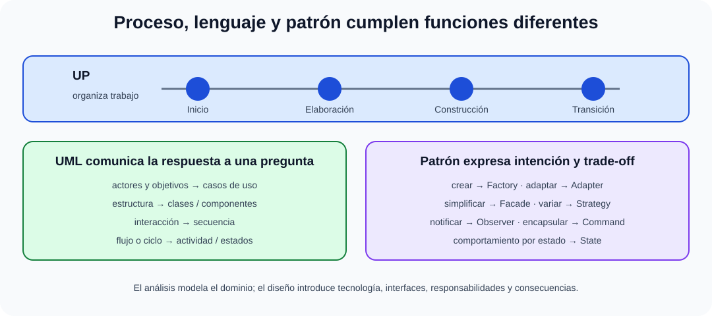

# Análisis y diseño orientado a objetos. Elementos. El proceso unificado de software. El lenguaje de modelado unificado (UML). Patrones de diseño.

B3-T09 · Bloque 3 · Tema 9

Fuente: [03 — BLOQUE III — Desarrollo de sistemas — GSI A2](https://docs.google.com/document/d/1T28bNfTrftG0eCG2sX336DKKir-8ruVKnkhKMS0w7N0/edit) · III.09 · V2.1 · 2026-09-23

Cobertura oficial que debe quedar dominada: Análisis y diseño orientado a objetos. Proceso Unificado, UML y patrones de diseño.

## 1. OO

Objeto = identidad, estado y comportamiento. Principios: abstracción, encapsulación, polimorfismo y composición/herencia. Alta cohesión y bajo acoplamiento son objetivos de diseño.

## 2. SOLID

SRP, OCP, LSP, ISP y DIP como heurísticas. No son leyes matemáticas ni obligan a crear muchas clases.

## 3. Proceso Unificado

Iterativo/incremental, dirigido por casos de uso, centrado en arquitectura y orientado a riesgos. Fases: Inicio, Elaboración, Construcción, Transición.

## 4. UML

<!-- editorial-supplement:B3-T09:01:start -->

### UML Profile, estereotipos y MOF

Un UML Profile especializa UML para un dominio sin crear un metamodelo independiente. Utiliza stereotypes (estereotipos), cuyas propiedades se denominaron históricamente tagged values, y constraints que restringen el modelado. MOF (Meta-Object Facility) es el estándar OMG para definir metamodelos y forma parte del ecosistema de metamodelado relacionado con UML.

<!-- editorial-supplement:B3-T09:01:end -->

Lenguaje de modelado, no metodología. Diagramas estructurales: clases, componentes, despliegue, paquetes. Comportamiento: casos de uso, actividad, estados; interacción: secuencia/comunicación.

## 5. Clases

Asociación, agregación, composición, generalización, dependencia, multiplicidad. Composición implica ciclo de vida fuertemente ligado; agregación es más débil.

## 6. Secuencia

Lifelines, mensajes, activaciones y fragmentos combinados. Útil para contratos e interacciones.

## 7. Patrones GoF

Creacionales: Factory Method, Abstract Factory, Builder, Prototype, Singleton. Estructurales: Adapter, Bridge, Composite, Decorator, Facade, Flyweight, Proxy. Comportamiento: Strategy, Observer, Command, State, Template Method, etc.

## 8. Patrones arquitectónicos

Layered, MVC, hexagonal/ports-adapters, event-driven, CQRS según necesidad. Patrón ≠ producto ni receta universal.

## 8.1 Análisis OO frente a diseño OO

El análisis identifica conceptos, responsabilidades y relaciones del dominio; el diseño traduce ese modelo a clases, componentes, interfaces y decisiones técnicas.

## 8.2 UP con más detalle

* **Inicio:** visión, alcance, caso de negocio y riesgos principales.
* **Elaboración:** arquitectura base ejecutable, requisitos/riesgos significativos.
* **Construcción:** completar funcionalidad incrementalmente.
* **Transición:** despliegue, formación, correcciones y aceptación.

Las disciplinas —requisitos, análisis/diseño, implementación, pruebas, despliegue, configuración/cambio, proyecto y entorno— aparecen con distinta intensidad a lo largo de las fases.

## 8.3 UML: qué muestra cada diagrama

### Proceso Unificado, UML y patrones: tres funciones distintas

_Evita confundir proceso de desarrollo, lenguaje de modelado y solución de diseño recurrente._

**Qué debes recordar:** UP organiza el trabajo, UML comunica modelos y un patrón resuelve un problema concreto con consecuencias que deben justificarse.

| Diagrama | Uso |
| --- | --- |
| casos de uso | actores y objetivos funcionales |
| clases | estructura estática del dominio/diseño |
| secuencia | mensajes ordenados temporalmente |
| actividad | flujo de trabajo/decisión |
| estados | ciclo de vida de una entidad/objeto |
| componentes | módulos e interfaces |
| despliegue | nodos/artefactos físicos/lógicos |

Relaciones: asociación, dependencia, generalización, realización; agregación/composición; multiplicidades. En test, **include** y **extend** de casos de uso suelen confundirse: include reutiliza comportamiento obligatorio común; extend añade comportamiento opcional/condicional al caso base.

## 8.4 Patrones: intención antes que nombre

**Factory** desacopla creación; **Adapter** hace compatibles interfaces; **Facade** simplifica subsistema; **Decorator** añade responsabilidades dinámicamente; **Strategy** intercambia algoritmo; **Observer** notifica cambios; **Command** encapsula solicitud; **State** cambia comportamiento según estado. Aprender problema→solución es más útil que memorizar una lista.

## 8.5 Microhechos UML de test

## En UML 2.x los diagramas de interacción incluyen secuencia, comunicación, visión general de interacción y tiempos (timing). Lifeline, activación y mensaje son elementos típicos de secuencia.

## Una dependencia puede aparecer cuando una clase usa a otra de forma no estructural, por ejemplo como tipo de parámetro. Observer es un patrón de comportamiento uno-a-muchos basado en notificación.

## 9. Test

* UML ≠ UP.
* Agregación ≠ composición.
* Strategy ≠ State aunque su estructura pueda parecerse.
* Facade simplifica interfaz; Adapter compatibiliza interfaces.
* Singleton introduce estado global y debe justificarse.

## 10. Supuesto

Usa diagramas únicamente si aclaran arquitectura: componentes/despliegue para solución, secuencia para integración, clases para dominio. Nombra patrones y explica problema que resuelven.

## 11. Resumen

OO organiza responsabilidades; UML comunica modelos; patrones capturan soluciones recurrentes.

## Resumen de repaso

Fuente: [GSI_A2 — BLOQUE III — RESUMEN MAESTRO DE REPASO (15 temas)](https://docs.google.com/document/d/1l0nl4fc451Tl3XB9XZ4LRLZGLZEJxUueQvaMZoF8gcA/edit) · III.09

### Núcleo de estudio

OO organiza software mediante objetos con estado y comportamiento. Conceptos: abstracción, encapsulación, herencia, polimorfismo, composición, interfaces, cohesión y acoplamiento. El Proceso Unificado es iterativo e incremental, dirigido por casos de uso y centrado en arquitectura; fases: inicio, elaboración, construcción y transición. UML es lenguaje de modelado, no metodología. Diagramas estructurales relevantes: clases, componentes, despliegue, paquetes; de comportamiento: casos de uso, actividad, estados, secuencia. Patrones GoF se agrupan en creacionales (Factory, Builder, Singleton...), estructurales (Adapter, Facade, Decorator...) y comportamiento (Strategy, Observer, Command...). Prioriza comprender intención y trade-offs.

### Claves de test

Herencia es relación “es-un”; composición “tiene-un”. UML no genera buen diseño por sí solo. Diagrama de secuencia muestra interacciones temporales; clases muestra estructura. Patrón ≠ framework ni algoritmo.

### Enfoque para supuesto práctico

En supuesto usa pocos diagramas pero informativos: contexto/casos de uso, componentes, despliegue, secuencia para integración. Aplica patrones solo si resuelven un problema explícito y justifica bajo acoplamiento/alta cohesión.

### Fuentes base del material

A1 089 + 090 + 092 + 093. Correspondencia DIRECTA.
