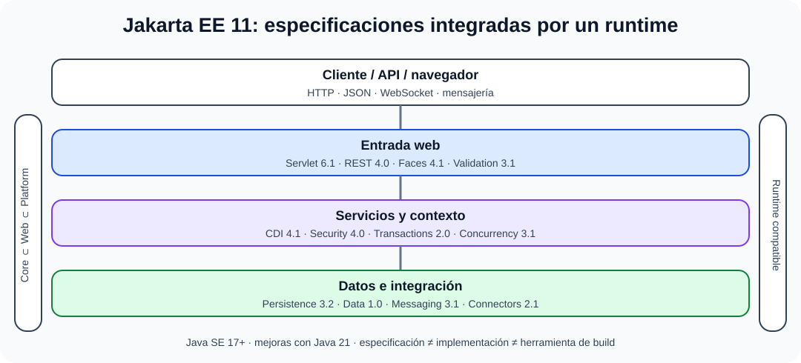

# La arquitectura Java EE/Jakarta EE. Características de funcionamiento. Elementos constitutivos. Productos y herramientas. Persistencia. Seguridad.

B3-T10 · Bloque 3 · Tema 10

Fuente: [GSI_A2 — BLOQUE III — APUNTES COMPLETOS V2.1 REVISADOS — ESTUDIO (15 temas)](https://docs.google.com/document/d/1eUTbZtV2Jj1Y8P_pjOP7Tk86chx1r9lPyLwuz3vBCec/edit) · III.10 · V2.1 · 2026-08-21

Cobertura oficial que debe quedar dominada: Plataforma Java EE/Jakarta EE: funcionamiento, elementos, productos y herramientas. Persistencia y seguridad.

## 1. Plataforma Java

Código fuente → bytecode → JVM. JDK incluye herramientas de desarrollo; JVM ejecuta bytecode; bibliotecas estándar completan plataforma. Java combina compilación y JIT.

## 2. Lenguaje

Tipado estático, OO/multiparadigma, GC, excepciones, genéricos, colecciones, lambdas/streams, concurrencia. Primitivos y referencias. equals() y hashCode() deben ser coherentes para colecciones hash.

## 3. JVM

Class loading, bytecode verification, memoria/heap/stacks, GC y JIT. GC libera memoria no alcanzable pero no sustituye cierre de recursos externos; try-with-resources gestiona AutoCloseable.

## 4. Concurrencia

Thread, Executor, futures, locks, concurrent collections. Java moderno añade virtual threads en Java 21, especialmente útiles para alta concurrencia con modelo thread-per-request en cargas bloqueantes; no aceleran CPU-bound por sí solas.

## 5. Jakarta EE 11

Plataforma empresarial actual. Soporta Java 17 o superior y mejoras con Java 21. Incluye CDI, REST, Persistence, Transactions, Validation, Security, Servlets, Faces y la nueva Jakarta Data, entre otras especificaciones. Managed Beans antiguos han sido retirados en favor de CDI.

## 6. CDI

Inyección de dependencias y gestión de ciclo/contextos. Favorece desacoplamiento y testabilidad.

## 7. Persistencia

Jakarta Persistence: entidades, EntityManager, relaciones, JPQL y transacciones. ORM no elimina necesidad de entender SQL, índices y N+1.

## 8. REST

Jakarta REST para APIs HTTP. Recursos, métodos, media types, filtros/interceptores. Seguridad y validación siguen siendo responsabilidades explícitas.

## 8.1 Productos y herramientas

Jakarta EE 11 es la plataforma final vigente de referencia y requiere Java SE 17 o superior; algunas especificaciones aprovechan capacidades de Java 21, como los hilos virtuales gestionados. Jakarta EE 12 continúa en desarrollo a 22/09/2026.

Categorías que el epígrafe exige reconocer: JDK y herramientas (javac, java, javadoc, jdeps/jlink según contexto); build/dependencias (Maven, Gradle); IDE (IntelliJ IDEA, Eclipse, VS Code como ejemplos); runtimes/servidores compatibles (Eclipse GlassFish, WildFly, Payara, Open Liberty como ejemplos de mercado, sin memorizar versiones comerciales).

## 8.2 Perfiles y componentes Jakarta EE 11

### Arquitectura y perfiles de Jakarta EE 11

_Sitúa las especificaciones por responsabilidad y alcance de perfil._

**Qué debes recordar:** Jakarta EE define especificaciones; el runtime las implementa. CDI, Persistence, Transactions, REST y Security cubren responsabilidades distintas.

**Core Profile** para runtimes pequeños/microservicios; **Web Profile** para aplicaciones web; **Platform** incluye el conjunto amplio. Especificaciones relevantes: Servlet 6.1, CDI 4.1, REST 4.0, Persistence 3.2, Transactions, Validation, Security 4.0, Messaging, WebSocket, JSON-P/JSON-B y Jakarta Data 1.0.

## 8.3 Persistencia en profundidad

Entidad con identidad, estado persistente y relaciones. EntityManager/persistence context controla ciclo; estados típicos new/transient, managed, detached, removed. **Lazy/eager**, cascadas y N+1 afectan rendimiento. Transacciones deben delimitar unidad de trabajo; JTA coordina en entornos empresariales cuando procede.

## 8.4 Seguridad

Autenticación y autorización declarativa/programática, roles, constraints, Security API, identidad externa/OIDC cuando arquitectura lo requiera, TLS, gestión de secretos, validación y protección de sesiones/tokens. El SecurityManager de Java SE no debe estudiarse como mecanismo actual de seguridad de Jakarta EE 11: la plataforma ha retirado sus referencias.

## 8.5 Mensajería y concurrencia

Jakarta Messaging desacopla productores/consumidores; transacciones y entrega deben entenderse según broker/configuración. Jakarta Concurrency gestiona tareas/hilos de forma integrada con el runtime, evitando crear hilos arbitrarios sin control del contenedor en aplicaciones empresariales.

## 8.6 Datos de test adicionales

* Jakarta EE 11 ≠ Java SE 11.
* JPA/Persistence ≠ JDBC; JPA suele usar acceso relacional subyacente pero añade ORM.
* Maven/Gradle son herramientas de build, no servidores.
* GlassFish/WildFly/Payara/Open Liberty son implementaciones/runtimes, no especificaciones.
* Java EE cambió de namespace javax.\* a jakarta.\* en la evolución de la plataforma.

## 9. Test

* JDK ≠ JVM.
* Java ≠ JavaScript.
* GC ≠ gestión automática de todos los recursos.
* Jakarta EE es evolución de Java EE.
* CDI ≠ JPA.
* Virtual thread ≠ proceso.

## 10. Supuesto

Diseña capas/servicios, CDI, JPA, REST, transacciones, validación, seguridad, pool/conexiones, observabilidad y despliegue en runtime compatible.

## 11. Resumen

Domina Java/JVM y componentes empresariales Jakarta EE 11; evita memorizar APIs retiradas como si fueran actuales.

## Resumen de repaso

Fuente: [GSI_A2 — BLOQUE III — RESUMEN MAESTRO DE REPASO (15 temas)](https://docs.google.com/document/d/1l0nl4fc451Tl3XB9XZ4LRLZGLZEJxUueQvaMZoF8gcA/edit) · III.10

### Núcleo de estudio

Jakarta EE es la evolución abierta de Java EE para aplicaciones empresariales sobre Java. Arquitectura típica multicapa con web/API, servicios de negocio y persistencia gestionados por contenedor. Especificaciones relevantes: Servlet, RESTful Web Services, CDI, Persistence (JPA), Transactions, Validation, Security, Messaging, WebSocket, JSON-P/JSON-B y otras según perfil. Persistencia JPA mapea entidades a bases relacionales y usa contexto de persistencia/transacciones. CDI gestiona inyección y ciclo de vida. Seguridad integra autenticación/autorización con mecanismos del contenedor y aplicación. Servidores compatibles incluyen GlassFish, Payara, WildFly y Open Liberty, entre otros.

### Claves de test

Java EE y Jakarta EE cambian namespace de javax.\* a jakarta.\* desde Jakarta EE 9. Jakarta EE 11 es la plataforma final vigente en 2026 y requiere Java SE 17 o superior; añade Jakarta Data y elimina tecnologías antiguas del núcleo. JPA es especificación, Hibernate una implementación popular.

### Enfoque para supuesto práctico

En supuesto selecciona API REST, CDI, JPA, transacciones, seguridad, mensajería y despliegue; evita EJB pesado por inercia si no aporta valor. Separa estado, configura pools y observabilidad.

### Actualización 2026

Actualización 2026: Jakarta EE 11 es la versión final estable; Jakarta EE 12 está en desarrollo.

### Fuentes base del material

A1 067 + documentación oficial Jakarta EE.
