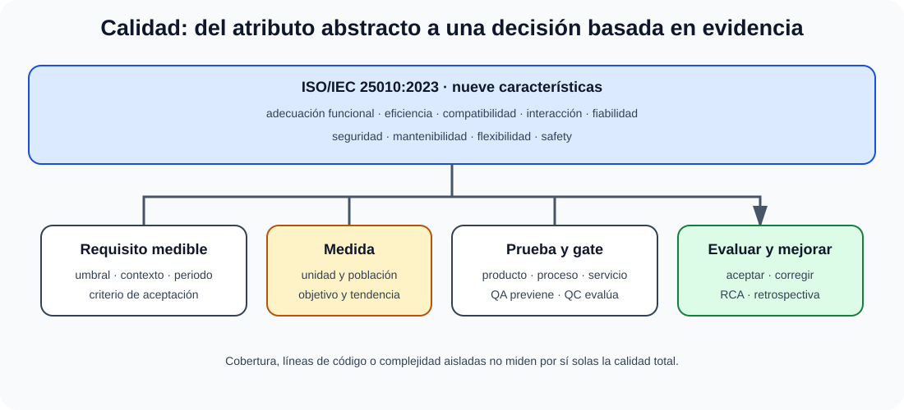

# La calidad del software y su medida. Modelos, métricas, normas y estándares.

B3-T13 · Bloque 3 · Tema 13

Fuente: [03 — BLOQUE III — Desarrollo de sistemas — GSI A2](https://docs.google.com/document/d/1T28bNfTrftG0eCG2sX336DKKir-8ruVKnkhKMS0w7N0/edit) · III.13 · V2.1 · 2026-09-23

Cobertura oficial que debe quedar dominada: Calidad del software y medición: modelos, métricas, normas y estándares.

## 1. Calidad

Grado en que producto satisface necesidades/requisitos bajo condiciones. Distingue quality assurance (proceso/preventivo) y quality control (evaluación del producto).

## 2. ISO/IEC 25010:2023

La edición 2023 reemplaza a 2011 y define un modelo de calidad de producto con **9 características**. El examen puede contener material antiguo, pero el apunte debe reflejar estándar vigente y señalar transición.

Las características vigentes incluyen adecuación funcional, eficiencia de desempeño, compatibilidad, capacidad de interacción, fiabilidad, seguridad, mantenibilidad, flexibilidad y safety; cada una se subdivide. Para estudiar, importa entender que el modelo sirve para especificar, medir y evaluar calidad durante el ciclo.

## 3. Métricas

Producto: tamaño, complejidad, duplicación, cobertura, defect density, deuda técnica, rendimiento. Proceso: lead/cycle time, defect escape, change failure rate. Servicio: disponibilidad, latencia, error rate, SLO.

## 4. Complejidad ciclomática

McCabe mide caminos independientes del grafo de control; una formulación común V(G)=E−N+2P o decisiones+1 para componente simple. Alta complejidad incrementa dificultad de prueba/mantenimiento, pero el número no debe usarse aislado.

## 5. Mantenibilidad

Modularidad, analizabilidad, modificabilidad, testabilidad y reutilización según modelo/edición aplicable. Reducir acoplamiento, aumentar cohesión, pruebas y documentación.

## 6. Calidad en proceso

Definition of Done, reviews, lint/static analysis, testing, quality gates, gestión de deuda, RCA y mejora continua.

## 6.1 SQuaRE y modelos de calidad

ISO/IEC 25010:2023 es la edición vigente del modelo de calidad de producto y define nueve características; SQuaRE conecta requisitos, medidas, evaluación y mejora.

La familia **SQuaRE (ISO/IEC 25000)** organiza requisitos y evaluación de calidad. Para estudiar no es necesario memorizar todas las partes, pero sí entender la cadena: definir modelo/requisitos → seleccionar medidas → evaluar → aceptar/mejorar.

## 6.2 Nueve características de ISO/IEC 25010:2023

### De los atributos de calidad a la evidencia

_Evita memorizar el modelo sin conectarlo con medidas, aceptación y operación._

**Qué debes recordar:** Una métrica necesita definición, unidad, periodo y objetivo; cobertura o complejidad aisladas no equivalen a calidad total.

Functional suitability, performance efficiency, compatibility, interaction capability, reliability, security, maintainability, flexibility y safety. La terminología de 2023 cambia respecto a material 2011: por eso en test hay que saber identificar qué edición se pregunta.

## 6.3 Métricas de producto

* densidad de defectos;
* complejidad ciclomática;
* duplicación;
* acoplamiento/cohesión;
* cobertura;
* tiempo de respuesta/throughput;
* disponibilidad y tasa de error;
* vulnerabilidades por severidad/edad.

Una métrica debe tener definición, unidad, población, periodo y objetivo. Comparar proyectos distintos con “líneas de código” sin contexto es una mala práctica.

## 6.4 Métricas de proceso/entrega

Lead time, deployment frequency, change failure rate, mean time to restore (con cautela sobre definiciones), defect escape rate y tiempo de resolución. Las métricas DORA pueden orientar entrega, pero no sustituyen calidad funcional ni seguridad.

## 6.5 QA, QC y mejora

**QA** diseña procesos preventivos: estándares, revisiones, formación, pipeline, auditoría. **QC** evalúa producto: pruebas, inspecciones y mediciones. RCA, retrospectivas y mejora continua cierran el ciclo.

## 6.6 Modelos de proceso

EFQM/ISO 900x pueden aparecer en tus fuentes como calidad organizativa/servicio, pero el epígrafe GSI aquí se centra en **software y medición**. Se conservan solo como contexto, evitando convertir III.13 en el tema A1 completo de calidad organizativa.

## 6.7 Microhechos oficiales de calidad y medición

## GQM: Goal = nivel conceptual; Question = nivel operacional; Metric = nivel cuantitativo.

## Los puntos de función miden tamaño funcional del software.

## CMMI: 0 Incomplete, 1 Initial, 2 Managed, 3 Defined, 4 Quantitatively Managed y 5 Optimizing. “Aprobado” no es un nivel.

## En ISO/IEC 25010, la tolerancia a fallos pertenece a fiabilidad. La OEP 2019 preguntó sobre la edición 2011, donde Portabilidad era característica de primer nivel; para actualidad prevalece ISO/IEC 25010:2023 con nueve características.

## 7. Test

* QA ≠ QC.
* ISO/IEC 25010:2023 es edición actual.
* Cobertura ≠ ausencia de defectos.
* Complejidad ≠ calidad total.
* Métrica sin objetivo/contexto puede inducir comportamientos perversos.

## 8. Supuesto

Convierte calidad en NFR medibles: disponibilidad, p95, errores, seguridad, accesibilidad, mantenibilidad y criterios de aceptación. Añade quality gates y SLO.

## 9. Resumen

Calidad debe especificarse y medirse. Actualiza el modelo a ISO/IEC 25010:2023 y usa métricas con contexto.

## Resumen de repaso

Fuente: [GSI_A2 — BLOQUE III — RESUMEN MAESTRO DE REPASO (15 temas)](https://docs.google.com/document/d/1l0nl4fc451Tl3XB9XZ4LRLZGLZEJxUueQvaMZoF8gcA/edit) · III.13

### Núcleo de estudio

Calidad debe definirse y medirse desde requisitos. ISO/IEC 25010:2023 actualiza el modelo de calidad de producto a nueve características: adecuación funcional, eficiencia de desempeño, compatibilidad, capacidad de interacción, fiabilidad, seguridad, mantenibilidad, flexibilidad y seguridad funcional/safety. Métricas pueden ser de producto (complejidad, defectos, cobertura), proceso (lead time, tasa de defectos, retrabajo) y servicio (disponibilidad, latencia, error rate), siempre vinculadas a objetivos. ISO 9001 aporta gestión de calidad organizativa; familia SQuaRE estructura evaluación de calidad de sistemas/software. Calidad interna, externa y en uso se relacionan pero no son idénticas.

### Claves de test

La edición ISO/IEC 25010:2011 tenía ocho características y quedó sustituida por la edición 2023. Cobertura de código no mide por sí sola calidad. Disponibilidad puede expresarse como tiempo disponible/tiempo total; fiabilidad no es solo rendimiento.

### Enfoque para supuesto práctico

En supuesto define atributos medibles: disponibilidad, p95 de respuesta, tasa de error, cobertura, vulnerabilidades, accesibilidad, mantenibilidad. Incluye quality gates y aceptación basada en SLA/SLO y pruebas.

### Actualización 2026

Actualización 2026: estudiar la edición ISO/IEC 25010:2023, no quedarse exclusivamente con el modelo 2011.

### Fuentes base del material

A1 103 es la fuente actual correcta; no usar A1 050 de mapeos antiguos. ISO/IEC 25010:2023.
