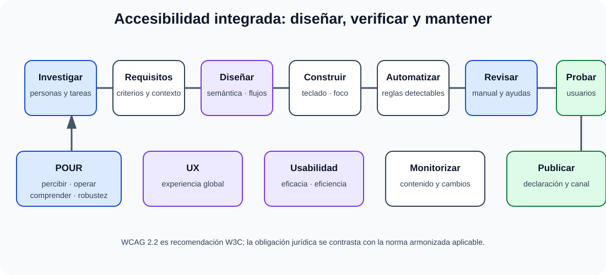

# Accesibilidad, diseño universal y usabilidad. Accesibilidad y usabilidad de las tecnologías, productos y servicios relacionados con la sociedad de la información. Experiencia de Usuario o UX. La Guía de comunicación digital de la Administración del Estado.

B3-T14 · Bloque 3 · Tema 14

Fuente: [GSI_A2 — BLOQUE III — APUNTES COMPLETOS V2.1 REVISADOS — ESTUDIO (15 temas)](https://docs.google.com/document/d/1eUTbZtV2Jj1Y8P_pjOP7Tk86chx1r9lPyLwuz3vBCec/edit) · III.14 · V2.1 · 2026-08-21

Cobertura oficial que debe quedar dominada: Accesibilidad y diseño universal; usabilidad de productos/servicios tecnológicos; experiencia de usuario; guía de comunicación digital de la AGE.

## 1. Accesibilidad

Diseñar para que personas con distintas capacidades puedan percibir, operar, entender e interactuar. No es una “adaptación al final”.

## 2. Marco

En sector público español: RD 1112/2018 y marco europeo/EN 301 549. La referencia armonizada actualmente emplea WCAG 2.1 en gran parte; W3C recomienda WCAG 2.2 para máxima aplicabilidad futura. Distingue obligación vigente y recomendación técnica más reciente.

## 3. WCAG

Principios POUR: Perceptible, Operable, Understandable, Robust. Niveles A, AA y AAA. WCAG 2.2 añade criterios de foco, dragging, tamaño de objetivo, ayuda consistente, entrada redundante y autenticación accesible.

## 4. Prácticas

* HTML semántico;
* teclado completo;
* focus visible/no oculto;
* alternativas textuales;
* subtítulos/transcripciones;
* contraste;
* labels y errores comprensibles;
* ARIA solo cuando HTML nativo no basta;
* reflow/zoom;
* no depender solo de color.

## 5. Usabilidad

Eficacia, eficiencia y satisfacción en contexto. Heurísticas, pruebas con usuarios, análisis de tareas, consistencia, feedback, prevención/recuperación de errores.

## 6. UX

Experiencia global antes/durante/después. Incluye utilidad, usabilidad, accesibilidad, confianza y percepción. UX ≠ diseño visual.

## 7. Investigación

Entrevistas, analytics, journey maps, prototipos, usability testing y métricas. Diseñar con usuarios reales evita asumir necesidades.

## 8. Comunicación digital AGE

Aplicar identidad, claridad, lenguaje comprensible, consistencia, accesibilidad y patrones oficiales vigentes. No memorizar capturas antiguas de una guía si cambian; priorizar principios y versión vigente.

## 8.1 Marco jurídico-técnico en sector público

En el sector público español, el RD 1112/2018 exige integrar accesibilidad durante diseño, gestión y mantenimiento. La presunción de conformidad se vincula a la norma armonizada publicada; WCAG 2.2 es la recomendación W3C más reciente, pero no debe confundirse automáticamente con la referencia jurídica aplicable.

## 8.2 Conformidad y evaluación

### Accesibilidad, usabilidad y UX durante todo el ciclo

_Integra cumplimiento técnico, facilidad de uso y experiencia sin tratarlos como sinónimos._

**Qué debes recordar:** Accesibilidad se verifica con herramientas y revisión humana; usabilidad mide tareas en contexto y UX abarca la experiencia global.

WCAG organiza criterios bajo POUR y niveles A/AA/AAA. Evaluar accesibilidad requiere combinación de herramienta automática, revisión manual, teclado, foco, lector de pantalla cuando proceda, zoom/reflow, contraste, multimedia y formularios. La automatización detecta solo una parte.

## 8.3 Declaración y mecanismo de comunicación

Los servicios públicos deben prever declaración de accesibilidad y mecanismos de comunicación/queja conforme al marco aplicable. La accesibilidad se gestiona como proceso: evaluación inicial, corrección, monitorización y actualización cuando cambia contenido o tecnología.

## 8.4 Diseño universal

Busca que producto sea utilizable por el mayor número posible de personas sin adaptación específica, complementado con ajustes cuando sean necesarios. Principios prácticos: múltiples modos de interacción, tolerancia a errores, información perceptible, bajo esfuerzo, tamaño/espacio adecuados y flexibilidad.

## 8.5 Usabilidad

ISO 9241-11 es una referencia conceptual: eficacia, eficiencia y satisfacción en un contexto de uso. Métodos: evaluación heurística, walkthrough, pruebas moderadas/no moderadas, success rate, tiempo de tarea, errores y SUS como ejemplo de cuestionario. Usabilidad no garantiza accesibilidad ni viceversa.

## 8.6 UX

Research → definición de problema → arquitectura de información/flujos → prototipo → prueba → iteración. Personas y journey maps son herramientas, no entregables obligatorios. Diseñar con evidencia evita “usuario promedio” ficticio.

## 8.7 Guía de comunicación digital AGE

Debe estudiarse desde la versión vigente disponible en la AGE: identidad, consistencia, lenguaje claro, arquitectura de información, componentes/patrones, accesibilidad y comunicación. Evita memorizar capturas o URLs que cambian; prioriza principios, responsabilidades y patrones estables.

## 8.8 Trampas

* WCAG 2.2 no “deroga” WCAG 2.1.
* AA no significa cumplir algunos criterios A y AA: requiere satisfacer todos los aplicables de A y AA.
* ARIA no arregla HTML incorrecto; primera regla práctica: usar semántica nativa.
* Accesibilidad ≠ solo discapacidad visual.
* UX ≠ UI estética.

## 9. Test

* Accesibilidad ≠ usabilidad.
* UX ≠ UI.
* ARIA no sustituye HTML semántico.
* A/AA/AAA son niveles de conformidad.
* Automatización no detecta todos los problemas de accesibilidad.

## 10. Supuesto

Incluye accesibilidad desde requisitos, componentes accesibles, testing automático+manual+usuarios, declaración de accesibilidad, feedback y monitorización.

## 11. Resumen

Diseño universal, WCAG, usabilidad y UX deben integrarse desde requisitos hasta pruebas.

## Resumen de repaso

Fuente: [GSI_A2 — BLOQUE III — RESUMEN MAESTRO DE REPASO (15 temas)](https://docs.google.com/document/d/1l0nl4fc451Tl3XB9XZ4LRLZGLZEJxUueQvaMZoF8gcA/edit) · III.14

### Núcleo de estudio

Accesibilidad busca que productos/servicios puedan ser utilizados por personas con capacidades diversas; diseño universal intenta que sean utilizables por el mayor número desde el origen. Usabilidad se centra en efectividad, eficiencia y satisfacción en contexto; UX abarca percepción y experiencia global antes, durante y después. En AAPP, RD 1112/2018 regula accesibilidad de sitios web y apps móviles del sector público. La referencia técnica europea se articula mediante EN 301 549 y criterios WCAG; WCAG 2.2 es la recomendación W3C más reciente, aunque el cumplimiento jurídico debe verificarse contra la versión armonizada aplicable. Principios WCAG: perceptible, operable, comprensible y robusto (POUR). La Guía de comunicación digital de la AGE aborda diseño, contenidos, identidad y accesibilidad.

### Claves de test

Accesibilidad no es solo contraste ni discapacidad visual; AA es el nivel habitual de referencia en web pública. Texto alternativo depende de función de imagen; teclado, foco, estructura semántica, formularios y errores son críticos. UX ≠ estética.

### Enfoque para supuesto práctico

En supuesto incorpora accesibilidad como requisito y criterio de aceptación: auditoría automática + manual, teclado, lector de pantalla, responsive, lenguaje claro, declaración de accesibilidad y pruebas con usuarios.

### Actualización 2026

Actualización 2026: WCAG 2.2 es recomendación W3C; no afirmar automáticamente que toda su versión sea requisito jurídico sin revisar estándar armonizado aplicable.

### Fuentes base del material

A1 044 + 094 + 133, RD 1112/2018, EN 301 549 y WCAG.
