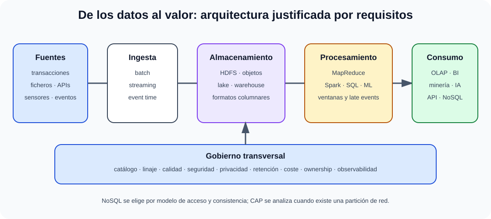

# Minería de datos. Aplicación a la resolución de problemas de gestión. Tecnología y algoritmos. Procesamiento analítico en línea (OLAP). Big data. Entornos Hadoop o similares. Bases de datos NoSQL.

B3-T15 · Bloque 3 · Tema 15

Fuente: [03 — BLOQUE III — Desarrollo de sistemas — GSI A2](https://docs.google.com/document/d/1T28bNfTrftG0eCG2sX336DKKir-8ruVKnkhKMS0w7N0/edit) · III.15 · V2.1 · 2026-09-23

Cobertura oficial que debe quedar dominada: Minería de datos: planteamiento y resolución de problemas, tecnologías y algoritmos. OLAP, Big Data, Hadoop o entornos similares y bases de datos NoSQL.

## 1. Minería de datos

Descubre patrones/modelos en datos. Tareas: clasificación, regresión, clustering, asociación, anomalías y reducción dimensional.

## 2. Proceso

Entender negocio → entender datos → preparar → modelar → evaluar → desplegar/monitorizar. CRISP-DM es referencia clásica.

## 3. OLAP

Analítica multidimensional, cubos, dimensiones/jerarquías/medidas; slice, dice, drill-down, roll-up, pivot. Se relaciona con BI del II.04.

## 4. Big Data

Volumen, velocidad, variedad, veracidad y valor como marco habitual. Lo importante es cuándo arquitectura distribuida aporta valor respecto a BD/warehouse convencional.

## 5. Hadoop

El BOE lo exige. Ecosistema clásico: HDFS para almacenamiento distribuido, YARN para recursos y MapReduce para procesamiento batch. HDFS replica bloques y favorece data locality. Hadoop no equivale a todo Big Data.

## 6. Spark

Motor distribuido general, procesamiento en memoria cuando es posible, batch/streaming/SQL/ML. Puede usar HDFS u otros almacenamientos.

## 7. NoSQL

| Familia | Uso típico |
| --- | --- |
| clave-valor | caché/sesiones/lookup simple |
| documental | documentos JSON-like y esquema flexible |
| columnar wide-column | gran escala distribuida por claves |
| grafos | relaciones y recorridos |

## 8. CAP

Ante partición de red, un sistema distribuido debe priorizar consistencia o disponibilidad en ese contexto. CAP no significa elegir permanentemente “dos de tres” sin matices.

## 9. Consistencia

Fuerte, eventual y modelos intermedios. BASE se contrasta a menudo con ACID, pero no son normas mutuamente excluyentes.

## 10. Lake, warehouse y lakehouse

Data lake almacena datos heterogéneos en formatos flexibles; warehouse modela datos curados para BI; lakehouse intenta combinar almacenamiento abierto con capacidades de gestión/tabla/SQL. Seleccionar por necesidades, no moda.

## 11. Gobierno

Catálogo, linaje, calidad, privacidad, retención, seguridad, costes y ownership. En plataformas masivas, gobernanza es requisito arquitectónico.

## 11.1 Algoritmos de minería

Las tareas de minería deben asociarse con algoritmos y métricas adecuados al objetivo, la distribución de datos y el coste de los errores.

| Tarea | Algoritmos/conceptos | Métrica típica |
| --- | --- | --- |
| clasificación | árboles, regresión logística, SVM, k-NN, redes | precision, recall, F1, ROC-AUC según caso |
| regresión | lineal, árboles/ensembles | MAE, RMSE, R² |
| clustering | k-means, jerárquico, DBSCAN | silhouette + validación de negocio |
| asociación | Apriori/FP-Growth | support, confidence, lift |
| anomalías | estadísticos, isolation forest, densidad | precision/recall con fuerte desbalance |

## 11.2 Preparación de datos

Limpieza, missing values, outliers, codificación, escalado, selección/creación de features y partición train/validation/test. Evita **data leakage**: información del futuro/test no debe influir entrenamiento/preprocesamiento.

## 11.3 Hadoop con más detalle

**HDFS:** NameNode gestiona namespace/metadatos; DataNodes almacenan bloques; replicación para tolerancia. **YARN:** gestión de recursos/ejecución. **MapReduce:** map → shuffle/sort → reduce para batch. La arquitectura clásica favorece mover cómputo hacia datos.

## 11.4 Ecosistema “o similares”

Spark ofrece ejecución distribuida y APIs para batch/SQL/streaming/ML; Kafka u otros logs/brokers se usan para ingestión/event streaming; almacenamiento de objetos y formatos columnares Parquet/ORC son comunes. Son ejemplos actuales, no sustitutos de los conceptos Hadoop del BOE.

## 11.5 NoSQL: modelo de acceso

**Key-value:** acceso por clave. **Documental:** agregados JSON-like. **Wide-column:** distribución masiva por claves/column families. **Grafo:** relaciones/recorridos. Diseña a partir de consultas y consistencia; no migres de relacional solo por volumen.

## 11.6 Particionado y replicación

Sharding distribuye datos por clave/rango/hash; una mala clave crea hot spots. Replicación mejora lectura/disponibilidad pero introduce lag/consistencia y gestión de fallos. CAP se analiza cuando existe partición, no como lema aislado de “elige dos”.

## 11.7 Batch vs streaming

### Plataforma de datos: de la ingesta al valor

_Relaciona tecnologías con función, latencia, modelo de acceso y gobierno._

**Qué debes recordar:** Hadoop no es todo Big Data y NoSQL no sustituye por defecto al modelo relacional: cada pieza debe justificarse por requisitos.

Batch procesa conjuntos finitos; streaming procesa eventos continuos. Conceptos: event time vs processing time, ventanas, late events, exactly-once como propiedad compleja que depende de extremo a extremo, no una casilla mágica del broker.

## 11.8 Supuesto

Empieza por volumen/velocidad/variedad y SLA. Propón ingestión, almacenamiento, procesamiento batch/stream, catálogo/linaje, calidad, seguridad, retención, costes y consumo. Justifica cada tecnología por requisito y planifica observabilidad del pipeline.

## 11.9 Microhechos oficiales de Big Data y NoSQL

## Sharding = particionado horizontal/distribución de datos entre nodos o servidores; en MongoDB es una técnica de escalado horizontal. MongoDB almacena documentos BSON.

## Spark es un motor open source de procesamiento distribuido para cargas Big Data.

## La validación cruzada es una técnica de evaluación de la capacidad de generalización de un modelo, no un método de sobreajuste.

## Neo4j es una base de datos orientada a grafos; HBase, BigTable y Cassandra pertenecen a familias wide-column.

## 12. Test

* Hadoop ≠ HDFS.
* HDFS ≠ base de datos.
* NoSQL ≠ “sin SQL” necesariamente; significa familia no relacional.
* CAP aparece ante partición.
* Data lake ≠ warehouse.
* OLAP ≠ data mining.

## 13. Supuesto

Justifica volumen/velocidad/variedad, ingestión, almacenamiento, batch/stream, procesamiento, catálogo, seguridad, costes y consumidores. No propongas Hadoop/Spark si una BD convencional resuelve mejor.

## 14. Resumen

Big Data es arquitectura distribuida por necesidad; Hadoop sigue siendo materia de examen, mientras NoSQL se elige según modelo de acceso/consistencia.

15. Memorización transversal del Bloque III

| Concepto | Clave |
| --- | --- |
| Ciclo vs metodología | qué/cuándo vs cómo |
| Scrum | PO / SM / Developers |
| Kanban | flujo + WIP |
| Requisito bueno | claro, verificable, trazable |
| Pila / cola | LIFO / FIFO |
| CI / CD | integración / entrega-despliegue |
| Testing | unit / integration / system / acceptance |
| UP | Inicio / Elaboración / Construcción / Transición |
| UML | lenguaje, no metodología |
| Jakarta EE | 11 actual; Java 17+ |
| .NET | 10 LTS actual en 2026 |
| ISO 25010 | edición 2023, 9 características |
| WCAG | POUR; A/AA/AAA |
| Hadoop | HDFS + YARN + MapReduce como núcleo clásico |
| CAP | decisión C/A cuando hay partición |

15.1 Estrategia de estudio

**Muy alta prioridad de supuesto:** III.02, III.03, III.04, III.06, III.07, III.09, III.12 y III.14. Practicar diagramas, pipelines, requisitos, modelos de datos, estrategia de pruebas y web segura/accesible.

**Primera vuelta:** comprender. **Segunda:** comparar conceptos cercanos. **Tercera:** test + mini-supuestos de 15–20 minutos.

16. Fuentes y control de actualidad

Jerarquía de autoridad: el BOE define el alcance; PreparaTIC aporta la base de estudio; cuando una fuente A1 no cubre o está desactualizada, la ampliación se marca como complemento GSI y se contrasta con documentación oficial del estándar/plataforma. Las versiones concretas se incluyen solo para corregir obsolescencia, no como sustituto de los conceptos estables.

* BOE-A-2025-26262, Anexo IX, Bloque III.
* PreparaTIC A1 según mapa maestro: 086, 088, 037, 094, 091, 063/064, 070/071/076, 097/102, 096, 101/100, 089/090/093, 067, 066, 065, 103, 044/133, 075.
* Jakarta EE 11 — Eclipse Foundation; Java 17+.
* Microsoft .NET Support Policy: .NET 10 LTS es la referencia de esta revisión; las fechas de fin de soporte próximas deben comprobarse en la política vigente.
* ISO/IEC 25010:2023 — modelo de calidad de producto, 9 características.
* W3C WCAG 2.2 — recomendación actual; EN 301 549 mantiene referencia jurídica técnica que debe comprobarse según versión aplicable.

**Control de actualidad: 23/09/2026. Auditoría oficial OEP 2018-2025 y vigencia técnica completada.**

## Resumen de repaso

Fuente: [GSI_A2 — BLOQUE III — RESUMEN MAESTRO DE REPASO (15 temas)](https://docs.google.com/document/d/1l0nl4fc451Tl3XB9XZ4LRLZGLZEJxUueQvaMZoF8gcA/edit) · III.15

### Núcleo de estudio

Minería de datos descubre patrones útiles mediante preparación, modelado y evaluación. Tareas: clasificación, regresión, clustering, reglas de asociación, detección de anomalías y reducción de dimensión. Flujo CRISP-DM: comprensión del negocio, datos, preparación, modelado, evaluación y despliegue. Big Data se caracteriza por volumen, velocidad, variedad y otras “V”; arquitecturas distribuidas separan almacenamiento y cómputo. Hadoop clásico incluye HDFS y MapReduce, con ecosistema; hoy convive con motores como Spark. NoSQL: clave-valor, documental, columna ancha y grafos; priorizan escalabilidad/modelos flexibles con distintos compromisos de consistencia. OLAP sigue siendo clave para analítica multidimensional.

### Claves de test

NoSQL no significa “sin SQL” ni ausencia de esquema; CAP aplica bajo particiones de red y expresa trade-offs entre consistencia y disponibilidad. MapReduce ≠ base de datos. Clasificación es supervisada; clustering normalmente no supervisado.

### Enfoque para supuesto práctico

En supuesto empieza por caso de uso y volumen real; define ingesta, lake/warehouse, procesamiento batch/stream, calidad, catálogo, seguridad, retención, BI/ML y gobierno. Evita Hadoop si una solución relacional cubre el problema.

### Fuentes base del material

A1 075 + 071 y materiales Big Data/IA del RELEASE.

## Fuentes oficiales de actualización

* [Programa oficial GSI A2 — BOE-A-2025-26262](https://www.boe.es/diario_boe/txt.php?id=BOE-A-2025-26262)
* [Jakarta EE 11 — especificación oficial](https://jakarta.ee/specifications/platform/11/)
* [.NET — releases y soporte](https://learn.microsoft.com/en-us/dotnet/core/releases-and-support)
* [ISO/IEC 25010:2023 — ficha oficial](https://www.iso.org/standard/78176.html)
* [WCAG 2.2 — W3C](https://www.w3.org/TR/WCAG22/)

Edición de trabajo GSI A2. Los materiales del otro proyecto GSI\_B1 no se han utilizado como fuente.
