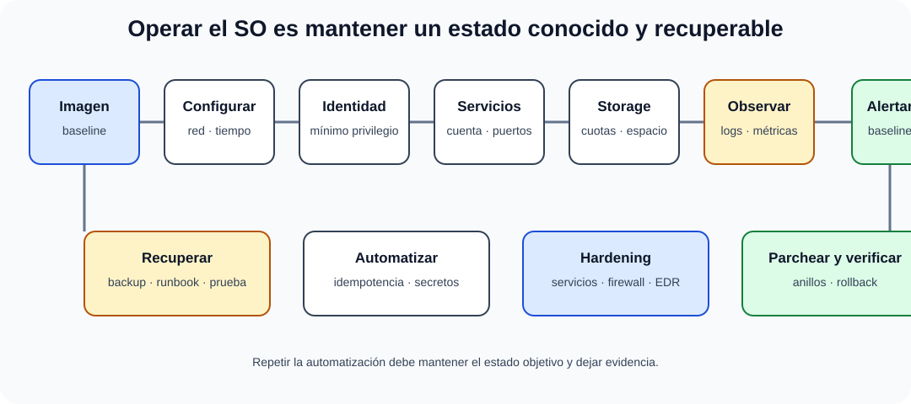

# Administración del Sistema operativo y software de base.

B4-T01 · Bloque 4 · Tema 1

Fuente: [GSI_A2 — BLOQUE IV — APUNTES COMPLETOS V2.1 REVISADOS — ESTUDIO (16 temas)](https://docs.google.com/document/d/1FMunz530TBBQnal_ttMprrZVGQ19wLAFksnJgEpd1os/edit) · IV.01 · V2.1 · 2026-08-21

**Cobertura oficial que debe quedar dominada:** Administración del Sistema operativo y software de base.

## 1. Alcance y objetivos de la administración

Administrar un sistema operativo no es solo instalarlo: significa mantener durante todo su ciclo una plataforma **disponible, segura, reproducible, monitorizada y recuperable**. Las actividades nucleares son instalación y arranque, configuración, identidad y permisos, procesos y servicios, almacenamiento, red, actualización, logging, automatización, rendimiento, hardening y recuperación.

El **software de base** comprende los componentes que soportan la ejecución de aplicaciones: kernel y servicios de sistema, controladores, runtimes, shells, utilidades, bibliotecas, agentes, servidores de infraestructura y middleware básico. La frontera con “aplicación” depende de la arquitectura, pero operativamente interesa quién lo parchea, configura, monitoriza y respalda.

## 2. Instalación, arranque y configuración

Una instalación administrable parte de una imagen o baseline conocida, particionado/volúmenes planificados, configuración de red, repositorios de software confiables, sincronización horaria y registro central. En producción conviene separar configuración del binario y documentar dependencias.

En Linux el arranque moderno suele pasar por firmware → cargador → kernel/initramfs → sistema de init (habitualmente systemd) → targets/servicios. En Windows, el gestor de arranque carga el kernel y los componentes del sistema; la operación se apoya en servicios, registro, políticas y administración remota. El examen debe centrarse en función y secuencia, no en memorizar comandos de una distribución concreta.

## 3. Usuarios, grupos, permisos y privilegios

Principios: identidad individual, mínimo privilegio, separación de funciones, trazabilidad y cuentas administrativas diferenciadas. En Unix/Linux son básicos UID/GID, propietario-grupo-otros, bits rwx, permisos especiales y ACL. En Windows predominan SIDs, grupos, ACL de NTFS y directivas; en dominio, Active Directory puede centralizar identidades y políticas.

Debe evitarse operar de forma habitual como root/Administrator. La elevación controlada, MFA para privilegios, cuentas de servicio no interactivas y rotación/gestión de secretos reducen superficie de ataque.

## 4. Procesos, servicios y tareas

El administrador gestiona procesos, hilos, prioridades, límites, dependencias y servicios. Un servicio debe tener propietario, cuenta, método de arranque, puertos, logs, health checks y procedimiento de recuperación. Las tareas programadas permiten mantenimiento periódico, pero deben registrar resultado y evitar credenciales embebidas.

Una incidencia de “servicio caído” exige distinguir proceso no ejecutándose, dependencia fallida, puerto ocupado, DNS/red, permisos, certificado, almacenamiento lleno o saturación. Esa lógica de diagnóstico es más valiosa que un comando aislado.

## 5. Almacenamiento, ficheros y cuotas

La administración incluye particiones/volúmenes, montaje, sistemas de ficheros, espacio libre, inodos o metadatos equivalentes, permisos, cuotas, snapshots cuando existan y políticas de limpieza. El sistema debe alertar antes de agotar capacidad; quedarse sin espacio puede impedir escribir logs, bases de datos o actualizaciones.

## 6. Parches, paquetes y ciclo de actualización

Patch management: inventariar → evaluar criticidad/compatibilidad → priorizar → probar → desplegar por anillos → verificar → documentar → disponer de rollback/contingencia. No todos los parches requieren el mismo tratamiento, pero la excepción debe justificarse. Mantener software fuera de soporte aumenta riesgo técnico y operativo.

## 7. Logs, monitorización, hardening y automatización

### Ciclo de operación segura del sistema operativo

_Reúne las responsabilidades operativas que convierten el sistema operativo en una plataforma controlada._

**Qué debes recordar:** Administrar no es instalar: es mantener configuración, privilegios, capacidad, evidencias y recuperabilidad durante todo el ciclo.

Los logs de sistema, seguridad y aplicaciones deben sincronizarse temporalmente, protegerse y, en entornos relevantes, centralizarse. Hardening elimina servicios innecesarios, restringe puertos, configura firewall, políticas de contraseña/MFA, cifrado, permisos, arranque, auditoría y actualización.

La automatización mediante PowerShell, shell, Python, herramientas de configuración o IaC reduce deriva. La propiedad deseable es la **idempotencia**: repetir la automatización deja el sistema en el mismo estado objetivo.

## 8. Rendimiento y resolución de problemas

Ante degradación se observa CPU, memoria, paging/swap, disco (latencia/IOPS/cola), red, procesos, errores y dependencias. Alta utilización no siempre es problema: hay que correlacionarla con latencia, throughput y saturación. El diagnóstico se apoya en una baseline de comportamiento normal.

9. Datos y trampas de test

* Administración ≠ fundamentos del SO: aquí se pregunta operación y control.
* Proceso ≠ servicio; un servicio puede lanzar uno o varios procesos.
* Permiso POSIX rwx ≠ ACL; pueden coexistir.
* Patch management incluye prueba y verificación, no solo instalar.
* Root/Administrator no debe ser la cuenta ordinaria.
* Log local ≠ trazabilidad suficiente si el equipo puede verse comprometido.
* Idempotencia significa que repetir la operación mantiene el estado objetivo.

10. Aplicación al supuesto práctico

En un supuesto de plataforma corporativa: define imagen/baseline, directorio/IAM, cuentas privilegiadas, segmentación, parcheo por anillos, EDR, logs/SIEM, monitorización, automatización, backup, recuperación, ventanas de mantenimiento y procedimiento de emergencia. Justifica Windows/Linux por requisitos, soporte e integración, no por preferencia personal.

## Resumen

El objetivo es operar el SO como una plataforma controlada: identidad, configuración, servicios, almacenamiento, actualización, seguridad, observabilidad, automatización y recuperación.

**Fuentes base:** A1 059 v31.1 (10/03/2026) + A1 060/061; complemento operativo GSI.

## Resumen de repaso

Fuente: [GSI_A2 — BLOQUE IV — RESUMEN MAESTRO DE REPASO (16 temas)](https://docs.google.com/document/d/1PRbZRedDj9j2D4jPlDODZUKkmbCqPWxMM4hhGhjcZIo/edit) · IV.01

### Núcleo de estudio

Administrar un SO implica instalación, configuración, usuarios/grupos, permisos, servicios, almacenamiento, red, actualizaciones, logs, automatización, rendimiento, seguridad y recuperación. Software de base incluye drivers, runtimes, servicios de sistema, shells, utilidades y middleware básico. En Linux domina systemd/servicios, permisos/ACL, paquetes, logs, procesos, recursos y SSH; en Windows, servicios, Event Log, PowerShell, políticas, Active Directory cuando aplique y gestión de actualizaciones. Principios: mínimo privilegio, hardening, configuración estándar, parcheo, inventario y automatización. Usa baselines y gestión de configuración para reducir drift.

### Claves de test

Administración ≠ fundamentos: aquí importan operación y controles. Patch management incluye evaluación, pruebas, despliegue y rollback. Root/Administrator no debe usarse para tareas ordinarias. Logs locales sin centralización son insuficientes para sistemas críticos.

### Enfoque para supuesto práctico

En supuesto define golden images/baselines, IAM, parcheo, EDR, logging/SIEM, automatización, monitorización, backup y recuperación. Incluye ventanas de mantenimiento y procedimiento de emergencia.

### Fuentes base del material

A1 059 + 060 + 061, pero exige complemento operativo. Tema COMPLEMENTAR.
