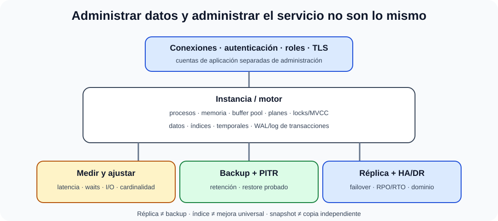

# Administración de sistemas de gestión de bases de datos.

B4-T02 · Bloque 4 · Tema 2

Fuente: [04 — BLOQUE IV — Sistemas y comunicaciones — GSI A2](https://docs.google.com/document/d/1MwEk2ye_u4RRHO3HP38gKX2yXjqAjzodtESKAOxDuv0/edit) · IV.02 · V2.1 · 2026-09-23

**Cobertura oficial que debe quedar dominada:** Administración de sistemas de gestión de bases de datos.

## 1. Funciones del DBA y arquitectura operativa

La administración de un SGBD convierte el motor de base de datos en un servicio fiable. Incluye instalación y parametrización, instancias, catálogos/esquemas, almacenamiento, memoria, conexiones, seguridad, transacciones, rendimiento, copias, recuperación, replicación, alta disponibilidad, auditoría, parcheo y capacidad.

Conviene distinguir **base de datos** (datos/estructuras) de **instancia** (procesos y memoria que prestan servicio, según motor). Algunos productos usan terminología distinta; el concepto operativo es identificar procesos, memoria, ficheros y listeners/endpoints.

## 2. Almacenamiento y memoria

El motor utiliza ficheros/volúmenes para datos, índices, temporales y logs de transacciones. Algunos SGBD agrupan espacio mediante tablespaces/filegroups o conceptos equivalentes. La administración debe vigilar crecimiento, espacio libre, IOPS, latencia y distribución.

Memoria: caché/buffer pool, estructuras de ejecución y caches de planes. Dar más memoria sin medir puede desplazar el problema. El objetivo es minimizar E/S innecesaria manteniendo equilibrio con el SO y otras cargas.

## 3. Usuarios, roles y seguridad

Separar autenticación de autorización. Conceder privilegios mediante roles; aplicar mínimo privilegio y segregación de funciones. Diferenciar privilegios sobre objetos de privilegios administrativos/sistema. Las cuentas de aplicación deben tener solo lo necesario.

Controles: TLS para conexiones, cifrado en reposo si procede, protección de claves, rotación de credenciales, auditoría de accesos/cambios, red restringida, bastión/PAM para administración y parcheo. No almacenar secretos en código.

## 4. Transacciones, bloqueos y concurrencia

El DBA debe comprender ACID, aislamiento, bloqueos/MVCC, deadlocks y transacciones largas. Un deadlock suele resolverse abortando una transacción víctima; la aplicación debe poder reintentar de forma segura. Los bloqueos excesivos pueden revelar consultas lentas, índices insuficientes o transacciones demasiado amplias.

## 5. Rendimiento: planes, índices y estadísticas

El ajuste comienza por medir: top queries, latencia, CPU, I/O, waits, locks, conexiones y cache hit según motor. El **plan de ejecución** muestra estrategia de acceso/join; las estadísticas ayudan al optimizador a estimar cardinalidades. Un índice puede acelerar lectura pero encarece escritura, ocupa espacio y exige mantenimiento.

Orden razonable: reproducir → medir → identificar cuello → cambiar una hipótesis → comparar. Evitar “tuning por recetas”.

## 6. Backup, logs y recuperación

### Administración del SGBD como servicio recuperable

_Distingue rendimiento, protección de datos, alta disponibilidad y recuperación._

**Qué debes recordar:** Una réplica mejora continuidad, pero no sustituye una copia independiente probada; RPO y RTO gobiernan la estrategia.

Una estrategia puede combinar copia física y lógica. Las copias físicas permiten restaurar estructuras del motor; las lógicas exportan objetos/datos y son útiles para portabilidad o recuperaciones granulares. Los logs de transacciones/WAL permiten **point-in-time recovery (PITR)** cuando el motor y la política lo soportan.

La cadena correcta es backup + retención + copia fuera del fallo común + pruebas de restore + runbook. Una réplica no sustituye al backup: puede replicar borrado, corrupción o error lógico.

## 7. Replicación, HA y DR

Replicación síncrona reduce posible pérdida a costa de latencia; asíncrona admite retraso. Topologías primario-réplica, multi-primary o cluster varían por producto. Hay que diferenciar **HA local** de **DR** entre dominios de fallo. RPO/RTO determinan cuánto dato y tiempo puede perderse.

## 8. Mantenimiento y capacidad

Tareas: actualizar motor, renovar certificados, revisar jobs, estadísticas, fragmentación/bloat cuando aplique, crecimiento de logs, capacidad, backups, restauraciones y alertas. Planificar upgrades mayores con compatibilidad, pruebas, réplica/piloto, rollback y ventana.

Microdatos oficiales de reconocimiento de producto

- En Microsoft SQL Server, Always On Availability Groups es una solución de alta disponibilidad y recuperación ante desastres basada en grupos de bases de datos replicadas; es un ejemplo de producto, no un sustituto de entender replicación, quorum, failover, RPO y RTO.

- En Oracle, BLOB almacena datos binarios dentro de la base de datos; BFILE referencia datos binarios externos de solo lectura gestionados fuera de la base. Es un microdato de producto aparecido en OEP 2025 y, por tanto, se mantiene con prioridad menor y carácter provisional.

9. Datos y trampas de test

* Índice acelera ciertas lecturas pero penaliza escrituras y consume espacio.
* Replicación ≠ backup.
* Snapshot ≠ copia independiente necesariamente.
* RPO = pérdida máxima de datos tolerable; RTO = tiempo objetivo de recuperación.
* Autenticación ≠ autorización.
* Privilegio de sistema/administrativo ≠ privilegio sobre objeto.
* Un plan de ejecución debe analizarse con cardinalidad y métricas, no solo con coste estimado.

10. Aplicación al supuesto práctico

Diseña una plataforma de datos con nodos primarios/réplicas, balanceo o endpoint de failover cuando proceda, roles, cifrado, red, auditoría, backups/PITR, pruebas de restore, monitorización y capacidad. Explica RPO/RTO, dominio de fallo y procedimiento de conmutación/retorno.

## Resumen

Administrar SGBD es gobernar datos y servicio: configuración, seguridad, concurrencia, rendimiento, copia/recuperación, HA, parcheo y capacidad.

**Fuentes base:** A1 063 (01/02/2022) como base + documentación operativa específica; apoyo de conceptos de II.05/III.04.

## Resumen de repaso

Fuente: [GSI_A2 — BLOQUE IV — RESUMEN MAESTRO DE REPASO (16 temas)](https://docs.google.com/document/d/1PRbZRedDj9j2D4jPlDODZUKkmbCqPWxMM4hhGhjcZIo/edit) · IV.02

### Núcleo de estudio

Administrar un SGBD incluye instalación/configuración, instancias, esquemas, usuarios/roles, privilegios, almacenamiento, memoria, conexiones, índices, estadísticas, ejecución de consultas, transacciones, replicación, HA, backup/recovery, auditoría y parcheo. Optimización parte de métricas y planes de ejecución; índices y estadísticas deben mantenerse. Seguridad: mínimo privilegio, cuentas de servicio, cifrado en tránsito/reposo, gestión de claves, auditoría y segregación de funciones. Backup lógico/físico, completo/incremental y point-in-time recovery según motor. Replicación no sustituye al backup.

### Claves de test

DBA ≠ desarrollador de SQL; índice puede perjudicar escrituras; réplica puede copiar corrupción/borrado; RPO/RTO condicionan estrategia. Diferencia backup consistente, snapshot y replicación. Privilegio de sistema y de objeto son conceptos distintos.

### Enfoque para supuesto práctico

En supuesto define topología primaria/réplicas, HA, backups con pruebas de restauración, monitorización, capacidad, cifrado, roles, mantenimiento y DR. Justifica RPO/RTO y ventanas.

### Fuentes base del material

A1 063 como base + documentación operativa de SGBD. Tema COMPLEMENTAR.
