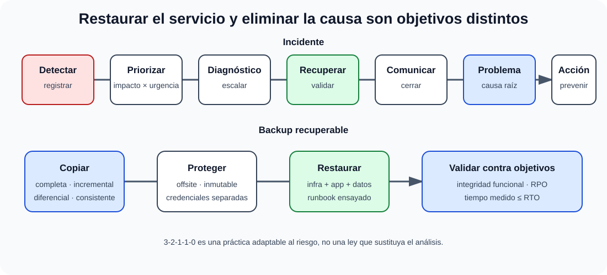

# Mantenimiento de equipos e instalaciones. Tipos de mantenimiento. Gestión de incidencias. Procedimientos de backup y recuperación.

B4-T03 · Bloque 4 · Tema 3

Fuente: [GSI_A2 — BLOQUE IV — APUNTES COMPLETOS V2.1 REVISADOS — ESTUDIO (16 temas)](https://docs.google.com/document/d/1FMunz530TBBQnal_ttMprrZVGQ19wLAFksnJgEpd1os/edit) · IV.03 · V2.1 · 2026-08-21

**Cobertura oficial que debe quedar dominada:** Mantenimiento de equipos e instalaciones. Tipos de mantenimiento. Gestión de incidencias. Procedimientos de backup y recuperación.

## 1. Tipos de mantenimiento

**Preventivo**: actuaciones periódicas para evitar fallo (limpieza, inspección, cambio programado, pruebas). **Correctivo**: reparar tras fallo. **Predictivo**: usa mediciones/tendencias para anticipar degradación. En software también se habla de correctivo, adaptativo, perfectivo/evolutivo y preventivo.

En instalaciones críticas se mantienen UPS, climatización, baterías, grupos electrógenos, detección/extinción, cableado y sensores, con calendario y evidencia.

## 2. Incidente, problema, petición y cambio

Un **incidente** es una interrupción o degradación no planificada; su objetivo es restaurar servicio. Un **problema** busca causa raíz y prevenir recurrencia. Una petición de servicio es demanda estándar; un cambio modifica de forma controlada un CI/servicio.

Prioridad suele combinar impacto y urgencia. El flujo: detectar/registrar → categorizar/priorizar → diagnóstico inicial → escalar → resolver/recuperar → validar → cerrar. Incidentes mayores requieren canal de mando, comunicaciones periódicas y revisión posterior.

## 3. SLA, escalado y postmortem

Un SLA expresa compromisos de servicio. Las métricas deben poder medirse. Escalado funcional busca más conocimiento; jerárquico moviliza autoridad/recursos. Un postmortem útil registra línea temporal, impacto, causas/contribuyentes y acciones con responsables; no debe convertirse en búsqueda de culpables.

## 4. Tipos de copia

### Incidente, problema y recuperación verificable

_Separa restaurar el servicio de eliminar la causa y muestra que backup termina en una prueba de recuperación._

**Qué debes recordar:** Incidente restaura; problema previene recurrencia. Una copia no demuestra recuperabilidad hasta que se restaura y valida.

**Completa**: copia todo el conjunto. **Incremental**: cambios desde la última copia de cualquier tipo de la cadena. **Diferencial**: cambios desde la última completa. **Sintética completa**: reconstruye una completa en el repositorio combinando copias previas sin releer todo el origen.

La elección equilibra ventana de copia, almacenamiento, tráfico y tiempo de restauración. Las bases de datos requieren mecanismos consistentes con transacciones.

## 5. Política 3-2-1-1-0 y ransomware

Como buena práctica moderna puede estudiarse 3-2-1 y su extensión 3-2-1-1-0: varias copias, medios/ubicaciones diferentes, una fuera del sitio, una offline/inmutable y cero errores tras verificaciones. No es una ley universal: debe adaptarse a riesgo y criticidad.

Protecciones: credenciales separadas para backup, repositorio inmutable, MFA/PAM, cifrado, aislamiento de red, retención y borrado protegidos. Si el ransomware compromete el dominio administrativo del backup, la copia puede dejar de ser recuperable.

## 6. Retención, rotación y restauración

Definir frecuencia, retención diaria/semanal/mensual según necesidad legal y operativa, versionado y expiración. Restaurar puede requerir infraestructura, SO, aplicación, configuración, datos y dependencias. La prueba debe comprobar integridad funcional, no solo que el fichero se lee.

## 7. RPO, RTO y ejercicios

RPO responde “¿cuánto dato puedo perder?”; RTO, “¿cuánto tiempo puedo estar sin servicio?”. Un RPO muy bajo exige copias/log shipping/replicación frecuentes; un RTO bajo exige automatización, capacidad reservada y runbooks ensayados. Los objetivos se fijan por proceso de negocio, no por deseo técnico.

8. Datos y trampas de test

* Incidente ≠ problema.
* Incremental: desde última copia de la cadena; diferencial: desde última completa.
* Backup ≠ archivo histórico; los objetivos y retenciones pueden diferir.
* Réplica ≠ backup.
* RPO mide pérdida de datos; RTO tiempo de recuperación.
* Una copia no verificada no demuestra recuperabilidad.
* Offline/inmutable protege frente a ciertos ataques, pero no sustituye pruebas.

9. Aplicación al supuesto práctico

Propón clasificación P1-P4 o equivalente por impacto/urgencia, on-call/escalado, NMS→ticket→diagnóstico→recuperación→RCA, y una política de copias vinculada a RPO/RTO. Incluye repositorio fuera del dominio de fallo, inmutabilidad, cifrado y simulacros periódicos de restauración.

## Resumen

Mantener es prevenir, detectar, reparar y aprender. La estrategia de backup solo es válida si permite restaurar dentro del RTO y con pérdida ≤ RPO.

**Fuentes base:** A1 056 v31.1 (11/03/2026) + A1 101/105 y materiales de continuidad.

## Resumen de repaso

Fuente: [GSI_A2 — BLOQUE IV — RESUMEN MAESTRO DE REPASO (16 temas)](https://docs.google.com/document/d/1PRbZRedDj9j2D4jPlDODZUKkmbCqPWxMM4hhGhjcZIo/edit) · IV.03

### Núcleo de estudio

Mantenimiento preventivo reduce fallos; correctivo repara; predictivo usa señales/medidas; evolutivo/adaptativo aplica especialmente a software. Gestión de incidencias restaura servicio lo antes posible y se diferencia de gestión de problemas, que busca causa raíz. Prioridad combina impacto y urgencia; define SLA, escalado, comunicación y postmortem. Backup: regla 3-2-1 como buena práctica, copias completas/incrementales/diferenciales, inmutabilidad/offline frente a ransomware y pruebas de restauración. RPO indica pérdida máxima de datos tolerable; RTO tiempo máximo objetivo de recuperación.

### Claves de test

Incidente ≠ problema; backup ≠ archivo; réplica ≠ backup; incremental copia cambios desde última copia de cualquier tipo, diferencial desde última completa. Un backup no probado no garantiza recuperación.

### Enfoque para supuesto práctico

En supuesto presenta matriz severidad, flujo ITSM, monitorización-alerta-ticket-escalado-cierre y plan backup/restore alineado con RPO/RTO. Incluye ejercicios de recuperación.

### Fuentes base del material

A1 101 + 056 + 105 y materiales de continuidad.
