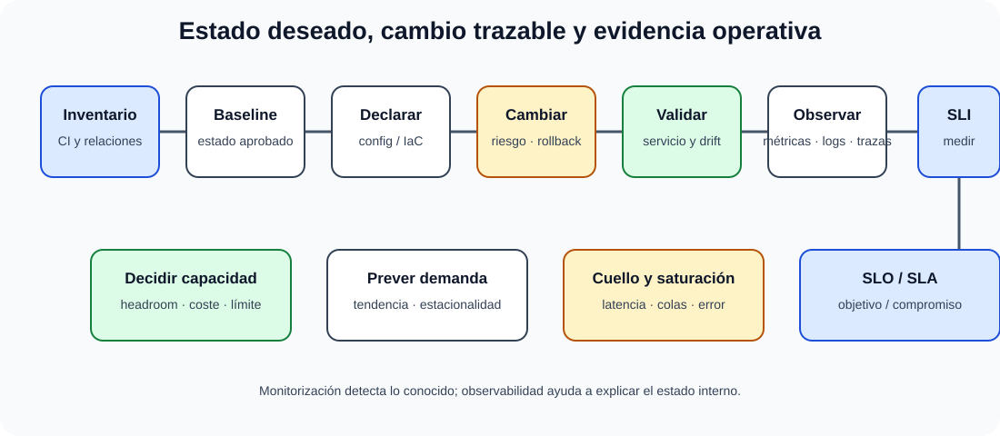

# Gestión de la configuración. Control de cambios y de versiones. Técnicas y herramientas de operación automática. Evaluación y monitorización del rendimiento de sistemas, infraestructuras y servicios. Gestión de la capacidad. Herramientas y técnicas utilizables.

B4-T04 · Bloque 4 · Tema 4

Fuente: [04 — BLOQUE IV — Sistemas y comunicaciones — GSI A2](https://docs.google.com/document/d/1MwEk2ye_u4RRHO3HP38gKX2yXjqAjzodtESKAOxDuv0/edit) · IV.04 · V2.1 · 2026-09-23

**Cobertura oficial que debe quedar dominada:** Gestión de la configuración. Control de cambios y de versiones. Técnicas y herramientas de operación automática. Evaluación y monitorización del rendimiento de sistemas, infraestructuras y servicios. Gestión de la capacidad. Herramientas y técnicas utilizables.

## 1. Gestión de configuración

Un **Configuration Item (CI)** es un elemento que se controla para prestar un servicio: servidor, VM, switch, aplicación, versión, certificado, base de datos, documento o servicio externo. La gestión de configuración mantiene identidad, atributos, relaciones y estado. Una CMDB puede soportar el proceso, pero una CMDB desactualizada es peor que un inventario más pequeño y fiable.

Una **baseline** fija una configuración aprobada. Configuration drift es la desviación respecto del estado esperado. Discovery automatizado, config-as-code e inventario ayudan a reducirlo.

## 2. Gestión de cambios

Flujo: solicitud/RFC → impacto, riesgo, dependencias y plan → autorización → calendario → ejecución → validación → cierre/revisión. Cambios estándar/preautorizados son repetitivos y de bajo riesgo; normales pasan evaluación ordinaria; emergencias aceleran controles, pero requieren trazabilidad y revisión posterior.

Todo cambio relevante necesita ventana, responsable, plan de prueba, comunicaciones y rollback/backout. El CAB es un mecanismo de asesoramiento/decisión en ciertos modelos, no una reunión obligatoria para cualquier cambio trivial.

## 3. Control de versiones

Versionar código, configuración, IaC, scripts, esquemas, documentación y artefactos permite reproducir un estado. Tags/releases identifican puntos desplegables. El control de versiones no sustituye a gestión de configuración: uno registra cambios de artefactos; la otra gobierna el estado completo del servicio y sus relaciones.

## 4. Automatización de operaciones

Niveles: scripts → jobs/schedulers → gestión de configuración → orquestación → IaC → pipelines. Imperativo describe pasos; declarativo describe estado objetivo. Idempotencia, manejo de errores, logs, secretos externos, versionado, pruebas y límites de privilegio son requisitos de automatización segura.

Ejemplos de categorías: PowerShell/shell/Python, Ansible o equivalentes para configuración, Terraform/OpenTofu o equivalentes para infraestructura declarativa, plataformas de orquestación y CI/CD. En examen interesa el patrón, no el producto.

## 5. Monitorización y observabilidad

### Controlar configuración, cambio, rendimiento y capacidad

_Conecta el estado deseado con la evidencia operativa y las decisiones de crecimiento._

**Qué debes recordar:** Versionar artefactos no sustituye gobernar el servicio; observar y prever permite cambiar antes de incumplir el SLO.

**Monitorización** comprueba estados y métricas conocidas; **observabilidad** persigue inferir el estado interno a partir de señales. Tres señales clásicas: métricas, logs y trazas; además perfiles y eventos. APM combina instrumentación y correlación del rendimiento de aplicaciones.

SLI = indicador medido; SLO = objetivo interno/operativo; SLA = compromiso formal con consecuencias definidas. Alertar sobre síntomas de usuario suele ser más útil que sobre cualquier métrica interna aislada.

## 6. Rendimiento y cuellos de botella

Métricas: latencia, throughput, tasa de errores, utilización y saturación. Recursos: CPU, memoria, paging, disco/IOPS/latencia/colas, red/ancho de banda/pérdida, locks, pool de conexiones y dependencias. La ley práctica es medir antes y después; correlación no implica causa.

Un sistema puede tener CPU 90% y cumplir SLO; otro con 30% puede ir lento por almacenamiento o dependencia externa. La **cola** suele crecer al acercarse a saturación.

## 7. Gestión de capacidad

Capacidad traduce demanda futura en recursos y decisiones. Se parte de demanda, perfil horario, crecimiento, estacionalidad, headroom, límites y SLO. Técnicas: tendencias, percentiles, modelos de carga, benchmarks y pruebas. Diferenciar capacity management de autoscaling: el segundo reacciona/ajusta, pero sigue necesitando límites y planificación.

## 8. Arquitectura de observabilidad

Agentes/exporters → colectores → almacenes de métricas/logs/trazas → correlación → dashboards/alertas → tickets/on-call. Debe proteger datos sensibles, controlar retención y evitar una plataforma de observabilidad que se convierta en SPOF o coste descontrolado.

Microdatos oficiales de alta rentabilidad

- Git distingue tres estados de fichero muy preguntables: modified, staged y committed. Un merge conflict es un conflicto de control de versiones que requiere reconciliar cambios incompatibles.

- Ansible expresa automatizaciones en Playbooks YAML; inventory identifica hosts/grupos, role estructura contenido reutilizable y module ejecuta una unidad de trabajo.

- Benchmark sintético mide de forma aislada o controlada un componente/carga artificial para estimar prestaciones; un benchmark de aplicación intenta representar una carga real. No confundir benchmark con KPI.

- ELK = Elasticsearch + Logstash + Kibana: combinación clásica para ingestión/procesamiento, búsqueda/análisis y visualización de logs/datos.

- ITIL 4 introdujo el Service Value System (SVS); para este tema interesa reconocerlo, no memorizar catálogos históricos de procesos.

9. Datos y trampas de test

* CI = elemento de configuración; CMDB = repositorio/relaciones, no sinónimo de inventario total.
* Cambio estándar ≠ emergencia.
* Monitorización ≠ observabilidad.
* SLI ≠ SLO ≠ SLA.
* Alta CPU no implica necesariamente cuello de botella.
* Idempotencia es clave para automatización repetible.
* Control de versiones ≠ gestión de configuración.
* Capacity planning ≠ sobredimensionar siempre.

10. Aplicación al supuesto práctico

Para un servicio crítico: inventario/CMDB y baselines, config-as-code, pipeline de cambio con aprobación proporcional al riesgo, rollback, métricas/logs/trazas, SLI/SLO, dashboards, alertas, on-call y capacity plan. Añade pruebas de carga y forecast de crecimiento; evita alertas sin acción asociada.

## Resumen

La operación madura controla estado y cambio, automatiza lo repetible, observa el servicio extremo a extremo y planifica capacidad antes de saturarse.

**Fuentes base:** A1 100/102 + material ITIL/operación; tema complementario construido específicamente para GSI.

## Resumen de repaso

Fuente: [GSI_A2 — BLOQUE IV — RESUMEN MAESTRO DE REPASO (16 temas)](https://docs.google.com/document/d/1PRbZRedDj9j2D4jPlDODZUKkmbCqPWxMM4hhGhjcZIo/edit) · IV.04

### Núcleo de estudio

Gestión de configuración identifica y controla elementos de configuración (CI), relaciones, versiones y estado; una CMDB puede soportarla. Gestión de cambios evalúa riesgo, impacto, aprobación, planificación, ejecución y revisión. Control de versiones preserva historia y reproducibilidad. Automatización: scripting, orquestadores, IaC, configuración declarativa y jobs; debe ser idempotente cuando sea posible. Observabilidad combina métricas, logs y trazas. Rendimiento se analiza con latencia, throughput, utilización, colas, error rate y saturación; capacidad proyecta demanda y recursos para cumplir SLO con margen. Baselines y tendencias evitan reaccionar solo a picos.

### Claves de test

Monitorización dice qué ocurre; observabilidad ayuda a explicar por qué. Alta CPU no implica siempre cuello de botella. Configuración ≠ inventario simple. Cambio estándar, normal y emergencia tienen controles distintos en marcos ITSM.

### Enfoque para supuesto práctico

En supuesto define CMDB/config-as-code, pipeline de cambios, aprobaciones, mantenimiento, métricas/SLO, alertas, dashboards, capacity plan y autoescalado. Incluye rollback y segregación.

### Fuentes base del material

A1 102 + 100 y material ITIL/operación. Tema COMPLEMENTAR.
