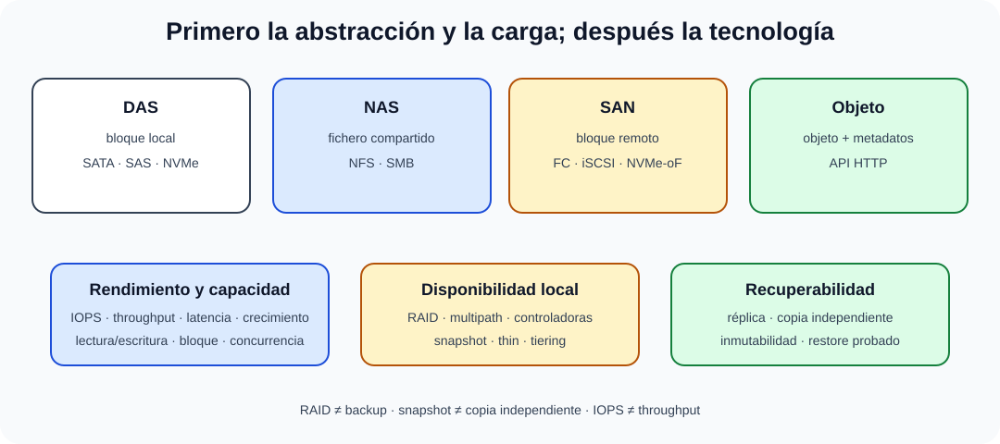

# Almacenamiento de datos: arquitectura, tipos, componentes, protocolos, gestión y administración. Virtualización del almacenamiento.

B4-T05 · Bloque 4 · Tema 5

Fuente: [GSI_A2 — BLOQUE IV — APUNTES COMPLETOS V2.1 REVISADOS — ESTUDIO (16 temas)](https://docs.google.com/document/d/1FMunz530TBBQnal_ttMprrZVGQ19wLAFksnJgEpd1os/edit) · IV.05 · V2.1 · 2026-08-21

**Cobertura oficial que debe quedar dominada:** Almacenamiento de datos: arquitectura, tipos, componentes, protocolos, gestión y administración. Virtualización del almacenamiento.

## 1. Medios y jerarquía

HDD ofrece gran capacidad/coste favorable con latencia mecánica; SSD reduce latencia; NVMe usa PCIe y colas/paralelismo adaptados a memoria no volátil. La cinta conserva valor en archivo/copia por coste y aislamiento. El almacenamiento cloud/objeto cambia modelo operativo y de coste, pero no elimina requisitos de durabilidad, acceso y salida.

## 2. DAS, NAS, SAN y objeto

### Elegir almacenamiento por abstracción y carga

_Ordena las tecnologías por lo que exponen y por el requisito que resuelven._

**Qué debes recordar:** Bloque, fichero y objeto son abstracciones distintas; RAID, snapshot, réplica y backup protegen frente a fallos diferentes.

| **Modelo** | **Unidad expuesta** | **Protocolos típicos** | **Uso** |
| --- | --- | --- | --- |
| DAS | bloques/dispositivo local | SATA, SAS, NVMe | servidor individual, baja complejidad |
| NAS | ficheros | NFS, SMB | ficheros compartidos |
| SAN | bloques remotos | Fibre Channel, iSCSI, NVMe-oF | BD, virtualización, cargas de bloque |
| Objeto | objeto + metadatos/API | HTTP/S3-compatible conceptualmente | backup, datos masivos, contenido |

NAS y SAN no se diferencian por “estar en red” —ambas lo están— sino por la abstracción: fichero frente a bloque.

## 3. RAID y protección local

RAID 0: striping sin redundancia. RAID 1: espejo. RAID 5: paridad distribuida, tolera normalmente un disco. RAID 6: doble paridad, normalmente dos. RAID 10: stripe sobre espejos; buen rendimiento y reconstrucción a cambio de capacidad.

RAID mejora disponibilidad frente a fallo de disco, pero **no es backup**: no protege de borrado lógico, ransomware, incendio, error administrativo o corrupción replicada.

## 4. Cabinas, controladoras, caché y LUN

Una cabina integra controladoras, puertos front-end/back-end, caché y discos/flash. Presenta volúmenes/LUN a hosts. En Fibre Channel, zoning controla qué iniciadores y targets se ven; LUN masking limita volúmenes. Multipathing ofrece varios caminos y failover/balanceo según pila.

## 5. Protocolos

Fibre Channel transporta bloques sobre red especializada; iSCSI transporta comandos SCSI sobre TCP/IP; NFS y SMB comparten ficheros; NVMe-oF extiende semántica NVMe sobre fabric. Cada elección implica latencia, coste, habilidades, multipath y aislamiento distintos.

## 6. Virtualización y eficiencia

Virtualizar almacenamiento agrupa/abstrae recursos físicos en pools y volúmenes lógicos. Técnicas: **thin provisioning**, snapshots, clones, deduplicación, compresión, tiering y replicación. Thin provisioning permite asignar capacidad lógica superior a la física, lo que exige alertas para evitar agotamiento.

Snapshot guarda un punto lógico, frecuentemente mediante copy-on-write/redirección; puede depender del mismo sistema y no ser copia independiente.

## 7. Rendimiento y dimensionamiento

Medir IOPS, throughput (MB/s o GB/s), latencia, tamaño de bloque, ratio lectura/escritura, secuencial/aleatorio y concurrencia. Una base OLTP exige perfil distinto de backup secuencial. La capacidad útil debe descontar RAID, snapshots, reservas y crecimiento.

## 8. Administración y seguridad

Inventario, firmware, salud de discos, pools, capacidad, latencia, rutas, snapshots, replicación y alertas. Seguridad: segmentación de redes de storage, autenticación, cifrado en tránsito/reposo cuando proceda, control de administración y borrado seguro. Para backup, valorar inmutabilidad/WORM.

9. Datos y trampas de test

* RAID ≠ backup.
* NAS = ficheros; SAN = bloques.
* iSCSI = SCSI sobre TCP/IP.
* Thin provisioning puede sobreaprovisionar; necesita control de capacidad.
* Snapshot ≠ copia independiente necesariamente.
* IOPS ≠ throughput; una carga puede estar limitada por uno u otro.
* RAID 5 tolera típicamente un fallo; RAID 6 dos.
* Zoning y LUN masking actúan en capas diferentes de visibilidad/acceso.

10. Aplicación al supuesto práctico

Clasifica cargas (BD, VM, ficheros, objeto, backup); estima capacidad útil y crecimiento; define rendimiento (IOPS/throughput/latencia); elige DAS/NAS/SAN/objeto; añade RAID, multipath, snapshots/replicación, cifrado, monitorización y backup independiente. Justifica coste y dominio de fallo.

## Resumen

El diseño de almacenamiento se basa en abstracción (bloque/fichero/objeto), rendimiento, disponibilidad, capacidad y recuperabilidad; la virtualización mejora flexibilidad pero exige vigilancia del pool físico.

**Fuentes base:** A1 056 v31.1 (11/03/2026) como fuente principal + A1 057 como apoyo histórico.

## Resumen de repaso

Fuente: [GSI_A2 — BLOQUE IV — RESUMEN MAESTRO DE REPASO (16 temas)](https://docs.google.com/document/d/1PRbZRedDj9j2D4jPlDODZUKkmbCqPWxMM4hhGhjcZIo/edit) · IV.05

### Núcleo de estudio

Distingue almacenamiento local DAS, NAS por ficheros y SAN por bloques; almacenamiento objeto expone objetos vía API y escala masivamente. Medios: HDD, SSD/NVMe, cinta y cloud según coste/rendimiento/durabilidad. RAID combina discos: RAID 0 rendimiento sin redundancia; 1 espejo; 5 paridad simple; 6 doble; 10 espejo+striping. Protocolos: SATA/SAS/NVMe local; NFS/SMB ficheros; Fibre Channel/iSCSI bloques; S3-compatible objetos a nivel conceptual. Virtualización agrupa recursos físicos en pools/lógicos, thin provisioning, snapshots y replicación. Capacidad debe considerar IOPS, throughput, latencia y crecimiento.

### Claves de test

RAID no es backup; snapshot no siempre es copia independiente; NAS ≠ SAN; iSCSI transporta SCSI sobre IP. RAID 5 tolera normalmente un disco; RAID 6 dos. Thin provisioning puede sobreaprovisionar y requiere control.

### Enfoque para supuesto práctico

En supuesto clasifica cargas (BD, ficheros, objetos, backup), calcula capacidad útil, rendimiento, redundancia, replicación y tiering. Incluye cifrado, inmutabilidad y monitorización.

### Fuentes base del material

A1 056 + 057 y material de almacenamiento/virtualización.
