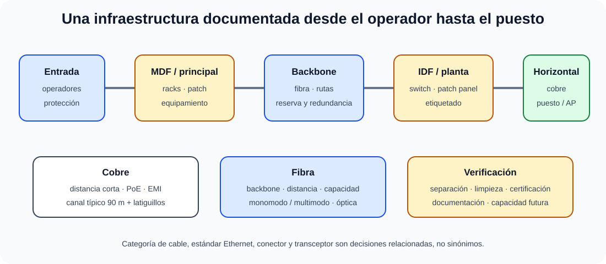

# Medios de transmisión guiados y no guiados (inalámbricos): tipos y parámetros significativos. Elementos de cableado estructurado.

B4-T07 · Bloque 4 · Tema 7

Fuente: [04 — BLOQUE IV — Sistemas y comunicaciones — GSI A2](https://docs.google.com/document/d/1MwEk2ye_u4RRHO3HP38gKX2yXjqAjzodtESKAOxDuv0/edit) · IV.07 · V2.1 · 2026-09-23

**Cobertura oficial que debe quedar dominada:** Medios de transmisión guiados y no guiados (inalámbricos): tipos y parámetros significativos. Elementos de cableado estructurado.

## 1. Parámetros de transmisión

Ancho de banda/capacidad, frecuencia, atenuación, ruido, relación señal/ruido, BER, latencia, dispersión y diafonía condicionan un enlace. El decibelio expresa relaciones logarítmicas. Mayor ancho de banda físico no garantiza rendimiento útil si protocolo, errores o equipo limitan.

## 2. Par trenzado y coaxial

Par trenzado de cobre puede ser UTP o apantallado. Categorías superiores soportan mayores frecuencias y aplicaciones, siempre respetando conectores, instalación y certificación. Ethernet estructurado sobre cobre utiliza habitualmente hasta 100 m de canal (90 m enlace permanente + latiguillos, diseño típico estándar).

Coaxial tiene conductor central y blindaje; hoy es menos habitual en LAN Ethernet, pero sigue presente en radiofrecuencia, acceso y vídeo.

## 3. Fibra óptica

Fibra **monomodo** usa núcleo menor y soporta mayores distancias/capacidades; **multimodo** se usa en distancias menores, especialmente edificio/CPD. Parámetros: longitud de onda, presupuesto óptico, atenuación, dispersión, conectores y transceptores. La fibra es inmune a interferencia electromagnética, pero requiere cuidado mecánico y limpieza de conectores.

## 4. No guiados

Radio, microondas terrestres, satélite e infrarrojo presentan propagación, interferencia, espectro, línea de vista y regulación distintas. El satélite añade latencia de propagación dependiente de órbita. En microondas y radio importan antena, potencia, zona Fresnel y obstáculos.

## 5. Cableado estructurado

### Cableado estructurado y selección del medio

_Sitúa cada elemento físico y ayuda a decidir entre cobre, fibra y medio inalámbrico._

**Qué debes recordar:** La categoría del cable no es una versión Ethernet; la distancia, interferencia, potencia, transceptor y certificación forman un sistema.

Organiza entrada de servicios, sala/equipamiento, backbone/vertical, distribuidores, horizontal, área de trabajo, patch panels y latiguillos. Debe separarse de potencia según norma/práctica, etiquetarse, documentarse y certificarse. Diseñar rutas y fibras de reserva facilita crecimiento y redundancia.

## 6. PoE

<!-- editorial-supplement:B4-T07:01:start -->

### PoE: IEEE 802.3af/at/bt, PSE y PD

En la evolución de Power over Ethernet, IEEE 802.3af se asocia a PoE, 802.3at a PoE+ y 802.3bt amplía la potencia y puede utilizar los cuatro pares. El PSE (Power Sourcing Equipment) suministra alimentación y el PD (Powered Device) la recibe. Para test importa distinguir generaciones y roles, no memorizar cifras comerciales de potencia.

<!-- editorial-supplement:B4-T07:01:end -->

Power over Ethernet alimenta terminales como AP, cámaras o teléfonos sobre el cable de datos mediante familias IEEE 802.3. En diseño importan potencia por puerto, presupuesto total del switch, categoría/temperatura del mazo y redundancia eléctrica. No memorizar marketing; sí distinguir que PoE añade energía sin cambiar el hecho de que Ethernet transporta datos.

## 7. Selección del medio

| **Criterio** | **Cobre** | **Fibra** |
| --- | --- | --- |
| Distancia | corta/media edificio | media/larga, campus/CPD |
| EMI | sensible según apantallado | inmune electromagnéticamente |
| Capacidad | alta en LAN moderna | muy alta y escalable |
| Alimentación PoE | sí | no de forma equivalente |
| Coste/terminación | habitualmente menor | óptica/transceptores más especializados |

Microdatos oficiales de alta rentabilidad

- Pérdidas típicas en fibra: absorción, dispersión de Rayleigh, curvaturas/microcurvaturas y pérdidas de conectores/empalmes; «difracción de Maxwell» no es una categoría estándar que debas memorizar.

- Órbita geoestacionaria: aproximadamente 35.786 km sobre el ecuador y periodo igual al día sideral (~23 h 56 min 4 s).

- Conectores APC se pulen con ángulo, típicamente 8°, para mejorar retorno óptico; UPC usa pulido sin ángulo.

- Como dato de cableado habitual: CAT6 se especifica hasta 250 MHz y CAT6A hasta 500 MHz; la categoría no equivale por sí sola a una velocidad Ethernet concreta.

8. Datos y trampas de test

* Fibra ≠ “sin pérdidas”: tiene atenuación/dispersión.
* Monomodo ≠ multimodo.
* dB es logarítmico.
* Categoría de cable ≠ versión Ethernet.
* 100 m es referencia típica de canal de cobre estructurado, no una ley para cualquier tecnología.
* PoE requiere presupuesto de potencia además de puertos.
* Ancho de banda físico ≠ throughput útil.

9. Aplicación al supuesto práctico

Elige cobre o fibra por distancia, capacidad, EMI, PoE, redundancia y coste. Dibuja MDF/IDF, backbone y horizontal; incluye patch panels, etiquetado, certificación, rutas redundantes y reserva de crecimiento. Para AP/cámaras calcula además presupuesto PoE.

## Resumen

El medio se selecciona por física y operación: capacidad, distancia, ruido, coste y mantenimiento. El cableado estructurado convierte enlaces en una infraestructura documentada y certificable.

**Fuentes base:** A1 108 + 110 + 112; conceptos físicos estables con actualización selectiva.

## Resumen de repaso

Fuente: [GSI_A2 — BLOQUE IV — RESUMEN MAESTRO DE REPASO (16 temas)](https://docs.google.com/document/d/1PRbZRedDj9j2D4jPlDODZUKkmbCqPWxMM4hhGhjcZIo/edit) · IV.07

### Núcleo de estudio

Medios guiados: par trenzado, coaxial y fibra óptica; no guiados: radio, microondas, infrarrojos/satélite según caso. Parámetros: ancho de banda, atenuación, interferencias, relación señal/ruido, distancia, latencia y tasa de error. Fibra monomodo cubre largas distancias y altas capacidades; multimodo distancias menores en LAN/CPD. Cableado estructurado organiza subsistemas horizontal, backbone, áreas de trabajo, cuartos y distribuidores; usa categorías de cobre y clases/estándares. PoE suministra energía sobre Ethernet bajo estándares IEEE 802.3 correspondientes.

### Claves de test

UTP no es inmune a interferencias; fibra es inmune a EMI. dB es escala logarítmica. Longitud máxima típica de canal Ethernet sobre cobre estructurado es 100 m (90 m permanente + latiguillos, según diseño estándar). No confundir categoría de cable con versión Ethernet.

### Enfoque para supuesto práctico

En supuesto selecciona cobre/fibra por distancia, velocidad, EMI y coste; diseña redundancia, racks, patch panels, etiquetado, certificación y crecimiento.

### Fuentes base del material

A1 108 + 110 + 112.
