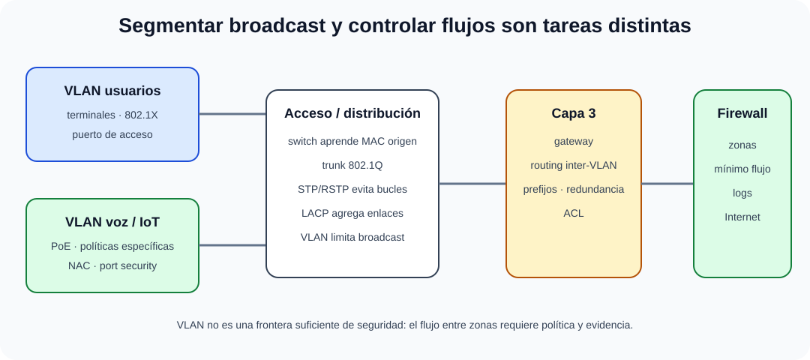

# Redes locales. Tipología, protocolos y técnicas de transmisión. Métodos de acceso. Dispositivos de interconexión. Seguridad. Normativa Reguladora.

B4-T08 · Bloque 4 · Tema 8

Fuente: [GSI_A2 — BLOQUE IV — APUNTES COMPLETOS V2.1 REVISADOS — ESTUDIO (16 temas)](https://docs.google.com/document/d/1FMunz530TBBQnal_ttMprrZVGQ19wLAFksnJgEpd1os/edit) · IV.08 · V2.1 · 2026-08-21

**Cobertura oficial que debe quedar dominada:** Redes locales. Tipología, protocolos y técnicas de transmisión. Métodos de acceso. Dispositivos de interconexión. Seguridad. Normativa Reguladora.

## 1. Arquitectura Ethernet

Ethernet IEEE 802.3 es la familia dominante en LAN cableadas. Opera a nivel físico y enlace; la trama contiene direcciones MAC origen/destino, tipo/longitud según formato, datos y FCS. La MAC es identificación de enlace; IP pertenece a capa de red.

En Ethernet conmutada full-duplex no hay colisiones normales y CSMA/CD queda como concepto histórico asociado a medio compartido/half-duplex.

## 2. Topologías y dominios

Físicamente predomina estrella alrededor de switches, aunque la topología lógica puede incluir enlaces redundantes. Un hub/repetidor no separa colisiones; un switch crea dominios de colisión por puerto; una VLAN delimita broadcast L2. Router/L3 separa dominios de broadcast y enruta entre subredes.

## 3. Switching y tabla MAC

El switch aprende MAC observando dirección origen y puerto. Si conoce destino, reenvía por puerto asociado; si es desconocido o broadcast, inunda dentro de la VLAN. Entradas envejecen. Bucles L2 generan tormentas y aprendizaje inestable, de ahí STP.

## 4. VLAN e inter-VLAN

### LAN segmentada: de acceso a routing y seguridad

_Muestra qué función realiza cada capa y dónde se aplica la política._

**Qué debes recordar:** El switch aprende MAC, la VLAN limita broadcast y la comunicación entre VLAN necesita capa 3; VLAN por sí sola no es firewall.

VLAN separa redes lógicas sobre switches. IEEE 802.1Q etiqueta tramas en enlaces trunk; puertos de acceso pertenecen normalmente a una VLAN sin etiqueta hacia el terminal. Comunicación entre VLAN requiere función L3 (router o switch multicapa) y políticas de filtrado.

## 5. STP, RSTP/MSTP y agregación

STP crea una topología libre de bucles bloqueando caminos redundantes; RSTP acelera convergencia; MSTP permite mapear VLAN a instancias. LACP negocia agregación de enlaces para capacidad y redundancia, pero un flujo concreto puede quedar limitado a un miembro según hashing.

## 6. Dispositivos

Repetidor/hub L1, bridge/switch L2, router L3, firewall con control de seguridad, punto de acceso puentea inalámbrico/cableado según diseño. Un switch L3 combina switching y routing; el nombre del dispositivo no sustituye analizar su función.

## 7. Seguridad LAN

Segmentación por VLAN/subred, ACL/firewall interzona, 802.1X/NAC, port security, DHCP snooping, Dynamic ARP Inspection donde exista, BPDU guard, control de puertos no usados, administración por SSH/HTTPS, AAA central y logs. La VLAN por sí sola no es frontera de seguridad suficiente.

## 8. Diseño jerárquico

Acceso-distribución-core es un modelo útil en redes medianas/grandes; en campus modernos puede colapsarse core/distribución. Redundancia, rutas, QoS y capacidad se diseñan según tamaño. Evitar extender L2 sin necesidad reduce dominios de fallo.

9. Datos y trampas de test

* Switch aprende MAC origen.
* Router decide por IP/prefijo.
* VLAN separa broadcast; inter-VLAN requiere L3.
* 802.1Q = etiquetado VLAN.
* STP evita bucles L2; RSTP converge más rápido.
* CSMA/CD es esencialmente histórico en Ethernet full-duplex conmutada.
* LACP agrega enlaces; no significa que un único flujo use suma de todos siempre.
* VLAN ≠ firewall.

10. Aplicación al supuesto práctico

Diseña acceso/distribución/core o arquitectura equivalente, VLAN/subred por función, routing inter-VLAN controlado, redundancia, STP/RSTP o diseño L3, LACP, QoS y NAC/802.1X. Incluye administración segura y monitorización; justifica dominios de fallo.

## Resumen

LAN moderna = Ethernet conmutada + segmentación VLAN/L3 + control de bucles/agregación + seguridad de acceso + redundancia y operación.

**Fuentes base:** A1 118 (12/09/2020) + 119; actualización de seguridad y diseño posterior.

## Resumen de repaso

Fuente: [GSI_A2 — BLOQUE IV — RESUMEN MAESTRO DE REPASO (16 temas)](https://docs.google.com/document/d/1PRbZRedDj9j2D4jPlDODZUKkmbCqPWxMM4hhGhjcZIo/edit) · IV.08

### Núcleo de estudio

Ethernet (IEEE 802.3) domina LAN cableada. Topologías físicas/lógicas, dominios de colisión/difusión, switching MAC, VLAN IEEE 802.1Q, enlaces troncales, STP/RSTP para bucles y agregación de enlaces son conceptos clave. Dispositivos: repetidor/hub L1, bridge/switch L2, router L3, firewall según funciones. Métodos de acceso históricos incluyen CSMA/CD; en Ethernet conmutada full-duplex ya no hay colisiones normales. Seguridad: segmentación VLAN, 802.1X/NAC, DHCP snooping, port security, gestión segura, ACL y monitorización.

### Claves de test

Switch aprende MAC; router decide por IP; VLAN separa dominios broadcast pero necesita routing entre VLAN. STP evita bucles L2. CSMA/CD es histórico en half-duplex. 802.1Q etiqueta VLAN.

### Enfoque para supuesto práctico

En supuesto crea VLAN por zonas/roles, core/distribución/acceso según tamaño, redundancia, routing, NAC, gestión, QoS y monitorización. Evita VLAN como única barrera de seguridad.

### Fuentes base del material

A1 118 + 119. Correspondencia DIRECTA.
