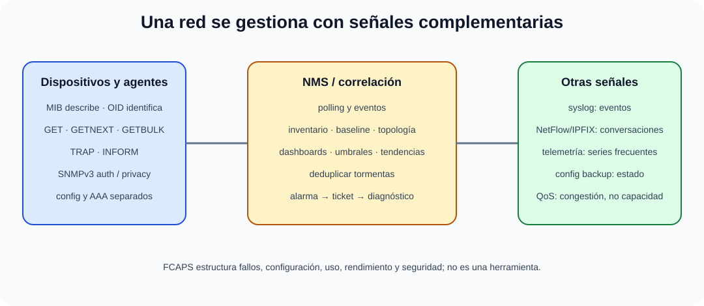

# Administración de redes locales. Gestión de usuarios y dispositivos. Monitorización y control de tráfico. Gestión SNMP.

B4-T09 · Bloque 4 · Tema 9

Fuente: [GSI_A2 — BLOQUE IV — APUNTES COMPLETOS V2.1 REVISADOS — ESTUDIO (16 temas)](https://docs.google.com/document/d/1FMunz530TBBQnal_ttMprrZVGQ19wLAFksnJgEpd1os/edit) · IV.09 · V2.1 · 2026-08-21

**Cobertura oficial que debe quedar dominada:** Administración de redes locales. Gestión de usuarios y dispositivos. Monitorización y control de tráfico. Gestión SNMP.

## 1. Modelo FCAPS

FCAPS resume áreas de gestión: Fault, Configuration, Accounting, Performance y Security. No es una herramienta concreta; sirve para estructurar operación: detectar fallos, controlar configuración, contabilizar/uso, medir rendimiento y proteger administración.

## 2. Inventario y configuración

Mantener modelo, serie/activo, ubicación, versión, interfaces, IP de gestión, dependencias, garantía/soporte y baseline. Respaldar configuraciones, controlar cambios, actualizar firmware y sustituir equipos fuera de soporte. Administración debe usar red/VRF de gestión cuando proceda y AAA central.

## 3. Usuarios y acceso a red

Directorio/IAM identifica usuarios; 802.1X autentica acceso a puerto/WLAN con supplicant–authenticator–servidor AAA, normalmente RADIUS. NAC añade postura/compliance y políticas. Separar identidad del usuario de cuenta administrativa del dispositivo.

## 4. SNMP: arquitectura

### Gestión de red con SNMP y telemetría complementaria

_Separa consulta, notificación, eventos, flujos y métricas de alta frecuencia._

**Qué debes recordar:** MIB describe y OID identifica; SNMPv3 protege mejor la gestión, mientras syslog y flows responden preguntas diferentes.

**Manager/NMS** consulta o recibe eventos; **agent** expone objetos; **MIB** describe estructura; **OID** identifica cada objeto. Operaciones: GET, GETNEXT, GETBULK (v2+), SET; TRAP envía notificación sin confirmación de aplicación y INFORM permite confirmación entre entidades según versión.

SNMPv1/v2c se apoyan en community strings; SNMPv3 añade modelo de seguridad con autenticación e integridad y, opcionalmente, privacidad/cifrado. En producción sensible preferir v3.

## 5. Syslog, flows y telemetría

Syslog centraliza eventos; NetFlow/IPFIX o tecnologías equivalentes resumen flujos para saber quién habla con quién, cuánto y cuándo; streaming telemetry publica métricas de forma más frecuente/estructurada que polling tradicional. Se complementan, no sustituyen totalmente.

## 6. Monitorización

Disponibilidad, estado de interfaces, errores/discards, utilización, latencia, pérdida, CPU/memoria, vecinos, rutas, PoE, temperatura y cambios. Usar percentiles/tendencias y umbrales con histéresis. Alertas deben mapearse a una acción y evitar tormentas.

## 7. Control de tráfico y QoS

Clasificación/marcado, policing, shaping, colas y prioridad. QoS no crea ancho de banda: administra congestión. El control puede detectar top talkers, aplicaciones anómalas y enlaces saturados; primero se corrige causa y luego se amplía capacidad si procede.

## 8. Troubleshooting por capas

Secuencia útil: físico (enlace, errores) → VLAN/L2 → IP/gateway → routing → DNS/DHCP → transporte/puertos → aplicación. Comparar alcance, rutas, ARP/NDP, latencia/pérdida y logs. Cambiar muchas variables a la vez destruye evidencia.

9. Datos y trampas de test

* MIB describe objetos; OID identifica un objeto.
* Polling ≠ trap/inform.
* SNMPv3 ofrece seguridad superior a community strings de v1/v2c.
* SNMP GETBULK aparece desde v2.
* Syslog ≠ SNMP; son complementarios.
* NetFlow/IPFIX describe flujos, no captura necesariamente payload.
* QoS no crea ancho de banda.
* FCAPS es un marco de áreas de gestión.

10. Aplicación al supuesto práctico

Propón NMS redundante, SNMPv3, syslog central, flows/telemetría, inventario y backups de configuración, AAA/RBAC, red de gestión, alertas y dashboards. Describe un flujo de incidencia desde alarma hasta diagnóstico por capas y cierre con actualización de baseline/documentación.

## Resumen

Administrar LAN significa conocer y controlar identidad, configuración, estado y tráfico; SNMP es una pieza de una plataforma más amplia de observabilidad y gestión.

**Fuentes base:** A1 118/119 + administración de redes; modernización hacia SNMPv3, flows y telemetría.

## Resumen de repaso

Fuente: [GSI_A2 — BLOQUE IV — RESUMEN MAESTRO DE REPASO (16 temas)](https://docs.google.com/document/d/1PRbZRedDj9j2D4jPlDODZUKkmbCqPWxMM4hhGhjcZIo/edit) · IV.09

### Núcleo de estudio

Administrar LAN incluye inventario, configuración, autenticación, direccionamiento, DHCP/DNS, VLAN, Wi-Fi si integrado, firmware, backups de configuración, monitorización y troubleshooting. Gestión de usuarios se apoya en directorio/IAM y NAC/802.1X; dispositivos pueden administrarse por SSH, APIs y plataformas centralizadas. Monitoriza disponibilidad, interfaces, errores, utilización, latencia, pérdida, top talkers y eventos. SNMP usa manager, agents, MIB y OID; SNMPv3 añade autenticación y privacidad frente a versiones anteriores. Syslog y telemetry complementan SNMP.

### Claves de test

SNMP trap/inform son notificaciones; polling consulta. MIB describe objetos, OID los identifica. SNMPv1/v2c usan community strings y no ofrecen seguridad equivalente a v3. Saturación de enlace no se resuelve solo cambiando umbral.

### Enfoque para supuesto práctico

En supuesto define NMS, SNMPv3, syslog central, NetFlow/IPFIX/telemetría, backups, RBAC, alertas, inventario y procedimientos de cambio/incidente.

### Fuentes base del material

A1 118 + 119 y administración de redes.
