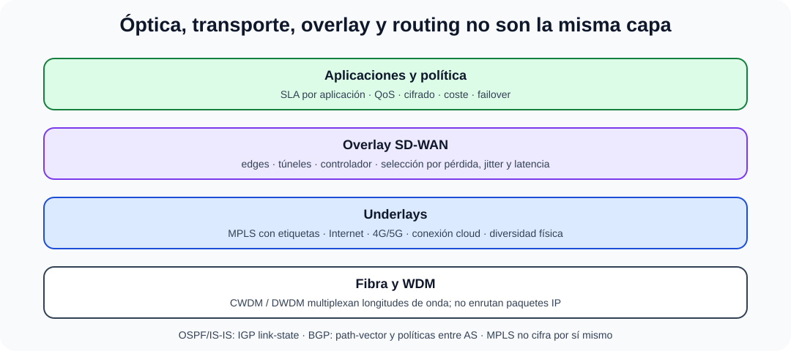

# Redes de área extensa. Tecnologías WDM y MPLS SD-WAN. Protocolos de encaminamiento.

B4-T10 · Bloque 4 · Tema 10

Fuente: [04 — BLOQUE IV — Sistemas y comunicaciones — GSI A2](https://docs.google.com/document/d/1MwEk2ye_u4RRHO3HP38gKX2yXjqAjzodtESKAOxDuv0/edit) · IV.10 · V2.1 · 2026-09-23

**Cobertura oficial que debe quedar dominada:** Redes de área extensa. Tecnologías WDM y MPLS SD-WAN. Protocolos de encaminamiento.

## 1. WAN y transportes

WAN conecta sedes/CPD/cloud a través de operadores, Internet o infraestructuras propias. Los criterios son capacidad, latencia, disponibilidad, QoS, cifrado, cobertura, coste, diversidad física y tiempo de provisión. Una arquitectura puede combinar varios underlays.

## 2. WDM

Wavelength Division Multiplexing transporta múltiples canales ópticos en diferentes longitudes de onda sobre una fibra. **CWDM** usa espaciado más amplio y menor complejidad; **DWDM** mayor densidad/capacidad y alcance con sistemas ópticos más sofisticados. WDM es tecnología de capa óptica; no realiza routing IP.

## 3. MPLS

MPLS reenvía paquetes usando etiquetas. Conceptos: FEC agrupa tráfico con mismo tratamiento; LER inserta/retira etiquetas en borde; LSR conmuta etiquetas; LSP es camino de etiquetas. Permite VPN L3/L2, ingeniería de tráfico y QoS en redes de operador. **MPLS no cifra por sí mismo**.

## 4. SD-WAN

### WAN por capas: óptica, transporte, overlay y routing

_Evita atribuir a cada tecnología funciones de otra capa._

**Qué debes recordar:** WDM multiplexa luz, MPLS conmuta etiquetas sin cifrar por sí solo, SD-WAN aplica política sobre underlays y BGP enruta por atributos.

SD-WAN desacopla política/control de la elección de múltiples transportes. Underlay = conectividad subyacente (Internet, MPLS, 4G/5G...); overlay = túneles/red lógica. Un controlador/orquestador distribuye políticas; el edge mide SLA de caminos y selecciona según aplicación, pérdida, jitter/latencia y coste.

Beneficios: gestión central, uso activo de varios enlaces y aprovisionamiento; riesgos: dependencia de plataforma, control plane, seguridad de edges y calidad variable del underlay.

## 5. Routing estático y dinámico

Routing estático es predecible pero escala mal. Protocolos dinámicos intercambian información y convergen tras cambios. Métricas y atributos determinan selección; debe evitarse redistribución indiscriminada.

## 6. RIP, OSPF, IS-IS y BGP

| **Protocolo** | **Tipo** | **Ámbito/idea clave** |
| --- | --- | --- |
| RIP | distance-vector | métrica de saltos; simple/legado |
| OSPF | link-state IGP | áreas, coste, SPF; interior de organización |
| IS-IS | link-state IGP | niveles/áreas; común en grandes operadores |
| BGP | path-vector EGP | políticas y AS-PATH entre AS; también DC/enterprise a gran escala |

Microdatos oficiales de alta rentabilidad

- En el encabezado MPLS, el campo TTL tiene 8 bits.

- OSPF calcula caminos mínimos mediante SPF/Dijkstra.

- RIP usa número de saltos: 1–15 son métricas alcanzables y 16 representa infinito/no alcanzable. Las triggered updates permiten anunciar cambios sin esperar al ciclo periódico.

- En un área OSPF stub no se inundan AS-external-LSAs; los destinos externos se alcanzan mediante una ruta por defecto anunciada por un ABR.

- IS-IS es un IGP de estado de enlace que se transporta directamente sobre capa 2/CLNS; OSPF se transporta sobre IP. Ambos usan SPF, por lo que no memorices que IS-IS usa «otro algoritmo».

- DLCI es un identificador asociado históricamente a Frame Relay, no un elemento MPLS. En MPLS sí debes reconocer LER, LSR, LSP y FEC.

7. Datos y trampas de test

* WDM multiplexa longitudes de onda, no paquetes IP.
* MPLS usa etiquetas y no cifra por sí mismo.
* Underlay ≠ overlay en SD-WAN.
* OSPF es link-state; BGP path-vector.
* BGP utiliza políticas/atributos, no una “ruta más corta” simple.
* Routing estático puede ser adecuado en topologías sencillas.
* Redundancia lógica sin diversidad física puede compartir el mismo fallo de fibra.

8. Aplicación al supuesto práctico

Compara MPLS, doble Internet+VPN y SD-WAN con criterios de SLA, cifrado y coste. Diseña dos operadores/rutas físicamente diversas, routing interior y exterior, QoS, monitorización y failover. Si hay cloud, contempla latencia y conectividad directa o VPN según criticidad.

## Resumen

WAN moderna combina transportes físicos/operador, routing y overlays. WDM aumenta capacidad óptica; MPLS ofrece forwarding/VPN/QoS; SD-WAN centraliza política sobre varios underlays.

**Fuentes base:** A1 113 + 108 + 120; SD-WAN actualizado como complemento.

## Resumen de repaso

Fuente: [GSI_A2 — BLOQUE IV — RESUMEN MAESTRO DE REPASO (16 temas)](https://docs.google.com/document/d/1PRbZRedDj9j2D4jPlDODZUKkmbCqPWxMM4hhGhjcZIo/edit) · IV.10

### Núcleo de estudio

WAN conecta sedes a larga distancia mediante servicios de operador, Internet/VPN y tecnologías privadas. WDM multiplexa múltiples longitudes de onda sobre fibra (CWDM/DWDM). MPLS conmuta etiquetas y permite VPN, ingeniería de tráfico y clases de servicio en redes de operador. SD-WAN crea overlay gestionado por software sobre múltiples transportes, seleccionando caminos según políticas/rendimiento y facilitando centralización. Routing: estático y dinámico; OSPF/IS-IS como IGP; BGP entre sistemas autónomos y también en grandes redes. Conceptos: convergencia, métrica, prefijo, next hop, redundancia y QoS.

### Claves de test

MPLS no cifra por sí mismo; SD-WAN no es necesariamente Internet-only; BGP es path-vector; OSPF es link-state. WDM opera en capa óptica y aumenta capacidad por fibra.

### Enfoque para supuesto práctico

En supuesto compara MPLS, Internet+VPN y SD-WAN; diseña doble operador/enlace, BGP/OSPF, QoS, cifrado, monitorización y failover. Incluye latencia a cloud/CPD.

### Fuentes base del material

A1 113 + 108 + 120.
