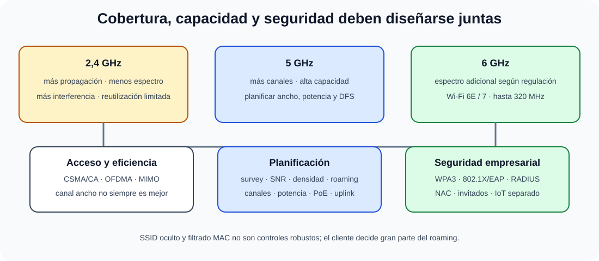

# Redes inalámbricas. Protocolos. Características funcionales y técnicas. Sistemas de expansión del espectro. Sistemas de acceso. Modos de operación. Seguridad. Normativa reguladora.

B4-T11 · Bloque 4 · Tema 11

Fuente: [GSI_A2 — BLOQUE IV — APUNTES COMPLETOS V2.1 REVISADOS — ESTUDIO (16 temas)](https://docs.google.com/document/d/1FMunz530TBBQnal_ttMprrZVGQ19wLAFksnJgEpd1os/edit) · IV.11 · V2.1 · 2026-08-21

**Cobertura oficial que debe quedar dominada:** Redes inalámbricas. Protocolos. Características funcionales y técnicas. Sistemas de expansión del espectro. Sistemas de acceso. Modos de operación. Seguridad. Normativa reguladora.

## 1. IEEE 802.11 y generaciones

802.11 define WLAN. Mapa útil: 802.11n → Wi-Fi 4; 802.11ac → Wi-Fi 5; 802.11ax → Wi-Fi 6 (6E al usar 6 GHz donde está permitido); 802.11be → Wi-Fi 7. Las denominaciones Wi-Fi son de industria/certificación; el estándar IEEE define PHY/MAC.

## 2. Bandas y canales

2,4 GHz: mayor propagación pero poco espectro y más interferencia. 5 GHz: más canales/capacidad y menor alcance típico. 6 GHz: espectro adicional donde regulación lo permite, con equipos compatibles. Anchos de 20/40/80/160 MHz y, con Wi‑Fi 7, hasta 320 MHz en 6 GHz según disponibilidad. Canales más anchos elevan pico pero consumen espectro y pueden empeorar reutilización.

## 3. Técnicas PHY

Históricamente DSSS/FHSS; OFDM en generaciones posteriores; OFDMA divide recursos entre estaciones, útil en densidad. MIMO usa múltiples antenas/streams; MU‑MIMO atiende varios clientes. Modulación más densa exige mayor SNR.

Wi-Fi 7/802.11be incorpora 320 MHz, 4096-QAM, Multi-Link Operation (MLO) y asignación más flexible de recursos; el examen debe entender beneficio, no memorizar tasas máximas de marketing.

## 4. Acceso al medio

Wi‑Fi usa CSMA/CA, no CSMA/CD: escucha, contención aleatoria y acknowledgements; RTS/CTS puede mitigar nodos ocultos. QoS 802.11e/WMM prioriza categorías. OFDMA añade programación más eficiente en ax/be.

## 5. Modos y arquitectura

BSS = conjunto básico alrededor de AP; ESS agrupa BSS con misma red/roaming. Ad-hoc/IBSS carece de AP central (histórico/limitado); mesh interconecta nodos inalámbricamente. En enterprise, control puede ser local, controlador o cloud; la función importa más que el formato.

## 6. Roaming y planificación RF

### Diseño Wi-Fi por capacidad, no solo por cobertura

_Relaciona física de radio, acceso compartido, movilidad y control de identidad._

**Qué debes recordar:** Canal más ancho o señal más fuerte no siempre mejora una WLAN densa; Wi-Fi usa CSMA/CA y la seguridad empresarial necesita identidad.

El cliente decide gran parte del roaming. 802.11k/v/r pueden ayudar con vecinos, steering y transición rápida. Diseño requiere site survey, potencia, canales, solapamiento, densidad, capacidad y fuentes de interferencia. “Señal fuerte” no equivale a buena WLAN si todos comparten aire saturado.

## 7. Seguridad

WEP y WPA antiguos son obsoletos/inseguros. WPA2 usa AES-CCMP en configuraciones modernas; WPA3 mejora autenticación y protección. En empresa: 802.1X/EAP con RADIUS, certificados cuando proceda, segmentación y NAC. Redes de invitados aisladas; IoT separado. Ocultar SSID o filtrar MAC no constituye seguridad robusta.

8. Datos y trampas de test

* Wi-Fi usa CSMA/CA, no CSMA/CD.
* SSID oculto ≠ seguridad.
* 2,4 GHz suele tener más alcance, pero menos espectro.
* Wi-Fi 6 = 802.11ax; Wi-Fi 7 = 802.11be.
* 6 GHz depende de regulación y equipo.
* Canal más ancho ≠ siempre mejor en alta densidad.
* WPA3/802.1X son preferibles en empresa; WEP está obsoleto.
* MLO es rasgo clave de Wi-Fi 7.

9. Aplicación al supuesto práctico

Diseña cobertura y capacidad mediante survey: número/ubicación de AP, canales/potencia, PoE y uplinks. Separa SSID corporativo, invitados e IoT; usa 802.1X/RADIUS, NAC, VLAN/VRF y políticas. Incluye redundancia del plano de control y monitorización de SNR, utilización, retransmisiones y roaming.

## Resumen

WLAN se diseña como un medio compartido de radio: bandas/canales, PHY/MAC, acceso, roaming, densidad y seguridad. Wi‑Fi 7 amplía capacidad y flexibilidad, pero no cambia los fundamentos de planificación RF.

**Fuentes base:** A1 114 v30.1 (05/09/2024) + actualización Wi‑Fi 7/IEEE 802.11be.

## Resumen de repaso

Fuente: [GSI_A2 — BLOQUE IV — RESUMEN MAESTRO DE REPASO (16 temas)](https://docs.google.com/document/d/1PRbZRedDj9j2D4jPlDODZUKkmbCqPWxMM4hhGhjcZIo/edit) · IV.11

### Núcleo de estudio

Wi-Fi se basa en IEEE 802.11. Conceptos: bandas 2,4/5/6 GHz, canales, ancho de canal, modulación, MIMO/OFDMA en generaciones modernas, potencia, roaming y planificación RF. 802.11ax corresponde a Wi-Fi 6/6E; 802.11be a Wi-Fi 7. Modos infraestructura y ad hoc; enterprise usa controladores/cloud según diseño. Seguridad actual: WPA2/WPA3, 802.1X/EAP y RADIUS para empresa; evita WEP y WPA antiguos. Planifica cobertura y capacidad, no solo señal; interferencia co-canal/adyacente y densidad importan.

### Claves de test

2,4 GHz suele dar mayor alcance pero menos canales/capacidad; 5/6 GHz más espectro. SSID no es mecanismo de seguridad. Ocultar SSID no protege. WPA3-Enterprise y 802.1X son preferibles en entornos corporativos.

### Enfoque para supuesto práctico

En supuesto separa SSID corporativo/invitados/IoT, usa 802.1X/NAC, segmentación, survey RF, redundancia de control, gestión y monitorización. Considera cableado/PoE de AP.

### Actualización 2026

Actualización 2026: incluir conceptualmente Wi-Fi 7/802.11be sin desplazar los fundamentos 802.11.

### Fuentes base del material

A1 114. Correspondencia DIRECTA.
