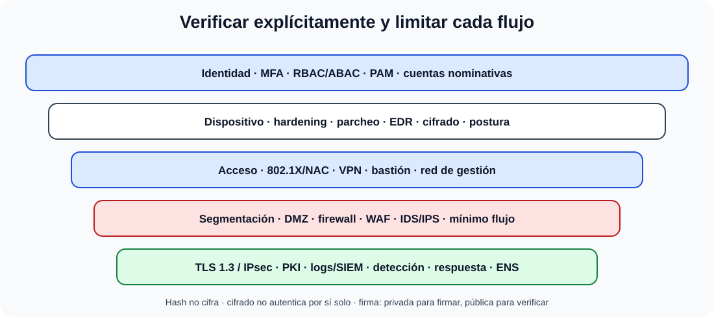

# La seguridad en redes. Seguridad perimetral. Control de accesos. Técnicas criptográficas y protocolos seguros. Mecanismos de firma digital. Redes privadas virtuales. Seguridad en el puesto del usuario.

B4-T12 · Bloque 4 · Tema 12

Fuente: [04 — BLOQUE IV — Sistemas y comunicaciones — GSI A2](https://docs.google.com/document/d/1MwEk2ye_u4RRHO3HP38gKX2yXjqAjzodtESKAOxDuv0/edit) · IV.12 · V2.1 · 2026-09-23

**Cobertura oficial que debe quedar dominada:** La seguridad en redes. Seguridad perimetral. Control de accesos. Técnicas criptográficas y protocolos seguros. Mecanismos de firma digital. Redes privadas virtuales. Seguridad en el puesto del usuario.

## 1. Arquitectura por capas y Zero Trust

### Defensa en profundidad desde identidad hasta respuesta

_Sitúa controles preventivos, detectivos y de respuesta alrededor del flujo real._

**Qué debes recordar:** Cifrado, autenticación, autorización, segmentación y detección son funciones distintas; Zero Trust elimina confianza implícita, no la red.

Seguridad en red aplica defensa en profundidad: segmentación, control de identidad, filtrado, cifrado, detección, endpoint, registro y respuesta. Zero Trust no significa “sin red interna”: significa no conceder confianza implícita por ubicación y verificar identidad, dispositivo, contexto y mínimo privilegio de forma continua.

## 2. Perímetro, DMZ y segmentación

DMZ aloja servicios expuestos separándolos de redes internas. Firewall **stateless** filtra por reglas de paquete; **stateful** sigue estado de conexión; NGFW añade identificación de aplicaciones/usuarios y otras funciones. Proxy intermedia tráfico; WAF protege aplicaciones web HTTP; IDS detecta, IPS puede bloquear. La segmentación limita movimiento lateral.

## 3. AAA, NAC y administración

AAA = Authentication, Authorization, Accounting. RADIUS se usa ampliamente para acceso de red/802.1X; TACACS+ es frecuente en administración de dispositivos. 802.1X separa supplicant, authenticator y servidor AAA. NAC aplica identidad/postura y políticas.

La administración debe usar MFA, RBAC, cuentas nominativas, bastión/PAM, protocolos seguros, red de gestión y logs. Deshabilitar Telnet/HTTP inseguros cuando existan alternativas.

## 4. Criptografía

Simétrica (AES): misma clave, eficiente para volumen. Asimétrica (RSA/ECC): par pública/privada, útil para firma/intercambio/autenticación. Hash (SHA-2/SHA-3): huella unidireccional, no cifra. HMAC combina hash y secreto para autenticidad/integridad.

La seguridad depende de algoritmos, tamaños, modos, generación/almacenamiento de claves y protocolo. “Usar criptografía” sin gestión de claves no resuelve el riesgo.

## 5. PKI, certificados y firma digital

Una PKI gestiona CA, certificados, claves, políticas, revocación/estado (CRL/OCSP) y ciclo de vida. En firma digital, el firmante genera una firma con su clave privada sobre el hash/estructura definida; se verifica con la pública/certificado. Aporta autenticidad e integridad y puede sustentar no repudio en el marco jurídico/procedimental adecuado.

## 6. TLS, SSH e IPsec

TLS protege protocolos de aplicación. En julio de 2026, RFC 9846 volvió a especificar TLS 1.3 y **obsoletó RFC 8446**; para examen importa TLS 1.3 y sus propiedades modernas (AEAD, handshake y eliminación de algoritmos legados), no memorizar cada cambio editorial.

SSH protege administración remota; IPsec protege tráfico IP mediante arquitectura de seguridad con AH/ESP (en la práctica ESP es central) y modos transporte/túnel. No confundir TLS con IPsec: operan en capas y escenarios diferentes.

## 7. VPN

VPN site-to-site conecta redes; acceso remoto conecta usuario/dispositivo. Puede basarse en IPsec o TLS/tecnologías asociadas. Debe autenticar fuerte, limitar rutas/recursos, registrar y evaluar endpoint. Split tunneling reduce carga pero cambia riesgo; decidir por política.

## 8. Puesto de usuario

Hardening, parcheo, EDR/antimalware, cifrado de disco, firewall local, control de aplicaciones, mínimo privilegio, navegador seguro, bloqueo, MFA, protección de credenciales, MDM/UEM en móviles y copias de datos cuando corresponda. Una VPN no protege un endpoint ya comprometido.

## 9. ENS

En sector público español, el RD 311/2022 regula el ENS. Su texto consolidado vigente a esta revisión mantiene principios como seguridad integral, gestión basada en riesgos, prevención/detección/respuesta/conservación, líneas de defensa, vigilancia continua y diferenciación de responsabilidades. Las medidas se agrupan en marco organizativo, operacional y protección.

Microdatos oficiales de alta rentabilidad

- IKE/IKEv2 es componente de IPsec: realiza autenticación mutua y establece/mantiene Security Associations (SA). AH y ESP son protocolos IPsec; HMAC es un mecanismo criptográfico, no un protocolo IPsec.

- DLP (Data Loss Prevention) busca prevenir/detectar fugas o exfiltración de información mediante políticas sobre datos en uso, tránsito o reposo según solución.

- UTM integra varias funciones de seguridad —por ejemplo firewall, antimalware, filtrado— en una misma plataforma/dispositivo.

- C&C/C2 es la infraestructura desde la que un atacante puede enviar órdenes a equipos comprometidos. Smishing es phishing mediante SMS/mensajería móvil.

- SIEM combina gestión/correlación de información y eventos de seguridad. DDoS usa múltiples orígenes/dispositivos para agotar recursos o disponibilidad del objetivo.

- Nessus se estudia hoy como herramienta de evaluación/escaneo de vulnerabilidades de Tenable; no memorices como vigente la etiqueta «open source» que apareció en una pregunta antigua.

10. Datos y trampas de test

* Hash ≠ cifrado.
* Firma se genera con clave privada y se verifica con pública.
* Cifrado no implica por sí solo autenticación.
* Firewall stateful ≠ WAF.
* IDS detecta; IPS puede actuar/bloquear.
* RADIUS es típico en acceso 802.1X; TACACS+ en administración de dispositivos.
* MPLS ≠ VPN cifrada por sí misma.
* TLS 1.3 sigue siendo versión moderna; RFC 9846 (julio 2026) obsoleta RFC 8446.
* VPN ≠ endpoint seguro.

11. Aplicación al supuesto práctico

Parte de datos/servicios y riesgo: zonas/DMZ, firewalls, WAF/IDS/IPS, NAC/802.1X, AAA, MFA/PAM, cifrado y PKI, VPN/Zero Trust, EDR y SIEM. Mapea controles al ENS cuando aplique. Dibuja flujos permitidos y evita “allow any”; incluye gestión de certificados, logs y respuesta.

## Resumen

La seguridad en red no es un producto: es arquitectura de confianza mínima, control de accesos, criptografía correcta, segmentación, detección y endpoint endurecido, alineados con riesgo y ENS.

**Fuentes base:** A1 125 v30.1 (09/09/2024) + A1 079/080/131 + RD 311/2022 ENS/CCN.

## Resumen de repaso

Fuente: [GSI_A2 — BLOQUE IV — RESUMEN MAESTRO DE REPASO (16 temas)](https://docs.google.com/document/d/1PRbZRedDj9j2D4jPlDODZUKkmbCqPWxMM4hhGhjcZIo/edit) · IV.12

### Núcleo de estudio

Arquitectura segura aplica segmentación, DMZ, firewalls stateful/NGFW, proxies/WAF, IDS/IPS, NAC, DNS seguro, VPN y Zero Trust como enfoque de verificación continua. IAM: identidad, autenticación, MFA, autorización RBAC/ABAC y mínimo privilegio. Criptografía simétrica (AES) para datos; asimétrica (RSA/ECC) para intercambio/firma; hash (SHA-2/3) para integridad; PKI gestiona certificados, CA, revocación OCSP/CRL. TLS protege transporte; IPsec protege capa IP; VPN puede ser site-to-site o acceso remoto. Firma digital combina hash y clave privada y aporta autenticidad/integridad/no repudio en el contexto adecuado. Puesto: hardening, EDR, cifrado, parcheo, control de aplicaciones y privilegios.

### Claves de test

Cifrar no autentica automáticamente; hash no cifra; firma se crea con clave privada y se verifica con pública. TLS 1.3 es la versión moderna estandarizada. VPN no hace seguro un endpoint comprometido.

### Enfoque para supuesto práctico

En supuesto diseña zonas, reglas de mínimo acceso, MFA, bastión/PAM, WAF, SIEM, EDR, VPN/Zero Trust, PKI y respuesta. Relaciona medidas con ENS y riesgo.

### Fuentes base del material

A1 125 + 079 + 080 + 131, ENS/CCN-STIC.
