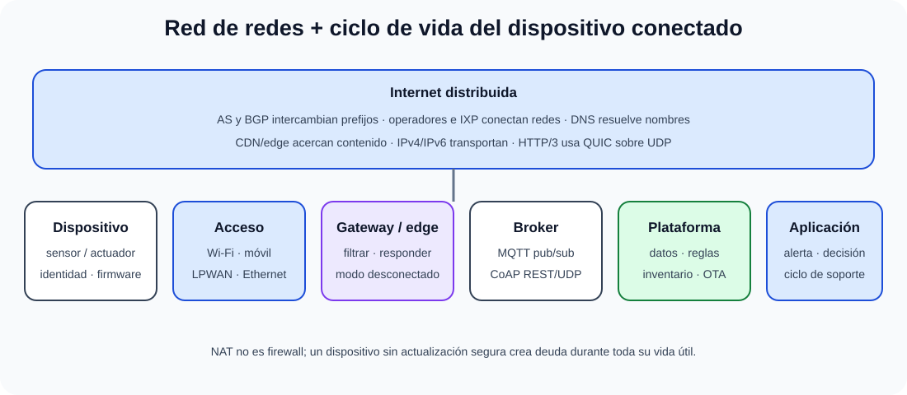

# La red Internet: arquitectura de red. Principios de funcionamiento. Servicios: evolución, estado actual y perspectivas de futuro. Internet de las Cosas (IoT).

B4-T13 · Bloque 4 · Tema 13

Fuente: [GSI_A2 — BLOQUE IV — APUNTES COMPLETOS V2.1 REVISADOS — ESTUDIO (16 temas)](https://docs.google.com/document/d/1FMunz530TBBQnal_ttMprrZVGQ19wLAFksnJgEpd1os/edit) · IV.13 · V2.1 · 2026-08-21

**Cobertura oficial que debe quedar dominada:** La red Internet: arquitectura de red. Principios de funcionamiento. Servicios: evolución, estado actual y perspectivas de futuro. Internet de las Cosas (IoT).

## 1. Internet como red de redes

Internet interconecta sistemas autónomos (AS) mediante IP. Un AS aplica política de routing común y se identifica con ASN. Operadores ofrecen tránsito; redes pueden hacer peering en IXP. BGP distribuye prefijos entre AS. La resiliencia depende de diversidad de rutas, DNS, proveedores y servicios, no de un único “backbone central”.

## 2. Direccionamiento, NAT e IPv6

IPv4 usa espacio limitado y NAT se ha extendido para conservar direcciones; IPv6 aporta 128 bits y autoconfiguración/ND, entre otras capacidades. Dual stack permite transición. NAT no es un control de seguridad equivalente a firewall y puede complicar extremo-a-extremo.

## 3. DNS, CDN y servicios

DNS es jerárquico/distribuido: resolvers consultan servidores autoritativos siguiendo delegaciones y caché. CDN acerca contenido/servicios a usuarios y reduce latencia/carga del origen. Servicios clásicos: HTTP(S), SMTP/IMAP, DNS, SSH, NTP, transferencia y APIs.

## 4. HTTP/2, HTTP/3 y QUIC

HTTP/2 multiplexa flujos sobre una conexión TCP con framing binario. HTTP/3 (RFC 9114) transporta semántica HTTP sobre QUIC. QUIC v1 (RFC 9000) usa UDP como sustrato, integra seguridad mediante TLS y ofrece streams, control de flujo y establecimiento de baja latencia. HTTP/3 reduce bloqueo entre streams causado por pérdidas a nivel TCP, aunque no elimina congestión ni pérdida física.

## 5. Servicios y perspectivas

Evolución: cifrado por defecto, CDN/edge, cloud, APIs, IPv6, automatización de red, HTTP/3/QUIC y mayor observabilidad. Las tendencias deben estudiarse como arquitectura, no como predicción comercial. La soberanía, resiliencia y dependencia de terceros importan en servicios públicos.

## 6. Arquitectura IoT

### Internet distribuida y ciclo de un servicio IoT

_Conecta la arquitectura global de Internet con el recorrido y ciclo de vida de un dispositivo IoT._

**Qué debes recordar:** BGP intercambia rutas y DNS nombres; en IoT, inventario, credenciales únicas y firmware actualizable son tan esenciales como la conectividad.

Capas prácticas: dispositivo/sensor-actuador → conectividad → gateway/edge → plataforma/broker → almacenamiento/procesamiento → aplicación. El edge reduce latencia/tráfico y puede funcionar ante desconexión; cloud aporta escala y servicios centrales.

## 7. Protocolos IoT

MQTT usa patrón publish/subscribe mediante broker, ligero y común en telemetría. CoAP es protocolo RESTful ligero sobre UDP para dispositivos restringidos. HTTP sigue siendo viable en dispositivos más capaces. Redes de acceso pueden incluir Wi-Fi, Ethernet, celular, LPWAN u otras según alcance/energía/coste.

## 8. Seguridad y ciclo de vida IoT

Identidad única, credenciales no por defecto, secure boot cuando aplique, firmware firmado/OTA, segmentación, mínimos servicios, inventario, logs, cifrado, privacidad y fin de soporte. Dispositivo que no puede actualizarse es una deuda de seguridad durante años.

9. Datos y trampas de test

* Internet ≠ Web.
* BGP conecta/intercambia rutas entre AS; DNS resuelve nombres.
* NAT ≠ firewall.
* HTTP/3 usa QUIC; QUIC v1 se define en RFC 9000.
* HTTP/3 = RFC 9114.
* DNS es jerárquico y cacheado.
* MQTT suele usar broker y pub/sub; CoAP es REST ligero sobre UDP.
* IoT requiere actualización e identidad, no solo conectividad.

10. Aplicación al supuesto práctico

Diseña Internet de un servicio público con doble conectividad, DNS autoritativo/resolución, CDN/WAF si procede, protección DDoS, IPv6 planificado, TLS, monitorización y rutas. Para IoT: red separada, identidad/certificados, broker, OTA firmado, inventario, gateway/edge y ciclo de vida.

## Resumen

Internet funciona mediante interconexión de AS, routing BGP y servicios distribuidos como DNS/CDN. Su evolución actual incluye QUIC/HTTP3 e IoT, donde seguridad y ciclo de vida son tan importantes como conectividad.

**Fuentes base:** A1 109/115/117 + RFC 9000 (QUIC) y RFC 9114 (HTTP/3) como actualización.

## Resumen de repaso

Fuente: [GSI_A2 — BLOQUE IV — RESUMEN MAESTRO DE REPASO (16 temas)](https://docs.google.com/document/d/1PRbZRedDj9j2D4jPlDODZUKkmbCqPWxMM4hhGhjcZIo/edit) · IV.13

### Núcleo de estudio

Internet es una red de redes basada en IP y sistemas autónomos interconectados mediante BGP. Arquitectura distribuida con DNS, operadores/ISP, IXPs, CDNs, centros de datos y redes de acceso. Servicios/protocolos: web HTTP/HTTPS, correo SMTP/IMAP, DNS, SSH, transferencia, NTP y APIs. Evolución incluye IPv6, CDN/edge, HTTP/2 y HTTP/3 sobre QUIC, cloud y cifrado generalizado. IoT conecta sensores/actuadores con gateways, plataformas y servicios; protocolos posibles MQTT, CoAP, HTTP y redes específicas. Riesgos: credenciales débiles, firmware, exposición, privacidad, escalabilidad y vida útil.

### Claves de test

Internet ≠ Web; DNS es jerárquico/distribuido; BGP conecta sistemas autónomos; HTTP/3 usa QUIC sobre UDP. IoT necesita identidad, actualización y segmentación, no solo conectividad.

### Enfoque para supuesto práctico

En supuesto usa DNS/CDN/WAF, doble conectividad, IPv6 planificado, TLS, observabilidad y protección DDoS. Para IoT separa red, gestiona certificados/dispositivos, firmware OTA, broker y ciclo de vida.

### Fuentes base del material

A1 109 + 115 + 117.
