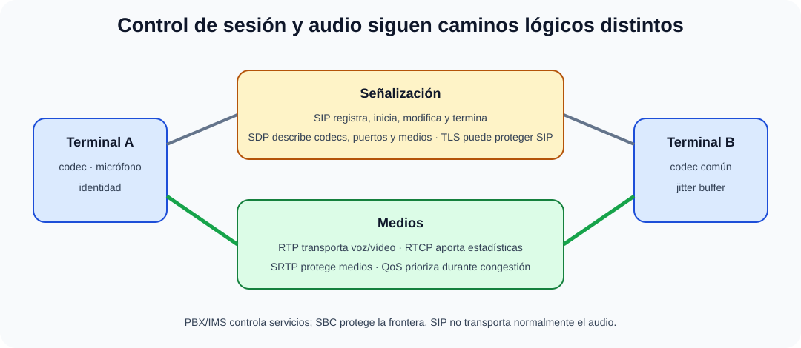

# Redes de nueva generación y servicios convergentes (NGN/IMS). VoIP, ToIP y comunicaciones unificadas. Convergencia telefonía fija-telefonía móvil.

B4-T14 · Bloque 4 · Tema 14

Fuente: [04 — BLOQUE IV — Sistemas y comunicaciones — GSI A2](https://docs.google.com/document/d/1MwEk2ye_u4RRHO3HP38gKX2yXjqAjzodtESKAOxDuv0/edit) · IV.14 · V2.1 · 2026-09-23

**Cobertura oficial que debe quedar dominada:** Redes de nueva generación y servicios convergentes (NGN/IMS). VoIP, ToIP y comunicaciones unificadas. Convergencia telefonía fija-telefonía móvil.

## 1. NGN

Next Generation Network busca ofrecer múltiples servicios sobre una infraestructura IP con separación entre transporte y control/servicios, QoS y movilidad. Sustituye la idea de redes verticales independientes por una plataforma convergente.

## 2. IMS

IP Multimedia Subsystem es una arquitectura 3GPP para controlar sesiones multimedia IP. Conceptualmente separa acceso de control de sesión y servicios. Entidades clásicas: P-CSCF (primer punto de contacto), I-CSCF (entrada/consulta) y S-CSCF (control de sesión/registro), junto con repositorios de abonado como HSS en arquitecturas tradicionales. En 5G hay evolución de funciones/datos, pero GSI debe dominar la lógica IMS, no memorizar cada release.

## 3. SIP y SDP

### Señalización y medios en VoIP

_Separa control de sesión, descripción de medios y transporte de voz._

**Qué debes recordar:** SIP señaliza, SDP describe y RTP transporta; SBC aplica política de frontera y QoS administra congestión sin crear capacidad.

SIP señaliza: registra usuarios, inicia, modifica y termina sesiones. Métodos típicos INVITE, ACK, BYE, REGISTER, OPTIONS; respuestas siguen familias 1xx–6xx. SDP describe medios/códecs/puertos dentro de señalización; no transporta audio.

## 4. RTP/RTCP y códecs

RTP transporta medios en tiempo real sobre UDP habitualmente; RTCP aporta estadísticas/control. Códecs como G.711 o compresores modernos determinan bitrate, calidad, CPU y robustez. El ancho real añade overhead IP/UDP/RTP y, según red, Ethernet/VPN.

## 5. SBC, NAT y seguridad

Session Border Controller protege/intermedia fronteras SIP/medios, normaliza señalización, oculta topología, aplica políticas y ayuda con NAT. Seguridad: TLS para SIP cuando se usa, SRTP para medios, autenticación, límites anti-fraude, segmentación y logs. Exponer PBX/SIP sin controles facilita abuso.

## 6. ToIP y comunicaciones unificadas

VoIP = voz sobre IP; ToIP suele referirse al sistema de telefonía corporativa completo sobre IP (terminales, PBX, numeración, servicios). UC integra voz, vídeo, mensajería, presencia, reuniones y colaboración con identidad/directorio.

## 7. QoS

Voz es sensible a latencia, jitter y pérdida. QoS clasifica/marca (p. ej. DSCP), prioriza colas y evita congestión. Un jitter buffer absorbe variación a costa de latencia. QoS debe ser coherente extremo a extremo; no crea ancho de banda.

## 8. Convergencia fijo-móvil

Busca continuidad de identidad/servicios entre acceso fijo y móvil: número/usuario, presencia, llamada, mensajería y políticas. IMS es una pieza histórica/arquitectónica clave. En diseño actual puede integrarse UC cloud/on-prem, móvil y SIP trunks manteniendo seguridad y continuidad.

Microdatos oficiales de alta rentabilidad

- H.323 emplea codificación binaria ASN.1 en buena parte de su señalización; SIP es un protocolo textual de señalización.

- SIP está definido principalmente por RFC 3261; SDP, usado para describir sesiones y medios, por RFC 4566.

- G.729 es un códec de voz ITU-T de baja tasa; es un ejemplo clásico de examen junto a G.711.

- Diameter es un protocolo/marco AAA (Authentication, Authorization and Accounting) utilizado en arquitecturas móviles/IMS; SIP sigue siendo la señalización de sesiones.

9. Datos y trampas de test

* SIP señaliza; RTP transporta medios.
* SDP describe sesión/medios; no es codec.
* VoIP puede existir sin IMS.
* VoIP ≠ ToIP como alcance conceptual.
* QoS no crea ancho de banda.
* SBC ≠ PBX; tiene función de frontera/política.
* RTCP complementa RTP con control/estadísticas.
* P-CSCF/I-CSCF/S-CSCF son funciones IMS clásicas.

10. Aplicación al supuesto práctico

Calcula llamadas simultáneas y bitrate con overhead/margen; diseña PBX/UC redundante, SIP trunk dual, SBC, VLAN voz, QoS extremo a extremo, directorio/MFA de administración, TLS/SRTP cuando aplique, grabación/retención legal si se solicita y continuidad. Separa señalización de medios en el diagrama.

## Resumen

NGN/IMS explican la convergencia de servicios IP; SIP/SDP controlan sesiones y RTP/RTCP los medios. Una ToIP empresarial necesita QoS, SBC, seguridad, redundancia y operación.

**Fuentes base:** A1 116 (24/09/2024, tema 16 págs.) como fuente principal.

## Resumen de repaso

Fuente: [GSI_A2 — BLOQUE IV — RESUMEN MAESTRO DE REPASO (16 temas)](https://docs.google.com/document/d/1PRbZRedDj9j2D4jPlDODZUKkmbCqPWxMM4hhGhjcZIo/edit) · IV.14

### Núcleo de estudio

NGN integra servicios sobre redes IP con separación entre transporte y control/servicio. IMS (IP Multimedia Subsystem) proporciona arquitectura de control de sesiones multimedia basada en SIP y componentes de núcleo. VoIP transporta voz sobre IP; ToIP suele referirse a telefonía corporativa basada en IP, terminales y PBX/IP. SIP establece/modifica/termina sesiones; RTP transporta medios y RTCP aporta control; codecs convierten voz y condicionan ancho de banda/calidad. Comunicaciones unificadas integran voz, vídeo, mensajería, presencia y colaboración. QoS usa priorización, colas, marcado y control de congestión; latencia, jitter y pérdida afectan voz.

### Claves de test

SIP no transporta normalmente audio; RTP sí. Codec ≠ protocolo de señalización. VoIP puede existir sin IMS. MOS es medida de calidad percibida. QoS no crea ancho de banda, gestiona prioridades.

### Enfoque para supuesto práctico

En supuesto dimensiona llamadas simultáneas, codecs, SBC, SIP trunk, redundancia, QoS, VLAN voz, seguridad, grabación/retención si aplica y continuidad.

### Fuentes base del material

A1 116. Correspondencia DIRECTA.
