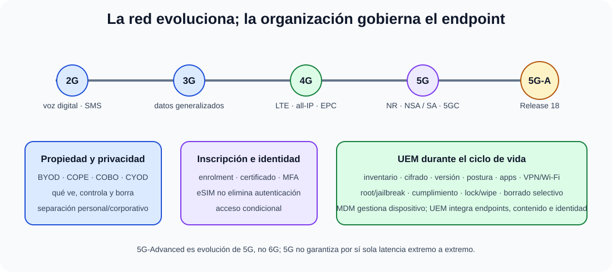

# Sistemas de comunicaciones móviles. Generaciones de tecnologías de telefonía móvil. Soluciones de gestión de dispositivos móviles (MDM, EMM, UEM).

B4-T15 · Bloque 4 · Tema 15

Fuente: [04 — BLOQUE IV — Sistemas y comunicaciones — GSI A2](https://docs.google.com/document/d/1MwEk2ye_u4RRHO3HP38gKX2yXjqAjzodtESKAOxDuv0/edit) · IV.15 · V2.1 · 2026-09-23

**Cobertura oficial que debe quedar dominada:** Sistemas de comunicaciones móviles. Generaciones de tecnologías de telefonía móvil. Soluciones de gestión de dispositivos móviles (MDM, EMM, UEM).

## 1. Evolución de generaciones

| **Generación** | **Idea dominante** | **Arquitectura/servicio** |
| --- | --- | --- |
| 2G | voz digital + SMS | GSM; datos limitados con GPRS/EDGE como evolución |
| 3G | datos móviles generalizados | UMTS/HSPA; voz aún con dominio tradicional |
| 4G | banda ancha all-IP | LTE + EPC; VoLTE/IMS para voz |
| 5G | NR, mayor capacidad/latencia/densidad | 5GC, SA/NSA, eMBB/URLLC/mMTC como familias de servicio |

## 2. Acceso radio y core

Una red móvil separa acceso radio (estaciones/celdas y UE) y core (movilidad, sesión, autenticación, salida a datos y servicios). Handover mantiene sesión al cambiar de celda. SIM/eSIM almacena identidad/credenciales; eSIM cambia aprovisionamiento, no elimina autenticación.

## 3. LTE y 5G

LTE se apoya en E-UTRAN y EPC. 5G introduce NR y 5G Core con arquitectura más basada en servicios. **NSA** combina NR con infraestructura LTE/EPC en despliegues; **SA** usa 5G Core. Network slicing permite redes lógicas con características diferenciadas sobre infraestructura común, sujeto a implementación.

## 4. 5G-Advanced

3GPP considera Release 18 la primera release de **5G-Advanced**. Aporta mejoras sobre 5G en radio, posicionamiento, RedCap, XR, energía y otros ámbitos. Para GSI basta entender que es evolución de 5G, no “6G”, y evitar memorizar largas listas de features/releases.

## 5. Modelos de propiedad

BYOD: dispositivo del empleado; COPE: corporativo con uso personal permitido; COBO: corporativo solo negocio; CYOD: usuario elige de catálogo corporativo. Cada modelo cambia privacidad, soporte, borrado y controles.

## 6. MDM, MAM, MCM, EMM y UEM

### Evolución móvil y gestión unificada del endpoint

_Distingue evolución de red móvil de gobierno corporativo del dispositivo._

**Qué debes recordar:** 5G SA y NSA no son lo mismo; MDM gestiona dispositivo y UEM integra además identidad, aplicaciones, contenido y endpoints diversos.

MDM administra dispositivo (enrolment, perfiles, cifrado, bloqueo/borrado, inventario). MAM gestiona aplicaciones; MCM contenido; EMM integra capacidades móviles; UEM amplía gestión unificada a endpoints móviles y tradicionales. Los límites varían por proveedor, pero la evolución conceptual es examinable.

## 7. Controles de UEM

Inscripción corporativa, cumplimiento (versión, cifrado, root/jailbreak), certificados/Wi-Fi/VPN, distribución de apps, configuración de correo, inventario, restricciones, remote lock/wipe, borrado selectivo, contenedor/perfil de trabajo y acceso condicional ligado a identidad.

## 8. Seguridad y privacidad

MFA, certificados, attestation/postura, cifrado, actualización, protección antiphishing, tienda controlada y separación personal/corporativa. En BYOD debe limitarse la recogida de datos y comunicar qué puede ver/borrar la organización.

Microdatos oficiales de alta rentabilidad

- UMTS/3G utiliza WCDMA en su interfaz radio UTRA.

- LTE usa OFDMA en el enlace descendente; en el ascendente clásico emplea SC-FDMA. No memorices «LTE = OFDMA» sin distinguir dirección.

- Network slicing se apoya en una arquitectura de red fuertemente software/virtualizada para crear redes lógicas con características diferenciadas.

- Geofencing define una frontera geográfica virtual y permite disparar políticas, avisos o acciones según entrada/salida/ubicación del dispositivo.

9. Datos y trampas de test

* 2G ≠ 3G ≠ LTE/4G; estudia evolución de voz/datos/core.
* 5G NSA ≠ SA.
* Release 18 = primera release 5G-Advanced.
* MDM ≠ antivirus.
* MDM ⊂ concepto más amplio EMM/UEM en la evolución habitual.
* BYOD/COPE/COBO/CYOD son modelos de propiedad/uso.
* eSIM no elimina autenticación de red.
* 5G no garantiza por sí solo baja latencia extremo a extremo.

10. Aplicación al supuesto práctico

Define si el parque es COPE/COBO/BYOD, UEM, enrolment, certificados, MFA, acceso condicional, perfiles Wi-Fi/VPN, apps, compliance, cifrado, borrado selectivo y privacidad. Para conectividad crítica explica 4G/5G, cobertura, redundancia, roaming y dependencia de operador.

## Resumen

Las generaciones móviles evolucionan acceso radio y core hasta 5G/5G-Advanced. La gestión empresarial se desplaza de MDM a UEM, integrando identidad, configuración, aplicaciones, cumplimiento y ciclo de vida.

**Fuentes base:** A1 123 v31.1 (15/02/2026) + A1 054/124; 3GPP Release 18 como actualización.

## Resumen de repaso

Fuente: [GSI_A2 — BLOQUE IV — RESUMEN MAESTRO DE REPASO (16 temas)](https://docs.google.com/document/d/1PRbZRedDj9j2D4jPlDODZUKkmbCqPWxMM4hhGhjcZIo/edit) · IV.15

### Núcleo de estudio

Generaciones: 2G digital voz/SMS; 3G datos móviles; 4G/LTE all-IP y banda ancha; 5G NR mejora capacidad, latencia, densidad y habilita eMBB, URLLC/mMTC conceptualmente. 5G-Advanced se asocia a evolución de Releases 18 en adelante. Arquitectura móvil incluye acceso radio, core, SIM/eSIM, handover y mecanismos de autenticación. MDM gestiona dispositivos; EMM amplía a apps/contenido/identidad; UEM unifica gestión de endpoints móviles y tradicionales. Capacidades: enrolment, políticas, cifrado, certificados, inventario, compliance, remote lock/wipe, separación de datos corporativos y gestión de aplicaciones.

### Claves de test

MDM ≠ antivirus; BYOD/COPE/COBO son modelos de propiedad/uso; eSIM no elimina autenticación de red. 5G no significa siempre baja latencia extremo a extremo. UEM es evolución más amplia que MDM.

### Enfoque para supuesto práctico

En supuesto define modelo corporativo/BYOD, UEM, MFA/certificados, compliance, VPN/Zero Trust, container corporativo, borrado selectivo, actualización y privacidad del empleado.

### Actualización 2026

Actualización 2026: tratar 5G-Advanced como evolución de 5G; evitar memorizar releases salvo concepto.

### Fuentes base del material

A1 123 + 054 + 124.
