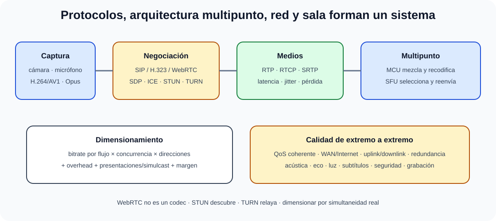

# Sistemas de videoconferencia. Protocolos. Dimensionamiento y calidad de servicio en las comunicaciones y acondicionamiento de salas y equipos.

B4-T16 · Bloque 4 · Tema 16

Fuente: [GSI_A2 — BLOQUE IV — APUNTES COMPLETOS V2.1 REVISADOS — ESTUDIO (16 temas)](https://docs.google.com/document/d/1FMunz530TBBQnal_ttMprrZVGQ19wLAFksnJgEpd1os/edit) · IV.16 · V2.1 · 2026-08-21

**Cobertura oficial que debe quedar dominada:** Sistemas de videoconferencia. Protocolos. Dimensionamiento y calidad de servicio en las comunicaciones y acondicionamiento de salas y equipos.

## 1. Arquitectura

Cadena: captura de audio/vídeo → codificación → señalización/negociación → transporte de medios → mezcla/reenviado multipunto → decodificación/presentación. Una solución puede ser punto a punto, MCU/SFU on-prem o servicio cloud. La arquitectura condiciona ancho de banda y resiliencia.

## 2. SIP, H.323 y WebRTC

H.323 es suite histórica ITU-T para multimedia sobre redes de paquetes; SIP es señalización IETF ampliamente usada. Ambos pueden negociar sesiones; RTP/RTCP transporta/controla medios. WebRTC permite comunicación en navegador/app con APIs y un conjunto de protocolos seguros; **WebRTC no es un codec**.

## 3. SDP, RTP/RTCP y NAT traversal

SDP describe codecs, direcciones/puertos y parámetros. RTP transporta audio/vídeo; RTCP aporta calidad/estadísticas. Para atravesar NAT/firewall en WebRTC se usan ICE como marco de candidatos, STUN para descubrir mapeos y TURN como relay cuando la conectividad directa falla.

## 4. Códecs

Vídeo: H.264/AVC, H.265/HEVC, VP8/VP9, AV1 según plataforma/licencia/capacidad. Audio: Opus y familias tradicionales. Más compresión reduce bitrate a costa de CPU/latencia/compatibilidad. La interoperabilidad exige negociar un conjunto común.

## 5. MCU y SFU

MCU recibe, decodifica/compone y vuelve a codificar una mezcla; reduce streams al cliente pero consume servidor y puede añadir latencia. SFU reenvía streams/capas seleccionadas sin mezcla completa; desplaza más trabajo al cliente/red y escala bien en WebRTC. La elección depende de terminales, grabación, layouts y escala.

## 6. Dimensionamiento

### Videoconferencia: señalización, medios y dimensionamiento

_Une protocolos, arquitectura multipunto, red y cálculo de capacidad._

**Qué debes recordar:** WebRTC no es un codec; SIP y H.323 señalizan, RTP transporta, TURN relaya y el ancho de banda se calcula por flujos simultáneos.

Capacidad aproximada = bitrate de cada flujo × concurrencia × direcciones + overhead + margen. En una sede con N reuniones, no se multiplica por usuarios totales si no son simultáneos. Considerar subida y bajada, presentaciones, simulcast/SVC y tráfico a cloud.

**Ejemplo:** 20 salas simultáneas a 3 Mb/s de vídeo+audio por sentido hacia cloud ≈ 60 Mb/s de subida y 60 Mb/s de bajada antes de overhead/margen. Con 30% de margen, reservar ~78 Mb/s por sentido, además de otros servicios.

## 7. QoS y calidad

Latencia extremo a extremo, jitter, pérdida y bitrate afectan calidad. Jitter buffer suaviza variación a costa de retardo. QoS clasifica/marca y prioriza; la medición puede incluir RTT, packet loss, jitter, frame rate y MOS/estimaciones. QoS solo funciona si la ruta respeta políticas.

## 8. Sala

Cámara con encuadre adecuado, micrófonos y altavoces con cancelación de eco, pantalla proporcional, iluminación frontal uniforme, tratamiento acústico, posición de participantes, red cableada preferente, alimentación y control. La experiencia depende más de audio claro que de resolución extrema.

## 9. Seguridad y accesibilidad

Identidad/SSO/MFA para administración y reuniones sensibles, cifrado en tránsito, controles de invitados/lobby, actualización, permisos de grabación, retención, privacidad y logs. Accesibilidad: subtitulado, transcripción, compatibilidad con ayudas y alternativas cuando proceda.

10. Datos y trampas de test

* SIP/H.323 = señalización/control; RTP = medios.
* WebRTC ≠ codec.
* Jitter = variación de retardo.
* MCU ≠ SFU.
* STUN ≠ TURN; TURN relaya tráfico cuando es necesario.
* QoS no crea ancho de banda.
* Dimensionar por concurrencia real, no por usuarios totales.
* Audio deficiente suele arruinar más una reunión que vídeo de menor resolución.

11. Aplicación al supuesto práctico

Calcula concurrencia y bitrate con overhead/margen; define WAN/Internet y QoS, redundancia, SBC/gateway si interopera con SIP, plataforma cloud/on-prem, seguridad, grabación, monitorización y diseño de salas. Incluye STUN/TURN/ICE si WebRTC y requisitos de accesibilidad.

## Resumen

Videoconferencia combina protocolos, codecs, red y sala. Para un supuesto, el valor está en calcular concurrencia, controlar latencia/jitter/pérdida, garantizar interoperabilidad y diseñar una experiencia operable y segura.

**Fuentes base:** A1 130 (06/09/2024, resumen 11 págs.) + A1 129; actualización WebRTC/NAT traversal.

12. Puertos, protocolos y siglas de alta rentabilidad

Los puertos indicados son valores bien conocidos por defecto; pueden cambiarse y algunos protocolos usan rangos/datos dinámicos. Memorizar el servicio y la función es más importante que creer que el puerto identifica siempre una aplicación.

| **Servicio / protocolo** | **Puerto habitual** | **Transporte / nota** |
| --- | --- | --- |
| SSH | 22 | TCP |
| DNS | 53 | UDP/TCP; DNS moderno puede usar transportes cifrados adicionales |
| DHCPv4 servidor/cliente | 67/68 | UDP |
| HTTP | 80 | TCP |
| HTTPS | 443 | TCP; HTTP/3 usa QUIC sobre UDP 443 habitualmente |
| NTP | 123 | UDP |
| SNMP | 161 | UDP consultas/agente |
| SNMP traps | 162 | UDP habitual |
| LDAP | 389 | TCP/UDP según uso; STARTTLS posible |
| LDAPS | 636 | TCP TLS directo |
| SMB | 445 | TCP |
| RADIUS auth/accounting | 1812/1813 | UDP habitual |
| SIP | 5060 | UDP/TCP habitual sin TLS |
| SIP TLS | 5061 | TCP/TLS habitual |
| Syslog | 514 | UDP tradicional; despliegues seguros pueden usar TLS/otros puertos |

## Siglas que deben salir sin pensar

| **Sigla** | **Significado / función** |
| --- | --- |
| RPO | Recovery Point Objective: pérdida máxima de datos objetivo |
| RTO | Recovery Time Objective: tiempo objetivo de recuperación |
| SLI/SLO/SLA | indicador / objetivo / acuerdo |
| IOPS | operaciones de E/S por segundo |
| HA/DR | alta disponibilidad / recuperación ante desastres |
| MIB/OID | base de información de gestión / identificador de objeto SNMP |
| AAA | autenticación, autorización y accounting |
| NAC | Network Access Control |
| PKI | infraestructura de clave pública |
| MPLS | Multiprotocol Label Switching |
| WDM | Wavelength Division Multiplexing |
| MLO | Multi-Link Operation de Wi-Fi 7 |
| IMS | IP Multimedia Subsystem |
| SBC | Session Border Controller |
| UEM | Unified Endpoint Management |
| MCU/SFU | dos arquitecturas de multipunto en vídeo |

13. Checklist para el segundo ejercicio

Cuando un supuesto pida infraestructura o comunicaciones, responde en capas para no olvidar requisitos:

* **Requisitos:** usuarios, sedes, carga, concurrencia, datos, latencia, disponibilidad, RPO/RTO, crecimiento, normativa.
* **Arquitectura:** zonas, compute, storage, red, acceso, Internet/WAN, servicios de infraestructura.
* **Disponibilidad:** dominios de fallo, N+1/2N donde proceda, cluster, balanceo, doble operador, HA vs DR.
* **Seguridad:** segmentación, IAM/MFA/PAM, firewall/WAF/NAC, cifrado/PKI/VPN, EDR, ENS.
* **Operación:** configuración/versiones, parcheo, logs, métricas/trazas, SNMP/telemetría, backups, cambios e incidentes.
* **Capacidad:** CPU/RAM/IOPS/throughput/latencia, ancho de banda, PoE, almacenamiento útil y crecimiento.
* **Recuperación:** backup probado, RPO/RTO, runbook, DR, failover/failback.
* **Gobierno:** documentación, SLA/SLO, responsables, pruebas, aceptación, formación y reversibilidad.

**Regla de redacción:** cada tecnología nombrada debe resolver un requisito o un riesgo. “Pondría Kubernetes, SD-WAN, Zero Trust y cloud” sin relación causal puntúa peor que una arquitectura más sencilla bien justificada.

14. Estrategia de estudio del Bloque IV

| **Prioridad** | **Temas** | **Cómo estudiarlos** |
| --- | --- | --- |
| Crítica | IV.01, IV.02, IV.04, IV.05, IV.08, IV.09, IV.12 | Teoría + preguntas cerradas + mini-supuestos de administración/red/seguridad. |
| Alta | IV.03, IV.06, IV.07, IV.10, IV.11, IV.13, IV.14, IV.15 | Teoría + tablas comparativas + diagramas y cálculos básicos. |
| Media-alta | IV.16 | Protocolos + cálculo de ancho de banda + diseño de sala/QoS. |

Primera vuelta: comprender arquitectura y diferencias. Segunda: memoria activa de siglas/puertos/estándares. Tercera: test y ejercicios (RAID, capacidad, RPO/RTO, ancho de banda, troubleshooting). Cuarta: mini-supuestos de 20–30 minutos y corrección con checklist.

15. Fuentes oficiales de actualización

* Programa oficial GSI A2 — BOE-A-2025-26262.
* Real Decreto 311/2022, ENS, texto consolidado (última actualización publicada 06/11/2024).
* RFC 9846 (julio 2026) — TLS 1.3; obsoleta RFC 8446.
* RFC 9000 — QUIC v1; RFC 9114 — HTTP/3.
* 3GPP Release 18 — inicio de 5G-Advanced.
* IEEE 802.11be — Wi-Fi 7.

## Resumen de repaso

Fuente: [GSI_A2 — BLOQUE IV — RESUMEN MAESTRO DE REPASO (16 temas)](https://docs.google.com/document/d/1PRbZRedDj9j2D4jPlDODZUKkmbCqPWxMM4hhGhjcZIo/edit) · IV.16

### Núcleo de estudio

Videoconferencia combina captura/codificación de audio-vídeo, señalización, transporte, conferencia multipunto y presentación de contenidos. Estándares históricos H.323 y SIP; medios con RTP/RTCP; WebRTC habilita comunicaciones en navegador con protocolos seguros y negociación propia. Códecs frecuentes incluyen familias H.264/H.265/VP8/VP9/AV1 según plataforma. Dimensiona por resolución, fps, codec, llamadas simultáneas, overhead y margen; QoS debe controlar latencia, jitter y pérdida. Salas requieren cámara, micrófonos, altavoces, pantalla, acústica, iluminación, red y ergonomía. MCU/SFU son enfoques de conferencia multipunto con características distintas.

### Claves de test

Ancho de banda se calcula por flujos concurrentes, no por número total de usuarios. Jitter es variación de retardo. WebRTC no es un codec. SIP/H.323 son señalización/control, RTP medios. QoS debe aplicarse extremo a extremo para ser eficaz.

### Enfoque para supuesto práctico

En supuesto calcula concurrencia y capacidad con margen, segmenta/red prioriza tráfico, define redundancia, seguridad, interoperabilidad, salas y monitorización de calidad. Añade accesibilidad como subtitulado cuando proceda.

### Fuentes base del material

A1 130 + 129. Correspondencia DIRECTA.

## Fuentes oficiales de actualización

* [Programa oficial GSI A2 — BOE-A-2025-26262](https://www.boe.es/diario_boe/txt.php?id=BOE-A-2025-26262)
* [ENS — Real Decreto 311/2022](https://www.boe.es/buscar/act.php?id=BOE-A-2022-7191)
* [RFC Editor — estándares Internet](https://www.rfc-editor.org/)
* [IEEE 802 — familias Ethernet/WLAN (referencia de estudio)](https://standards.ieee.org/)

Edición de trabajo GSI A2. Los materiales del otro proyecto GSI\_B1 no se han utilizado como fuente.
